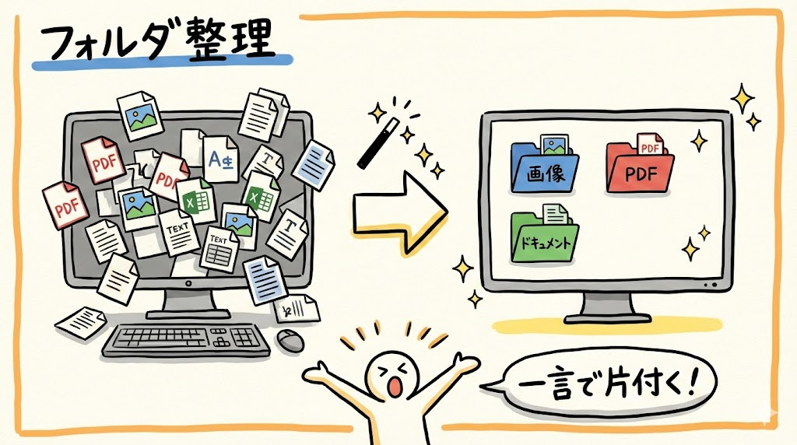
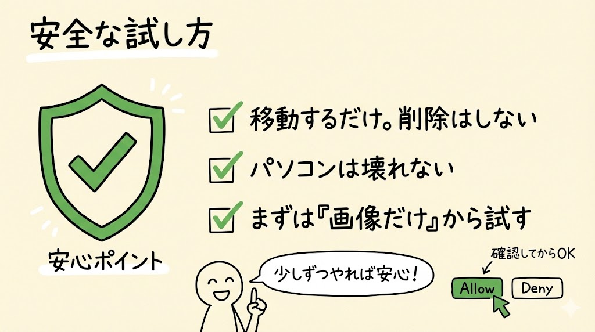
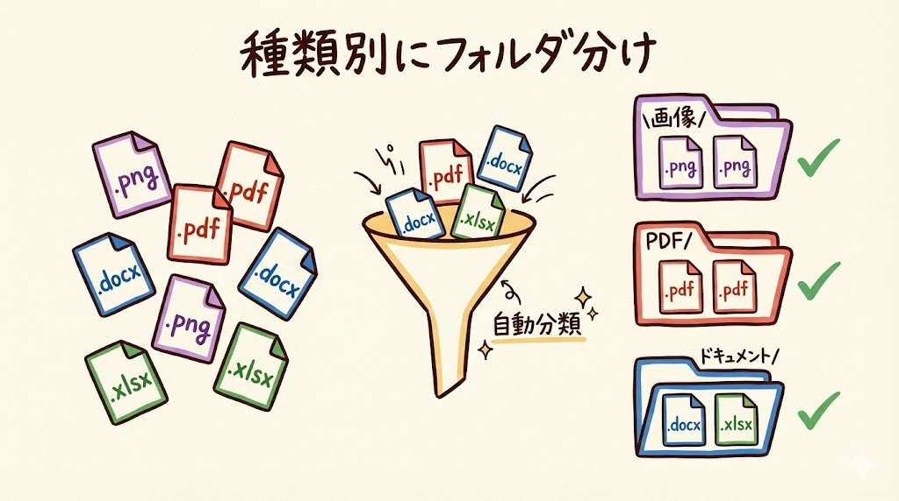
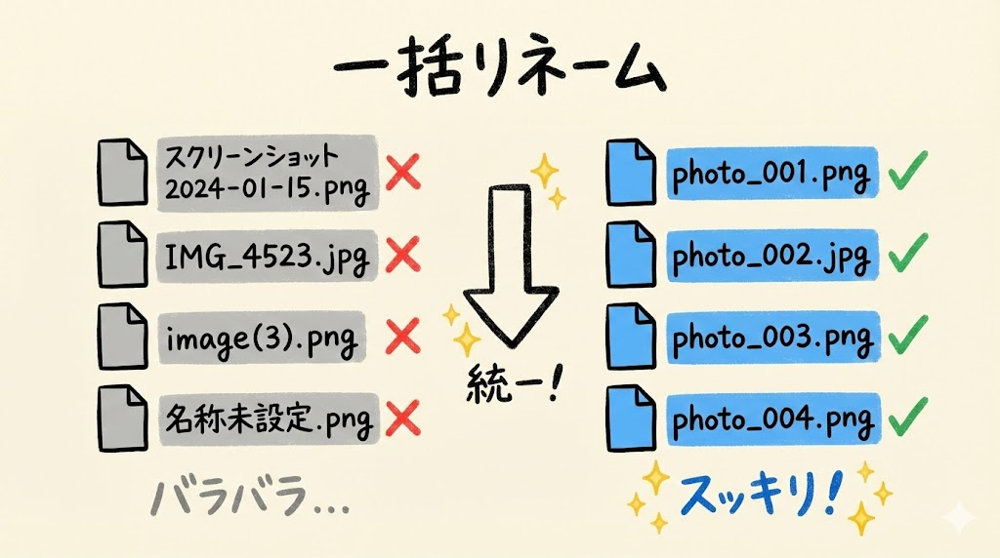
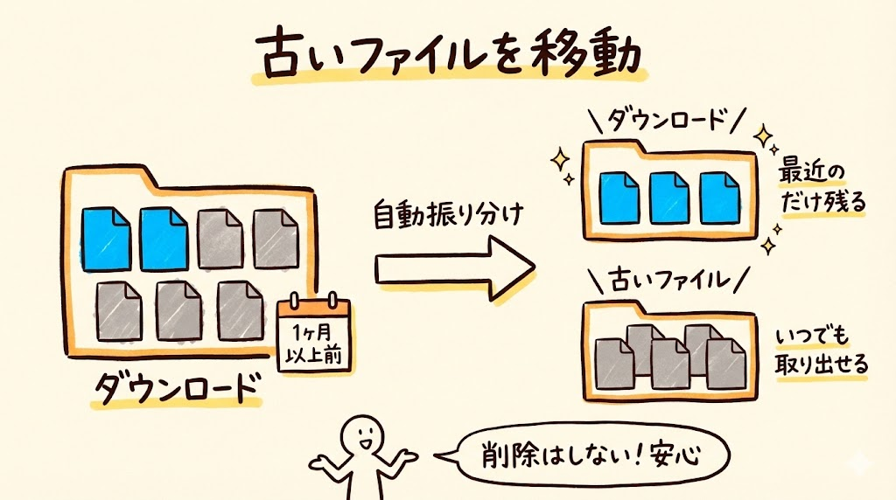
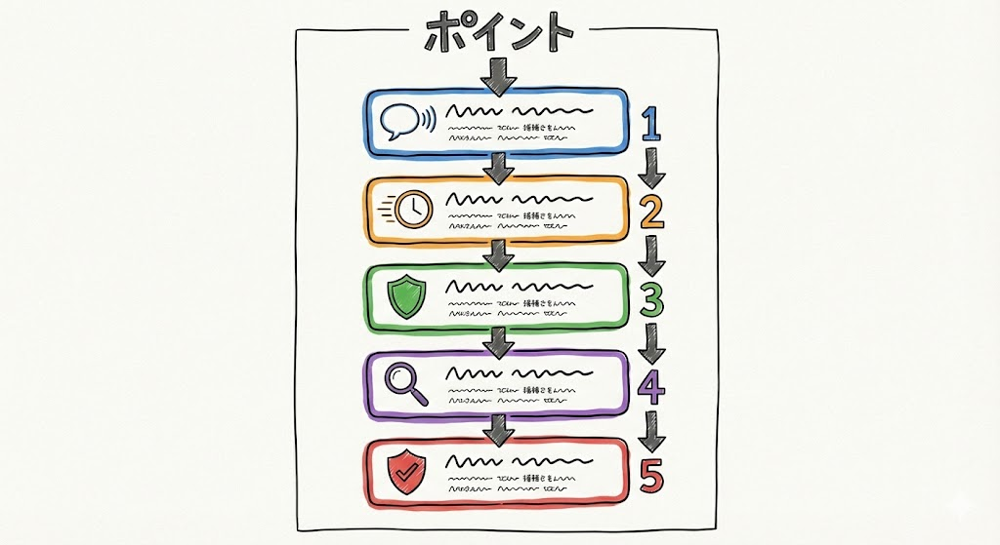
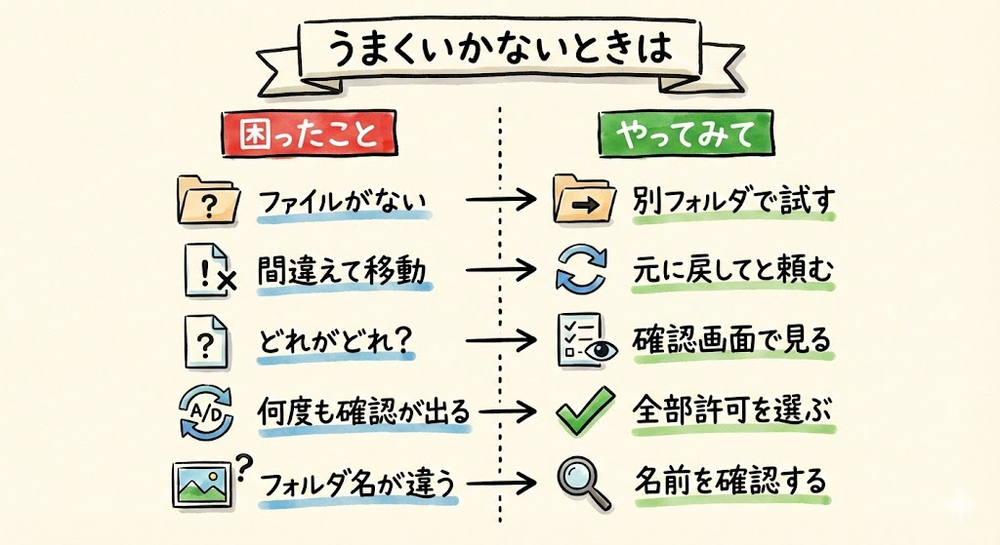

# 第10回｜フォルダ整理・一括リネーム — 散らかったデスクトップが片付く

## このレッスンのゴール



Claude Codeを使って、ファイルの自動分類と一括リネームができるようになること。

---

## 第2回の具体例④を実際にやってみよう


第2回で紹介したこの例です。

> デスクトップのファイルを種類別にフォルダ分けして

手動で1つずつやったら30分かかる作業が、一言で終わります。今回は、その「一言で片付く」体験を実際にやっていきましょう。

---

## こんなデスクトップ、心当たりありませんか？


始める前に、ちょっと聞いてみたいんですが、こんな状態になっていませんか？

- スクリーンショット（画面のキャプチャ）が何十枚も散らばっている
- 「名称未設定.pdf」みたいな、中身がわからないファイルがゴロゴロしている
- ダウンロードしたファイルがそのまま放置されている
- もはやデスクトップの壁紙が見えない

もしデスクトップがきれいな方は、ダウンロードフォルダで試してみてください。ダウンロードフォルダは、だいたいの方が散らかっていると思います。

---

## まずは安全な試し方を知っておこう



**ファイルの移動やリネームに入る前に、安心材料をお伝えします。**

今回の操作はファイルを移動したり名前を変えたりする作業です。**間違えても、パソコンが壊れたりはしません**のでご安心ください。ファイルがどこかのフォルダに移動するだけです。また、ファイルを削除する操作は含まれていないので、ファイルが消えることもありません。

それでも不安な方は、**まずは種類を限定して少しずつ試す**のがおすすめです。

```
デスクトップのファイルの中から、画像ファイルだけを「画像」フォルダにまとめて
```

全部一気にやるのではなく、「画像だけ」「PDFだけ」のように少しずつ整理していくと安心です。慣れてきたら、まとめて整理する指示を出してみましょう。

### Allow / Deny の確認画面について（復習）

Claude Codeは操作の前に「これを実行していいですか？」と確認してくれます（第5回でやりましたね）。

- **Allow**（アラウ）= 許可する
- **Deny**（ディナイ）= 拒否する

ファイルを移動する前に、Claude Codeが「以下の操作を行います」と表示してくれます。

- 「report.pdf を PDF/ フォルダに移動」
- 「photo.png を 画像/ フォルダに移動」

のように、**どのファイルがどこに移動するかが書かれています**。ここで「あ、このファイルは動かしたくないな」と思ったら、Deny して指示を修正できます。

**今回の整理作業では、この確認画面が何度も出ることがあります。内容をざっと確認して、問題なければAllowを選んでください。**

---

## やってみよう


Claude Codeを起動しましょう。

**ターミナルの開き方：**
- **Macの方**: `Cmd` + `Space` を押して「ターミナル」と入力 → `Enter`
- **Windowsの方**: スタートメニューで「PowerShell」と検索 → クリック

ターミナルが開いたら、以下を入力します。

```
claude
```

`Enter` を押して、入力待ちの表示（`>`のようなマーク）が出たら準備完了です。

### 1. 種類別にフォルダ分けする



さっそくやってみましょう。こう話しかけてください。

```
デスクトップのファイルを種類別にフォルダ分けして
```

`Enter` を押すと、Claude Codeが「こういう操作を実行しますよ」と確認（Allow / Deny）を出してきます。

ここで皆さん、画面をよく見てください。Claude Codeが「以下のファイルをこのように移動します」といった内容を表示してくれるはずです。どのファイルがどのフォルダに移動するかが書いてあります。この内容を確認して、問題なければ Allow を選んでください。

「あ、このファイルは移動したくないな」と思うものがあれば、Deny を選んで指示を修正できます。たとえば「デスクトップのファイルを種類別にフォルダ分けして。ただし work.xlsx は動かさないで」のように伝えれば、特定のファイルを除外できます。

Claude Codeが、ファイルの拡張子（ファイル名の最後の `.` 以降の部分。ファイルの種類を示すもの）を見て自動的に分類してくれます。たとえばこんな感じです。

- `画像/` --- .png, .jpg, .gif など（画像ファイル）
- `PDF/` --- .pdf（PDFファイル）
- `ドキュメント/` --- .docx, .xlsx, .txt など（文書やスプレッドシート）
- `その他/` --- 上記に当てはまらないもの

> **確認ポイント**: 実行後にデスクトップを見てみてください。種類ごとのフォルダ（「画像」「PDF」「ドキュメント」など）が作られて、ファイルがその中に入っていればOKです。

> **うまくいかない場合**: ファイルがまったくない、または数が少ない場合は「移動するファイルがありません」と表示されることがあります。ダウンロードフォルダで試してみてください。

### 2. 一括リネーム



リネームというのは、ファイルの名前を変えることです。一括リネームは、たくさんのファイルの名前をまとめて変える操作です。

ステップ1で「画像/」フォルダが作られている場合は、そのフォルダを使います。もし別の名前のフォルダになっている場合は、Claude Codeが作ったフォルダ名に合わせてください（たとえば「images/」や「写真/」になっている場合もあります）。

```
デスクトップの画像フォルダの中のファイルを日付順に連番でリネームして。photo_001.png のような形式で
```

連番（れんばん）というのは、001, 002, 003...のように番号を順番につけることです。

`Enter` を押すと、Claude Codeがファイルを日付順（古いものから新しいものの順）に並べ替えて、`photo_001.png`、`photo_002.png`、`photo_003.png`...と名前を統一してくれます。

バラバラだったファイル名（「スクリーンショット 2024-01-15 10.23.45.png」とか「IMG_4523.jpg」とか）が、統一された連番に整います。写真の整理にとても便利です。

> **確認ポイント**: 画像フォルダの中のファイルが `photo_001.png`、`photo_002.png`... のように連番に変わっていればOKです。

> **注意**: もしステップ1を飛ばして画像フォルダがない場合は、「デスクトップの画像ファイルを〜」のように、フォルダ名ではなくファイルの種類で指定してもOKです。

### 3. 古いファイルを移動する



ダウンロードフォルダのお掃除もやってみましょう。

```
ダウンロードフォルダの中から1ヶ月以上前のファイルを「古いファイル」フォルダに移動して
```

Claude Codeが、ファイルの更新日時を確認して、1ヶ月以上前のファイルだけを「古いファイル」フォルダに移動してくれます。「古いファイル」フォルダが存在しない場合は、自動で作ってくれます。

最近のファイルだけがダウンロードフォルダに残る状態になるので、必要なファイルが見つけやすくなりますね。

ちなみに、ファイルは移動するだけで削除はしませんので、安心してください。「古いファイル」フォルダを見れば、いつでも取り出せます。

> **確認ポイント**: ダウンロードフォルダの中に「古いファイル」フォルダが作られて、古いファイルがそこに移動していればOKです。最近のファイルはダウンロードフォルダに残っているはずです。

---

## 手動 vs Claude Code


実際にどれくらい時間の差があるか、比べてみましょう。

| 作業 | 手動でやった場合 | Claude Codeに頼んだ場合 |
| --- | --- | --- |
| 50個のファイルを種類別に分ける | 15〜30分 | 10秒 |
| 100個のファイルを連番でリネーム | 30分〜1時間 | 10秒 |
| 古いファイルをまとめて移動 | 10〜20分 | 10秒 |

どれも10秒です。日本語で指示を出す時間だけ。あとはClaude Codeが全部やってくれます。これが「手足のあるAI」の威力ですね。

---

## ポイント



- 日本語で「こう整理して」と言うだけで、自動的にフォルダ分け・リネームしてくれる
- 手動で1つずつやると数十分かかる作業が、一言で終わる
- Allow / Deny の確認画面で、実行前に内容をチェックできるので安心
- まずは種類を限定して（「画像だけ」など）小規模に試すのがおすすめ
- ファイルは移動するだけで削除はしないので、いつでも取り出せる

---

## うまくいかないときは



| 症状 | 対処法 |
| --- | --- |
| 「移動するファイルがありません」と表示される | 指定したフォルダにファイルがない可能性があります。別のフォルダ（ダウンロードなど）で試してみてください |
| 意図しないファイルが移動されてしまった | 移動先のフォルダ（「画像/」「PDF/」など）を開けばファイルはあります。手動で元に戻すか、Claude Codeに「〜を元に戻して」と頼んでください |
| リネーム後にどのファイルがどれだったかわからなくなった | リネーム前にClaude Codeが確認画面で「元の名前 → 新しい名前」を表示してくれるので、そこで確認してからAllowを選びましょう |
| Allow / Deny が何度も表示される | ファイルの数だけ確認が出ることがあります。内容を確認してAllowを選んでください。面倒な場合は「残り全部許可」を選ぶこともできます |
| 画像フォルダが見つからない | ステップ1で作られたフォルダ名を確認してください。「画像」「images」「写真」などClaude Codeの判断で名前が変わることがあります |

---

## まとめ


- ファイルの種類別フォルダ分けが一言でできる
- 一括リネーム（名前の統一）も日本語で指定するだけ
- 古いファイルの移動・整理も簡単
- **不安なら小規模から試す。「画像だけ」「PDFだけ」のように少しずつ**
- 確認画面（Allow / Deny）を活用して、安全に操作する習慣をつけよう
- 移動したくないファイルがあれば、指示に「ただし〜は動かさないで」と追加できる

次回は、第2回の具体例⑤「CSV集計」を実際にやってみます。Excelを開かずに「売上の合計出して」で集計できる体験です。Excelの関数に苦手意識がある方、朗報ですよ。
