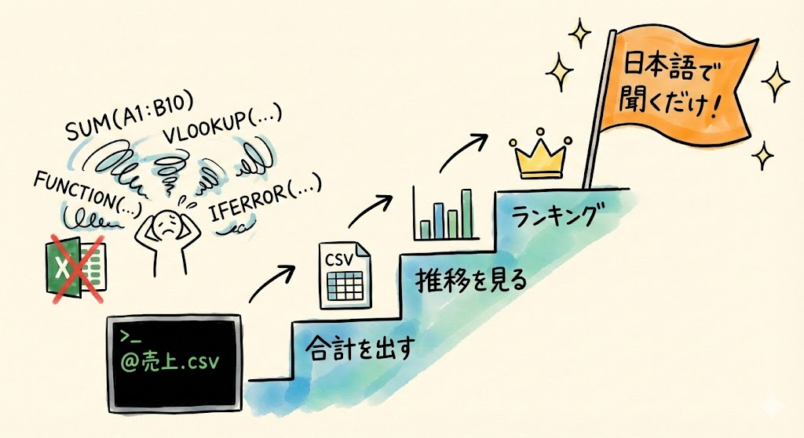
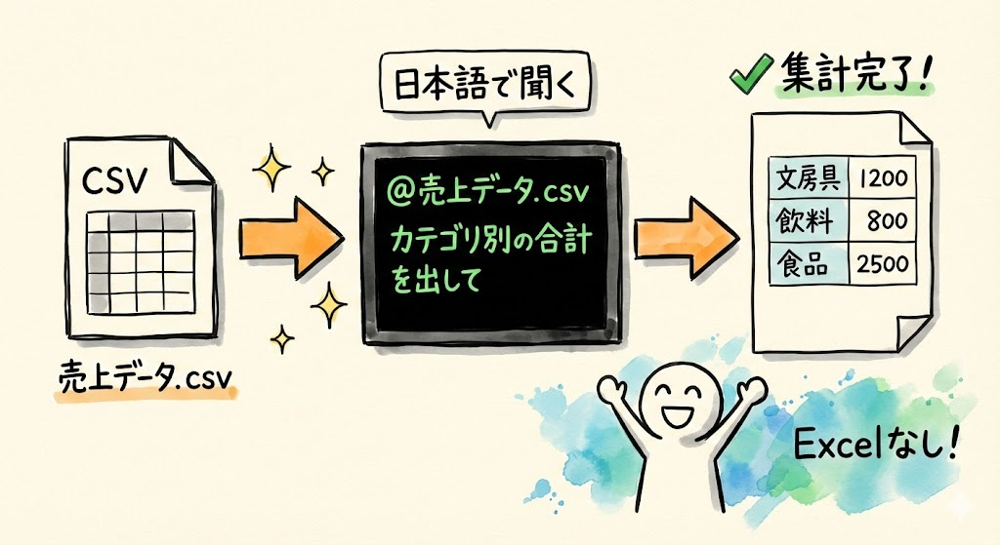
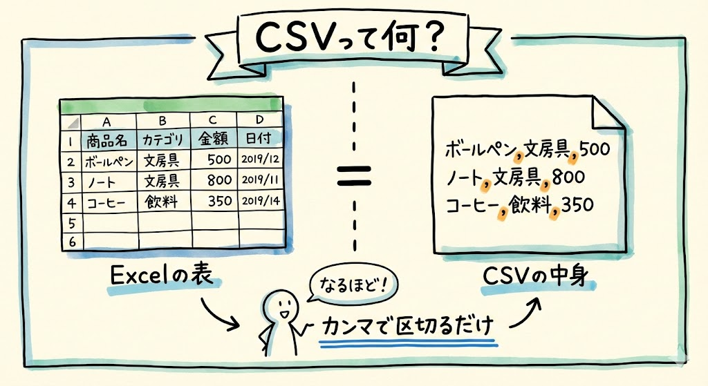
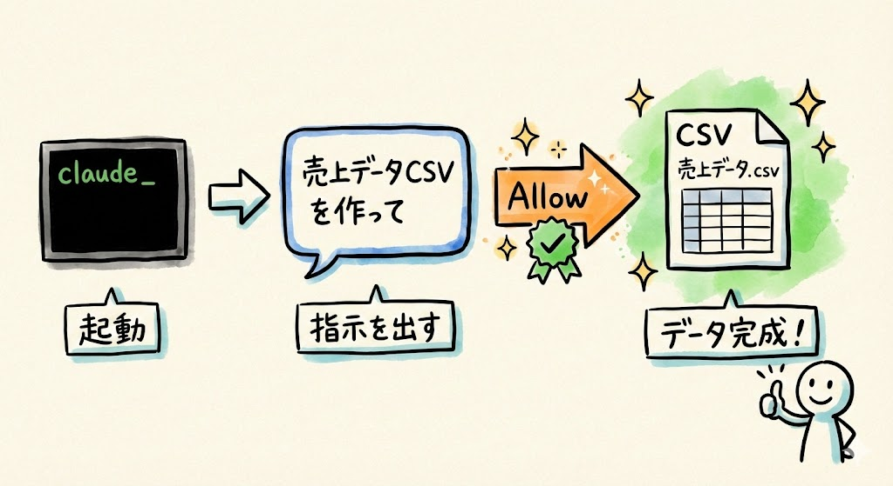
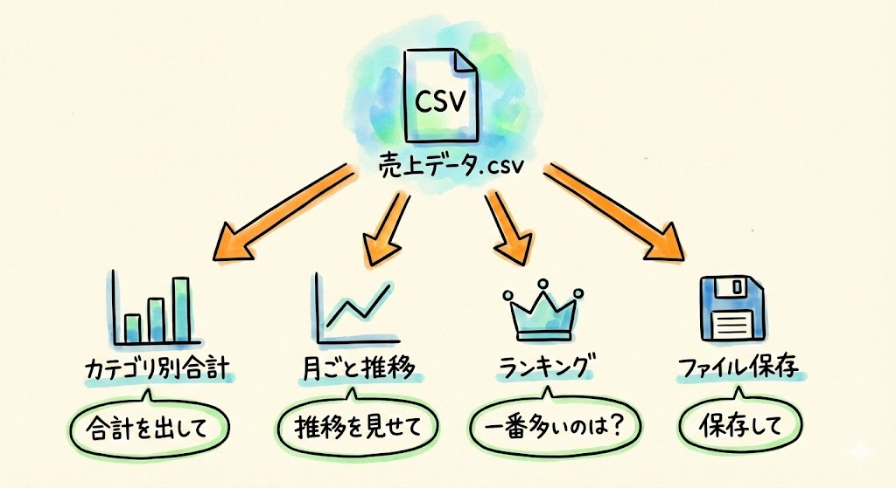
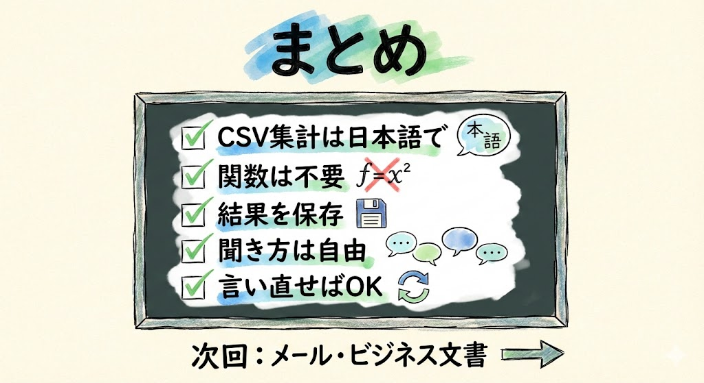

# 第11回｜CSV集計 — Excelなしで「売上の合計出して」

## このレッスンのゴール



Claude Codeを使って、CSVファイルの集計・分析ができるようになること。

---

## 第2回の具体例⑤を実際にやってみよう



さて、今回は第2回で紹介したこの例を、実際にやってみます。

> @売上データ.csv のカテゴリ別の合計を出して

Excelの関数を覚えなくても、日本語で聞くだけでデータ分析ができるんです。

ここ、ちょっと大事なポイントです。「関数を覚えなくていい」というのは、本当に大きいことなんですね。

---

## CSVファイルって何？



まず、CSVについて説明しますね。

CSVというのは、データをカンマ（,）で区切って並べただけのシンプルなファイル形式です。身近な例でいうと、Excelの表をもっと素朴にしたものだと思ってください。Excelで開くと表形式で見えますが、中身はただのテキストデータなんです。

実際の中身を見てみましょう。こんな感じです。

```
商品名,カテゴリ,売上,日付
ボールペン,文房具,500,2025-01-05
ノート,文房具,800,2025-01-05
コーヒー,飲料,350,2025-01-06
```

見てください。商品名のあとにカンマ、カテゴリのあとにカンマ、というふうに、カンマで区切られているだけですよね。これがCSVです。「CSV」は「Comma Separated Values（カンマで区切られた値）」の略ですが、名前は覚えなくて大丈夫です。

業務で使うデータの多くは、このCSV形式でエクスポート（書き出し）できます。たとえば会計ソフトや顧客管理システムから「CSVでダウンロード」といったボタンを見たことがある方もいるのではないでしょうか。

---

## 練習用CSVファイルを用意する



手元にCSVファイルがなくても大丈夫です。練習用のデータも、Claude Codeに作ってもらいましょう。

まず、ターミナルを開いてください。

- **Macの方**: `Cmd` + `Space` → 「ターミナル」と入力して `Enter`
- **Windowsの方**: スタートメニューから「PowerShell」で検索

ターミナルが開いたら、以下を打ち込んで `Enter` を押し、Claude Codeを起動します。

```
claude
```

画面に「Claude Code」の表示が出てきたら、準備完了です。

Claude Codeが起動した状態で、キーボードで以下をそのまま打ち込みます。

```
デスクトップにサンプルの売上データCSVを作って。商品名、カテゴリ、金額、日付の列で、30件くらいのデータを入れて。カテゴリは文房具・飲料・食品の3種類で。
```

Claude Codeが「このコマンドを実行していいですか？」と許可を求めてきたら、**「Allow」** を左クリックしてください。

画面に英語のメッセージが少し流れて、すぐに止まります。エラーっぽい赤い文字が出なければ成功です。

> **確認してみましょう**: デスクトップを見てください。「売上データ.csv」のようなファイルが出来上がっていればOKです。ファイルが見つからない場合は、Claude Codeに「ファイルはどこに保存した？」と聞いてみてください。

もし赤い文字でエラーが出た場合は、Claude Codeに「このエラーが出ました」と貼り付けて相談してみてください。

これだけで、リアルなサンプルデータが出来上がります。練習用の素材もClaude Codeに作ってもらえるのが便利ですね。

---

## やってみよう



それでは、実際にCSVファイルを分析していきましょう。

### 1. カテゴリ別の合計を出す

キーボードで以下をそのまま打ち込みます。

```
@売上データ.csv のカテゴリ別の合計を出して
```

ここで皆さん、画面を見てください。`@`（アットマーク）のあとにファイル名を書いていますね。これは第8回で学んだ「ファイルを読み込ませる」やり方です。覚えていますか？

Excelだったら、ピボットテーブルを作るか、SUMIF関数を書く場面です。——といっても、こういった関数の名前は覚えなくて大丈夫です。Claude Codeなら日本語で聞くだけですから。

しばらくすると、こんな感じの結果が返ってきます。

```
文房具:  45,800円
飲料:   23,500円
食品:   31,200円
合計:  100,500円
```

> **確認してみましょう**: カテゴリ（文房具・飲料・食品）ごとに合計金額が表示されていればOKです。数字の値は皆さんのデータによって変わりますが、3つのカテゴリに分かれて表示されているはずです。

たったこれだけで集計ができました。

### 2. 月ごとの推移を見る

続けて、こう打ち込んでみましょう。

```
@売上データ.csv の月ごとの売上推移を見せて
```

時系列の変化も、一言で把握できます。Claude Codeが月ごとの数字をまとめて表示してくれます。「先月と比べてどうだったか」が一目でわかりますね。

> **確認してみましょう**: 月ごとの金額が表示されていればOKです。

### 3. 特定の情報を抜き出す

次は、こう聞いてみてください。

```
@売上データ.csv の中で売上が一番多い商品は何？
```

ランキングや最大値・最小値の抽出も、日本語で聞くだけです。Excelだと複数の関数を組み合わせる必要があるんですが、Claude Codeなら「一番多い商品は何？」で終わりです。

### 4. 結果をファイルに保存する

集計結果をファイルとして残したいときは、こう言います。

```
直前に表示してくれた集計結果を 集計レポート.txt としてデスクトップに保存して
```

ここで「直前に表示してくれた集計結果」と具体的に指定しているのがポイントです。Claude Codeは会話の流れを覚えているので、さっき画面に出してくれた結果のことだとわかってくれます。

Claude Codeが許可を求めてきたら「Allow」を左クリックしてください。画面に「ファイルを作成しました」のようなメッセージが表示されれば成功です。

> **確認してみましょう**: デスクトップに「集計レポート.txt」が出来上がっていればOKです。ファイルを開いて、中身が集計結果になっていることも確認してみてくださいね。

誰かに共有するときや、記録として残したいときに便利ですね。

---

## Excelの関数、覚えなくていい


これ、よく聞かれるんですが、「Excelの知識がなくても本当に大丈夫？」という質問があります。

大丈夫です。これまでCSVデータを分析するには、Excelの知識が必要でした。でもClaude Codeを使えば、こうなります。

| やりたいこと | Excelでの方法 | Claude Codeでの方法 |
| --- | --- | --- |
| カテゴリ別合計 | 専用の関数を使う | 「カテゴリ別の合計を出して」 |
| 月ごとの推移 | 集計表を作る | 「月ごとの売上推移を見せて」 |
| 最大値の商品 | 複数の関数を組み合わせる | 「一番多い商品は何？」 |
| 条件付き抽出 | フィルター機能を使う | 「文房具だけ抜き出して」 |

右の列を見てください。全部、日本語で聞いているだけです。関数の書き方を検索する時間も、数式が合っているか確認する時間も不要です。

左の列にある「関数」や「ピボットテーブル」「フィルター」といったExcelの用語は、名前を覚える必要はありません。Claude Codeを使えば、こういった機能の名前を知らなくても同じことができる、ということだけ知っておいてください。

今は「こんな使い方ができるんだな」とわかっていただければ大丈夫です。使ううちに自然と慣れていきます。

---

## こんな質問もできる


他にもいろいろな聞き方ができます。いくつか例を紹介しますね。

```
@売上データ.csv で、金額が1000円以上のものだけ抽出して
```

```
@売上データ.csv のカテゴリ別の平均単価を出して
```

```
@売上データ.csv を金額の高い順に並べ替えて
```

聞き方に正解はありません。やりたいことを日本語で伝えれば、Claude Codeが適切な方法で処理してくれます。「こう聞かなきゃいけない」という決まりはないので、気軽にいろいろ試してみてください。

もし思った通りの結果が返ってこなかったら、「違う、カテゴリごとに分けて見せて」のように、言い方を変えてもう一度聞けば大丈夫です。間違えても壊れたりしないので、安心してどんどん試してください。

> **うまくいかない場合は**: 「@ファイル名」で指定したファイルが見つからないとエラーになることがあります。その場合は「デスクトップにある売上データ.csvを読んで」のように、ファイルの場所を具体的に伝えてみてください。

---

## ポイント

- CSVファイルの分析が、Excelの関数なしでできる
- 練習用データもClaude Codeに作ってもらえる
- 集計結果をファイルに保存して共有もできる
- 日本語で聞くだけ。やりたいことをそのまま伝える
- 聞き方に正解はない。思ったことをそのまま言えばOK

---

## まとめ



- CSV集計はClaude Codeの得意分野。日本語で質問するだけ
- カテゴリ別合計、月ごと推移、ランキングなど何でも聞ける
- Excelの関数を覚える必要なし
- 結果はファイルに保存して共有できる
- 聞き方を間違えても大丈夫。言い直せばClaude Codeが理解してくれる

次回は「メール・ビジネス文書の作成」。レベル1の総まとめとして、ここまで学んだことを組み合わせて実務に使える文書を作成します。
