# 第12回｜メール・ビジネス文書の作成 — 下書きから完成まで

## このレッスンのゴール

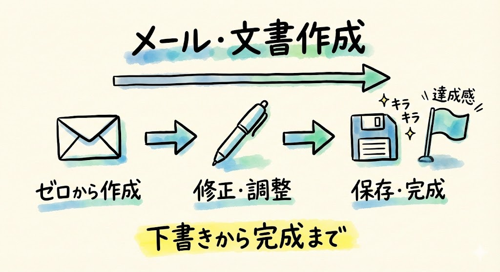

Claude Codeを使って、メール文面やビジネス文書をゼロから作成し、修正・保存まで一気通貫でできるようになること。

---

## レベル1の応用まとめ

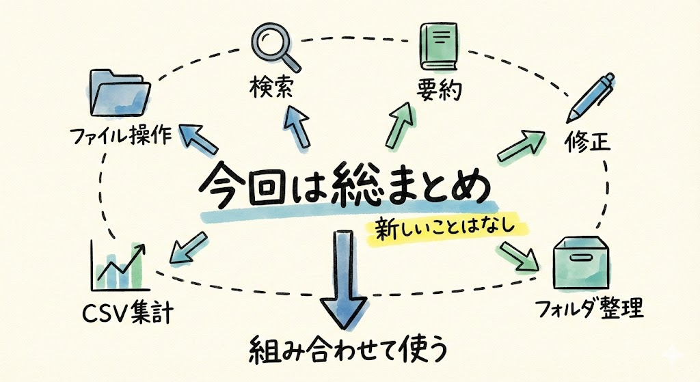

さて、第6回から第11回まで、Claude Codeでの日常業務を1つずつ体験してきました。今回はその総まとめとして、**文書をゼロから作り、修正し、保存する**という一連の流れをやってみます。

これまで学んだスキルの組み合わせです。新しいことは出てきません。安心して進めてくださいね。

---

## やってみよう

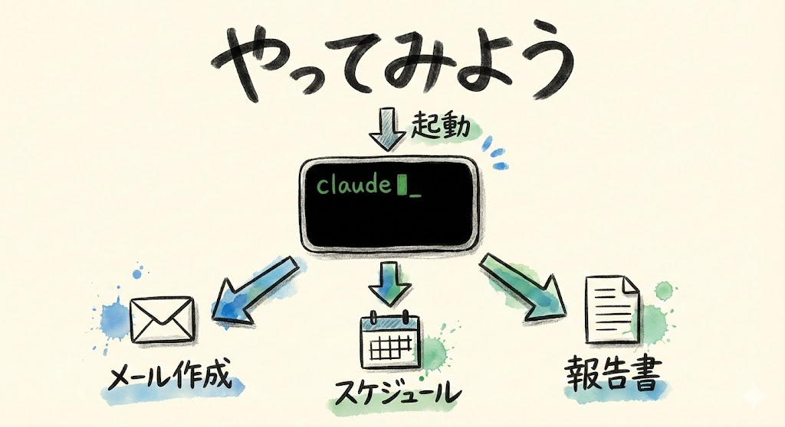

まず、ターミナルを開いてClaude Codeを起動しましょう。

- **Macの方**: `Cmd` + `Space` → 「ターミナル」と入力して `Enter`
- **Windowsの方**: スタートメニューから「PowerShell」で検索

ターミナルが開いたら、これまで使っていたターミナルで、キーボードから以下をそのまま打ち込んで `Enter` を押します。

```
claude
```

画面に「Claude Code」の表示が出てきたら、準備完了です。

### 1. メール文面を作成する

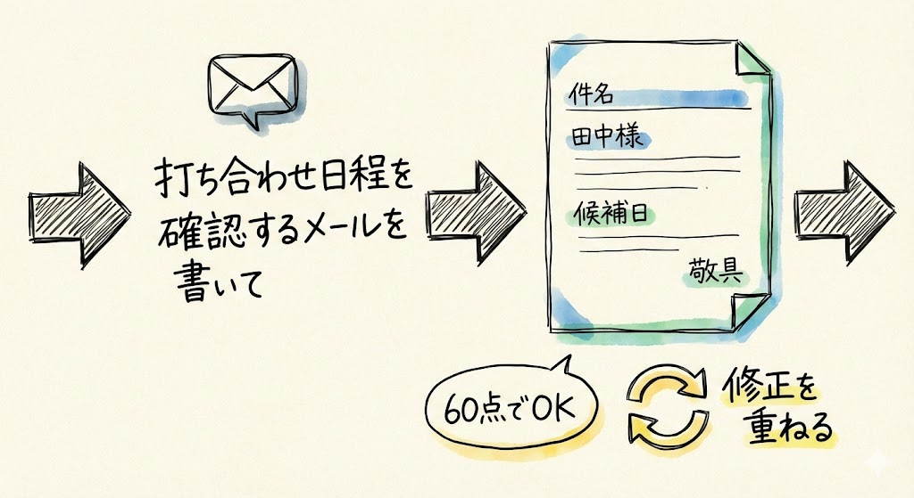

では、さっそくメールの文面を作ってもらいましょう。キーボードで以下をそのまま打ち込みます。

```
取引先の田中さんに、来週の打ち合わせ日程を確認するメールを書いて。候補日は火曜14時、水曜10時、木曜15時の3つ。
```

しばらくすると、Claude Codeがビジネスメールの定型に沿ったメール文面を作ってくれます。件名、宛名、本文、締めの挨拶まで、ちゃんとしたビジネスメールの形になっているはずです。

> **確認してみましょう**: 画面にメールの文面が表示されていればOKです。「件名」「宛名（田中様）」「本文」「候補日が3つ」「締めの挨拶」が含まれているか見てみてください。

ここで皆さん、画面を見てください。もうメールの下書きができましたよね。

ここから、第9回で学んだ「修正」を組み合わせます。もし「もうちょっとフォーマルな感じがいいな」と思ったら、こう打ち込みます。

```
もうちょっとフォーマルにして
```

Claude Codeが文面を書き直してくれます。さらに、こうも言えます。

```
件名もつけて
```

こんなふうに、追加の指示でどんどん文面を磨けます。最初から完璧な文面を考える必要はありません。まず作って、そこから修正する。このやり方がClaude Codeの使い方です。

ここ、ちょっと大事なポイントです。「最初から100点を目指さなくていい」んですね。60点くらいでまず作って、「ここを直して」「もうちょっとこうして」と何回でも修正を頼めます。

### 2. ファイルとして保存する

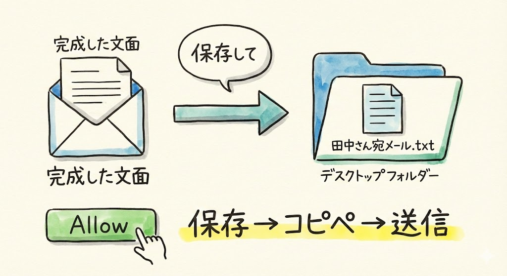

納得いく文面ができたら、保存しましょう。キーボードで以下をそのまま打ち込みます。

```
このメールを「田中さん宛メール.txt」としてデスクトップに保存して
```

Claude Codeが許可を求めてきたら「Allow」を左クリックしてください。画面に「ファイルを作成しました」のようなメッセージが表示されれば成功です。

> **確認してみましょう**: デスクトップに「田中さん宛メール.txt」が出来上がっていればOKです。ファイルを開いて、さっき作ったメールの文面が入っていることも確認してみてください。

このファイルを開いて、中身をコピーしてメールソフトに貼り付ければ、すぐに送信できますね。

第6回で学んだファイル操作と、第9回の修正テクニックの組み合わせです。これまで学んだことが、こうやってつながっていくんです。

### 3. スケジュール表を作る

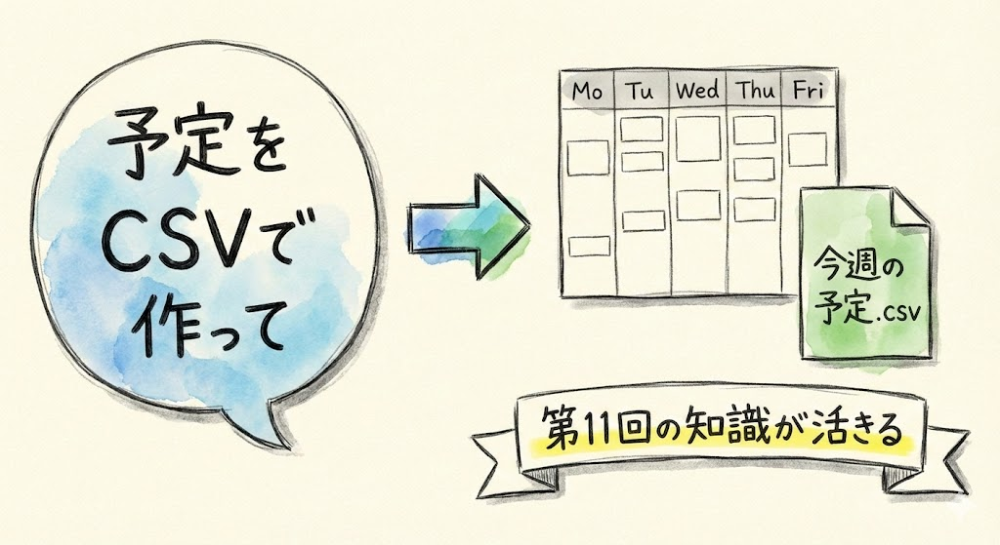

次は、スケジュール表を作ってみましょう。キーボードで以下をそのまま打ち込みます。

```
今週の予定をCSV形式で作って。以下の内容で。
月曜: 社内ミーティング 10:00-11:00
火曜: 田中さん打ち合わせ 14:00-15:00
水曜: 資料作成
木曜: 部門報告会 13:00-14:00
金曜: 週次レビュー 16:00-17:00
```

ここで出てきた「CSV形式」、覚えていますか？ 前回（第11回）で学んだ、カンマで区切ったデータの形式です。CSV形式で作れば、ExcelやGoogleスプレッドシートで開いて表として使えます。第11回の知識が早速活きていますね。

> **確認してみましょう**: Claude Codeが作ってくれたデータを見てください。曜日、予定名、時間がカンマで区切られた形になっていればOKです。たとえば「月曜,社内ミーティング,10:00-11:00」のような形です。

もし「このスケジュール表をファイルに保存したい」と思ったら、続けてこう打ち込みます。

```
このスケジュール表を「今週の予定.csv」としてデスクトップに保存して
```

許可を求められたら「Allow」を左クリックしてください。デスクトップにファイルが出来上がります。

> **うまくいかない場合は**: 「CSV形式って何？」と思ったら、第11回を見返してみてください。簡単に言えば「カンマで区切ったテキストデータ」です。

### 4. 報告書のテンプレートを作る

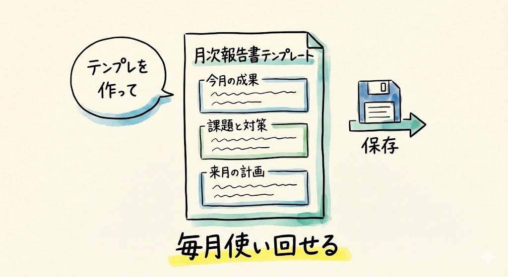

最後に、報告書のテンプレート——つまり「ひな形」を作ってみましょう。キーボードで以下をそのまま打ち込みます。

```
月次報告書のテンプレートを作って。セクションは「今月の成果」「課題と対策」「来月の計画」の3つで。
```

毎月使い回せるテンプレートが一瞬で出来上がります。自分でゼロからフォーマットを考える手間が省けますね。

出来上がったテンプレートを保存しておきましょう。

```
このテンプレートを「月次報告書テンプレート.txt」としてデスクトップに保存して
```

許可を求められたら「Allow」を左クリックしてください。画面に「ファイルを作成しました」と表示されれば成功です。

> **確認してみましょう**: デスクトップに「月次報告書テンプレート.txt」が出来上がっていればOKです。

もし赤い文字でエラーが出てしまった場合は、慌てなくて大丈夫です。もう一度同じ指示を打ち込んでみるか、Claude Codeに「エラーが出たんだけど、どうすればいい？」と聞いてみてください。

---

## レベル1で学んだ6つのスキル

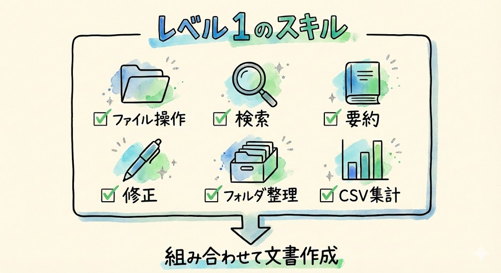

ここで、これまでの回で身につけたことを振り返りましょう。

| 回 | スキル | やったこと |
| --- | --- | --- |
| 第6回 | ファイル操作 | フォルダ作成、ファイル作成、削除 |
| 第7回 | ファイル検索 | 条件を指定してファイルを探す |
| 第8回 | 文書の要約 | `@ファイル名` で読み込んで要約 |
| 第9回 | 文章の修正 | トーン変更、校正、書き換え |
| 第10回 | フォルダ整理 | 種類別分類、一括リネーム |
| 第11回 | CSV集計 | データの集計・分析 |

そして今回の第12回で、これらを組み合わせて**文書をゼロから作り、修正し、保存する**ところまでやりました。

皆さん、6つのスキルを身につけたんです。すごいことですよ。

---

## 大事なことを確認

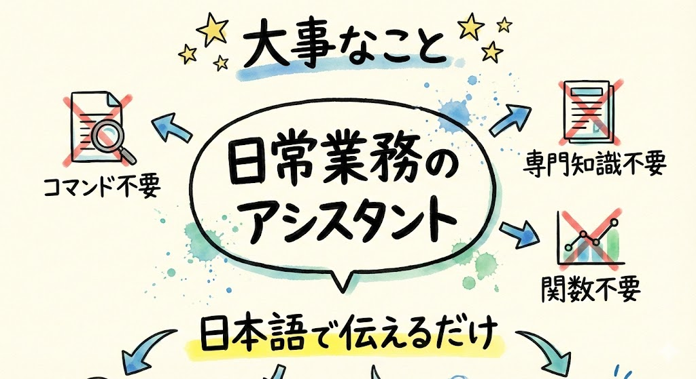

ここで、改めて大事なことを言います。

**Claude Codeはコードを書くためだけのツールではありません。日常業務のアシスタントです。**

「Claude Code」という名前に「Code」と入っているので、プログラマー向けのツールだと思われがちです。でも、ここまでの7回で体験したとおり、プログラミングの知識がなくても日常業務に使えます。

- ファイルを探すのにコマンドを覚える必要はない
- 文書を要約するのにAIの専門知識は不要
- CSVの集計にExcelの関数は使わない

全部、**日本語で「こうして」と言うだけ**です。

「自分はエンジニアじゃないから......」と思っていた方、ここまでの内容をちゃんとこなしてきたこと自体がすごいんです。自信を持ってくださいね。

---

## レベル2への予告

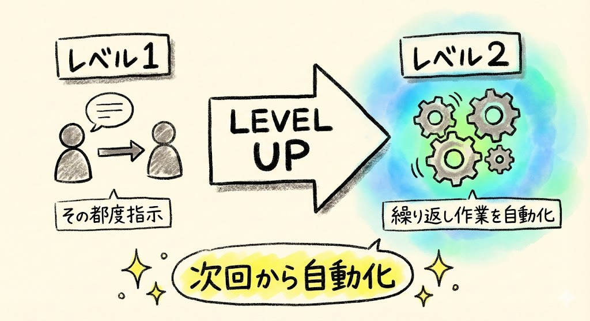

次回からは**レベル2: 自動化**に進みます。

レベル1では「その都度、Claude Codeに指示を出す」使い方をしてきました。レベル2では、**繰り返し作業をまとめて自動化する**ことを学びます。

第2回で紹介した具体例でいうと、⑥「議事録の自動整形」や⑦「大量ファイルの一括変換」のような世界です。

「毎週やっている同じ作業、自動化できないかな？」——そんな視点を持ちながら、次回に進みましょう。

わくわくしますよね。レベル1でもこれだけのことができたんですから、レベル2ではもっとすごいことができるようになります。

---

## まとめ

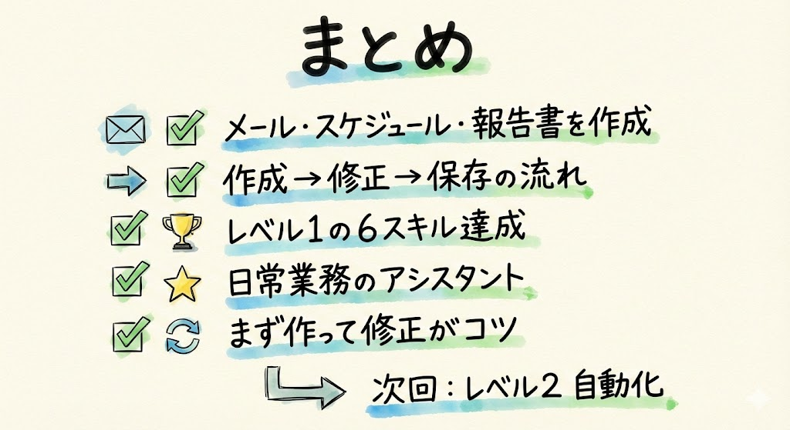

- メール文面、スケジュール表、報告書テンプレートをClaude Codeで作成した
- 作成 → 修正 → 保存の一連の流れを体験した
- レベル1の6つのスキルを振り返った
- Claude Codeは「日常業務のアシスタント」。コードを書くためだけのツールではない
- 最初から完璧を目指さなくてOK。まず作って、修正を重ねるのがコツ

次回からはレベル2「自動化」に進みます。繰り返し作業を一発で片付ける方法を学んでいきましょう。
