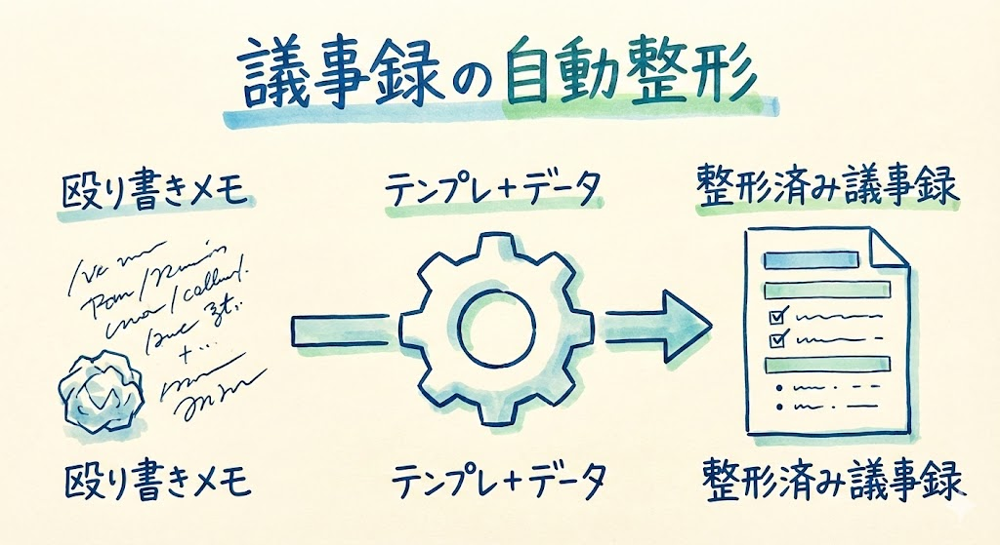
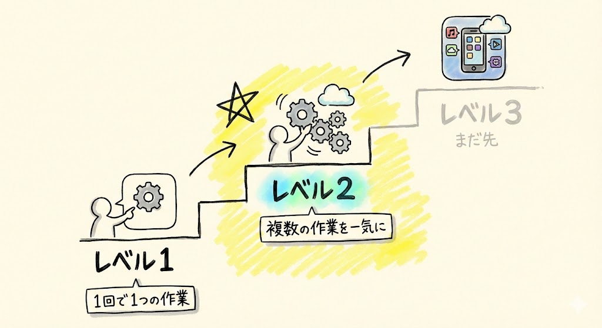
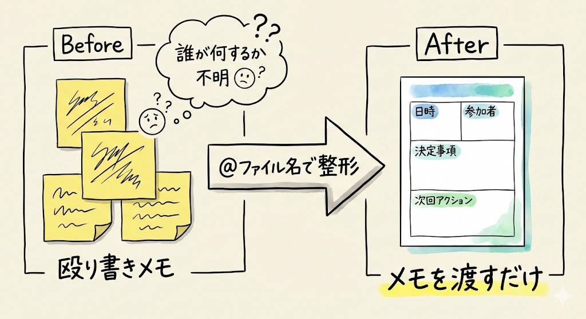
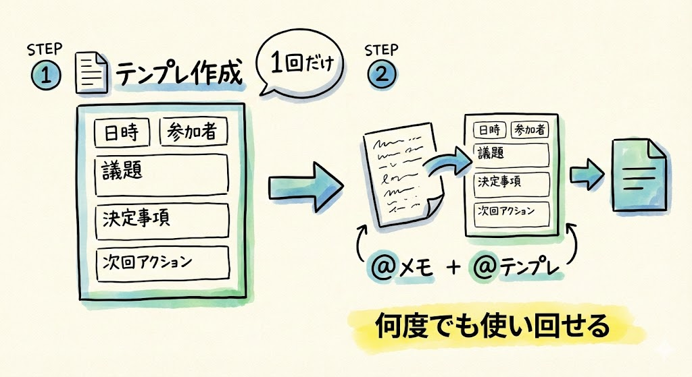
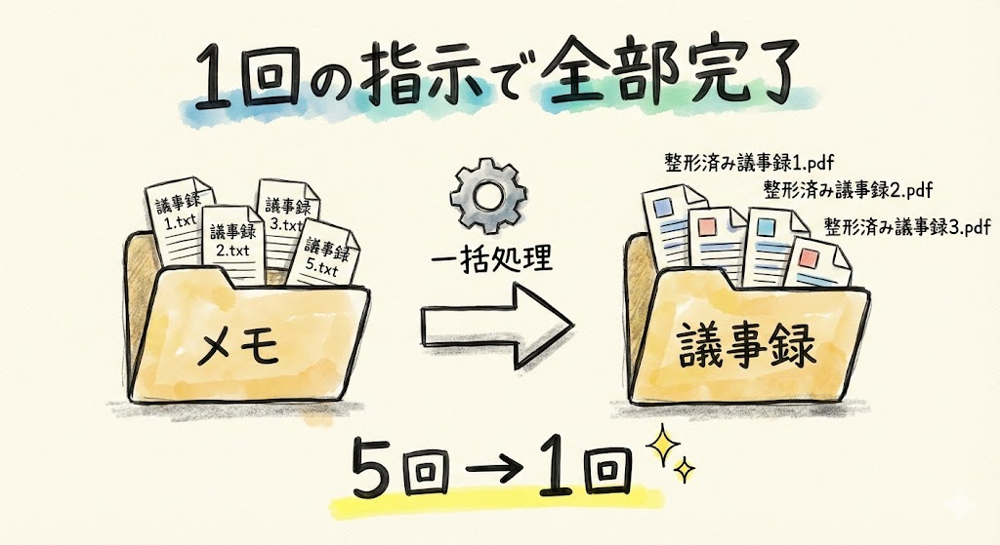
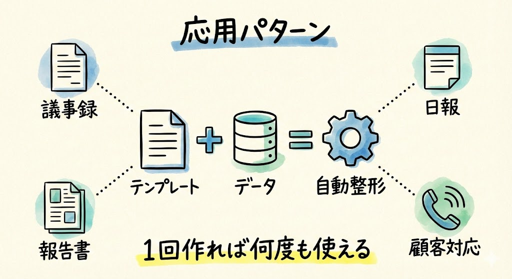
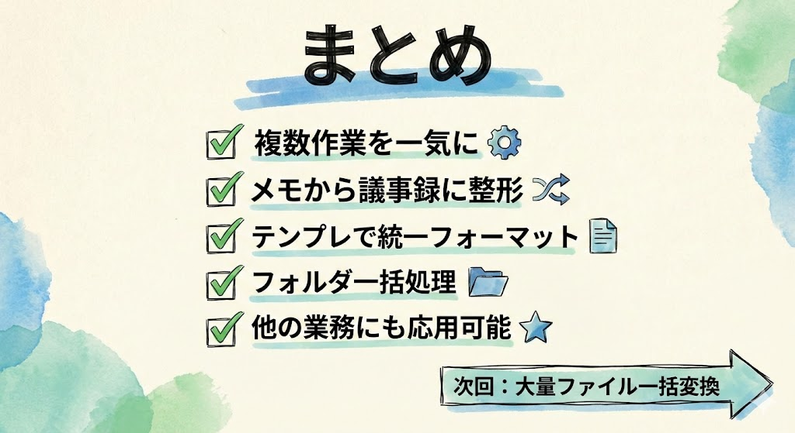

# 第13回｜議事録の自動整形 — テンプレに合わせてフォーマット

## このレッスンのゴール



会議の殴り書きメモをClaude Codeに渡して、きれいな議事録に整形できるようになること。「テンプレート + データ = 自動整形」のパターンを身につけること。

---

## レベル2に進みます



さて、ここまでレベル1（日常業務）をやってきました。

レベル1は **「1回の指示で1つの作業」** でしたね。

- 「このファイルを探して」→ 1つ見つかる
- 「この文章を要約して」→ 1つ要約される
- 「このCSVを集計して」→ 1つ集計される

今日からのレベル2は **「複雑な指示で、複数の作業を一気に」** です。ここが大きなステップアップになります。

| レベル | やること | 指示の特徴 |
| --- | --- | --- |
| レベル1 | 日常業務 | 1回の指示で1つの作業 |
| **レベル2** | **自動化** | **複雑な指示で複数の作業を一気に** |
| レベル3 | アプリ開発 | この先で挑戦 |

第2回で紹介した例⑥「議事録の自動整形」を、実際にやってみましょう。

今は「レベル2」って聞いて身構える必要はありません。やることは今まで通り、Claude Codeに日本語で話しかけるだけです。

---

## 会議のメモをClaude Codeに渡してみよう



まず、こんな殴り書きメモがあるとします。皆さんも会議中にこういうメモを取ることがありますよね。

```
2/10 営業会議
田中、佐藤、鈴木
売上について話した
先月の売上は目標未達
原因は新規顧客の獲得が遅れたこと
鈴木さんが来月キャンペーンやるって言ってた
次は2/24に集まる
田中さんが資料作ってくる
```

実際の会議メモって、こんな感じですよね。あとから見返すと何が決まったのかよくわからない。「あれ、結局誰が何をやるんだっけ？」ってなりがちです。

### メモをファイルに保存する

このメモをClaude Codeに渡すために、まずファイルとして保存しましょう。ターミナルを開いてください。

- **Macの方**: `Cmd` + `Space` → 「ターミナル」と入力して `Enter`
- **Windowsの方**: スタートメニューから「PowerShell」で検索

ターミナルが開いたら、以下を打ち込んで `Enter` を押し、Claude Codeを起動します。

```
claude
```

画面に「Claude Code」の表示が出てきたら、準備完了です。

Claude Codeにキーボードで以下をそのまま打ち込みます。

```
デスクトップに「会議メモ.txt」というファイルを作って、以下の内容を入れて。

2/10 営業会議
田中、佐藤、鈴木
売上について話した
先月の売上は目標未達
原因は新規顧客の獲得が遅れたこと
鈴木さんが来月キャンペーンやるって言ってた
次は2/24に集まる
田中さんが資料作ってくる
```

Claude Codeが許可を求めてきたら「Allow」を左クリックしてください。

> **確認してみましょう**: デスクトップに「会議メモ.txt」ファイルが出来上がっていればOKです。

これでメモの準備ができました。

### メモを整形する

保存できたら、続けてClaude Codeにキーボードで以下をそのまま打ち込みます。

```
@会議メモ.txt を、日時・参加者・議題・決定事項・次回アクションの形式に整えて
```

ここで `@会議メモ.txt` というのは、第8回で学んだ「ファイルを読み込ませる」書き方ですね。覚えていますか？

しばらくすると、Claude Codeが整形してくれます。画面にこんな感じで表示されます。

```
# 営業会議 議事録

## 基本情報
- 日時: 2月10日
- 参加者: 田中、佐藤、鈴木

## 議題
- 先月の売上実績の振り返り

## 決定事項
- 先月の売上は目標未達。原因は新規顧客の獲得遅れ
- 来月、鈴木がキャンペーンを実施する

## 次回アクション
- 田中: 次回会議用の資料を作成
- 次回会議: 2月24日
```

> **確認してみましょう**: 画面に「基本情報」「議題」「決定事項」「次回アクション」のような見出しつきの議事録が表示されていればOKです。

ここで皆さん、画面を見てください。殴り書きが、きちんとした議事録に変わりましたよね。「誰が」「何をするか」が明確になっています。

もし結果が思ったのと違っていたら、「決定事項をもう少し詳しく書いて」「次回アクションに期限を入れて」のように、追加で指示すれば修正してもらえます。間違えても何度でもやり直せるので安心してくださいね。

---

## テンプレートを先に作っておく



毎回「日時・参加者・議題・決定事項・次回アクション」と指定するのは面倒ですよね。何回も同じことを言うのは手間です。

そこで、先にテンプレート——つまり「ひな形」を作っておく方法があります。これがレベル2らしい工夫です。

### ステップ1: テンプレートを作ってもらう

Claude Codeにキーボードで以下をそのまま打ち込みます。

```
議事録テンプレートを作って。項目は、日時・場所・参加者・議題・議論内容・決定事項・次回アクション。ファイル名は議事録テンプレート.mdにして、デスクトップに保存して
```

ここで出てきた `.md` というのは、マークダウン（Markdown）形式のファイルです。マークダウンは文書を見やすく書くための書き方のルールで、さっきの議事録のように `#` で見出しをつけたり、`-` で箇条書きにしたりできます。今は「見やすい文書ファイルの形式なんだな」とわかっていれば大丈夫です。

Claude Codeが許可を求めてきたら「Allow」を左クリックしてください。画面に英語のメッセージが少し流れて止まります。エラーっぽい赤い文字が出なければ成功です。

> **確認してみましょう**: デスクトップに「議事録テンプレート.md」が出来上がっていればOKです。

### ステップ2: メモをテンプレートに合わせて整形する

テンプレートができたら、こう打ち込みます。

```
@会議メモ.txt を @議事録テンプレート.md の形式に合わせて整形して。結果は議事録_20260210.mdとしてデスクトップに保存して
```

ここで皆さん、注目してほしいポイントがあります。`@` を2つ使っていますよね。1つ目の `@会議メモ.txt` が「整形したいデータ」、2つ目の `@議事録テンプレート.md` が「どんな形にしてほしいか」です。

Claude Codeが許可を求めてきたら「Allow」を左クリックしてください。しばらく待つと処理が完了して、テンプレートに沿った統一フォーマットで議事録が仕上がります。

> **確認してみましょう**: デスクトップに「議事録_20260210.md」が出来上がっていればOKです。画面に「ファイルを作成しました」のようなメッセージが表示されていれば成功です。

**ポイント: テンプレートは一度作れば何度でも使い回せます。**

毎週の定例会議も、プロジェクトの打ち合わせも、同じテンプレートで整形すれば、すべての議事録が同じフォーマットになります。統一されたフォーマットだと、あとから見返すときにとても楽ですよね。

---

## 複数ファイルの一括処理



ここからがレベル2の本領発揮です。ちょっとすごいことをやりますよ。

たとえば、フォルダの中に会議メモが5つ溜まっているとします。

```
メモ/
├── 会議メモ_0203.txt
├── 会議メモ_0210.txt
├── 会議メモ_0217.txt
├── 会議メモ_0224.txt
└── 会議メモ_0303.txt
```

### まず練習用のフォルダを作る

上の図のようなフォルダを練習用に作りましょう。Claude Codeにキーボードで以下をそのまま打ち込みます。

```
デスクトップに「メモ」フォルダを作って、その中に練習用の会議メモを5つ作って。ファイル名は会議メモ_0203.txt、会議メモ_0210.txt、会議メモ_0217.txt、会議メモ_0224.txt、会議メモ_0303.txt にして。中身はそれぞれ違う営業会議のメモにして
```

Claude Codeが許可を求めてきたら「Allow」を左クリックしてください。

> **確認してみましょう**: デスクトップに「メモ」フォルダが出来ていて、中にテキストファイルが5つ入っていればOKです。

### 一括で整形する

レベル1だと、1つずつ「このメモを整形して」と5回指示する必要がありました。5回も同じことを繰り返すのは面倒ですよね。

レベル2ではこう指示します。キーボードで以下をそのまま打ち込みます。

```
デスクトップのメモフォルダの中のテキストファイルを全部、@議事録テンプレート.md の形式で整形して。結果はデスクトップの議事録フォルダに保存して
```

たった1回の指示で、5つのメモが全部きれいな議事録になります。

Claude Codeが許可を求めてきたら「Allow」を左クリックしてください。画面に英語のメッセージがずらっと流れます。5つのファイルを順番に処理しているので、少し時間がかかります。全部終わると、カーソルが戻ってきます。エラーっぽい赤い文字が出なければ成功です。

> **確認してみましょう**: デスクトップに「議事録」フォルダが出来ていて、中に整形された議事録ファイルが5つ入っていればOKです。

もし途中で赤い文字のエラーが出た場合は、Claude Codeに「このエラーが出ました」と伝えてみてください。たいていは「フォルダが見つからない」「ファイル名が違う」といった単純な原因なので、すぐに解決できます。

これがレベル2の「自動化」です。1回の指示で、まとめて処理する。これだけで作業時間が大幅に短縮されますね。

---

## このパターンは他の業務にも使える



今日やった「テンプレート + データ = 自動整形」のパターンは、議事録だけに使えるものではありません。いろいろな業務に応用できます。

| 業務 | テンプレート | データ |
| --- | --- | --- |
| 議事録 | 議事録テンプレート | 会議メモ |
| 日報 | 日報テンプレート | その日のメモ |
| 報告書 | 報告書テンプレート | 調査結果のメモ |
| 顧客対応記録 | 対応記録テンプレート | 電話メモ |

やり方はどれも同じです。

1. テンプレートを作る（1回だけ）
2. データを渡す
3. 「このテンプレートに合わせて整形して」と指示する

このパターンを覚えておくと、定型業務がどんどん自動化できます。

ここ、ちょっと大事なポイントです。テンプレートは最初に1回作るだけで、あとは何度でも使い回せます。「投資対効果」がとても高い作業なんですね。

---

## まとめ



- レベル2は「複雑な指示で複数の作業を一気に」
- 会議の殴り書きメモを、Claude Codeに渡すだけできれいな議事録に整形できる
- **テンプレートを先に作っておく** と、毎回同じフォーマットで統一できる
- **フォルダ内のファイルをまとめて処理** できる。1回の指示で全部完了
- 「テンプレート + データ = 自動整形」のパターンは、議事録以外にも応用できる
- テンプレートは1回作れば何度でも使い回せる。最初の手間だけで、あとはずっと楽になる

次回は、大量ファイルの一括変換に挑戦します。100枚の画像を1回の指示でリサイズする、そんな自動化を体験しましょう。
