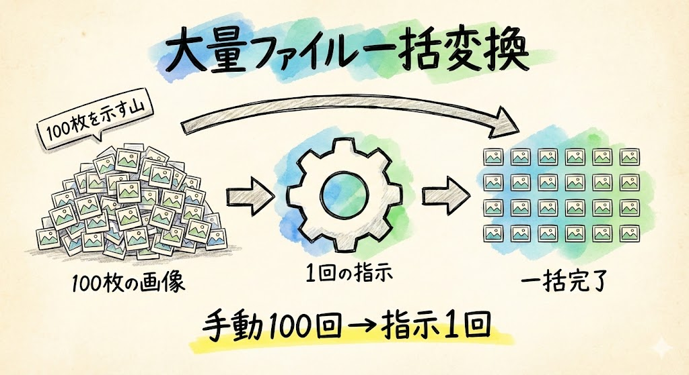
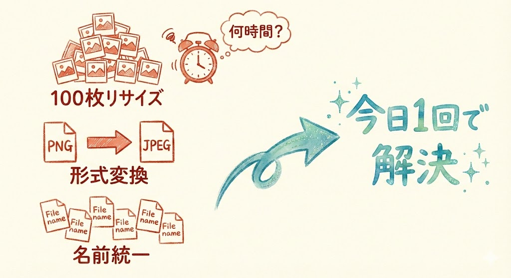
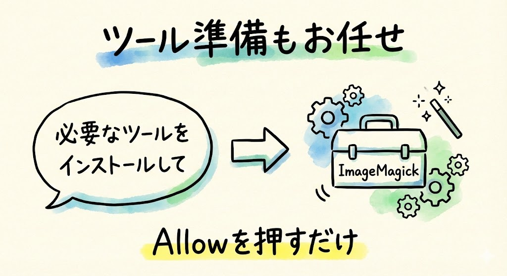
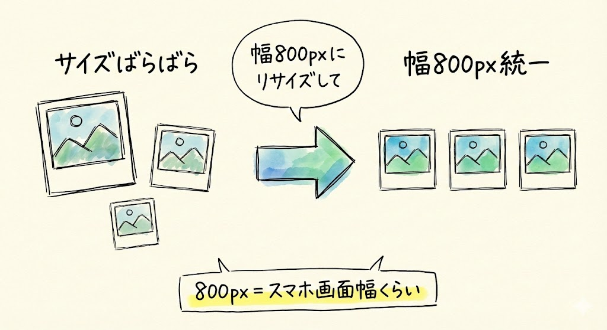
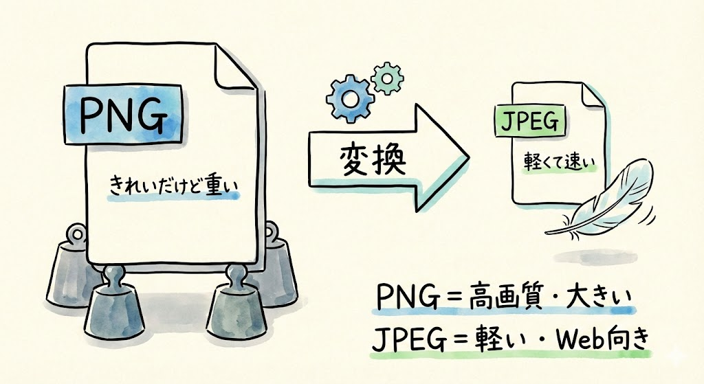
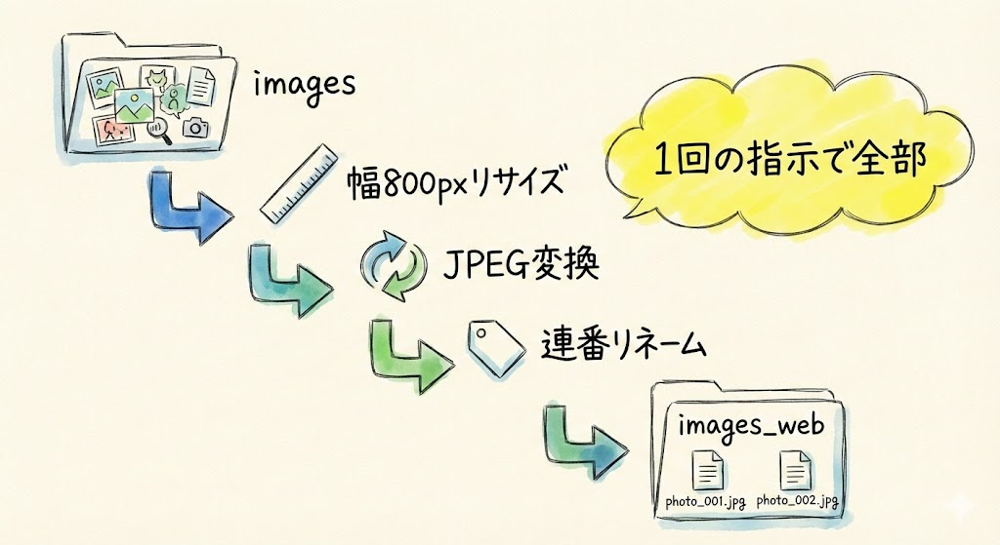
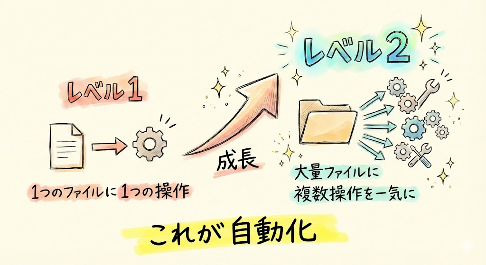
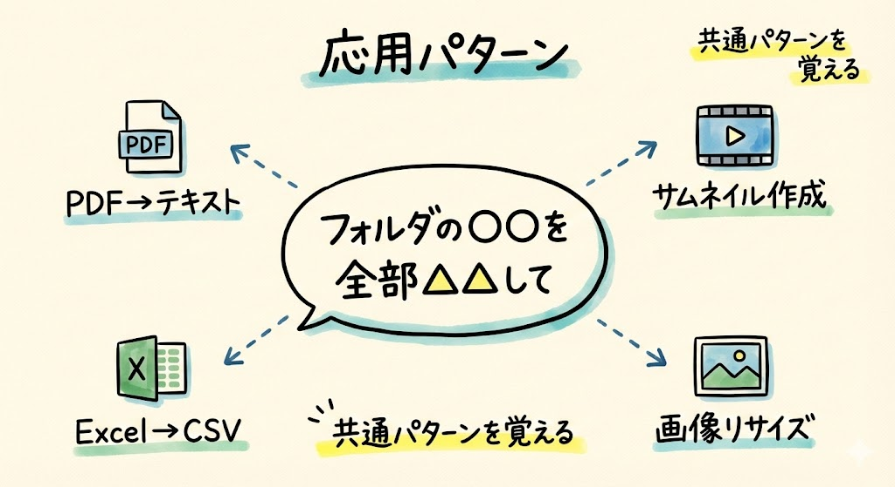
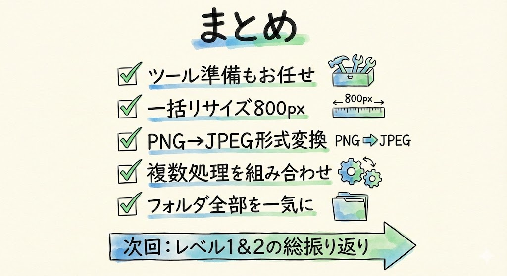

# 第14回｜大量ファイルの一括変換 — 100枚の画像リサイズ

## このレッスンのゴール



Claude Codeを使って、画像の一括リサイズや形式変換ができるようになること。手動で100回繰り返す作業を、1回の指示で終わらせる「自動化」を体感すること。

---

## 実際の業務シーンを想像してみてください



こんな状況になったことはありませんか？

- 写真を100枚、Webサイト用にリサイズしたい
- PNG画像を全部JPEG形式に変換したい
- ファイル名がバラバラで統一したい

1枚ずつ画像編集ソフトで開いて、サイズを変更して、保存して......。100枚あったら、何時間かかるでしょうか。想像しただけで気が遠くなりますよね。

今日は、これを1回の指示で終わらせます。

---

## まずツールを準備してもらう



画像をリサイズするには、パソコンに画像処理用のツールが必要です。でも、自分でインストール方法を調べる必要はありません。Claude Codeに任せましょう。

まず、ターミナルを開いてClaude Codeを起動します。

- **Macの方**: `Cmd` + `Space` → 「ターミナル」と入力して `Enter`
- **Windowsの方**: スタートメニューから「PowerShell」で検索

ターミナルが開いたら、以下を打ち込んで `Enter` を押します。

```
claude
```

画面に「Claude Code」の表示が出てきたら、準備完了です。

Claude Codeが起動した状態で、キーボードで以下をそのまま打ち込みます。

```
画像のリサイズや変換をしたいんだけど、必要なツールをインストールして
```

Claude Codeが許可を求めてきたら「Allow」を左クリックしてください。

画面に英語のメッセージがずらっと流れます。これはツールをダウンロードしてインストールしている様子です。少し時間がかかることがありますが、焦らず待ちましょう。カーソルが戻ってきて、エラーっぽい赤い文字が出なければ成功です。

> **確認してみましょう**: Claude Codeが「インストールしました」「完了しました」のようなメッセージを表示していればOKです。

Claude Codeが **ImageMagick（イメージマジック）** というツールをインストールしてくれます。ImageMagickは、プロのエンジニアも使っている画像処理ツールです。

名前は覚えなくて大丈夫です。Claude Codeが裏で使ってくれるだけなので、皆さんが直接操作することはありません。「そういうツールが入ったんだな」くらいの認識でOKです。

> **赤い文字でエラーが出た場合は**: Claude Codeに「このエラーが出たんだけど、どうすればいい？」と聞いてみてください。パソコンの環境によって追加の手順が必要なことがありますが、Claude Codeが案内してくれます。

---

## 画像を一括リサイズしてみよう



### 準備: imagesフォルダに画像を入れる

デスクトップに `images` というフォルダを作って、リサイズしたい画像を入れてみてください。フォルダの作り方は、デスクトップ上で右クリックして「新しいフォルダ」を選ぶか、Claude Codeに「デスクトップにimagesフォルダを作って」とお願いしてもOKです。

手元に画像がなければ、Claude Codeに用意してもらうこともできます。キーボードで以下をそのまま打ち込みます。

```
デスクトップにimagesフォルダを作って、テスト用のカラフルな画像を5枚作成して入れて
```

Claude Codeが許可を求めてきたら「Allow」を左クリックしてください。

> **確認してみましょう**: デスクトップに「images」フォルダが出来ていて、中に画像ファイルが入っていればOKです。

> **画像の作成がうまくいかない場合は**: ネット環境やパソコンの設定によっては、テスト画像を自動で作れないこともあります。その場合は、以下のどちらかで代用してください。
> - 自分のスマホで撮った写真を5枚ほど、imagesフォルダにコピーして入れる
> - パソコンの「写真」「ピクチャ」フォルダから適当な画像を5枚ほどコピーして入れる
>
> 画像の種類は何でもOKです。風景でも食べ物でも、なんでも構いません。

### 一括リサイズ

画像が準備できたら、いよいよ一括リサイズです。キーボードで以下をそのまま打ち込みます。

```
デスクトップのimagesフォルダの画像を全部、幅800pxにリサイズして
```

ここで出てきた「px（ピクセル）」というのは、画像の大きさを表す単位です。画面上の小さな点（ドット）1つが1ピクセルです。「幅800px」というのは「横幅を800ドット分の大きさにして」という意味です。具体的にイメージすると、**だいたいスマホの画面幅くらい**の大きさです。一般的なWebサイトに載せる写真としてちょうどいいサイズですね。

今は「画像のサイズを指定する数字なんだな」とわかっていれば大丈夫です。

たったこれだけの指示です。Claude Codeが許可を求めてきたら「Allow」を左クリックしてください。

画面に英語のメッセージが流れます。1枚ずつ処理しているので、画像の枚数分だけメッセージが表示されます。全部終わると止まって、カーソルが戻ってきます。エラーっぽい赤い文字が出なければ成功です。

Claude Codeがフォルダ内の画像を1枚ずつ処理して、全部を幅800pxにリサイズしてくれます。100枚あっても、指示は1回だけです。

> **確認してみましょう**: Claude Codeが「完了しました。○枚の画像をリサイズしました」のように報告してくれます。imagesフォルダを開いて、画像のサイズが変わっていることを確認してみてくださいね。Macの場合、画像を右クリック →「情報を見る」でサイズを確認できます。

> **うまくいかない場合は**: 「画像が見つかりません」というエラーが出たら、フォルダの場所やフォルダ名が合っているか確認してください。Claude Codeに「デスクトップのimagesフォルダの中身を見せて」と聞けば、フォルダの状態を教えてもらえます。

---

## 画像形式の変換もできる



リサイズだけでなく、画像の形式変換もできます。

### PNG → JPEG に一括変換

キーボードで以下をそのまま打ち込みます。

```
imagesフォルダのPNG画像を全部JPEGに変換して
```

Claude Codeが許可を求めてきたら「Allow」を左クリックしてください。画面にメッセージが流れて、変換が完了します。

> **確認してみましょう**: imagesフォルダの中に、`.jpg` という拡張子のファイルが出来ていればOKです。

### なぜ形式変換するのか

ここで少しだけ背景を説明しますね。画像にはいくつかの形式（フォーマット）があります。

| 形式 | 特徴 | 向いている用途 |
| --- | --- | --- |
| PNG（ピング） | きれいだがファイルサイズが大きい | ロゴ、イラスト |
| JPEG（ジェイペグ） | ファイルサイズが小さい | 写真、Webサイト |

身近な例でいうと、PNGは「高画質だけど重たい荷物」、JPEGは「少し画質を妥協して軽くした荷物」のようなイメージです。Webサイトに写真を載せるなら、JPEGの方がファイルサイズが小さくなるので、ページの表示が速くなります。

100枚のPNG画像を手動で1枚ずつJPEGに変換するのは大変ですが、Claude Codeなら1回の指示で終わります。

今はすべてを理解しなくても大丈夫です。「画像の形式には種類があって、用途によって使い分ける」ということだけ知っておいてください。

---

## ファイル名の一括処理と組み合わせる



画像のリサイズや変換と、ファイル名の変更を組み合わせることもできます。ここがレベル2の醍醐味です。

### 応用例: リサイズ + リネーム + 形式変換を一度に

キーボードで以下をそのまま打ち込みます。

```
imagesフォルダの画像を全部、以下の条件で処理して
- 幅800pxにリサイズ
- JPEG形式に変換
- ファイル名を photo_001.jpg, photo_002.jpg, ... のように連番にする
- 結果は images_web フォルダに保存して
```

Claude Codeが許可を求めてきたら「Allow」を左クリックしてください。

画面に英語のメッセージがたくさん流れます。リサイズ、変換、リネーム、保存先の作成......と、複数の処理を順番にやってくれています。少し時間がかかりますが、じっくり待ちましょう。全部終わると止まります。

1回の指示で、リサイズ・変換・リネーム（ファイル名の変更）・保存先の指定まで全部やってくれます。

> **確認してみましょう**: デスクトップに「images_web」フォルダが出来ていて、中に「photo_001.jpg」「photo_002.jpg」......と連番でファイルが並んでいればOKです。

手動でやったら何時間もかかる作業が、**指示を書いて送信するだけ** で完了します。

> **エラーが出た場合は**: Claude Codeに「途中でエラーが出たんだけど」と伝えれば、原因を調べて対処してくれます。最初からやり直しても大丈夫です。元の画像は残っているので、壊れたりする心配はありません。

---

## レベル1からの成長を振り返る



ここで、レベル1との違いを改めて確認しておきましょう。

| | レベル1 | レベル2 |
| --- | --- | --- |
| 対象 | 1つのファイル | フォルダ内の全ファイル |
| 指示 | 「このファイルをリネームして」 | 「このフォルダの画像を全部リサイズして」 |
| 処理数 | 1回 | 数十〜数百回分を一気に |
| 複雑さ | シンプル | 複数の条件を組み合わせられる |

レベル1では「1つのファイルに1つの操作」でした。レベル2では「大量のファイルに、複数の操作を一気に」できるようになりました。

**手動で100回繰り返す作業を、1回の指示で終わらせる。これが「自動化」です。**

ここまでできるようになった皆さん、すごいですよ。

---

## 画像以外にも使えるパターン



今日やった「フォルダ内のファイルを一括で処理する」パターンは、画像以外にもいろいろ使えます。いくつか例を紹介しますね。

| やりたいこと | 指示の例 |
| --- | --- |
| PDFを全部テキストに変換 | 「このフォルダのPDFを全部テキストファイルに変換して」 |
| 動画のサムネイル一括作成 | 「このフォルダの動画から全部サムネイルを切り出して」 |
| Excelを全部CSVに変換 | 「このフォルダのExcelファイルを全部CSVに変換して」 |

共通しているのは、**「このフォルダの○○を全部、△△して」** という指示のパターンです。このパターンを覚えておけば、さまざまな一括処理に応用できます。

今は「こういうこともできるんだな」と知っておくだけで大丈夫です。実際に必要になったときに、このパターンを思い出してClaude Codeに頼んでみてください。

---

## まとめ



- 画像処理ツール（ImageMagick）のインストールもClaude Codeに任せられる
- **「imagesフォルダの画像を全部、幅800pxにリサイズして」** で一括リサイズ
- px（ピクセル）は画像サイズの単位。800pxはだいたいスマホの画面幅くらい
- PNG→JPEGの形式変換、連番リネームなど、複数の処理を組み合わせられる
- レベル1（1つのファイル操作）→ レベル2（大量ファイルを一気に処理）への成長
- **「このフォルダの○○を全部、△△して」** のパターンは、画像以外にも応用できる
- エラーが出ても大丈夫。元のファイルは残っているので、やり直しがきく

次回は、レベル1とレベル2の全体を振り返ります。ここまでの知識だけでも仕事が変わることを実感しつつ、いよいよレベル3（アプリ開発）への橋渡しをしていきます。
