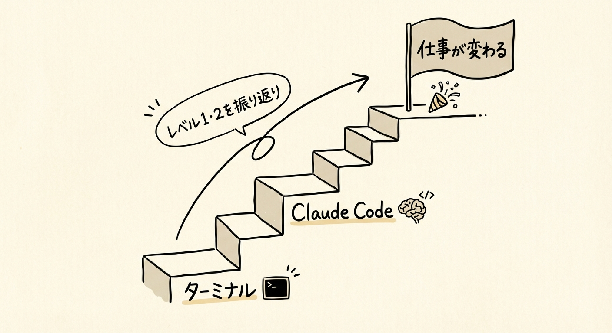
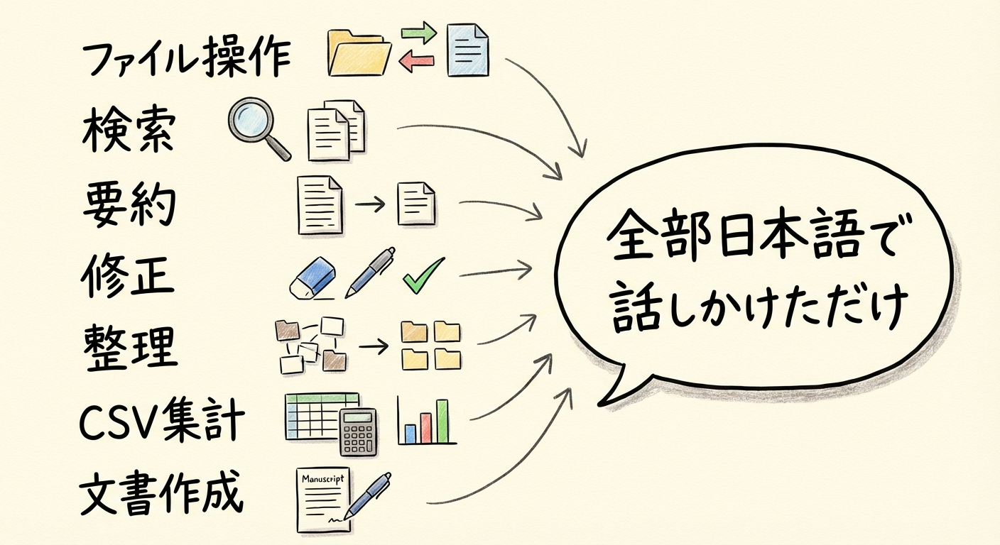
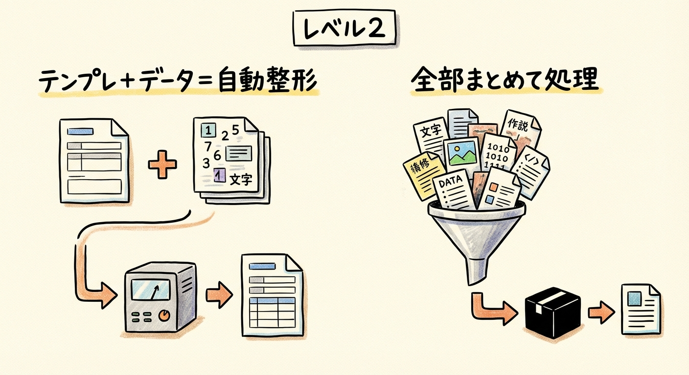
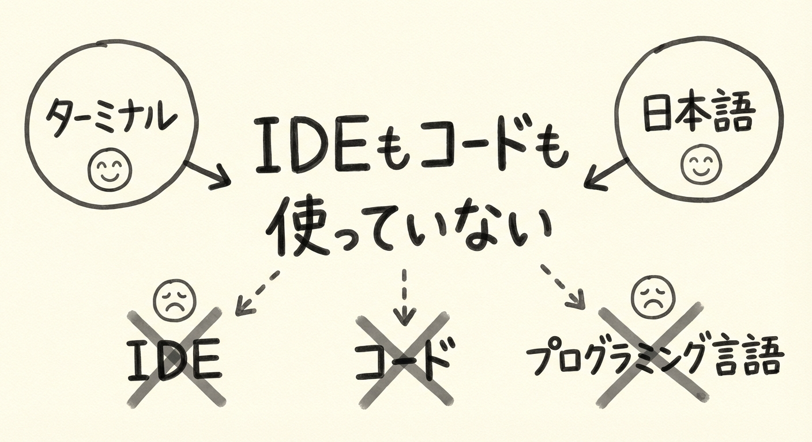
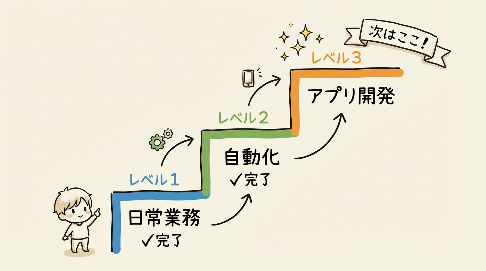
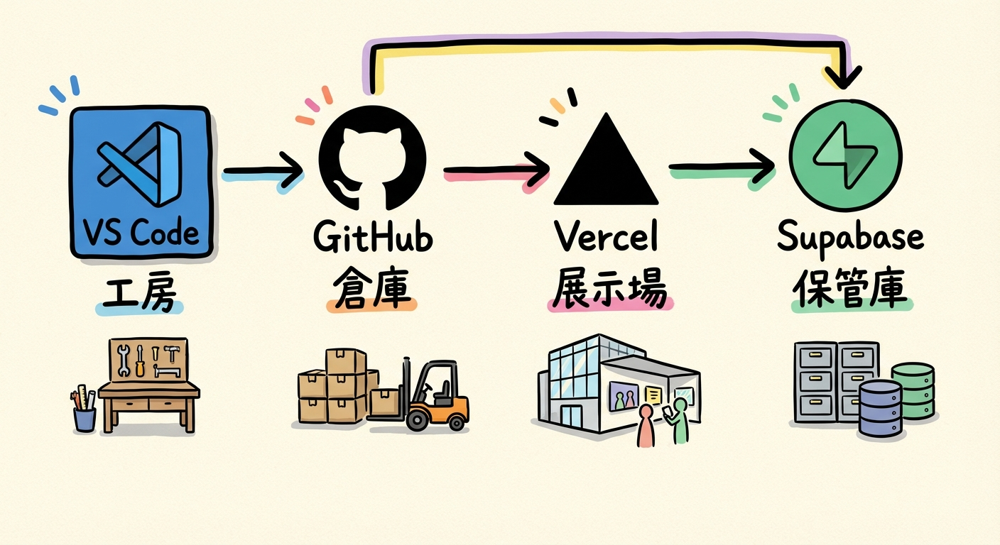
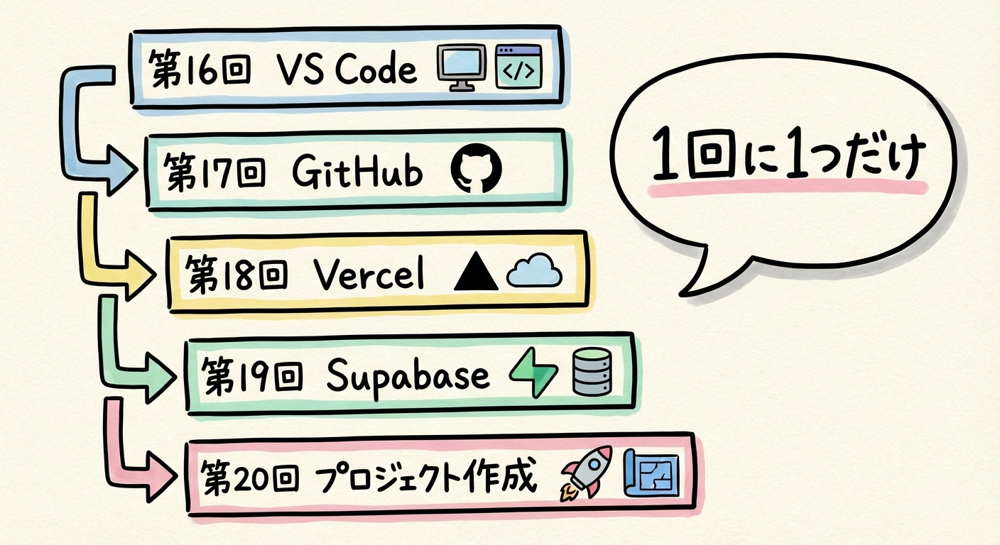
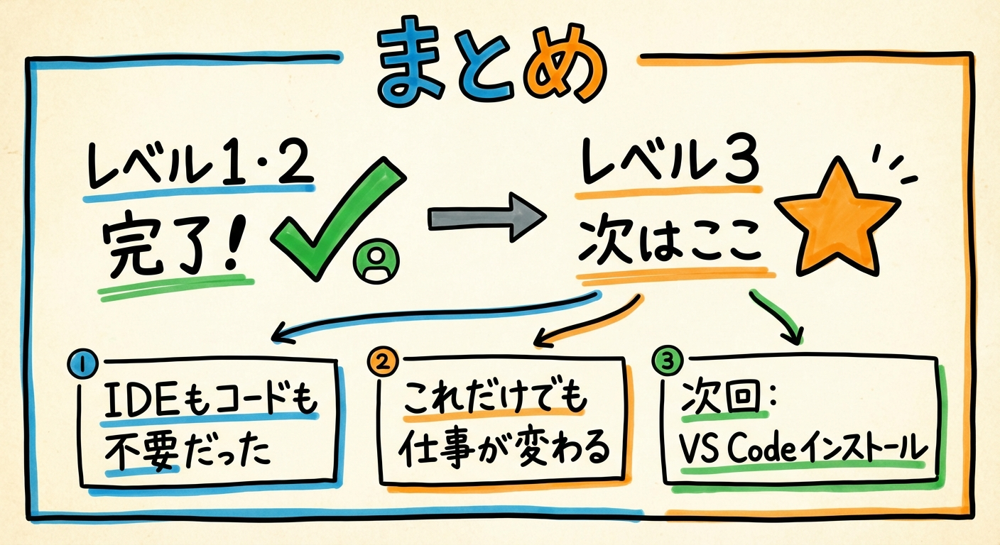

# 第15回｜レベル1・2のまとめ — ここまでの振り返りとアプリ開発への橋渡し

## このレッスンのゴール

レベル1・2で学んだことを整理し、「ここまでの知識だけでも仕事が変わる」と実感すること。そして、レベル3（アプリ開発）に進むための準備を知ること。

---

## レベル1で学んだこと

さて、今日は少し立ち止まって、これまでやってきたことを振り返りましょう。

第6回から第12回まで、日常業務にClaude Codeを使う方法を学んできました。

| 回 | やったこと | 指示の例 |
| --- | --- | --- |
| 第6回 | ファイル操作の基本 | 「このファイルを探して」「フォルダを作って」 |
| 第7回 | ファイル検索 | 「報告書って名前のファイルを探して」 |
| 第8回 | 文書の要約 | 「この資料を3行で要約して」 |
| 第9回 | 文章の修正 | 「もっとカジュアルに書き直して」 |
| 第10回 | フォルダ整理・リネーム | 「種類別にフォルダ分けして」 |
| 第11回 | CSV集計 | 「カテゴリ別の合計を出して」 |
| 第12回 | 文書作成 | 「報告書のドラフトを作って」 |

どれも **「1回の指示で1つの作業」** でした。

ここで皆さん、この表を見てください。右の列を上から順に見ていくと、全部日本語ですよね。コマンドも関数も出てきません。全部、日本語で話しかけているだけ。これが大事なポイントです。

---

## レベル2で学んだこと

第13回から第14回で、自動化のパターンを身につけました。

| 回 | やったこと | 指示の例 |
| --- | --- | --- |
| 第13回 | 議事録の自動整形 | 「このフォルダのメモを全部テンプレートに合わせて整形して」 |
| 第14回 | 大量ファイルの一括変換 | 「画像を全部幅800pxにリサイズして」 |

レベル2の特徴は **「複雑な指示で複数の作業を一気に」** でした。

覚えたパターンは2つです。

1. **テンプレート + データ = 自動整形** — 議事録、日報、報告書などに応用できる
2. **「このフォルダの○○を全部△△して」** — 画像、PDF、Excelなど何にでも使える

この2つのパターンだけで、かなりの業務を効率化できます。

---

## ここまでの事実を確認します

ここ、ちょっと大事なポイントです。改めて確認させてください。

**ここまで、IDEもコードも使っていません。**

IDE（アイディーイー）というのは、プログラマーがコードを書くための専用アプリのことです。正式には「統合開発環境」と言いますが、ざっくり言えば「プログラマー専用の高機能なメモ帳」のようなイメージです。この先で登場するVS Codeもその一種ですが、ここまでは一切使っていません。

皆さんがやったのは、ターミナルを開いて、Claude Codeに日本語で話しかけただけです。

プログラミング言語は学んでいません。コードも1行も書いていません。VS Codeも使っていません。

それでも、ここまでのことができるようになりました。

- ファイルを探す、要約する、修正する
- フォルダを整理する、名前を一括で変える
- CSVを集計する
- 文書を作成する
- テンプレートに沿って大量の文書を整形する
- 100枚の画像を一括でリサイズする

**ここまでの知識だけでも、仕事は大きく変わります。これだけでも元が取れます。**

もしアプリ開発に興味がなくても、レベル1とレベル2の内容を日常的に使うだけで、月に何時間もの時間が浮くはずです。「自分はアプリ開発はいいかな......」という方も、ここまでの内容だけで十分に価値があります。自信を持ってくださいね。

---

## 第1回の「3つのレベル」を振り返る

第1回で紹介した3つのレベルを、改めて確認しましょう。

| レベル | できること | 状態 |
| --- | --- | --- |
| レベル1 | 日常業務（ファイル操作、検索、要約、修正、整理、CSV、文書作成） | 完了 |
| レベル2 | 自動化（議事録整形、一括変換） | 完了 |
| **レベル3** | **アプリ開発** | **次はここ** |

レベル1とレベル2は、もうクリアしました。皆さん、ここまでよく頑張りましたね。

---

## ここからの話: レベル3に進みます

ここからはいよいよ、**自分のアプリを作ってインターネットに公開する** ところまでやります。

「え、アプリ開発？ 自分には無理でしょ......」

そう思った方、大丈夫です。レベル1を始めるときも「ターミナルなんて触れるのかな」と思いませんでしたか？ でもできましたよね。

レベル3も同じです。Claude Codeが全部やってくれます。皆さんがプログラミングを覚える必要はありません。

### 新しく必要なツール・アカウント

レベル3に進むにあたって、いくつか新しいツールとアカウントが必要になります。名前がいくつか出てきますが、今は全部覚える必要はありません。1つずつ順番にやっていきます。

| ツール / サービス | 役割 | たとえると |
| --- | --- | --- |
| **VS Code** | プログラマーがコードを書くための専用アプリ。Claude Codeと組み合わせて使う | 工房（作業する場所） |
| **GitHub** | コードをインターネット上に保存・管理するサービス | 倉庫（作ったものを保管する場所） |
| **Vercel** | 作ったアプリをインターネットに公開するサービス | 展示場（みんなに見せる場所） |
| **Supabase** | ユーザーのデータを保存するサービス（ログイン情報やTODOリストなど） | 保管庫（お客さんの荷物を預かる場所） |

4つあります。名前を見ると難しそうに感じるかもしれません。

でも、皆さんがやることは **画面に従ってアカウントを作るだけ** です。

- VS Code（ブイエス・コード） → ダウンロードしてインストールするだけ
- GitHub（ギットハブ） → メールアドレスでアカウントを作るだけ
- Vercel（バーセル） → GitHubアカウントでログインするだけ
- Supabase（スーパベース） → GitHubアカウントでログインするだけ

ここで注目してほしいのが、GitHubのアカウントを1つ作れば、VercelもSupabaseもそのアカウントでログインできるという点です。実質、新しいアカウントは1つだけです。パスワードをたくさん覚える必要はありません。

設定で「コードっぽいもの」を触る瞬間が1回だけありますが、それもコピー&ペーストするだけです。具体的には、envファイル（設定ファイル）にサービスの接続情報を貼り付ける作業です。キーボードで何かを打ち込むのではなく、画面に表示された文字列をコピーして貼り付けるだけなので、難しいことは一切ありません。

**Claude Codeが全部やってくれます。**

---

## 次回からの流れ

第16回から第20回で、アプリ開発の準備をしていきます。

| 回 | やること |
| --- | --- |
| 第16回 | VS Codeをインストールする |
| 第17回 | GitHubアカウントを作る |
| 第18回 | Vercelアカウントを作る |
| 第19回 | Supabaseプロジェクトを作る |
| 第20回 | プロジェクト作成とenvファイルの設定 |

1回につき1つのツールを準備していきます。どれも「画面の手順に従うだけ」なので、気楽に進められます。焦る必要はまったくありません。

そして第21回以降で、いよいよTODOアプリを作ってインターネットに公開します。自分で作ったアプリが、スマホからでもアクセスできるようになる——そんな体験がこの先に待っています。

---

## まとめ

- レベル1（日常業務）とレベル2（自動化）を完了した
- ここまで **IDEもコードも使っていない。ターミナルとClaude Codeだけ**
- レベル1・2の知識だけでも仕事は大きく変わる。これだけでも元が取れる
- 次はレベル3（アプリ開発）に進む
- 必要なのはVS Code、GitHub、Vercel、Supabaseの4つ。難しそうに見えるが、やることはアカウントを作るだけ
- GitHubアカウント1つで3つのサービスにログインできる。パスワードをたくさん覚える必要なし

次回は、VS Codeのインストールから始めます。アプリ開発の「作業場」を用意しましょう。
