# 第16回｜VS Codeをインストールしよう — アプリ開発の作業場

## このレッスンのゴール

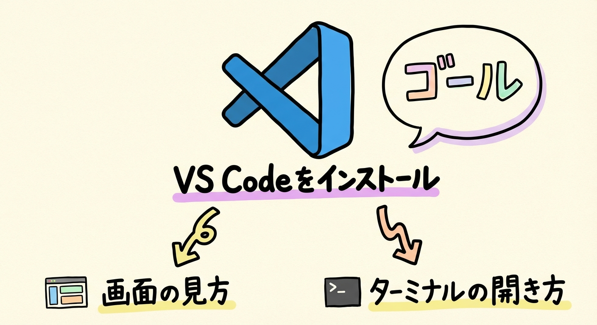

VS Code（Visual Studio Code）をインストールし、画面の見方とターミナルの開き方を覚えること。

---

## なぜ今、VS Codeが必要になるのか

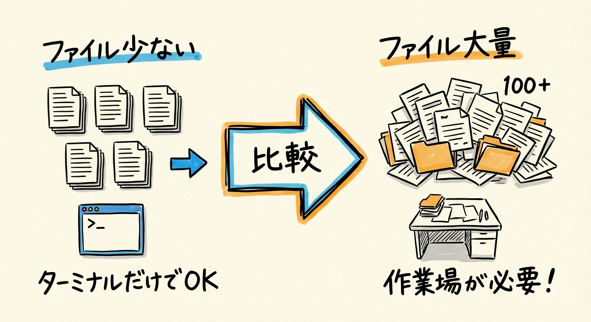

ここまでの講座（第3回〜第14回）では、ターミナルだけでClaude Codeを使ってきました。ファイル操作、検索、要約、CSV集計、議事録整形、画像一括変換......。全部ターミナルだけで完結しましたよね。

ではなぜ、ここからVS Codeが必要になるのか。

理由はシンプルです。**アプリ開発ではファイルが大量にできるから** です。

ターミナルだけだと、ファイルの中身を確認したり、フォルダ構成を見渡したりするのが大変になります。ファイルが5個や10個なら問題ありませんが、アプリ開発では数十〜数百のファイルが作られます。

たとえるなら、書類が5枚だけなら机の上に並べて見られますが、100枚の書類を管理するには棚や引き出しが必要になりますよね。それと同じです。

それを管理するための「作業場」が、VS Codeです。ファイルの一覧を見ながら、ターミナルも使える。そういう便利な場所だと思ってください。

---

## VS Codeとは

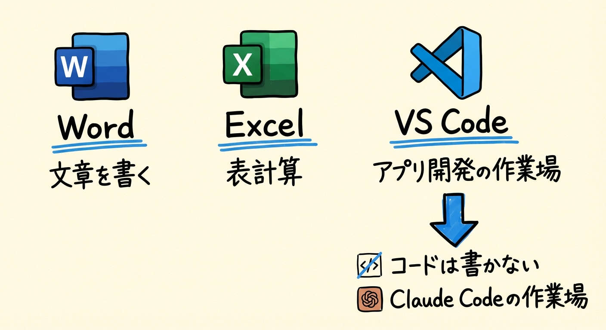

**VS Code（ブイエス・コード）** の正式名称は「Visual Studio Code（ビジュアル・スタジオ・コード）」です。Microsoftが作った無料のソフトです。

Wordは文章を書くソフト、Excelは表計算をするソフトですよね。VS Codeは **アプリ開発をするためのソフト** です。

| ソフト | 用途 |
| --- | --- |
| Word | 文章を書く |
| Excel | 表計算をする |
| **VS Code** | **アプリ開発の作業場** |

ただし、ここで大事なことを1つ。

**皆さんがVS Codeでコードを書くわけではありません。**

Claude Codeがコードを書きます。VS Codeは、Claude Codeが作ったファイルを見たり、ターミナルを使ったりするための「場所」として使います。工房のイメージですね。職人（Claude Code）が作業するための場所を用意する、という感じです。

---

## ダウンロード＆インストール

### ステップ1: ダウンロード

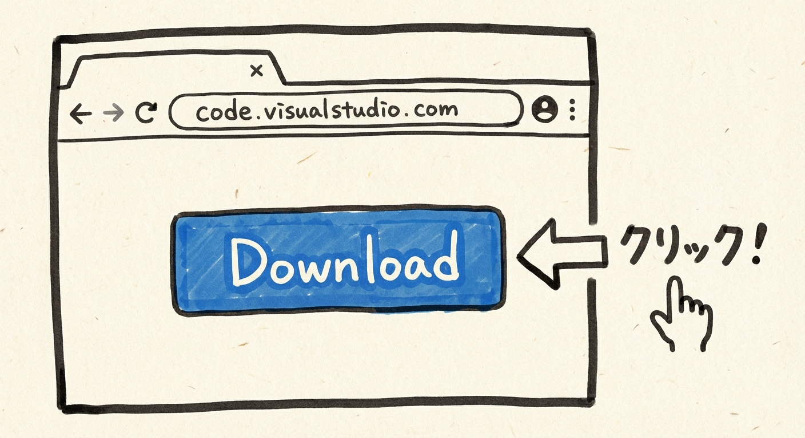

ブラウザ（Chrome、Safari、Edgeなど、普段使っているもの）の上部にあるアドレスバー（URLが表示されている横長の欄）に、以下のURLを打ち込んで `Enter` を押します。

```
https://code.visualstudio.com
```

ページを開くと、大きなダウンロードボタンが表示されます。お使いのパソコンに合ったものが自動で表示されるはずです。そのボタンを左クリックしてください。

もし「Mac用」「Windows用」のように選択肢が表示された場合は、自分のパソコンに合ったものを左クリックしてください。自分のパソコンがMacかWindowsかわからない場合は、画面の左上にリンゴのマークがあればMac、画面の左下にWindowsのマークがあればWindowsです。

### ステップ2: インストール（Macの場合）

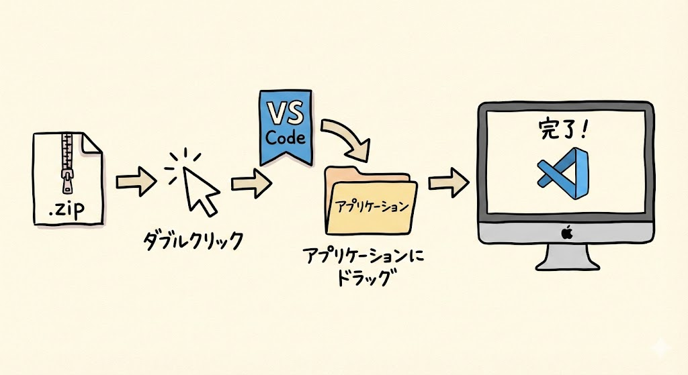

1. ダウンロードされた `.zip` ファイルをダブルクリックして解凍します。`.zip`（ジップ）ファイルというのは、ファイルを小さく圧縮してまとめたものです。お弁当を小さな箱に詰めるようなイメージですね。ダブルクリックすると中身が出てきます
2. 出てきた **「Visual Studio Code」** というアイコンを **アプリケーションフォルダ** にドラッグ＆ドロップします。ドラッグ＆ドロップとは、アイコンを左クリックしたまま移動させて、目的の場所で指を離す操作です。Finderで左の一覧から「アプリケーション」を探してください
3. アプリケーションフォルダから「Visual Studio Code」をダブルクリックして起動します
4. 「インターネットからダウンロードされたアプリケーションです。開いてもよろしいですか？」と聞かれたら **「開く」** を左クリックします。これはMacのセキュリティ確認なので、心配する必要はありません

### ステップ2: インストール（Windowsの場合）

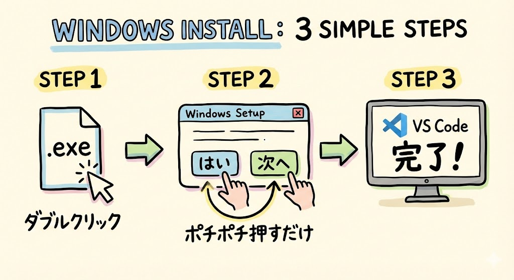

1. ダウンロードされた `.exe`（エグゼ）ファイルをダブルクリックします。`.exe` はWindowsのインストール用ファイルです。「実行ファイル」とも呼ばれます
2. 「このアプリがデバイスに変更を加えることを許可しますか？」と表示されたら **「はい」** を左クリックします。これはWindowsのセキュリティ確認です
3. インストーラーの指示に従って **「次へ」** を左クリックしていきます
4. 途中でいくつかチェックボックスが表示されることがありますが、デフォルト（最初からチェックが入っている状態）のままで大丈夫です
5. 完了画面が出たらインストール完了です
6. デスクトップのアイコン、またはスタートメニュー（画面左下のWindowsマーク）から「Visual Studio Code」を検索して起動します

どちらの場合も、基本的に「次へ」を押していくだけです。設定はデフォルト（初期設定）のままで問題ありません。

### 確認してみましょう

VS Codeが正しくインストールできたか確認します。

- デスクトップやアプリケーション一覧に **「Visual Studio Code」** のアイコンが表示されていますか？
- ダブルクリックして起動すると、青っぽい画面が表示されますか？

どちらもOKなら、インストール成功です。

### トラブルシュート

| 症状 | 対処法 |
| --- | --- |
| ダウンロードボタンが見つからない | ページ中央の「Download」と書かれた大きなボタンを探してください。ページの上部に小さく表示されていることもあります |
| Macで「アプリケーションが壊れています」と表示される | `システム設定` → `プライバシーとセキュリティ` → 画面下部の「このまま開く」を左クリックしてください |
| Windowsで「WindowsによってPCが保護されました」と表示される | 「詳細情報」を左クリック → 「実行」を左クリックしてください。安全なソフトなので問題ありません |
| インストール中にエラーが出た | パソコンを再起動してからもう一度試してみてください。それでもダメな場合は、Claude Codeに「VS Codeのインストールで困っている」と相談してみてください |

---

## 画面の説明

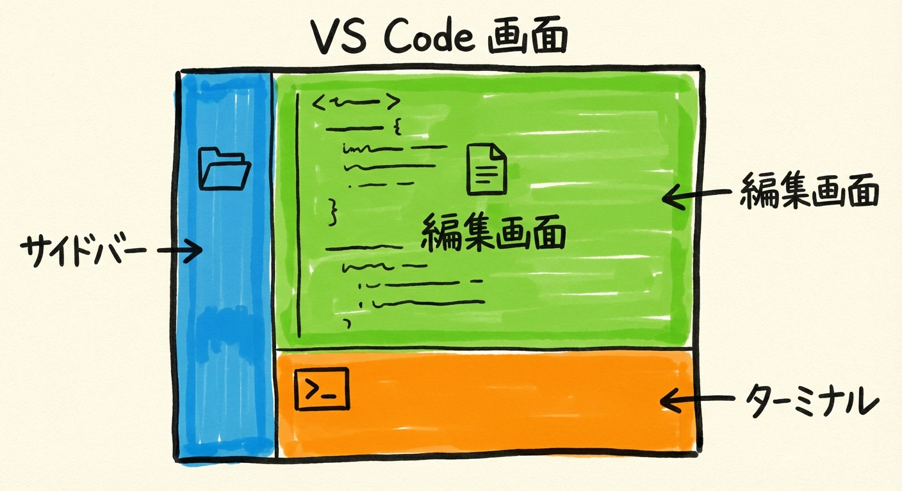

VS Codeを起動すると、英語の画面が表示されます。「英語で難しそう......」と思うかもしれませんが、使うのは3つのエリアだけです。覚えてくださいね。

### サイドバー（左）

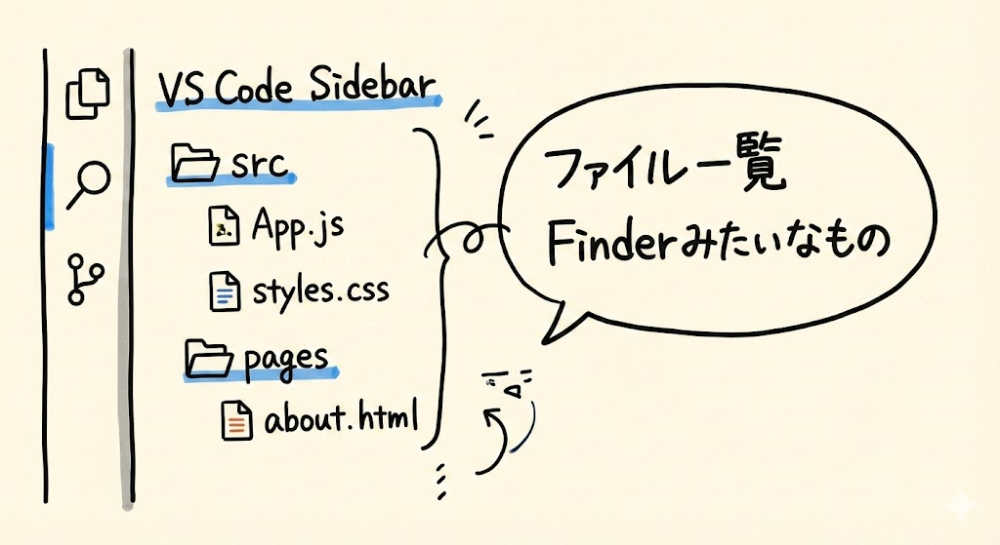

画面の左側にあるエリアです。ファイルやフォルダの一覧が表示されます。パソコンのフォルダを開くと、ここにファイルがずらっと並びます。ファイル名を左クリックすると中身が見られます。

Windowsの「エクスプローラー」やMacの「Finder」に似た役割ですね。

### 編集画面（中央）

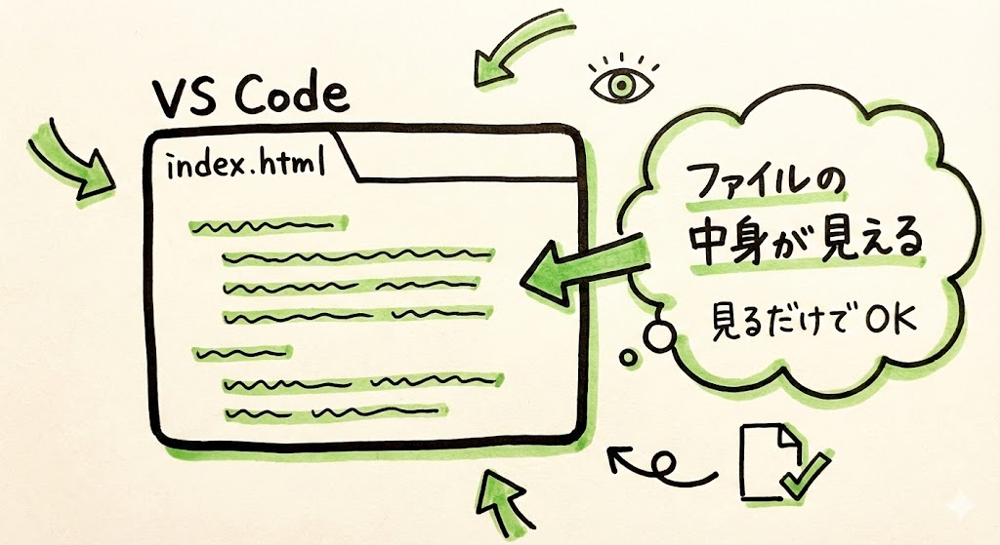

画面の真ん中にある大きなエリアです。ファイルの中身が表示されます。サイドバーでファイルを左クリックすると、ここに内容が表示されます。

この講座では、皆さんがここで何かを編集する機会はほぼありません。Claude Codeが編集したファイルを確認するときに見る場所です。「見るだけ」の場所だと思ってもらえれば大丈夫です。

### ターミナル（下）

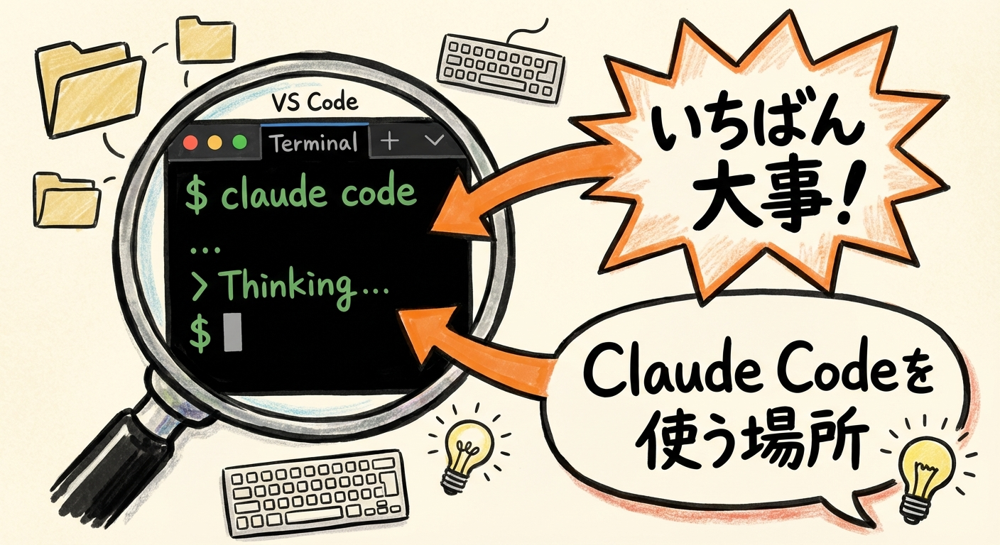

画面の下部にあるエリアです。ここがいちばん大事です。

今まで別のウィンドウで開いていたターミナルが、VS Codeの中に組み込まれています。ここからClaude Codeを起動します。使い方はこれまでと全く同じです。

---

## ターミナルの開き方

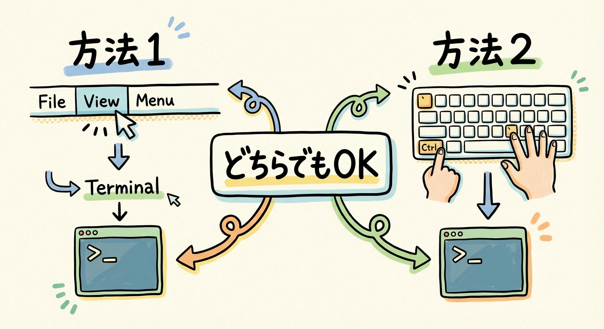

VS Codeを最初に開いたとき、画面の下部にターミナルが表示されていないことがあります。その場合は、以下の方法で表示しましょう。

### 方法1: メニューから開く

画面の一番上にあるメニューバーから **「View」** を左クリックして、表示されたメニューの中から **「Terminal」** を左クリックします。

もしVS Codeが日本語表示になっている場合は **「表示」→「ターミナル」** です。

### 方法2: ショートカットキーで開く

- **Mac**: ``Ctrl + ` ``（コントロールキーを押しながら、バッククォートキーを押す）
- **Windows**: ``Ctrl + ` ``（同じです）

バッククォート（`` ` ``）は、キーボードの左上あたりにあることが多いキーです。日本語キーボードの場合は `Shift` + `@` で入力できることもあります。見つからなくても大丈夫です。方法1のメニューから開く方法で問題ありません。

### 確認してみましょう

ターミナルが正しく表示されたか確認します。

- 画面の下部に、黒っぽい背景のエリアが表示されていますか？
- そのエリアの中に、文字を入力できるカーソル（点滅する線）が見えますか？

どちらもOKなら、ターミナルの表示成功です。

### トラブルシュート

| 症状 | 対処法 |
| --- | --- |
| メニューに「View」が見つからない | Macの場合、画面の一番上（デスクトップの最上部）にメニューバーが表示されていることがあります。VS Codeのウィンドウ内ではなく、画面最上部を確認してください |
| ターミナルが表示されたが文字が打てない | ターミナルのエリア内を左クリックしてから、キーボードで入力してみてください |
| ターミナルがとても小さい | ターミナルとエディタの境界線（ターミナルの上端）を左クリックしたまま上にドラッグすると、ターミナルのエリアを広げられます |

---

## これまでのターミナルとの違い

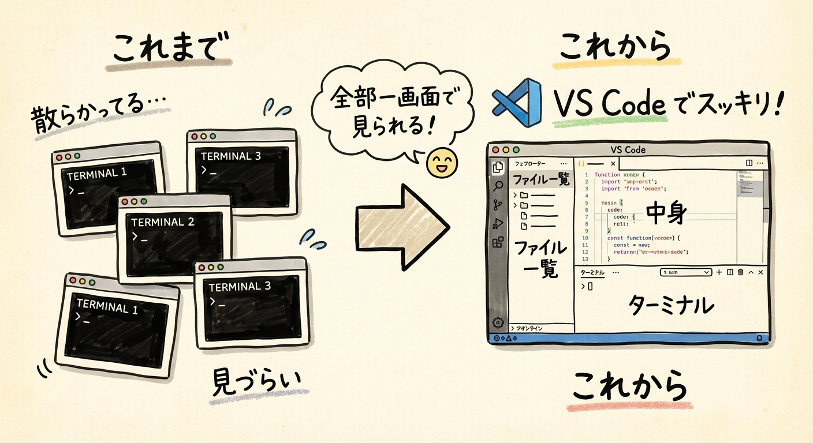

「あれ？ 今までもターミナルを使っていたのに、なぜVS Codeの中のターミナルに切り替えるの？」

と思うかもしれません。良い質問です。理由は2つあります。

1. **ファイルを見ながら作業できる** — 左にファイル一覧、下にターミナル、中央にファイルの中身。全部一画面で見られます。いちいちウィンドウを切り替える必要がありません
2. **フォルダの場所が自動で合う** — VS Codeでフォルダを開くと、ターミナルも自動でそのフォルダの中に入ってくれます。「今どこにいるか」を意識しなくて済むんですね。料理をするとき、道具と材料が全部同じキッチンに揃っている状態です

ターミナル単体で使うのと、やっていることは同じです。Claude Codeへの話しかけ方も変わりません。ただ、アプリ開発では「ファイルを見ながら作業する」ことが多いので、VS Codeの中のターミナルの方が便利です。

今は「VS Codeの中にターミナルがあるんだな」ということだけわかっていれば大丈夫です。

---

## 試しに動かしてみよう

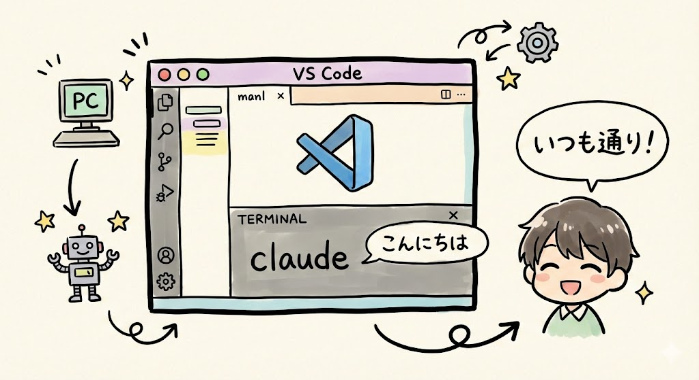

VS Codeのターミナルが開けたら、試しにClaude Codeを起動してみましょう。

ターミナルの中を左クリックして、カーソル（文字を打てる位置を示す点滅するライン）がターミナル内にあることを確認したら、キーボードで以下をそのまま打ち込んで `Enter` を押します。

```
claude
```

画面に英語のメッセージが表示されて、いつも通りClaude Codeが起動するはずです。「Claude Code」のロゴや文字が表示されていれば成功です。

起動できたら、キーボードで以下をそのまま打ち込んでみましょう。

```
こんにちは。VS Codeのターミナルから起動しています
```

ちゃんと返事が来ますよね。使い方は今まで通り、何も変わりません。安心してくださいね。

確認できたら、キーボードで `/exit` と打ち込んで `Enter` を押して、Claude Codeを終了しておきましょう。

### 確認してみましょう

以下の3つがすべてできたか確認してください。

- VS Codeのターミナルで `claude` と打って起動できた
- 「こんにちは」と話しかけて返事が返ってきた
- `/exit` でClaude Codeを終了できた

全部OKなら、VS Codeの準備は完了です。

### トラブルシュート

| 症状 | 対処法 |
| --- | --- |
| `command not found` と表示される | VS Codeを一度閉じて、もう一度開き直してからやり直してみてください。それでもダメな場合は、Macなら「ターミナル」アプリ、Windowsなら「PowerShell」で `claude --version` を試して、Claude Codeがインストールされているか確認してください |
| ターミナルに何も入力できない | ターミナルのエリア内を左クリックしてから入力してみてください。カーソルがターミナル内で点滅していることを確認しましょう |
| Claude Codeは起動するが返事が返ってこない | インターネット接続を確認してください。Claude CodeはAIと通信するため、インターネット接続が必要です |

---

## まとめ

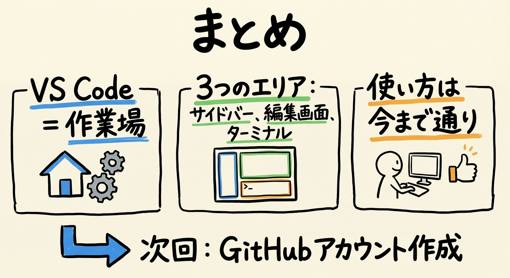

- アプリ開発ではファイルが大量にできるので、**VS Code（作業場）** が必要になる
- VS Code = Microsoftが作った無料のソフト。ただしコードは書かない。Claude Codeの作業場として使う
- 画面は3つのエリア: **サイドバー**（左、ファイル一覧）、**編集画面**（中央、ファイルの中身）、**ターミナル**（下、Claude Codeを使う場所）
- ターミナルの開き方: **View → Terminal**、またはショートカット ``Ctrl + ` ``
- **ここからはVS Codeのターミナルの中でClaude Codeを使っていきます**
- 使い方はこれまでと同じ。日本語で話しかけるだけ

次回は、GitHubのアカウントを作ります。コードを安全に保管するための「倉庫」を用意しましょう。
