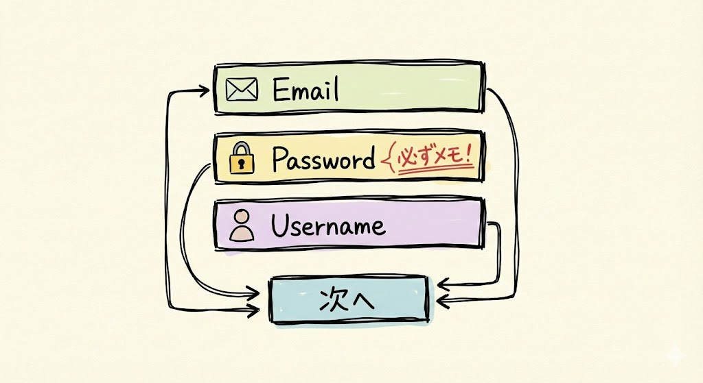
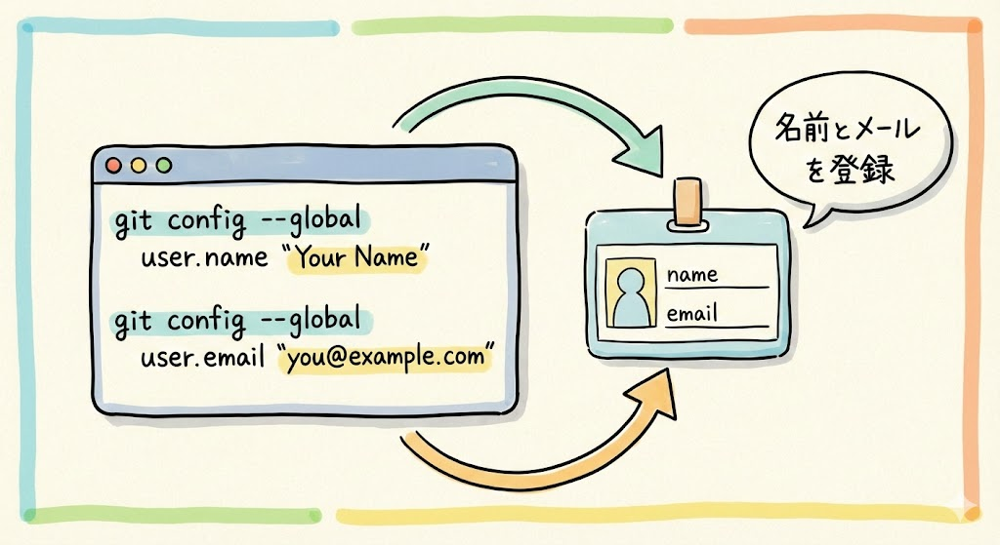
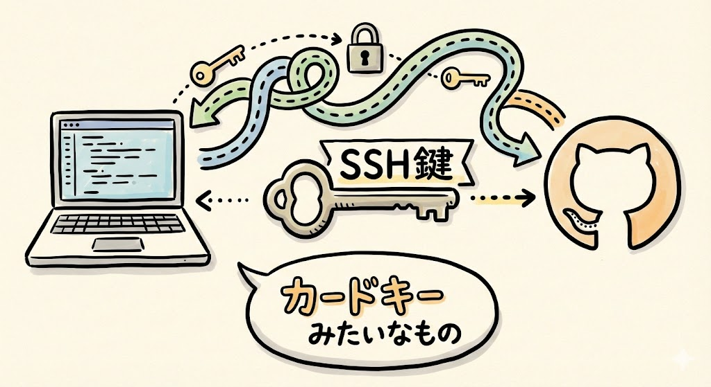
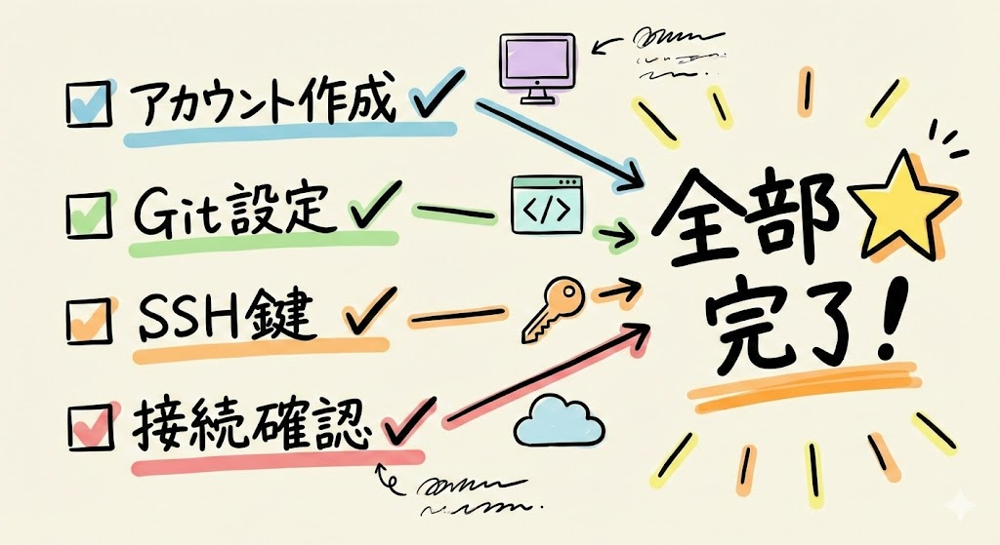
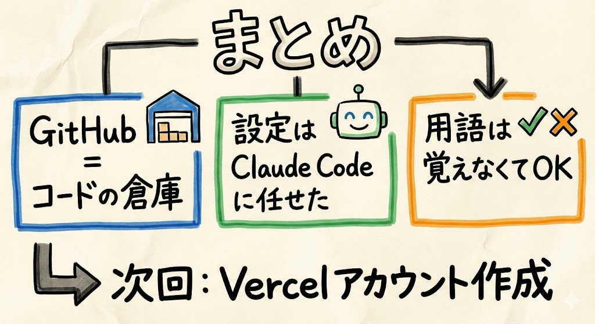

# 第17回｜GitHubアカウントを作ろう — コードの倉庫

## このレッスンのゴール


GitHubのアカウントを作成し、Claude Codeから接続できる状態にすること。

---

## GitHubとは


**GitHub（ギットハブ）** は、コードを保存しておくためのサービスです。

文書をGoogle Driveに保存するように、コードをGitHubに保存します。インターネット上にある「コード専用のクラウドストレージ」だと思ってもらえれば近いです。クラウドストレージとは、インターネット上にファイルを保存できるサービスのことです。

| サービス | 保存するもの | 特徴 |
| --- | --- | --- |
| Google Drive | 文書、写真、動画 | ファイルをクラウドに保管 |
| **GitHub** | **コード** | **変更履歴が残る、他の人と共有できる** |

GitHubの便利なところは、**変更履歴が残る** ことです。「1週間前の状態に戻したい」ということができます。

文書を上書き保存してしまって「前の版に戻したい......」と後悔した経験はありませんか？ GitHubなら、いつでも過去の状態に戻せます。上書きしてしまっても安心です。Word の「元に戻す」ボタンの超強力版だと思ってください。

---

## なぜGitHubが必要なのか


この先の流れを見ると、GitHubが土台になっていることがわかります。

```
VS Code + Claude Code（コードを作る）
    ↓
GitHub（コードを保管する）← ここが今日
    ↓
Vercel（アプリを公開する）← 次回
```

GitHubにコードを保存すると、Vercel（バーセル。次回アカウントを作るサービスです）が自動でアプリを公開してくれます。つまり、GitHubは **この先ずっと使う土台** です。

今日しっかり設定しておけば、あとの作業がスムーズになりますよ。

---

## ステップ1: GitHubアカウントを作る

### 1. github.comにアクセス


ブラウザ（Chrome、Safari、Edgeなど、普段使っているもの）の上部にあるアドレスバー（URLが表示されている横長の欄）に、以下のURLを打ち込んで `Enter` を押します。

```
https://github.com
```

GitHubのトップページが表示されます。英語のサイトですが、必要な部分だけ見ていけば大丈夫です。

### 2. 「Sign Up」をクリック


画面右上にある **「Sign Up」** ボタンを左クリックします。「Sign Up」は「新しくアカウントを作る」という意味です。似たボタンで「Sign In」がありますが、それは「既にアカウントを持っている人がログインする」ときのものなので、間違えないようにしてくださいね。

### 3. 必要な情報を入力



画面の指示に従って、以下をキーボードで入力していきます。

| 項目 | 入力内容 | 補足 |
| --- | --- | --- |
| Email address | 自分のメールアドレス | 普段使っているメールアドレスでOKです |
| Password | パスワード | **必ずメモしておいてください。** 忘れるとログインできなくなります |
| Username | ユーザー名 | 英数字で、好きなものを。後から変更もできるので、気楽に決めて大丈夫です |

入力したら、画面下部のボタンを左クリックして次に進みます。途中でパズルのような認証（「ロボットではありません」の確認）が表示されることがありますが、画面の指示に従って操作すれば大丈夫です。

### 4. メール認証を完了する


入力したメールアドレスに、GitHubから認証メールが届きます。メールアプリ（Gmail、Yahoo!メールなど）を開いて、GitHubからのメールを探してください。

メールの中にある認証コード（数字の並び）を、GitHubの画面に入力します。もしくは、メールの中にあるリンクを左クリックします。

もしメールが届かない場合は、迷惑メールフォルダを確認してみてください。それでも届かない場合は、少し待ってから「Resend（再送信）」ボタンを左クリックしてください。

### 確認してみましょう

GitHubアカウントが正しく作成できたか確認します。

- メール認証が完了して、GitHubのダッシュボード（管理画面）が表示されていますか？
- 画面右上にアイコン（丸い画像）が表示されていますか？

どちらもOKなら、アカウント作成は成功です。

### トラブルシュート

| 症状 | 対処法 |
| --- | --- |
| 認証メールが届かない | 迷惑メールフォルダを確認してください。5分待っても届かない場合は「Resend email」ボタンを左クリックしてください |
| 「Username is already taken」と表示される | そのユーザー名は既に他の人が使っています。別のユーザー名を試してください。数字を後ろにつけるのもアリです（例: `taro123`） |
| パズル認証が何度やっても通らない | ブラウザを変えて試してみてください（例: ChromeからEdgeに変更）。VPN（仮想的に別の場所から接続する仕組み）を使っている場合はオフにしてみてください |

---

## ステップ2: Gitの初期設定をClaude Codeに任せる


GitHubを使うには、パソコン側で少しだけ設定が必要です。でも、この設定もClaude Codeに任せられます。「設定」と聞くと難しそうですが、Claude Codeに話しかけるだけなので安心してくださいね。

### 1. VS Codeを開いてターミナルを表示

前回（第16回）でインストールしたVS Codeを開いて、ターミナルを表示します。

**ターミナルの開き方（復習）**

- **Mac**: VS Codeの画面上部のメニューバーから **「View」→「Terminal」** を左クリック。または ``Ctrl + ` ``
- **Windows**: VS Codeの画面上部のメニューバーから **「View」→「Terminal」** を左クリック。または ``Ctrl + ` ``

画面の下部に黒っぽいエリア（ターミナル）が表示されればOKです。

### 2. Claude Codeを起動

ターミナルの中を左クリックして、キーボードで以下をそのまま打ち込んで `Enter` を押します。

```
claude
```

Claude Codeが起動したら、準備完了です。

### 3. Git設定をお願いする



Claude Codeにキーボードで以下をそのまま打ち込みます。（○○の部分は、さっきGitHubで登録したユーザー名とメールアドレスに置き換えてください。）

```
GitHubを使えるように設定して。ユーザー名は○○、メールは○○@example.com
```

Claude Codeが `git config`（ギット・コンフィグ）というコマンドを実行して、設定してくれます。

ここで少し用語の説明をしますね。

- **Git（ギット）** とは、コードの変更履歴を管理するための仕組みです。たとえるなら、文書の「変更履歴を追跡する機能」です。Wordにも変更履歴を記録する機能がありますよね。それのプログラミング版だと思ってください
- **git config** とは、そのGitの設定を変更するためのコマンドです。「あなたの名前と連絡先を登録する」ようなイメージです

Claude Codeが許可を求めてきたら「Allow」を左クリックしてください。画面にコマンドの実行結果が表示されます。エラーっぽい赤い文字が出なければ成功です。

### 4. SSH接続の設定をお願いする



続けて、キーボードで以下をそのまま打ち込みます。

```
GitHubにSSH接続できるように設定して
```

Claude Codeが **SSH鍵**（エスエスエイチかぎ）というものを作って、GitHubに登録する手順を案内してくれます。

SSH鍵というのは、パソコンとGitHubの間で安全に通信するための「電子的な合い鍵」のようなものです。マンションのオートロックに使うカードキーをイメージしてください。カードキーを持っている人だけが入れるように、SSH鍵を持っているパソコンだけがGitHubに接続できます。パスワードよりもセキュリティが高い仕組みなんですね。

途中でGitHubのウェブサイトを開いて鍵を登録する作業があります。Claude Codeが「ここにこの値を貼り付けてください」と案内してくれるので、その通りに進めれば大丈夫です。具体的には以下のような流れになります。

1. Claude Codeが「この文字列をコピーしてください」と表示します
2. その文字列を選択してコピーします（**Mac**: `Cmd` + `C`、**Windows**: `Ctrl` + `C`）
3. Claude Codeが案内するGitHubの設定ページをブラウザで開きます
4. 指示された場所にコピーした文字列を貼り付けます（**Mac**: `Cmd` + `V`、**Windows**: `Ctrl` + `V`）
5. 「Add SSH Key」のようなボタンを左クリックして保存します

もし途中でわからなくなったら、Claude Codeに「次に何をすればいいですか？」と聞いてみてください。手順を教えてくれます。

### 5. 接続確認


最後に、ちゃんと接続できるか確認しましょう。キーボードで以下をそのまま打ち込みます。

```
GitHubに接続できるか確認して
```

Claude Codeが接続テストを実行してくれます。画面に `Hi ○○! You've successfully authenticated` のようなメッセージが表示されれば成功です。これは「○○さん、認証に成功しました」という意味です。

### 確認してみましょう

ステップ2の設定がすべて完了したか確認します。

- Git設定（ユーザー名・メールアドレス）が完了した
- SSH鍵の作成と登録が完了した
- 接続テストで `successfully authenticated` のメッセージが表示された

全部OKなら、GitHubとの接続設定は完了です。

### トラブルシュート

| 症状 | 対処法 |
| --- | --- |
| 接続テストで `Permission denied` と表示される | SSH鍵の登録がうまくいっていない可能性があります。Claude Codeに「SSH鍵をもう一度設定してほしい」と伝えてみてください |
| 「GitHubのページでSSH鍵を登録する場所がわからない」 | GitHubにログインした状態で、右上のアイコン → `Settings` → 左メニューの `SSH and GPG keys` → `New SSH key` ボタンの順に進みます。Claude Codeに「SSH鍵の登録場所を教えて」と聞いても案内してくれます |
| Claude Codeが表示する文字列が長くてどこからどこまでコピーすればいいかわからない | `ssh-rsa` または `ssh-ed25519` で始まる行を、行の最後まですべてコピーしてください。Claude Codeに「コピーする範囲を教えて」と聞くと丁寧に教えてくれます |

---

## 「Git」「SSH鍵」って何？


ここで出てきた用語について、少しだけ補足しておきますね。

### Git（ギット）

コードの変更履歴を管理するための仕組みです。GitHubは、このGitの仕組みをインターネット上で使えるようにしたサービスです。名前が似ていてややこしいですが、こう覚えてください。

- **Git** = 変更履歴を管理する「仕組み」（道具そのもの）
- **GitHub** = その仕組みをインターネット上で使えるようにした「サービス」（道具を使える場所）

たとえるなら、Gitは「日記帳」、GitHubは「日記帳を預けられるクラウドの金庫」です。

### SSH鍵（エスエスエイチかぎ）

パソコンとGitHubの間で安全にデータをやり取りするための「暗号の鍵」です。パスワードの代わりに使われます。鍵といっても物理的なものではなく、長い文字列の組み合わせです。

**どちらも、覚える必要はありません。**

Claude Codeが設定してくれたので、皆さんは今後「GitHubにpushして」と指示するだけです。push（プッシュ）というのは「GitHubにコードを送る（アップロードする）」という意味です。Google Driveにファイルをアップロードするのと同じ感覚ですね。裏でGitやSSH鍵が働いてくれますが、意識する必要はありません。

---

## 今日の成果



今日やったことを振り返りましょう。

```
GitHub アカウント作成 → 完了
Git 初期設定 → Claude Codeが実行 → 完了
SSH鍵 設定 → Claude Codeが実行 → 完了
接続確認 → 成功
```

GitHubの準備が整いました。これで、コードを安全に保管できる「倉庫」が使えるようになりました。

お疲れさまでした。今日の作業は設定が中心だったので、少し大変だったかもしれません。でも、この設定は一度やれば終わりです。次回からはもっと楽になりますよ。

---

## まとめ



- **GitHub** = コードを保存するサービス。Google Driveのコード版
- 変更履歴が残るので、いつでも過去の状態に戻せる（Wordの「元に戻す」の超強力版）
- GitHubは **Vercelと連携してアプリを公開するときにも必要** な土台
- github.com でアカウントを作成した
- Git初期設定とSSH鍵の設定は **Claude Codeに任せた**
- 「Git」「SSH鍵」「push」は覚えなくてOK。Claude Codeがやってくれる
- 設定は一度やれば終わり。次回からはもっと楽になる

次回は、Vercelのアカウントを作ります。作ったアプリをインターネットに公開してくれる「展示場」の準備です。
