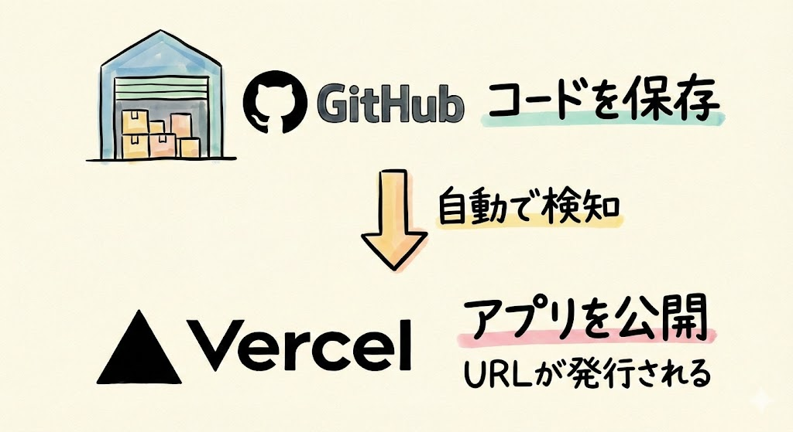
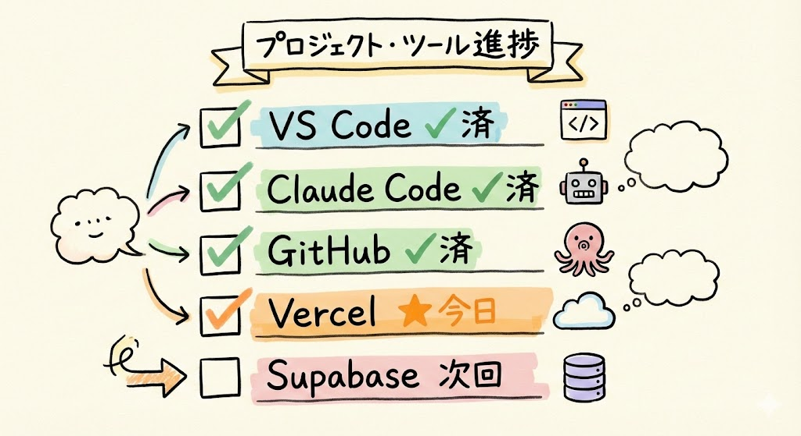
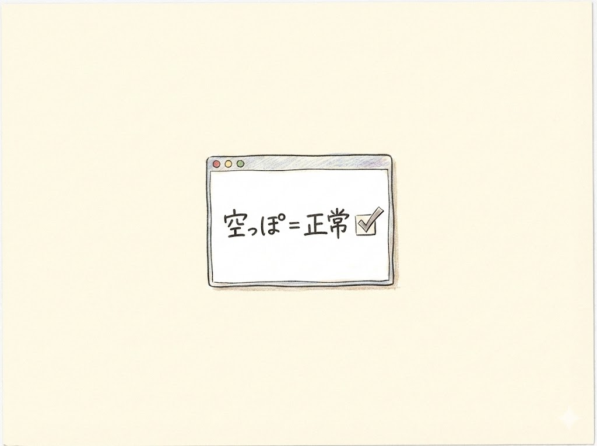
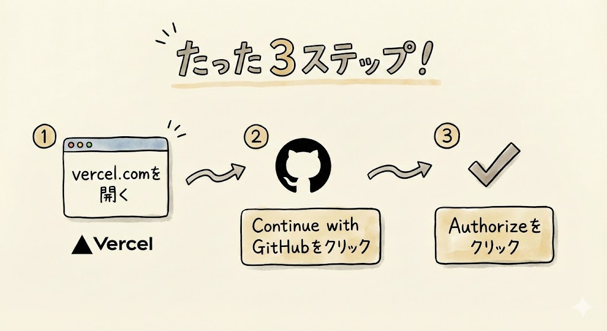
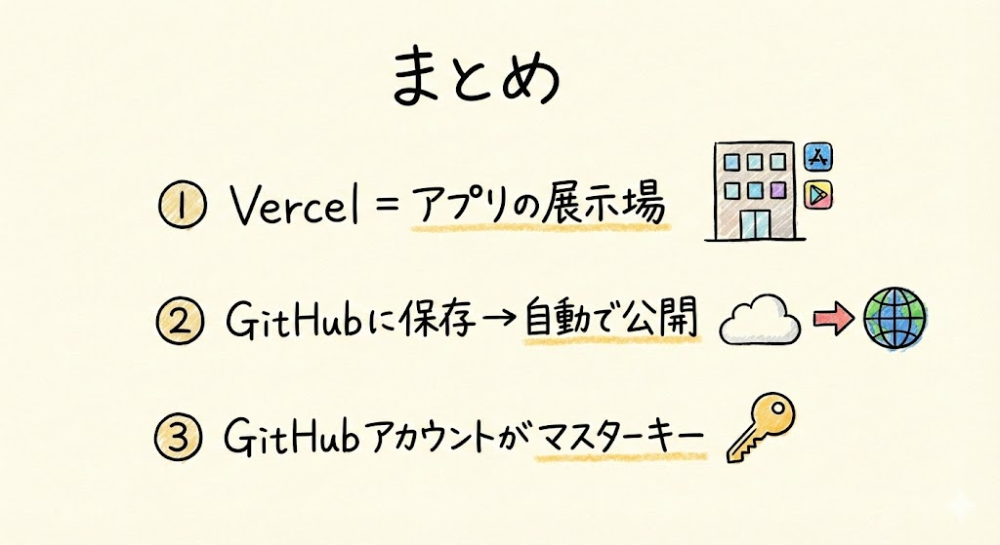

# 第18回｜Vercelアカウントを作ろう — アプリの展示場

## このレッスンのゴール


Vercelのアカウントを作成し、アプリを公開する準備を整えること。

---

## Vercelとは


**Vercel（バーセル）** は、作ったアプリをインターネットに公開してくれるサービスです。

普通、アプリをインターネットに公開するには、サーバー（インターネット上のコンピューター）を借りて、設定して、ドメイン（URLの住所、たとえば `www.example.com` のこと）を取って......と大変な作業が必要です。Vercelを使えば、それが全部自動になります。

**デプロイ** ——これは「公開する」「本番環境に置く」という意味のIT用語ですが——この「デプロイ」の面倒な作業を、Vercelが全部やってくれるんですね。たとえるなら、レストランで料理を作ったあと、配膳から片付けまで全部やってくれるウェイターのような存在です。

### 仕組みはシンプル



GitHubにコードを保存するだけで、Vercelが自動でアプリを公開してくれます。

```
GitHub（倉庫）にコードを保存
    ↓ Vercelが自動で検知
Vercel（展示場）がアプリを公開
    ↓
URLが発行される → 誰でもアクセスできる
```

**「倉庫に商品を入れたら、展示場に自動で並ぶ」** というイメージです。

皆さんがやることは、GitHubにコードを保存するだけ。あとはVercelが勝手に公開してくれます。コードを更新したら、自動で最新版に切り替わります。とても便利な仕組みですよね。

---

## なぜGitHubの次にVercelなのか



前回までに準備したツールを振り返ります。

| ツール | 役割 | 状態 |
| --- | --- | --- |
| VS Code | 作業場 | 済 |
| Claude Code | 職人 | 済（第3回〜第5回で設定済み） |
| GitHub | コードの倉庫 | 済 |
| **Vercel** | **アプリの展示場** | **今日やる** |
| Supabase | データの保管庫 | 次回 |

GitHubとVercelはセットで使います。GitHubに保存 → Vercelで公開。この流れを作るために、今日Vercelのアカウントを準備します。

---

## Vercelアカウントを作る

### ステップ1: vercel.comにアクセス


ブラウザ（Chrome、Safari、Edgeなど、普段使っているもの）の上部にあるアドレスバー（URLが表示されている横長の欄）に、以下のURLを打ち込んで `Enter` を押します。

```
https://vercel.com
```

Vercelのトップページが表示されます。英語のサイトですが、やることはほんの少しだけなので安心してくださいね。

### ステップ2: GitHubアカウントでサインアップ


ここがポイントです。**新しくアカウントを作る必要はありません。**

画面に表示されている **「Continue with GitHub」** というボタンを左クリックしてください。「Continue with GitHub」は「GitHubアカウントで続ける」という意味です。

前回作ったGitHubアカウントでそのままログインできます。新しいメールアドレスやパスワードを入力する必要はありません。

もしGitHubにログインしていない状態だと、GitHubのログイン画面が表示されます。その場合は、前回作ったGitHubのユーザー名（またはメールアドレス）とパスワードを入力してログインしてください。

> **補足**: もし「Continue with GitHub」ボタンが見つからない場合は、画面上部の「Sign Up」を左クリックしてから探してみてください。ページのデザインが更新されている場合があります。

### ステップ3: 「Authorize」を押す


GitHubの認証画面が表示されます。

**「Authorize Vercel」** というボタンを左クリックしてください。

「Authorize」は「許可する」という意味です。これは「VercelがGitHubのリポジトリ（倉庫）にアクセスしていいですか？」という確認です。

ここで出てきた **リポジトリ** という言葉について説明しますね。リポジトリ（レポジトリとも言います）は、プロジェクトのファイルをまとめて保存しておく場所のことです。GitHubの中に作る「プロジェクト専用のフォルダ」だと思ってください。パソコンの中にフォルダを作って書類をまとめるのと同じ感覚です。

許可しないと、VercelがGitHubからコードを取得できないので、ここは「Authorize」を左クリックして許可してください。安全な操作なので、心配する必要はありません。

### ステップ4: ダッシュボードを確認



認証が完了すると、Vercelのダッシュボード（管理画面）が表示されます。ダッシュボードというのは、サービスにログインしたときに最初に表示される管理画面のことです。車のダッシュボードのように、状態が一目でわかる画面ですね。

ここで皆さん、画面を見てください。

**まだ中身は空っぽです。** これで正常です。

プロジェクトはまだ作っていないので、何も表示されないのが当たり前です。「あれ、何も表示されない......」と不安にならなくて大丈夫ですよ。

この先、TODOアプリを作ってGitHubにアップロードしたら、ここにプロジェクトが表示されるようになります。楽しみにしていてくださいね。

### 確認してみましょう

Vercelアカウントが正しく作成できたか確認します。

- Vercelのダッシュボード（管理画面）が表示されていますか？
- 画面の左上に自分の名前またはアイコンが表示されていますか？
- 「No projects yet」や空の画面が表示されていますか？（これで正常です）

すべてOKなら、Vercelの準備は完了です。

### トラブルシュート

| 症状 | 対処法 |
| --- | --- |
| 「Continue with GitHub」が表示されない | まず画面上部の「Sign Up」を左クリックしてください。サインアップ画面に移ると表示されることがあります |
| GitHubのログイン画面が出てきた | 前回（第17回）で作ったGitHubのユーザー名（またはメールアドレス）とパスワードを入力してログインしてください |
| 「Authorize」を押した後に画面が真っ白になる | ブラウザをリロード（再読み込み。**Mac**: `Cmd` + `R`、**Windows**: `Ctrl` + `R`）してみてください |
| エラーメッセージが表示される | ブラウザのキャッシュ（一時データ）をクリアしてから、もう一度 `https://vercel.com` にアクセスしてみてください。わからない場合は、Claude Codeに「Vercelのアカウント作成で困っている」と相談してみてください |

---

## たったこれだけです



Vercelの準備、これで終わりです。びっくりするくらい簡単でしたよね。

やったことを振り返ると：

1. vercel.com をブラウザで開いた
2. 「Continue with GitHub」を左クリックした
3. 「Authorize」を左クリックした

以上です。たった3ステップ。新しいパスワードを考える必要もありません。GitHubアカウント1つでログインできるので、楽ですね。

---

## GitHubアカウントが「マスターキー」になっている


ここで気づいてほしいことがあります。

前回GitHubアカウントを作ったおかげで、今日のVercelはGitHubアカウントでログインするだけで済みました。次回のSupabase（スーパベース）も同じです。

```
GitHubアカウント（1つ作るだけ）
    ├→ GitHub にログイン
    ├→ Vercel にログイン（今日やった）
    └→ Supabase にログイン（次回やる）
```

GitHubアカウントが、3つのサービスの「マスターキー」になっています。マンションの管理室の鍵1本で、すべての共用施設のドアが開くようなイメージですね。だから、新しいパスワードをいくつも覚える必要がありません。

ただし、そのぶんGitHubのパスワードは大切に管理してくださいね。このパスワードを忘れると3つのサービスにログインできなくなるので、必ずメモしておきましょう。

---

## まとめ



- **Vercel** = 作ったアプリをインターネットに公開してくれるサービス。デプロイ（公開作業）を全自動でやってくれる
- GitHubにコードを保存するだけで、自動でアプリが公開される仕組み
- 「倉庫（GitHub）に入れたら展示場（Vercel）に自動で並ぶ」イメージ
- **「Continue with GitHub」でサインアップ** — 新しいアカウントを作る必要なし
- ダッシュボード（管理画面）はまだ空っぽで正常。プロジェクトはこの先で作る
- GitHubアカウントが3つのサービスの「マスターキー」。パスワードは大切に管理する

次回は、Supabaseのプロジェクトを作ります。アプリのデータを保存するための「保管庫」を用意しましょう。
