# 第19回｜Supabaseプロジェクトを作ろう — データの保管庫

## このレッスンのゴール

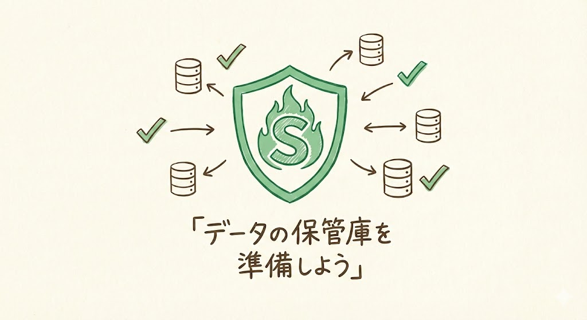

Supabaseのアカウントとプロジェクトを作成し、アプリとの接続に必要な情報（Project URLとanon key）をメモしておくこと。

---

## Supabaseとは

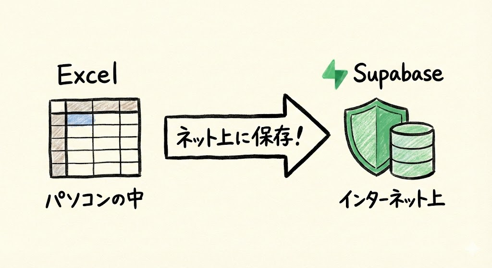

**Supabase（スーパベース）** は、アプリのデータを保存する場所です。

IT用語では「データベース」とも呼ばれますが、難しく考えなくて大丈夫です。データベースとは、たくさんの情報を整理して保存しておく仕組みのことです。

これから作るTODOアプリを例にすると、こういったデータを保存してくれます。

- 「牛乳を買う」というタスクの内容
- そのタスクが「完了しているか / まだか」
- いつ追加されたか

こういった情報をどこかに保存しないと、ブラウザを閉じたら全部消えてしまいますよね。Supabaseが、この情報をインターネット上で預かってくれます。

**Excelの表をインターネット上に置いておけるサービス** と考えてもらえれば、イメージしやすいと思います。Excelの表の1行1行がタスクのデータで、それがインターネット上に保存されている——そんなイメージです。

| イメージ | Excelの場合 | Supabaseの場合 |
| --- | --- | --- |
| 保存場所 | 自分のパソコンの中 | インターネット上 |
| 見え方 | 表（行と列） | 同じく表形式 |
| アクセス | ファイルを開く | アプリが自動でアクセス |

---

## 5つのツール、あと1つ！

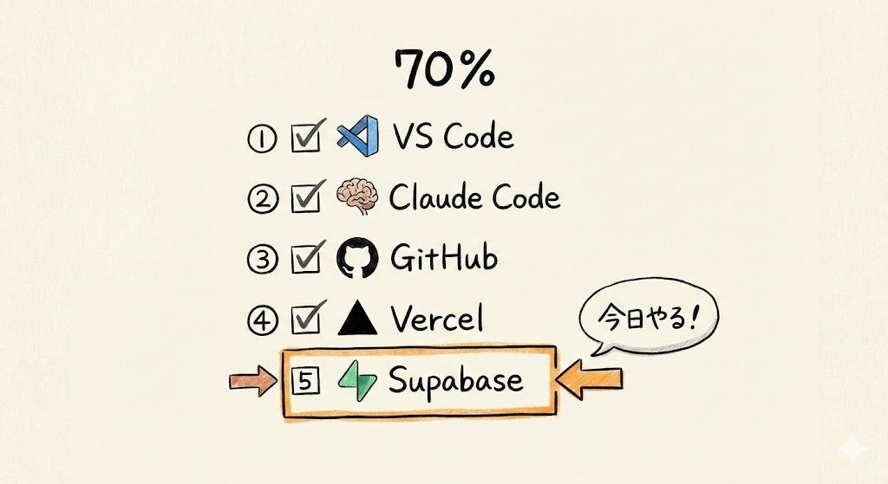

これまでに準備したツールを振り返ります。ここまでよく頑張ってきましたね。

| ツール | 役割 | 状態 |
| --- | --- | --- |
| VS Code | 作業場 | 済 |
| Claude Code | 職人 | 済 |
| GitHub | コードの倉庫 | 済 |
| Vercel | アプリの展示場 | 済 |
| **Supabase** | **データの保管庫** | **今日やる** |

今日でパーツが全部揃います。あと1つです。

---

## ステップ1: Supabaseアカウントを作る

### 1. supabase.comにアクセス

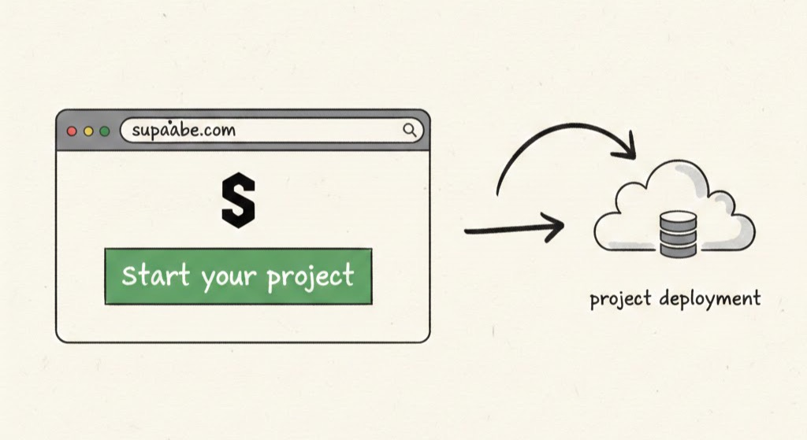

ブラウザ（Chrome、Safari、Edgeなど、普段使っているもの）の上部にあるアドレスバー（URLが表示されている横長の欄）に、以下のURLを打ち込んで `Enter` を押します。

```
https://supabase.com
```

Supabaseのトップページが表示されます。英語のサイトですが、前回のVercelと同じ要領なので安心してくださいね。

### 2. 「Start your project」→ GitHub連携でサインアップ

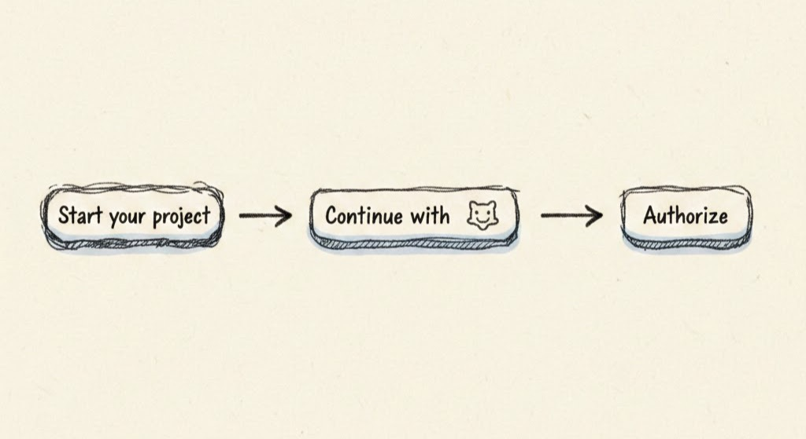

Vercelのときとまったく同じです。**GitHubアカウントでログイン** できます。

画面に表示されている **「Start your project」** を左クリックすると、サインアップ画面に移ります。そこで **「Continue with GitHub」** というボタンを左クリックしてください。

GitHubの認証画面が表示されたら、**「Authorize」** を左クリックします。「Authorize」は「許可する」という意味でしたね。前回のVercelと同じ操作です。

もしGitHubにログインしていない状態だと、GitHubのログイン画面が表示されます。その場合は、GitHubのユーザー名（またはメールアドレス）とパスワードを入力してログインしてください。

> **補足**: ページのデザインが変わっている場合は、画面上部の「Sign In」や「Start your project」のようなボタンを探してみてください。

これで3つのサービスが全部、GitHubアカウント1つでログインできる状態になりました。

```
GitHubアカウント
    ├→ GitHub ← 済
    ├→ Vercel ← 済
    └→ Supabase ← 今ここ
```

### 確認してみましょう

Supabaseアカウントが正しく作成できたか確認します。

- Supabaseのダッシュボード（管理画面）が表示されていますか？
- 「New Project」というボタンが画面に表示されていますか？

どちらもOKなら、アカウント作成は成功です。

### トラブルシュート

| 症状 | 対処法 |
| --- | --- |
| 「Continue with GitHub」が表示されない | 「Sign In」ボタンを左クリックしてから探してみてください。ページのレイアウトが更新されている場合があります |
| 「Authorize」を押した後に画面が進まない | ブラウザをリロード（再読み込み。**Mac**: `Cmd` + `R`、**Windows**: `Ctrl` + `R`）してみてください |
| 英語ばかりで何を押せばいいかわからない | 「GitHub」のロゴマーク（猫のようなアイコン）が付いたボタンを探してください。それが「Continue with GitHub」ボタンです |

---

## ステップ2: 新しいプロジェクトを作る

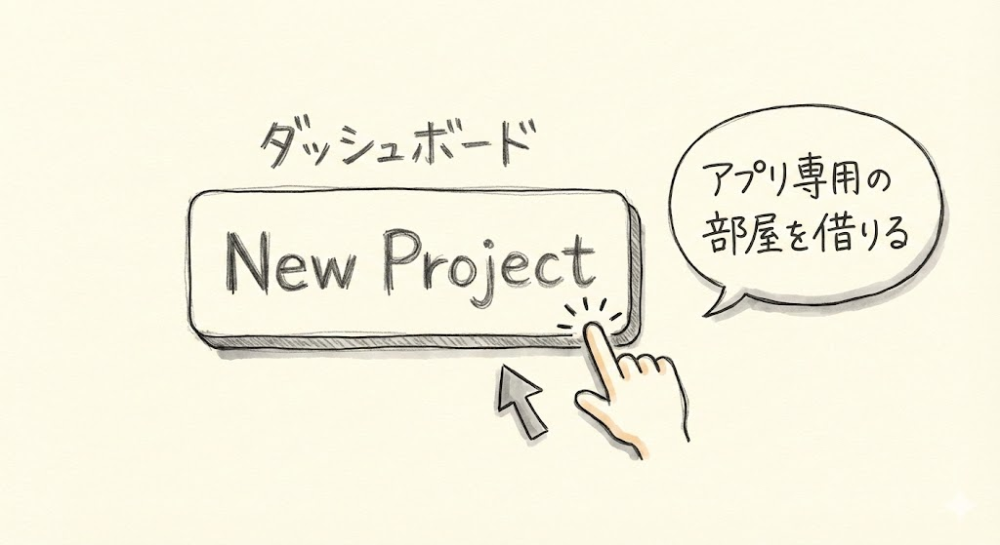

アカウントができたら、TODOアプリ用のプロジェクトを1つ作ります。プロジェクトとは、1つのアプリに必要なデータベースや設定をまとめたものです。「アプリ専用の部屋」を1つ借りるようなイメージですね。

### 1. 「New Project」をクリック

ダッシュボード（管理画面）の **「New Project」** ボタンを左クリックします。「New Project」は「新しいプロジェクト」という意味です。

もし「Organization（組織）」の選択を求められた場合は、最初から表示されているもの（自分のアカウント名）を左クリックしてください。Organization とは、プロジェクトをまとめるためのグループのことです。個人で使う場合は、自分のアカウント名のものを選べば大丈夫です。

### 2. 以下の情報を入力

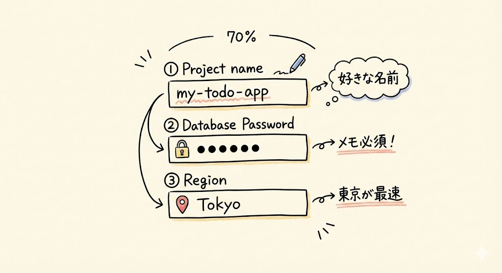

画面に表示された入力欄に、キーボードで以下の情報を入力します。

| 項目 | 入力内容 | 補足 |
| --- | --- | --- |
| Project name | `my-todo-app` | 何でもOKですが、これに合わせると後の回がスムーズに進みます |
| Database Password | 好きなパスワード | **必ずメモしておいてください。** あとで必要になることがあります |
| Region | `Northeast Asia (Tokyo)` | プルダウン（選択肢の一覧）から選びます |

それぞれの項目について、もう少し詳しく説明しますね。

- **Project name（プロジェクト名）**: アプリの名前です。ここでは `my-todo-app` と入力してください。半角英数字とハイフン（-）だけを使います。日本語は使えません
- **Database Password（データベース・パスワード）**: データベースを管理するときに使うパスワードです。普段の操作では使いませんが、念のためメモしておいてください。忘れてしまっても再設定はできるので、過度に心配する必要はありません。好きなパスワードを入力するか、「Generate a password」ボタンで自動生成してもらうこともできます
- **Region（リージョン）**: 「サーバーの場所」のことです。インターネット上のコンピューターが物理的にどこにあるか、ということです。荷物の倉庫が近い方が届くのが早いのと同じで、東京を選ぶと日本からのアクセスが速くなります。リストの中から「Northeast Asia (Tokyo)」を探して左クリックしてください

### 3. 「Create new project」をクリック

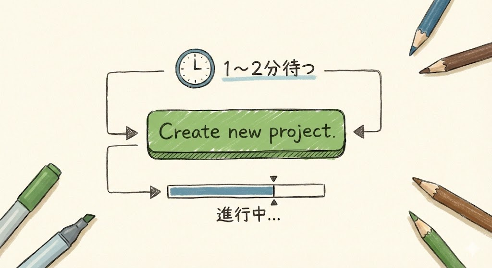

入力が終わったら、**「Create new project」** ボタンを左クリックします。

ボタンを押すと、プロジェクトの作成が始まります。**1〜2分** ほど待ちましょう。画面に進捗（プログレスバーや「Setting up...」のような表示）が出るので、完了するまで見守ってください。途中で画面が切り替わっても、まだ処理中のことがあるので、焦らず待ちましょう。

画面が切り替わって、プロジェクトのダッシュボードが表示されれば成功です。

### 確認してみましょう

プロジェクトが正しく作成できたか確認します。

- プロジェクトのダッシュボード画面が表示されていますか？
- 画面上部にプロジェクト名（`my-todo-app`）が表示されていますか？
- 画面に「Project Status: Active」のような表示がありますか？（表示が少し異なる場合もありますが、エラーメッセージが出ていなければOKです）

すべてOKなら、プロジェクト作成は成功です。

### トラブルシュート

| 症状 | 対処法 |
| --- | --- |
| 「Create new project」を押した後、画面がずっと読み込み中のまま | 3分ほど待ってみてください。それでも終わらない場合は、ブラウザをリロード（**Mac**: `Cmd` + `R`、**Windows**: `Ctrl` + `R`）してみてください |
| エラーメッセージが表示された | ブラウザをリロードしてからもう一度試してください。パスワードが短すぎる場合（6文字未満など）にエラーが出ることがあります。8文字以上で再度お試しください |
| 「Region」のリストに「Tokyo」がない | リストをスクロールして探してください。「Northeast Asia」の項目の中にあります。見つからない場合は、一番近い地域（例: `Southeast Asia (Singapore)`）を選んでも問題ありません |

---

## ステップ3: API Keyの場所を確認してメモする

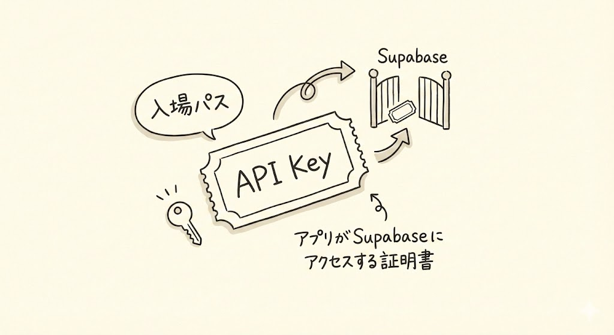

ここが今日いちばん大事なポイントです。しっかり見てくださいね。

プロジェクトができたら、**2つの値** をメモしておきます。この値は、後でアプリとSupabaseを繋ぐときに使います。

**API Key（エーピーアイ・キー）** というのは、アプリがSupabaseにアクセスするための「入場パス」のようなものです。遊園地に入るときにチケットを見せますよね。アプリも同じで、このAPI Keyを使って「自分はアクセスしていいですよ」と証明するんです。この値がないと、アプリはSupabaseのデータを読み書きできません。

### 1. 「Settings」をクリック


プロジェクトのダッシュボード画面で、左サイドバー（画面左側のメニュー一覧）にある **歯車アイコン（Settings）** を左クリックします。歯車の形をしたアイコンです。画面左側のメニューの下の方にあることが多いです。

### 2. 「API」をクリック


設定画面が表示されたら、左側のメニューの中から **「API」** という項目を左クリックします。「Configuration」や「Data API」のセクション内にある場合もあります。

### 3. 以下の2つをコピーしてメモ

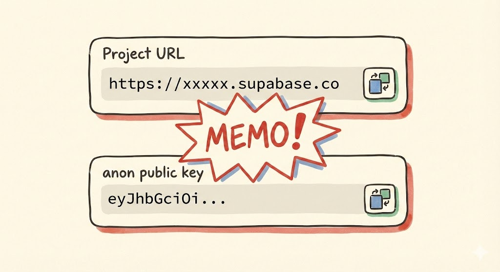

画面に表示されている値のうち、使うのはこの2つです。

| 名前 | 表示例 | 役割 |
| --- | --- | --- |
| **Project URL** | `https://xxxxx.supabase.co` | アプリがSupabaseと通信するための「住所」。手紙を送るための住所と同じです |
| **anon public key** | `eyJhbGciOi...`（長い文字列） | アプリがSupabaseに入るための「入場パス」。この鍵がないとデータにアクセスできません |

**Project URL** は画面上部の「Project URL」というラベルの下に表示されています。`https://` から始まる文字列です。

**anon public key** は「Project API keys」というセクションの中にある `anon` `public` と書かれた行の値です。`eyJ` から始まるとても長い文字列です。

それぞれの値の右側にコピーボタン（四角が2つ重なったアイコン）があるので、それを左クリックするとクリップボード（コピーした内容を一時的に保持する場所）にコピーされます。

この2つを **メモ帳やテキストファイルにコピーして保存** しておいてください。次回、アプリの設定ファイルに貼り付けます。

### メモの例

メモ帳に、こんな感じで貼り付けておけばOKです。

```
【Supabase接続情報】
URL: https://xxxxx.supabase.co
Key: eyJhbGciOiJIUzI1NiIsInR5cCI6IkpXVCJ9...
```

**この値は次回使うので、必ずどこかに残しておいてください。**

もしメモするのを忘れてしまっても大丈夫です。次回この画面に戻ってきて、もう一度コピーすることができます。ただ、メモしておいた方がスムーズに進められるので、今のうちに保存しておきましょう。

### 確認してみましょう

API Keyの確認が正しくできたか確認します。

- **Project URL**（`https://` で始まる文字列）をメモできましたか？
- **anon public key**（`eyJ` で始まるとても長い文字列）をメモできましたか？
- メモ帳やテキストファイルに保存しましたか？

3つともOKなら、今日の作業はほぼ完了です。

### トラブルシュート

| 症状 | 対処法 |
| --- | --- |
| 「Settings」が見つからない | 左サイドバーの一番下の方にある歯車アイコンを探してください。画面が狭い場合は、サイドバーが折りたたまれていることがあります。左端のアイコンを左クリックしてみてください |
| 「API」の項目が見つからない | 「Settings」を左クリックした後、左メニューに「API」「Data API」「Configuration」などの項目を探してください。デザインが更新されている場合、名前が変わっていることがあります |
| コピーボタンを押しても何も起きない気がする | コピーボタンを左クリックすると、値がクリップボードにコピーされます。見た目上は何も変わらないことがあります。メモ帳を開いて貼り付け（**Mac**: `Cmd` + `V`、**Windows**: `Ctrl` + `V`）を試してみてください。値が貼り付けられればコピーは成功しています |
| `anon public key` の値が途中までしか表示されない | 値が長いため画面上では途中で切れて見えることがあります。コピーボタンを左クリックすれば、全体がコピーされるので問題ありません |

---

## 今日やったことの全体像

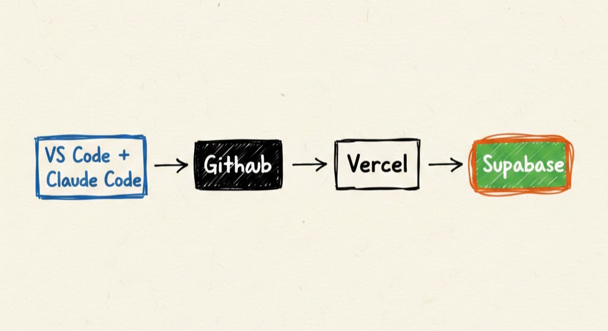

5つのパーツがすべて揃いました。ここまで来た皆さん、お疲れさまです。

```
VS Code + Claude Code（作業場と職人）
    ↓ コードを作る
GitHub（倉庫に保管）
    ↓ 自動で検知
Vercel（展示場で公開）
    ↕ データのやり取り
Supabase（データの保管庫）← 今日作った！
```

この図を見てください。すべてのパーツがつながっています。VS CodeでClaude Codeを使ってコードを作り、GitHubに保管し、Vercelが公開し、Supabaseがデータを保存する。この流れで、アプリが動くんですね。

次回は、いよいよこのパーツを組み合わせてプロジェクトを作ります。

---

## まとめ

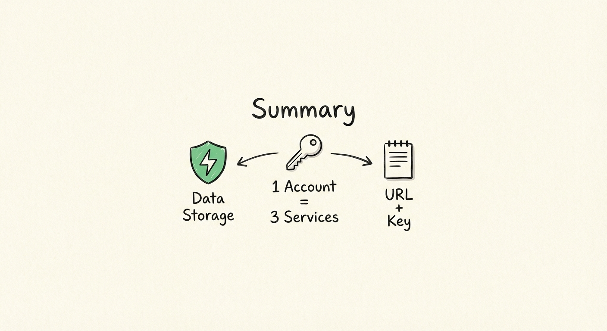

- **Supabase** = アプリのデータを保存する場所。Excelの表をネット上に置けるサービス
- データベースとは、情報を整理して保存する仕組みのこと。難しく考えなくてOK
- 「Continue with GitHub」でアカウントを作成。GitHubアカウント1つで3つのサービスにログインできる
- 新しいプロジェクトを作成した（プロジェクト名: `my-todo-app`、リージョン: `Northeast Asia (Tokyo)`）
- **Project URL** と **anon public key** の2つをメモした — 次回これを使う
- API Key = アプリがサービスにアクセスするための「入場パス」
- Database Passwordもメモしておく
- メモを忘れても、あとからSupabaseの画面で確認できる。でも今やっておくのがベスト

次回は、プロジェクトフォルダを作って、今日メモした値を設定ファイルに貼り付けます。アプリ開発の最後の準備です。
