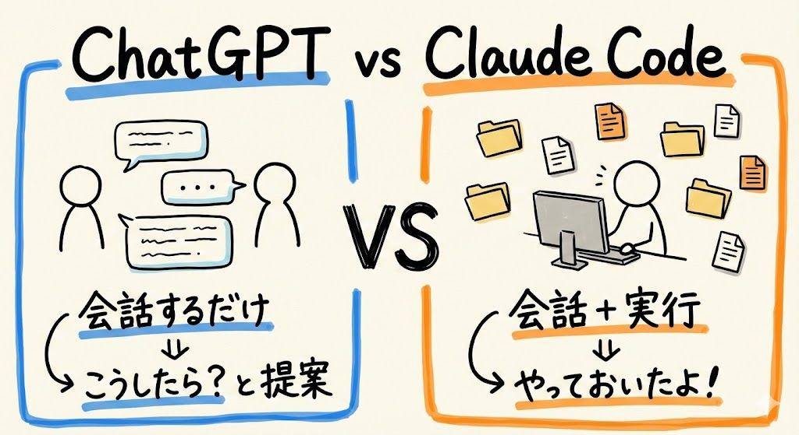
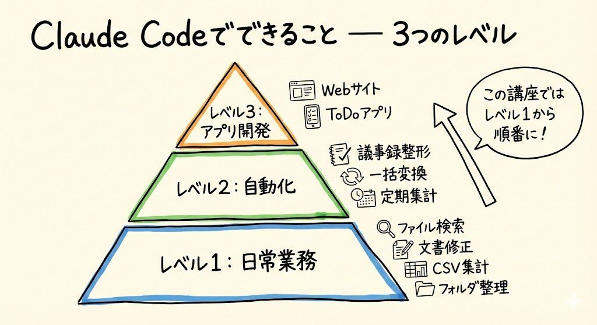
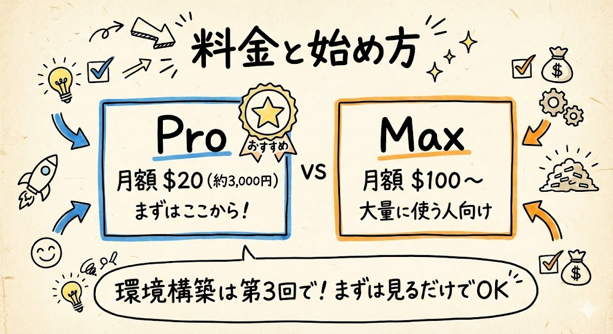

# 第1回｜Claude Codeって何？ — ChatGPTの「手足がある版」

## このレッスンのゴール

Claude Codeが何者かを理解し、「自分にも使えそう」と思えるようになること。

---

## ChatGPT と Claude Code、何が違うの？

はい、それでは第1回を始めていきましょう。

まず最初に、一番大事なことをお伝えします。「Claude Code（クロード・コード）って、ChatGPT（チャットジーピーティー）と何が違うの？」という話です。

ひとことで言うと、こうです。

- **ChatGPT** = 会話するだけ。「こうしたら？」と提案してくれるけど、実行はしてくれない
- **Claude Code** = 会話＋実行。「やっておいたよ」と、実際にファイルを作ったり、整理したりしてくれる

ここ、ちょっと大事なポイントです。

たとえば「デスクトップを整理して」と頼んだ場合を考えてみてください。

|  | ChatGPT | Claude Code |
| --- | --- | --- |
| 応答 | 「こういう手順で整理できますよ」 | （実際にフォルダを作って、ファイルを移動する） |
| 結果 | 自分で手を動かす必要がある | 作業が完了している |

わかりますか？ ChatGPTは「アドバイスしてくれる人」、Claude Codeは「作業を代わりにやってくれる人」なんです。

Claude Codeは **ターミナル（黒い画面）** の中で動きます。ターミナルというのは、パソコンに文字で指示を出すための画面のことです。今は「そういうものがあるんだな」くらいで大丈夫です。第3回で実際に開きますので、今は見ているだけでOKです。

そのターミナルを開いて、日本語で話しかけるだけ。それだけで、パソコンの中の作業を代わりにやってくれます。プログラミングの知識は一切いりません。

---

## Claude Code でできること — 3つのレベル

Claude Codeでできることは、大きく3つのレベルに分かれます。この講座では、レベル1から順番にやっていきますので、「全部覚えなきゃ」と焦る必要はありません。

### レベル1: 日常業務

最初に使えるようになるのがここです。一番身近なところから始めます。

- **ファイル検索** — 「あのファイルどこだっけ？」が一瞬で見つかる
- **文書の修正** — 「もっとカジュアルにして」と伝えるだけで書き直してくれる
- **CSV集計** — CSV（シーエスブイ）というのは表形式のデータファイルのことです。「売上の合計出して」と言うだけで、Excelを開かずに処理できます
- **フォルダ整理** — 「種類別に分けて」で散らかったデスクトップが片付く

これだけでも、毎日の作業がかなり楽になります。

### レベル2: 自動化

慣れてきたら、繰り返し作業をなくせるようになります。

- 議事録の自動整形
- 大量ファイルの一括変換（たとえば100枚の画像を一気にリサイズするとか）
- データの定期集計

「毎回同じことやってるな」と思う作業があれば、それを自動化できるイメージです。

### レベル3: アプリ開発

最終的には、自分だけのアプリが作れるようになります。

- Webサイト制作
- ToDoアプリ、家計簿アプリ
- ブラウザ操作の自動化

「え、プログラミングなんてできないけど？」と思いますよね。でも大丈夫です。Claude Codeに日本語で「こういうアプリ作って」と言うだけで作ってくれるんです。もちろん、ここに到達するのはもう少し先の話ですので、今は「そんなこともできるんだ」くらいで大丈夫です。

この講座では、レベル1から順番にやっていきます。

---

## 料金と始め方

ここで皆さん気になるであろう、料金の話をしておきますね。

| プラン | 月額 | 特徴 |
| --- | --- | --- |
| Pro（プロ） | $20/月（日本円で約3,000円前後） | 基本的な使用。まずはここから始められます |
| Max（マックス） | $100/月（日本円で約15,000円前後） | 大量に使う人向け。使える量の上限が大幅に増えます |

為替レートによって多少変動しますが、だいたいこのくらいです。最初はProプランで始めてみて、「もっと使いたい」と思ったらMaxに変えるのがおすすめです。

ここで1つ安心していただきたいのが、**今日はまだ何もインストールしません**。次回は「具体例10選」で、「こんなことに使えるのか」というイメージをもっと掴んでいただきます。実際に手を動かすのは第3回からですので、今回と次回は**見るだけでOK**です。リラックスして聞いてくださいね。

---

## まとめ

- **ChatGPT** は「アドバイスしてくれる人」、**Claude Code** は「作業を代わりにやってくれる人」
- できることは3つのレベルに分かれている（日常業務 → 自動化 → アプリ開発）
- この講座ではレベル1から順番にやっていく
- 料金はProプラン$20/月から始められる
- 次回は「具体例10選」。環境構築は第3回なので、まだ見ているだけでOK
