# 第20回｜プロジェクト作成とenvファイルの設定 — 最後の準備

## このレッスンのゴール

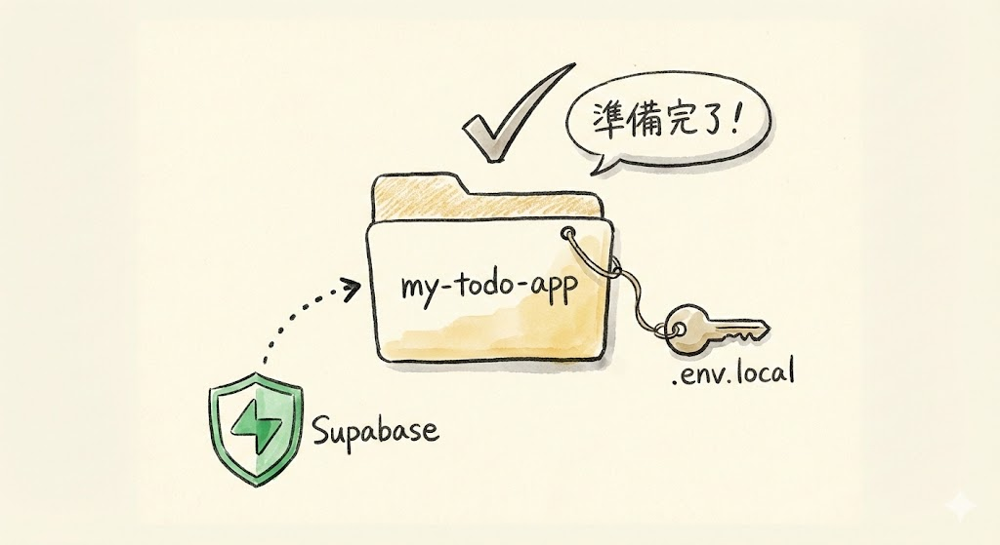

TODOアプリのプロジェクトフォルダを作成し、Supabaseとの接続情報を設定ファイル（envファイル）に書き込むこと。これでアプリ開発の準備がすべて完了する。

---

## 今日やることは2つだけ

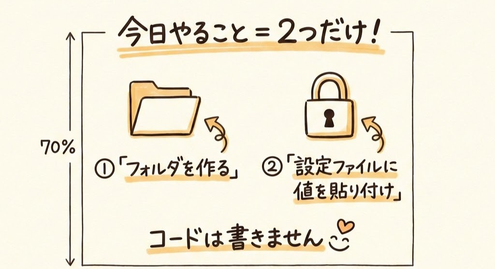

今日の作業はシンプルです。

1. **フォルダを作って、プロジェクトの骨組みを用意する**
2. **設定ファイルに、前回メモした値を貼り付ける**

これだけです。コードは書きません。安心してくださいね。

---

## ステップ1: プロジェクト用のフォルダを作る

### VS Codeを開いてターミナルを表示する

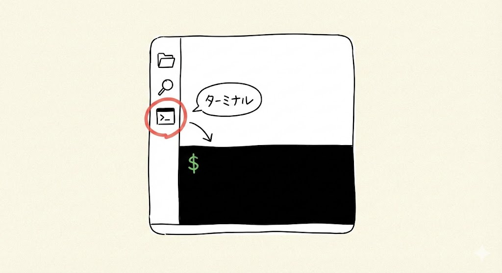

まず、VS Codeを起動します。

**VS Codeの起動方法（復習）**

- **Mac**: アプリケーションフォルダから「Visual Studio Code」をダブルクリック。または Dock（画面下のアイコンバー）から起動
- **Windows**: デスクトップのアイコンをダブルクリック。またはスタートメニュー（画面左下のWindowsマーク）で「Visual Studio Code」を検索

VS Codeが開いたら、ターミナルを表示します。

**ターミナルの開き方（復習）**

- **Mac**: 画面上部のメニューバーから **「View」→「Terminal」** を左クリック。または ``Ctrl + ` ``
- **Windows**: 画面上部のメニューバーから **「View」→「Terminal」** を左クリック。または ``Ctrl + ` ``

画面の下部に黒っぽいエリア（ターミナル）が表示されればOKです。

### ターミナルでフォルダを作成

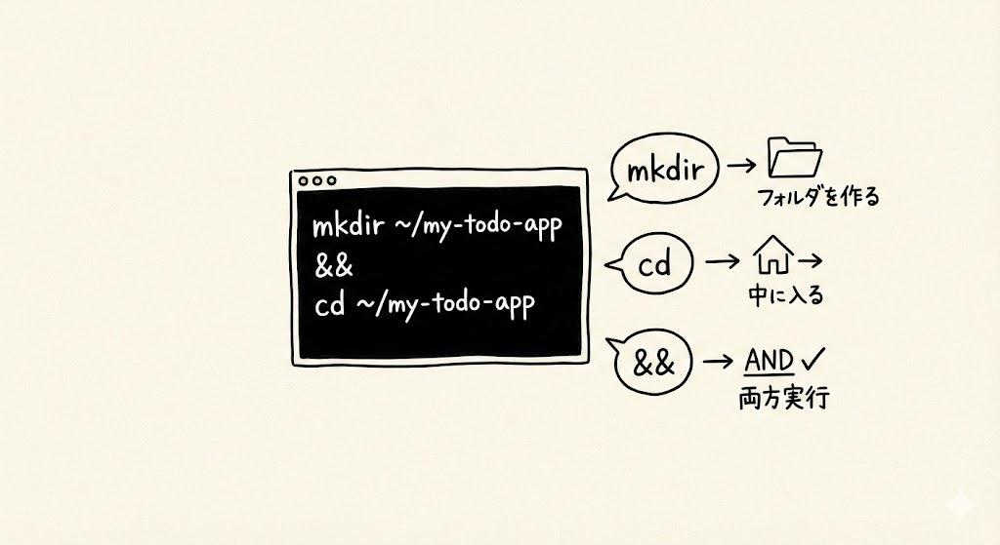

ターミナルの中を左クリックして、キーボードで以下をそのまま打ち込んで `Enter` を押します。

**Macの場合:**

```
mkdir ~/my-todo-app && cd ~/my-todo-app
```

**Windowsの場合:**

```
mkdir ~\my-todo-app && cd ~\my-todo-app
```

> **補足**: Macではフォルダの区切りに `/`（スラッシュ）を使い、Windowsでは `\`（バックスラッシュ）を使います。ただし、Windowsでも `/` で動くことが多いので、上のMac用のコマンドで試してみて、エラーが出たらWindows用を使ってください。

ここで出てきたコマンドを少し説明しますね。今は覚えなくて大丈夫ですが、知っておくと安心です。

- `mkdir`（エムケーディーアイアール） = フォルダを作るコマンド。「make directory（ディレクトリを作る）」の略です。ディレクトリはフォルダと同じ意味です。「新しいフォルダを作る」ボタンをキーボードから操作しているようなイメージです
- `cd`（シーディー） = フォルダの中に入るコマンド。「change directory（ディレクトリを変える）」の略です。フォルダをダブルクリックして中に入るのと同じ操作です
- `~/`（チルダ・スラッシュ） = ホームフォルダを意味します。Macなら `/Users/あなたのユーザー名/`、Windowsなら `C:\Users\あなたのユーザー名\` のことです。パソコンを開いたときに最初にいる場所ですね
- `&&` = 「1つ目が成功したら2つ目もやる」という意味です

画面に特にエラーっぽいメッセージが表示されなければ成功です。これで、ホームフォルダの中に「my-todo-app」というフォルダが作られて、そこに移動した状態になっています。

### 確認してみましょう

フォルダが正しく作成できたか確認します。ターミナルにキーボードで以下をそのまま打ち込んで `Enter` を押してください。

**Macの場合:**

```
pwd
```

**Windowsの場合:**

```
cd
```

`pwd`（ピーダブリューディー）は「print working directory（今いるフォルダを表示する）」の略で、今自分がどこにいるかを教えてくれるコマンドです。Windowsでは `cd` だけ打つと同じ情報が表示されます。

表示されたパスの最後が `my-todo-app` になっていれば成功です。（例: `/Users/taro/my-todo-app` や `C:\Users\taro\my-todo-app`）

### トラブルシュート

| 症状 | 対処法 |
| --- | --- |
| 「ディレクトリが既に存在します」のようなメッセージが表示される | 既にフォルダがあるということです。問題ないので、`cd ~/my-todo-app` だけ打って `Enter` を押して、そのフォルダに移動してください |
| 「mkdir: cannot create directory」のようなエラーが出る | ホームフォルダへのアクセスに問題がある可能性があります。Claude Codeに「my-todo-appフォルダを作りたいけどエラーが出る」と相談してみてください |

### VS Codeでフォルダを開く

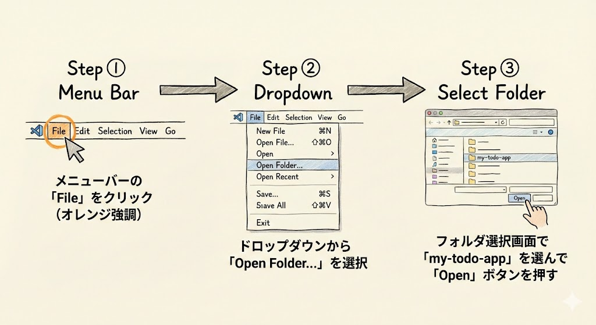

次に、このフォルダをVS Codeで開きます。

1. VS Codeの画面上部にあるメニューバーから **「File」** を左クリックします（日本語の場合は **「ファイル」**）
2. 表示されたメニューから **「Open Folder...」** を左クリックします（日本語の場合は **「フォルダーを開く...」**）
3. フォルダの選択画面が表示されるので、ホームフォルダの中にある **「my-todo-app」** フォルダを探して左クリックで選択します。ホームフォルダの場所は、**Mac** なら左の一覧の「ホーム」または自分のユーザー名のアイコン、**Windows** なら「PC」→「ローカルディスク (C:)」→「ユーザー」→「自分のユーザー名」の中です
4. **「Open」**（または **「開く」**）ボタンを左クリックします

もし「このフォルダーの作成者を信頼しますか？」のような確認メッセージが表示されたら、**「はい、信頼します」** を左クリックしてください。これはVS Codeのセキュリティ確認で、自分で作ったフォルダなので信頼して問題ありません。

これで、VS Codeの左側（サイドバー）に「my-todo-app」フォルダが表示されます。まだ中身は空っぽです。これから中身を作っていきますよ。

### 確認してみましょう

VS Codeでフォルダが正しく開けたか確認します。

- VS Codeのタイトルバー（画面の一番上）に「my-todo-app」という文字が表示されていますか？
- 左側のサイドバーに「MY-TODO-APP」のようなフォルダ名が表示されていますか？

どちらもOKなら、フォルダを開く作業は成功です。

---

## ステップ2: Claude Codeでプロジェクトを作る

### Claude Codeを起動

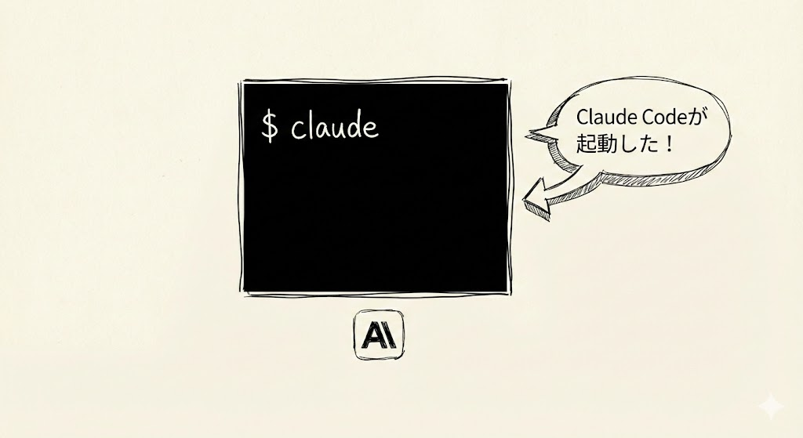

VS Codeのターミナルの中を左クリックして、キーボードで以下をそのまま打ち込んで `Enter` を押します。

**Mac / Windows 共通:**

```
claude
```

Claude Codeが起動して、画面に「Claude Code」の表示が出てきたら準備完了です。

> **補足**: もしターミナルが表示されていない場合は、**「View」→「Terminal」** で表示してください。

### Next.jsプロジェクトを作ってもらう

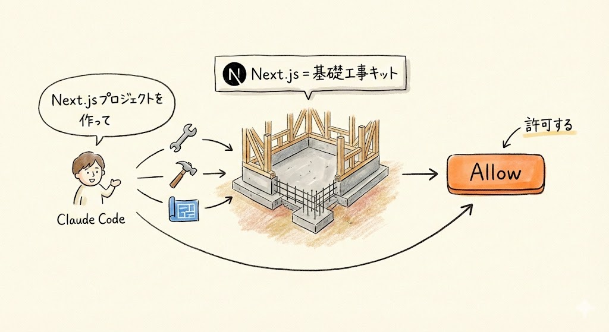

Claude Codeにキーボードで以下をそのまま打ち込みます。

```
Next.jsプロジェクトを作って
```

ここで出てきた **Next.js（ネクスト・ジェイエス）** は、Webアプリを作るためのひな形のようなものです。家を建てるときの「基礎工事キット」だと思ってください。基礎（土台、壁の骨組み、配管など）が最初から用意されていて、あとは内装を整えるだけでいい——そんなキットです。このひな形をもとにして、TODOアプリを作っていきます。

Claude Codeが `npx create-next-app` というコマンドを実行してくれます。途中で「このコマンドを実行していい？」と許可を求められるので、**「Allow」** を左クリックしてください。

画面に英語のメッセージがずらっと流れます。これはプロジェクトに必要なファイルをダウンロードしてセットアップしている様子です。量が多いので少し時間がかかります（1〜3分程度）。焦らず待ちましょう。途中で止まったように見えても、まだ処理中のことがあるので、そのまま待ってください。

途中で「TypeScriptを使うか？」「ESLintを使うか？」のような質問が表示されることがあります。Claude Codeが自動で回答してくれることが多いですが、もし画面が止まって待っている状態になったら、Claude Codeに「デフォルトの設定で進めて」と伝えてください。

全部終わると、カーソルが戻ってきます。エラーっぽい赤い文字が出なければ成功です。

### ここで何が起きたか？


今起きたことを説明しますね。

VS Codeの左側（サイドバー）を見てください。ファイルやフォルダがずらっと並んでいるはずです。`node_modules` とか `package.json` とか、見慣れない名前のものがたくさんありますよね。

これらは全部、Next.jsというひな形が用意してくれたファイルです。数十〜数百のファイルが一瞬で作られました。

**これらのファイルの中身を理解する必要はありません。**

Claude Codeが基礎工事を全部やってくれたので、私たちは何も考える必要はありません。この先、Claude Codeに「TODOアプリを作って」と話しかけると、Claude Codeがこれらのファイルを編集してアプリを作ってくれます。

### 確認してみましょう

プロジェクトが正しく作成できたか確認します。

- VS Codeの左側（サイドバー）にファイルやフォルダがたくさん表示されていますか？
- `package.json` というファイルが見えますか？
- `node_modules` というフォルダが見えますか？（量が多いので、展開しなくてOKです）

すべてOKなら、プロジェクトの作成は成功です。

### トラブルシュート

| 症状 | 対処法 |
| --- | --- |
| 「Allow」を押し忘れて進まなくなった | Claude Codeの画面に「Allow / Deny」の選択が出ていないか確認してください。出ていたら「Allow」を左クリックしてください |
| エラーっぽい赤い文字が出た | Claude Codeに「エラーが出ました。解決して」と話しかけてみてください。原因を調べて対応してくれます |
| サイドバーにファイルが表示されない | VS Codeのメニューから **「File」→「Open Folder...」** で `my-todo-app` フォルダを開き直してみてください |
| 「npx: command not found」と表示される | Node.jsがインストールされていない可能性があります。第4回の手順を確認してください |

---

## ステップ3: envファイルを作る

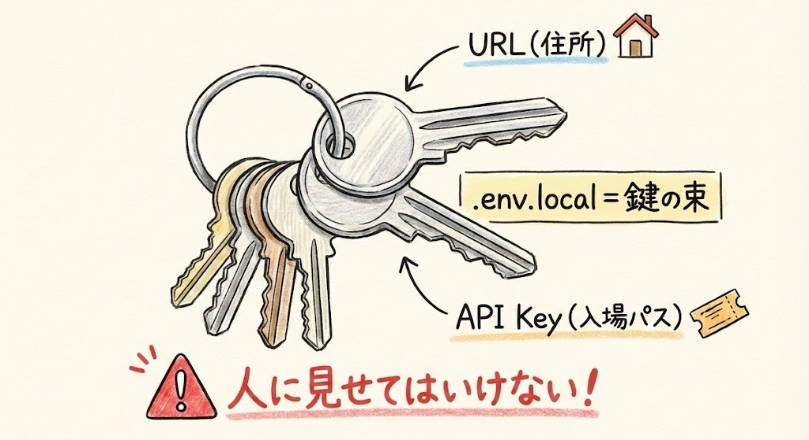

ここが今日のメインです。しっかり見てくださいね。

### envファイルって何？

envファイル。envは「environment」（エンバイロメント）の略で、日本語にすると「環境」という意味です。アプリが動くために必要な設定値——たとえば接続先の住所やパスワードのようなもの——を書いておくファイルです。

もっとわかりやすく言うと、**「鍵の束」** です。

- Supabaseに接続するための住所（URL）
- Supabaseに入るための入場パス（API Key）

家を出るときに鍵の束をポケットに入れますよね。それと同じで、アプリも起動するときにenvファイルから「鍵の束」を読み込んで、必要なサービスに接続するんです。

こういった大事な情報を1つのファイルにまとめておきます。

ここ、ちょっと大事なポイントです。大事なルールが1つあります。

> **envファイルは人に見せてはいけません。**

パスワードと同じです。このファイルの中身を他人に共有したり、SNSに載せたりしないでください。GitHubにも公開されないように設定されています（この設定もClaude Codeがやってくれます。`.gitignore`（ギットイグノア）という「GitHubにアップロードしないファイルのリスト」で自動的に管理されるので、皆さんは何もする必要はありません）。

### Claude Codeにenvファイルを作ってもらう

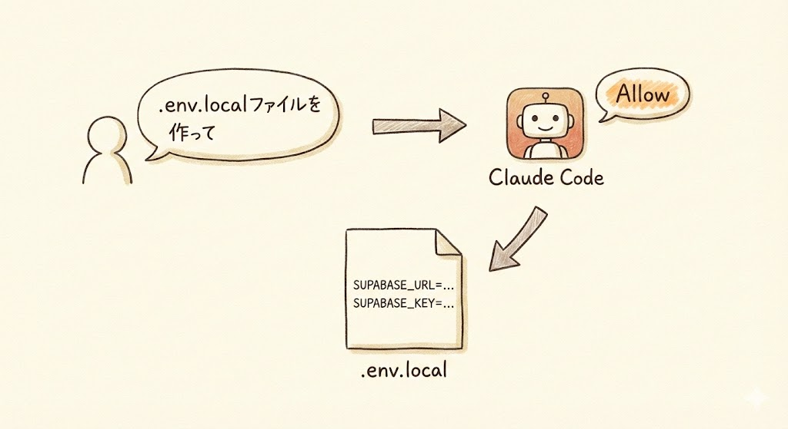

Claude Codeにキーボードで以下をそのまま打ち込みます。

```
.env.localファイルを作って。Supabaseの接続情報を入れる場所を用意して
```

Claude Codeが許可を求めてきたら「Allow」を左クリックしてください。

Claude Codeが `.env.local` というファイルを作ってくれます。画面に「ファイルを作成しました」のようなメッセージが表示されれば成功です。

中身はこのようになっているはずです。

```
NEXT_PUBLIC_SUPABASE_URL=ここにURLを入れる
NEXT_PUBLIC_SUPABASE_ANON_KEY=ここにキーを入れる
```

`NEXT_PUBLIC_SUPABASE_URL` とか `NEXT_PUBLIC_SUPABASE_ANON_KEY` とか、長くて難しそうな名前が並んでいますが、気にしなくて大丈夫です。これはアプリが「どの名前の設定値を使うか」を決めるための名前で、決まった書き方なんです。荷物の宛先ラベルに「住所欄」「電話番号欄」があるのと同じですね。

### 確認してみましょう

envファイルが正しく作成されたか確認します。

- VS Codeの左側（サイドバー）に `.env.local` というファイルが表示されていますか？
- そのファイルを左クリックして開くと、`NEXT_PUBLIC_SUPABASE_URL=` と `NEXT_PUBLIC_SUPABASE_ANON_KEY=` の2行が見えますか？

どちらもOKなら、envファイルの作成は成功です。

> **補足**: `.env.local` のようにドット（.）で始まるファイルは「隠しファイル」と呼ばれます。通常はパソコンのフォルダを開いても見えませんが、VS Codeのサイドバーには表示されます。見つからない場合は、サイドバーをよく探してみてください。

---

## ステップ4: Supabaseの値を貼り付ける

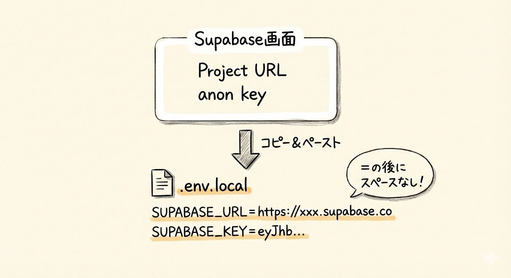

ここが **唯一「コードっぽいもの」を触る瞬間** です。

でもやることは、コピーして貼り付けるだけ。プログラミングではありません。

### 1. VS Codeで.env.localを開く

VS Codeの左側（サイドバー）のファイル一覧を見てください。その中から **`.env.local`** というファイル名を探して左クリックします。

ファイル名の先頭がドット（.）で始まっているので、少し見つけにくいかもしれません。ファイル一覧をよく見てくださいね。ファイルはアルファベット順に並んでいることが多いので、一覧の先頭付近にあるはずです。

左クリックすると、画面の中央（編集画面）にファイルの中身が表示されます。

### 2. 前回メモした値を貼り付ける

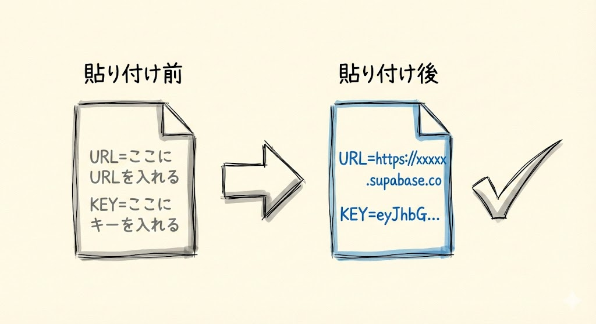

前回（第19回）でメモした **Project URL** と **anon public key** を、それぞれの場所に貼り付けます。

具体的にはこうなります。

**貼り付け前:**
```
NEXT_PUBLIC_SUPABASE_URL=ここにURLを入れる
NEXT_PUBLIC_SUPABASE_ANON_KEY=ここにキーを入れる
```

**貼り付け後:**
```
NEXT_PUBLIC_SUPABASE_URL=https://xxxxx.supabase.co
NEXT_PUBLIC_SUPABASE_ANON_KEY=eyJhbGciOi...
```

具体的な手順を1つずつ説明しますね。

1. **1行目の編集**: `NEXT_PUBLIC_SUPABASE_URL=` の `=` より右側（「ここにURLを入れる」の部分）をマウスで選択して削除します。選択するには、テキストの先頭を左クリックしてから、末尾まで左クリックしたまま引っ張ります（ドラッグ）。選択したら `Delete` キー（Macの場合は `Backspace` キー）を押して削除します
2. **URLを貼り付ける**: 前回メモした **Project URL** を貼り付けます（**Mac**: `Cmd` + `V`、**Windows**: `Ctrl` + `V`）
3. **2行目の編集**: 同じように、`NEXT_PUBLIC_SUPABASE_ANON_KEY=` の `=` より右側を選択して削除します
4. **Keyを貼り付ける**: 前回メモした **anon public key** を貼り付けます（**Mac**: `Cmd` + `V`、**Windows**: `Ctrl` + `V`）

貼り付けるときの注意点を確認しましょう。

- `=` の後ろに、**スペース（空白）を入れずに** 貼り付けてください。`=https://...` のように、`=` のすぐ後ろに値が来る形です
- 前後に余計なスペースや改行が入らないように注意してください。コピーしたときに余分な空白が入ることがあるので、確認しましょう
- 値全体を引用符（`""`や`''`）で囲む必要はありません。そのまま貼り付けてください
- 2つの設定はそれぞれ **別の行** に書いてください。1行に2つの値を書かないでください

もし前回のメモが見つからない場合は、Supabaseのウェブサイト（supabase.com）にログインして、プロジェクトの **Settings → API** から再度コピーできます。第19回の手順を参考にしてください。

### 3. 保存する

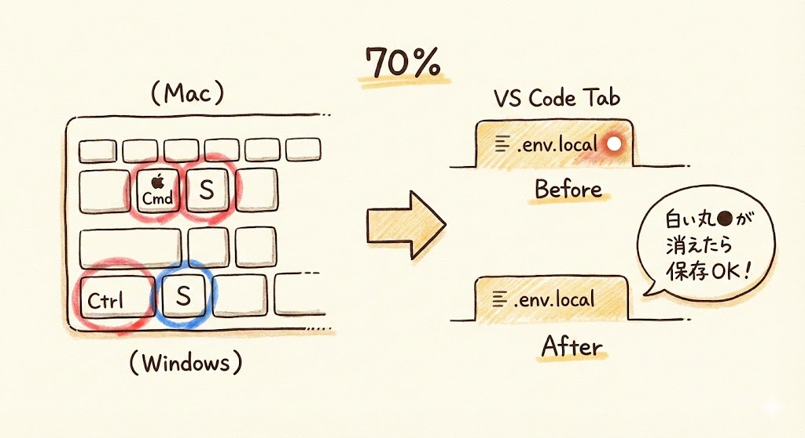

貼り付けが終わったら、ファイルを保存します。

- **Macの場合**: キーボードの **Cmd**（コマンド）キーを押しながら **S** キーを押します
- **Windowsの場合**: キーボードの **Ctrl** キーを押しながら **S** キーを押します

保存できたかどうかは、VS Codeのタブ（画面上部のファイル名が表示されている部分）を見ればわかります。ファイル名の横に白い丸（または黒い丸）が表示されていたら「まだ保存されていない」状態です。保存すると、その丸が消えます。

### 確認してみましょう

envファイルの設定が正しく完了したか確認します。

- `.env.local` ファイルの1行目が `NEXT_PUBLIC_SUPABASE_URL=https://` で始まっていますか？（`=` の後に `https://` が続いている）
- `.env.local` ファイルの2行目が `NEXT_PUBLIC_SUPABASE_ANON_KEY=eyJ` で始まっていますか？（`=` の後に `eyJ` が続いている）
- `=` の前後に余計なスペースが入っていませんか？
- ファイル名の横の丸が消えていますか？（保存済みの確認）

すべてOKなら、envファイルの設定は完了です。お疲れさまでした。

### トラブルシュート

| 症状 | 対処法 |
| --- | --- |
| `.env.local` ファイルが見つからない | Claude Codeにもう一度「.env.localファイルを作って」と話しかけてください。または、VS Codeのサイドバーの右上にある「更新」アイコン（矢印が回転している形）を左クリックしてファイル一覧を更新してみてください |
| 前回のメモが見つからない | Supabaseのウェブサイト（supabase.com）にログインして、プロジェクトの **Settings → API** から再度コピーできます |
| 貼り付けたら変な文字が入った | 一度全部消して、メモからコピーし直してください。メモ帳からコピーする際に、余計な改行やスペースが入ることがあります |
| 保存のショートカットがうまくいかない | メニューから保存することもできます。**「File」→「Save」**（日本語の場合は **「ファイル」→「保存」**）を左クリックしてください |

---

## 今やったことの全体像

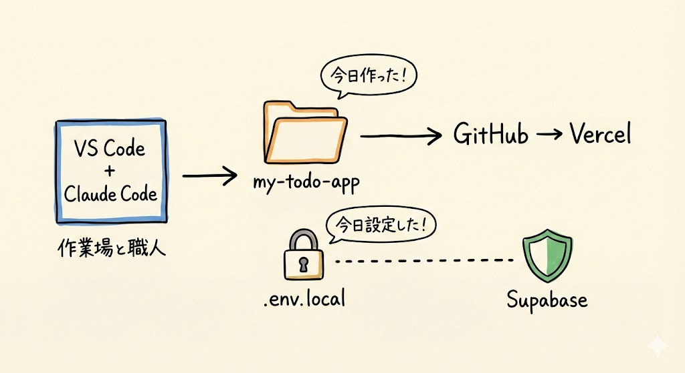

5つのパーツが揃って、接続も完了しました。

```
VS Code + Claude Code（作業場と職人）
    ↓ コードを作る
my-todo-app（プロジェクト本体）← 今日作った
    ↑
.env.local（接続するための鍵）← 今日設定した
    ↑
Supabase（データの保管庫）← 前回作った

GitHub（倉庫）← 第17回で作った
    ↓
Vercel（展示場）← 第18回で作った
```

ここで皆さん、画面を見てください。全部のパーツが揃いました。あとは、アプリの中身を作るだけです。

ここまでの準備は、1回やれば終わりです。次回からは、いよいよアプリ開発本番です。

---

## ここまでの道のりを振り返る

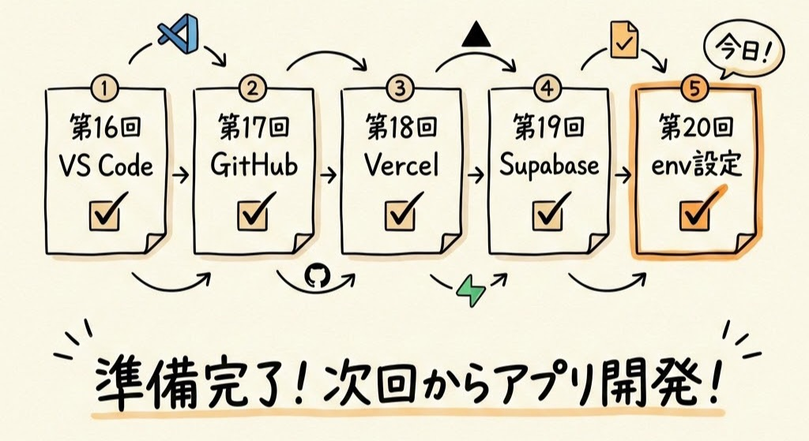

第16回から今回まで、5回かけて準備をしてきました。振り返ってみましょう。

| 回 | やったこと | 状態 |
| --- | --- | --- |
| 第16回 | VS Codeをインストール | 済 |
| 第17回 | GitHubアカウント作成 | 済 |
| 第18回 | Vercelアカウント作成 | 済 |
| 第19回 | Supabaseプロジェクト作成 | 済 |
| 第20回 | プロジェクト作成 + envファイル設定 | 済（今日！） |

準備は全部終わりました。パーツが揃って、接続も完了。

5回分の準備、お疲れさまでした。「準備が長かった......」と感じたかもしれません。でも、この準備は一度きりです。一度環境を整えてしまえば、2つ目、3つ目のアプリを作るときはもっと楽になります。

**次回、いよいよアプリを作ります。**

Claude Codeに「TODOアプリを作って」と話しかけるだけで、ファイルが次々と生成されていく様子を体験しましょう。プログラミングの知識はいりません。日本語で話しかけるだけです。

わくわくしますよね。ここまで頑張ってきた甲斐があります。

---

## まとめ

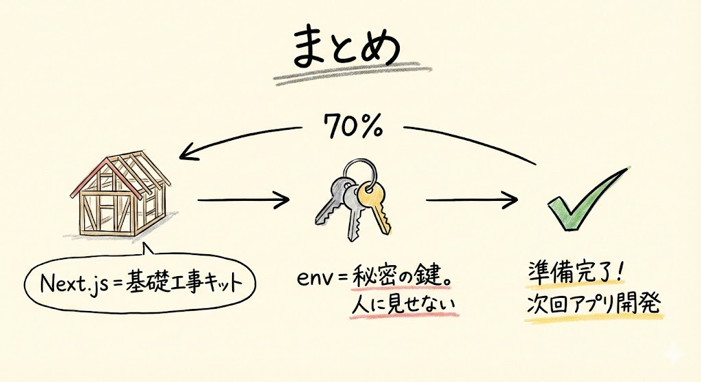

- `my-todo-app` フォルダを作り、VS Codeで開いた
- Claude Codeに **Next.jsプロジェクト** を作ってもらった（基礎工事の完了）。Next.jsはWebアプリのひな形（家を建てるときの基礎工事キット）
- **envファイル** = アプリの「鍵の束」。接続に必要な秘密の情報を入れるファイル。envは「environment（環境）」の略
- Supabaseの **Project URL** と **anon public key** を `.env.local` に貼り付けた
- envファイルは **絶対に人に見せない**（パスワードと同じ）。`.gitignore` が自動で守ってくれる
- **ここが唯一「コードっぽいもの」を触る瞬間** だった。やったのはコピー&ペーストだけ
- 準備は一度きり。次回からはいよいよアプリ開発本番

次回はいよいよ、TODOアプリを作っていきます。Claude Codeに「TODOアプリを作って」と話しかけるだけで、アプリのコードが生まれる瞬間を体験しましょう。
