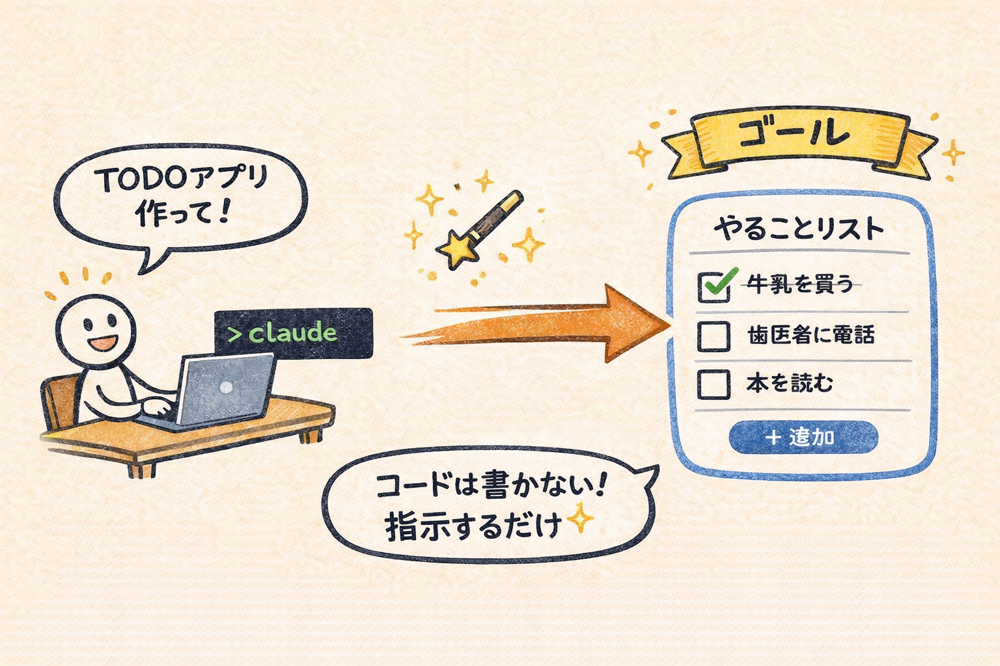
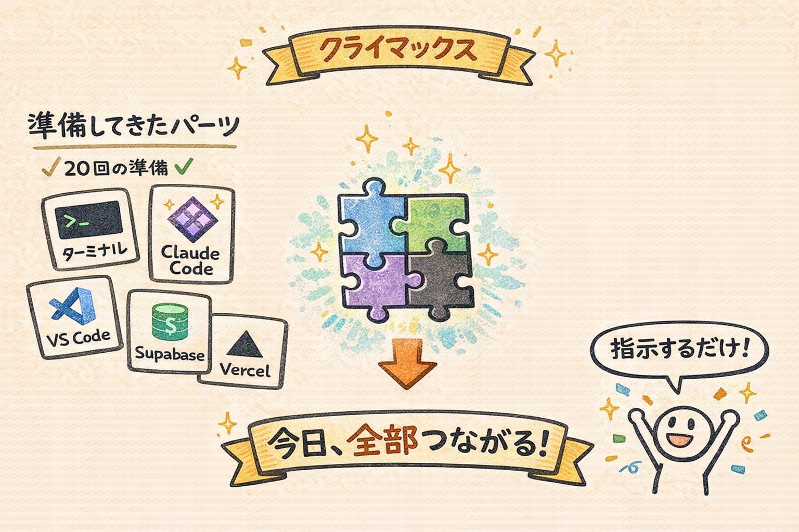
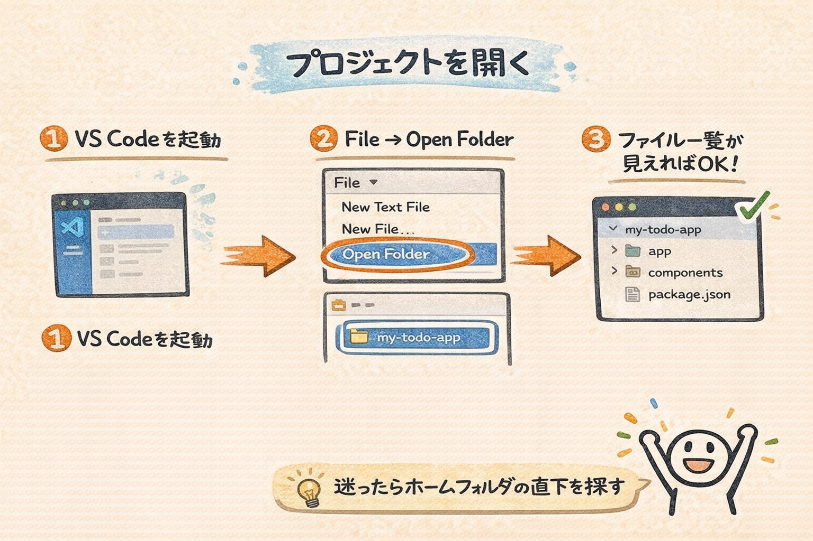
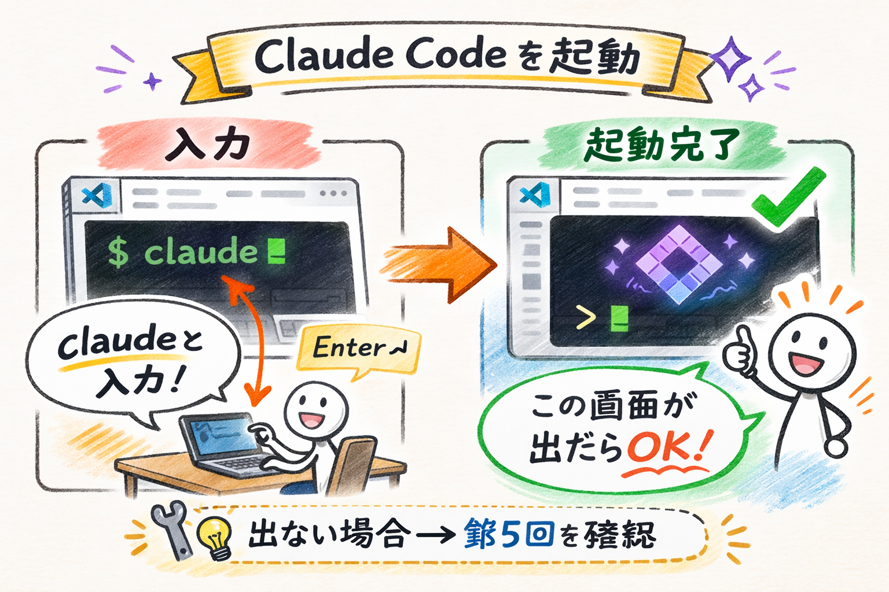
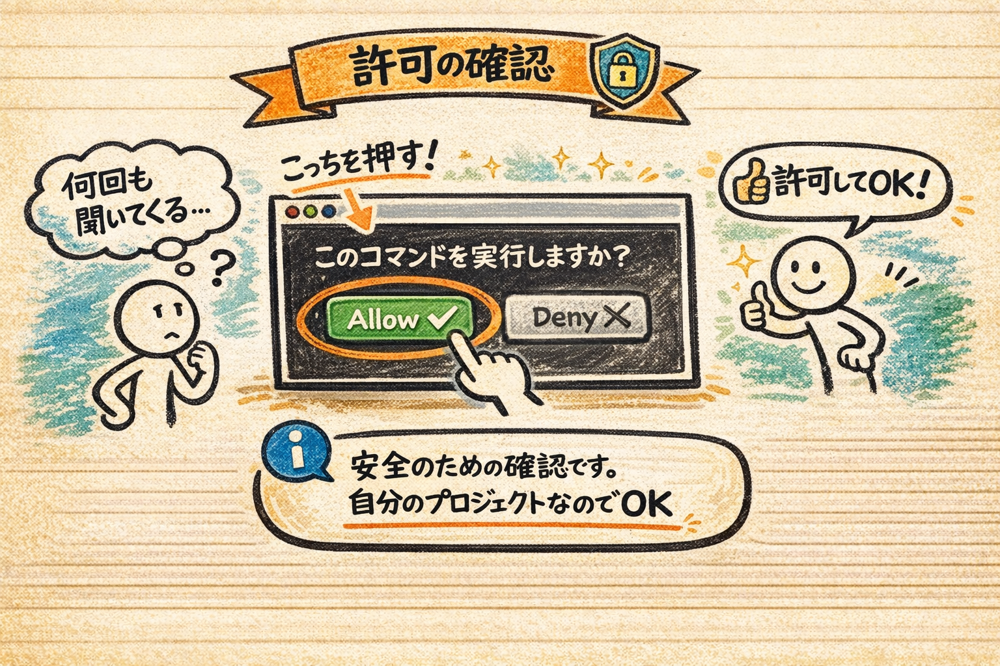
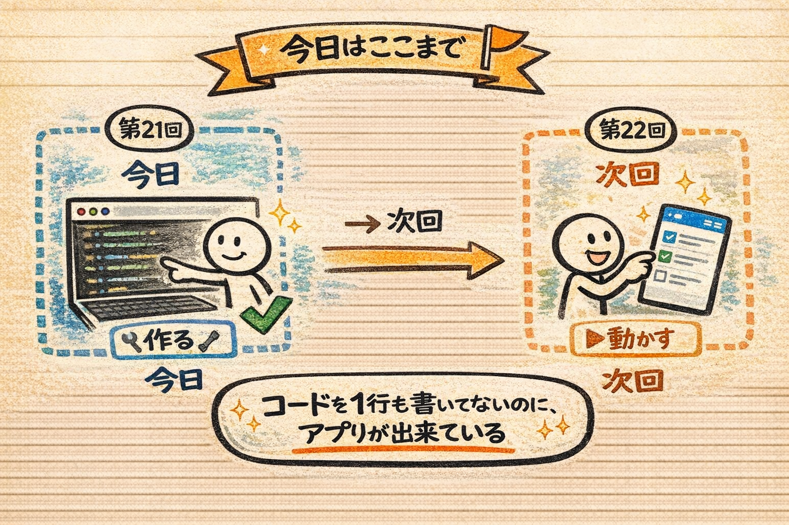

# 第21回｜TODOアプリを作ってもらおう — Claude Codeに任せる（前半）

## このレッスンのゴール



Claude Codeに日本語で指示を出し、TODOアプリのコードが自動生成される様子を体験すること。「自分はコードを書かない。指示を出すだけ」という感覚を掴むこと。

---

## いよいよ、この講座のクライマックスです



ここまで20回にわたって、準備を進めてきました。

- ターミナルの使い方を覚えた
- Claude Codeをインストールした
- VS Codeを使えるようになった
- GitHub、Vercel、Supabaseのアカウントを作った
- Next.jsプロジェクトを作成し、Supabaseとの接続も設定した

すべてのパーツが揃いました。今日、これらが全部つながります。

**日本語で指示を出すだけで、アプリが出来上がる。** その体験をしましょう。

---

## VS Codeでプロジェクトを開く



まず、VS Codeで `my-todo-app` を開きます。前回までに作成したプロジェクトフォルダですね。

VS Codeを起動してください。画面左上にある **「File」** メニューを左クリックして、表示されたメニューから **「Open Folder」** を左クリックしてください。フォルダ選択のウィンドウが開くので、`my-todo-app` フォルダを探して選択し、**「開く」** ボタンを左クリックします。

もし「my-todo-appってどこにあるんだっけ？」と迷ったら、前回の講座でフォルダを作った場所を思い出してくださいね。多くの場合、ホームフォルダの直下にあるはずです。

- **Macの場合**: `/Users/自分の名前/my-todo-app`
- **Windowsの場合**: `C:\Users\自分の名前\my-todo-app`

### 確認してみましょう

VS Codeの左側にファイル一覧が表示され、`my-todo-app` フォルダの中身（`package.json` や `app` フォルダなど）が見えていればOKです。もし何も表示されない、またはフォルダ名が違う場合は、もう一度「File」→「Open Folder」で正しいフォルダを選び直してください。

---

## ターミナルでClaude Codeを起動する



VS Codeの画面下部にターミナルが表示されています。もし表示されていない場合は、以下の方法でターミナルを開いてください。

- **Macの場合**: 画面上部のメニューバーから **「Terminal」** を左クリック → **「New Terminal」** を左クリック
- **Windowsの場合**: 画面上部のメニューバーから **「Terminal」** を左クリック → **「New Terminal」** を左クリック（Macと同じです）

画面の下半分にターミナル（黒っぽい画面）がパッと開きます。

ターミナルに以下を入力して、Enterキーを押してください。

```
claude
```

画面にClaude Codeのロゴやバージョン情報がぱっと表示されます。「`>`」のような入力待ちの記号が表示されたら、Claude Codeの起動完了です。これで準備が整いました。

### 確認してみましょう

ターミナルにClaude Codeのロゴが表示され、入力待ちの状態（`>` マークが出ている）になっていればOKです。

### うまくいかないときは

- **「command not found」と表示された場合**: Claude Codeが正しくインストールされていない可能性があります。第5回の手順に戻ってインストールを確認してみてください
- **ターミナルが開かない場合**: VS Codeの画面上部メニューの「View」→「Terminal」を左クリックしてみてください。ショートカットキー（Macなら `` Ctrl + ` ``、Windowsなら `` Ctrl + ` ``）でも開けます
- **ターミナルの表示場所が `my-todo-app` になっていない場合**: ターミナルの左端に表示されているフォルダ名を確認してください。もし違うフォルダが表示されている場合は、VS Codeで「File」→「Open Folder」から `my-todo-app` を開き直してからターミナルを起動してください

焦らなくて大丈夫です。ひとつずつ確認していきましょう。

---

## 指示を出す — たった一文でアプリを作る


いよいよ本番です。ここ、ちょっと大事なポイントです。

Claude Codeの入力欄に、以下の文章をそのまま入力してください。コピー&ペースト（コピペ）でもOKです。コピペとは、文章を選択して `Ctrl + C`（Macなら `Command + C`）でコピーし、入力欄で `Ctrl + V`（Macなら `Command + V`）で貼り付ける操作のことです。

```
Supabaseを使ったTODOアプリを作ってください。機能は、タスクの追加・完了・削除です。Tailwind CSSとshadcn/uiを使って、見た目もきれいにしてください
```

ここで出てくる用語を補足しておきますね。

- **Supabase（スーパベース）** — 第19回・第20回で設定した、データを保存するためのサービスです。TODOのデータがここに保管されます。たとえるなら「インターネット上にある、みんなで使えるノート」のようなものです
- **Tailwind CSS（テイルウィンド・シーエスエス）** — Webページの見た目（色や余白、レイアウトなど）を簡単に整えるための道具です。たとえるなら「洋服のコーディネートセット」のようなもので、あらかじめ用意された組み合わせを選ぶだけで、おしゃれなデザインになります
- **shadcn/ui（シャドシーエヌ・ユーアイ）** — ボタンや入力欄などの部品を、きれいなデザインで使えるようにするセットです。UIは User Interface（ユーザーインターフェース）の略で、画面上で人が操作する部分のことです。たとえるなら「おしゃれな家具セット」のようなもので、そのまま配置するだけで部屋（画面）がきれいに仕上がります

覚える必要はまったくありません。「見た目をきれいにする道具を使ってね」とClaude Codeに伝えているだけです。

入力したら、Enterキーを押しましょう。

---

## Claude Codeが作業する様子を見守る


ここから先は、**皆さんは何もしなくて大丈夫です。** Claude Codeが全部やってくれます。

### 何が起こるか

Claude Codeが指示を理解し、自動的に作業を始めます。画面にはこんなことが次々と表示されます。

- **ファイルが作られていく** — コンポーネント（部品）、ページ、データベース接続のコードなどが、自動で生成されていきます。コンポーネントというのは「パーツ」「部品」のことです。レゴブロックのように、小さな部品を組み合わせてアプリ全体を作ります
- **コマンドが自動実行される** — 必要なパッケージ（道具セット）のインストールなどが走ります。`npm install ...` のような表示が出ることがあります。npm（エヌピーエム）は、プログラミングで使う道具をダウンロードしてくるための仕組みです。スマホで言うところの「App Store」のようなものですね
- **コードがどんどん書かれていく** — JavaScript（ジャバスクリプト）やTypeScript（タイプスクリプト）といったプログラミング言語のコードが画面を流れていきます

画面を眺めていると、プログラミングの知識がない方は「何が書かれているのかさっぱりわからない」と思うかもしれません。

**それで全然OKです。** 皆さんがコードを読む必要はありません。Claude Codeが書いて、Claude Codeが動かします。映画のエンドロールを眺めるくらいの気持ちで見ていてください。

### 「許可しますか？」と聞かれたら



ここで皆さん、画面を見てください。

作業中、Claude Codeが「このコマンドを実行してもいいですか？」と確認してくることがあります。画面に `Allow` や `Deny` といった選択肢が表示されます。

- **Allow（アラウ）** = 「許可する」という意味です
- **Deny（ディナイ）** = 「拒否する」という意味です

これが表示されたら **「Allow」（許可）** を選んでください。キーボードで `y` を押すか、「Allow」の部分を左クリックすればOKです。

Claude Codeは安全のために、ファイルの変更やコマンドの実行前に確認を取るようになっています。自分のプロジェクトで作業しているので、許可して大丈夫ですよ。

何回か聞かれることがありますが、そのたびに「Allow」を選んでくださいね。「何度も聞いてくるな...」と思うかもしれませんが、安全のための確認なので、ちょっと面倒でもひとつずつ許可してあげてください。

### 作業時間の目安

指示の内容にもよりますが、だいたい **3〜5分程度** かかります。

その間、皆さんは画面を眺めているだけで構いません。コーヒーでも飲みながら待ちましょう。

### うまくいかないときは

- **途中で止まったように見える場合**: 処理に時間がかかっているだけのことが多いです。5分以上経っても何も動きがない場合は、`Ctrl + C`（Macの場合は `Command + C` ではなく `Ctrl + C` です。ターミナルでの中断操作は、MacでもCtrlを使います）でキャンセルして、もう一度最初の指示を入力してみてください
- **赤い文字でエラーが表示された場合**: そのままClaude Codeに「このエラーを直して」と伝えてください。Claude Codeが自動で修正してくれます
- **Claude Codeが途中で終了してしまった場合**: ターミナルに `claude` と入力してEnterキーを押し、再度起動してください。そして同じ指示をもう一度入力すればOKです

やり直しがきくので、慌てなくて大丈夫です。

---

## 指示のコツ — 良い指示と悪い指示


今私がやったことを説明しますね。今回の指示をもう一度見てみましょう。

```
Supabaseを使ったTODOアプリを作ってください。機能は、タスクの追加・完了・削除です。Tailwind CSSとshadcn/uiを使って、見た目もきれいにしてください
```

この指示には、2つのポイントが入っています。

| ポイント | 内容 | 例 |
| --- | --- | --- |
| **機能を具体的に** | 何ができるアプリかを明確に | タスクの追加・完了・削除 |
| **見た目を指定** | どんなデザインにしたいか | Tailwind CSS + shadcn/ui |

比較してみましょう。

| 指示 | 結果 |
| --- | --- |
| 「TODOアプリを作って」 | 動くけど見た目が素朴。白い画面に文字だけ、という感じになりがち |
| 「Supabaseを使ったTODOアプリを作って。機能は追加・完了・削除。Tailwind CSSとshadcn/uiで見た目もきれいに」 | 機能もデザインも整ったアプリ。ボタンや入力欄がおしゃれに仕上がる |

**機能と見た目を具体的に伝える。** これが良い指示のコツです。

たとえるなら、レストランで「おまかせで」と注文するよりも「魚料理で、さっぱりした味付けで、サラダ付きで」と頼んだほうが、自分の好みに合った料理が出てきますよね。それと同じです。

これ、よく聞かれるんですが、「プログラミングの知識がないとうまく指示できないのでは？」と心配される方がいます。でも大丈夫です。「何を」「どうしたいか」を日本語で具体的に書けば、Claude Codeはそれに応えてくれます。プログラミングの知識はいりません。日本語の表現力だけで十分です。

たとえば将来、別のアプリを作るときにも「ボタンは丸みのあるデザインで」「色はパステルカラーで」のように、日本語で伝えれば大丈夫ですよ。

---

## 作業完了の確認


Claude Codeの作業が終わると、入力待ちの状態（`>` マーク）に戻ります。

### 確認してみましょう

VS Codeの左側にあるファイル一覧（エクスプローラー）を見てみてください。いくつものファイルやフォルダが自動で作られているのがわかるはずです。たとえば以下のようなファイルやフォルダが増えています。

- `components/` フォルダ — アプリの部品（ボタン、入力欄など）が入っています
- `app/page.tsx` — アプリのメイン画面のファイルです
- `lib/` フォルダ — Supabaseとの接続コードなどが入っています

これ全部、Claude Codeが書いてくれたものです。すごいですよね。

皆さんがやったのは、日本語で指示を出しただけ。それだけで、プロのエンジニアが何時間もかけて書くようなコードが、数分で生成されました。

---

## 今日はここまで。動作確認は次回



今日は、指示を出してコードが生成されるところまでを体験しました。

「えっ、動かさないの？」と思った方、ご安心ください。次回、アプリを起動して実際に触ってみます。今日は「作る」、次回は「動かす」。2回に分けて進めていきます。

今日の体験で感じてほしかったのは、**「自分は一行もコードを書いていないのに、アプリのコードが出来上がっている」** という事実です。

---

## まとめ


- VS Codeで `my-todo-app` を開き、ターミナルで `claude` と入力してClaude Codeを起動した
- 日本語で「TODOアプリを作って」と具体的に指示を出した
- Claude Codeがファイル作成、コマンド実行、コード記述を自動で行った
- 「許可しますか？」と聞かれたら「Allow」を選ぶ。何度聞かれても大丈夫
- 指示のコツ: **機能と見た目を具体的に伝える**。日本語の表現力だけでOK
- エラーが出ても慌てない。Claude Codeに「このエラーを直して」と伝えるだけ

次回は、作ったアプリを起動して実際に触ってみます。自分のPCの中でTODOアプリが動く瞬間を体験しましょう。
