# 第22回｜TODOアプリを動かしてみよう — 起動して動作確認（後半）

## このレッスンのゴール

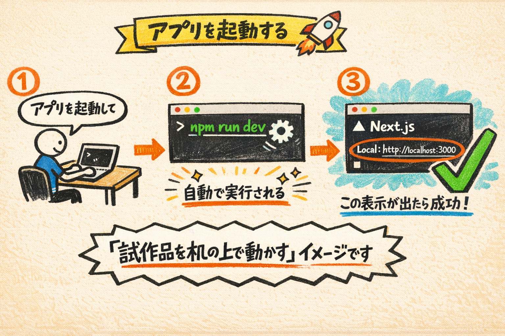

前回作ったTODOアプリを起動し、実際にタスクの追加・完了・削除を体験すること。エラーが出たときの対処法も知ること。

---

## 前回のおさらい

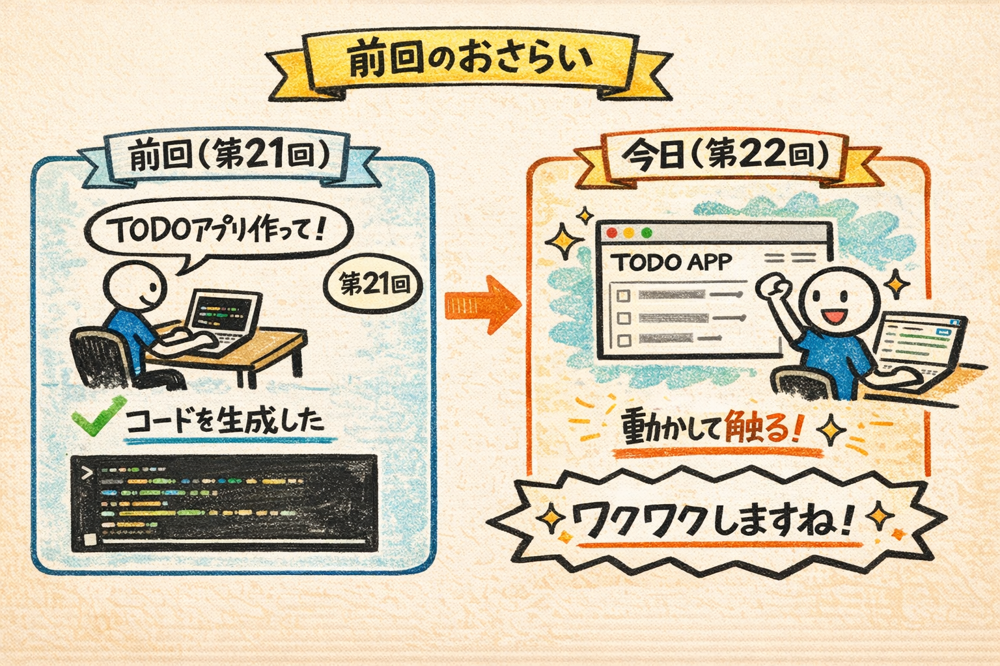

前回、Claude Codeに指示を出して、TODOアプリのコードを生成してもらいました。

今日は、そのアプリを **実際に動かして触ってみます。** ワクワクしますね。

---

## VS Codeでプロジェクトを開く

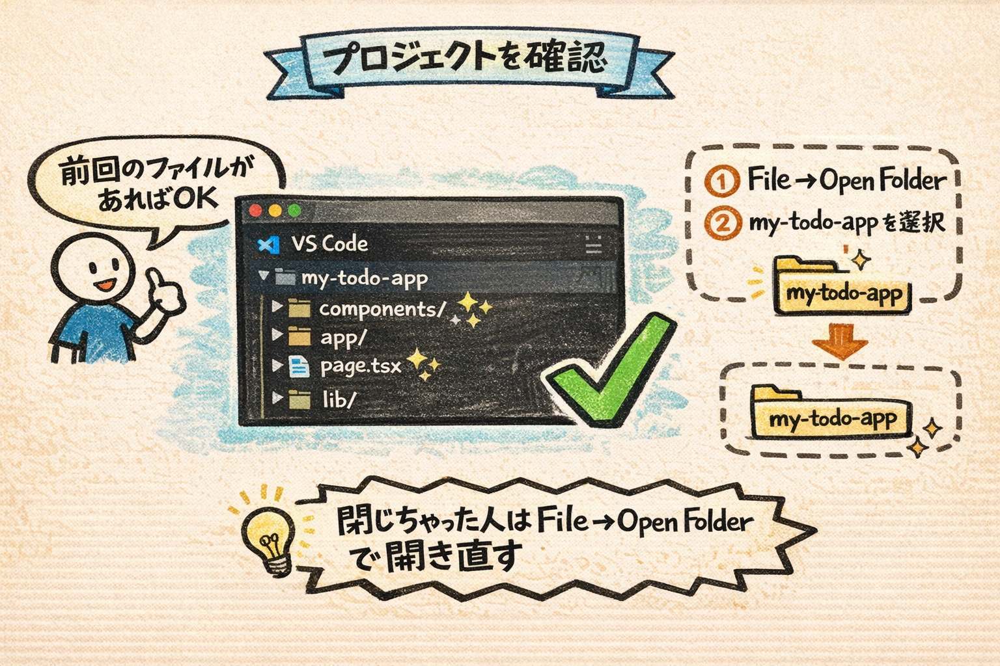

まず、VS Codeで `my-todo-app` フォルダが開かれていることを確認してください。前回の続きであれば、すでに開いた状態のはずです。

もしVS Codeを閉じてしまった方は、VS Codeを起動して、画面左上の **「File」** → **「Open Folder」** から `my-todo-app` フォルダを選んでください。

- **Macの場合**: `/Users/自分の名前/my-todo-app`
- **Windowsの場合**: `C:\Users\自分の名前\my-todo-app`

### 確認してみましょう

VS Codeの左側のファイル一覧に、前回Claude Codeが作ったファイル（`components/` フォルダ、`app/page.tsx` など）が表示されていればOKです。

---

## ターミナルでClaude Codeを起動する

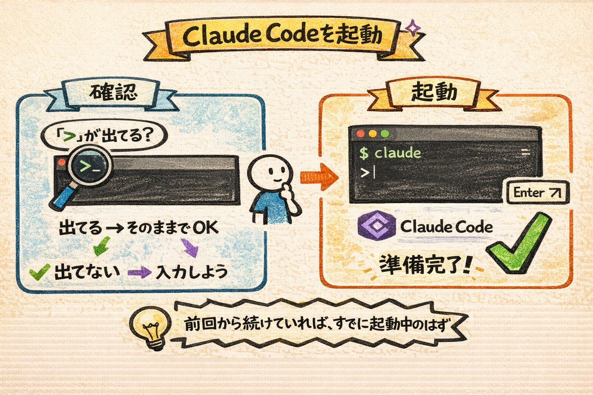

VS Codeの画面下部にターミナルが表示されていることを確認してください。表示されていない場合は、以下の方法でターミナルを開きます。

- **Mac / Windows共通**: 画面上部のメニューバーから **「Terminal」** を左クリック → **「New Terminal」** を左クリック

ターミナルが表示されたら、Claude Codeがまだ起動しているか確認してください。入力欄に `>` マークが表示されていれば起動中です。

起動していなければ、ターミナルに以下を入力してEnterキーを押してください。

```
claude
```

Claude Codeのロゴが表示され、`>` マークが出たら準備完了です。

---

## アプリを起動する

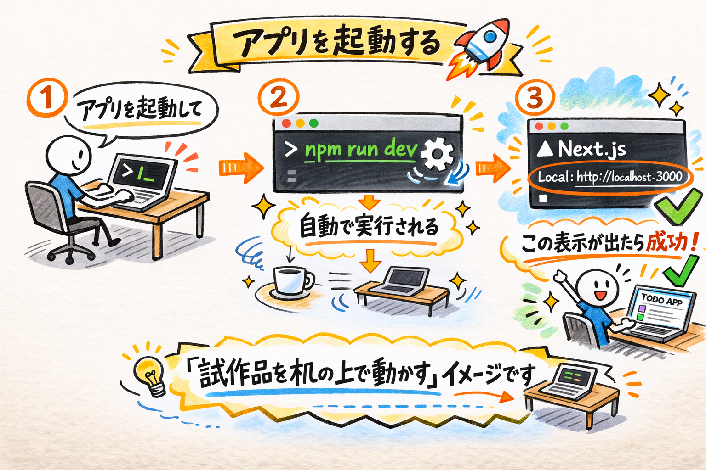

Claude Codeの入力欄に、こう指示します。

```
アプリを起動して
```

Enterキーを押すと、Claude Codeが以下のようなコマンドを自動で実行してくれます。

```
npm run dev
```

ここで用語を説明しますね。`npm run dev`（エヌピーエム・ラン・デブ）は「開発モードでアプリを起動して」という命令です。

- `npm` — 道具を管理する仕組み（スマホのApp Storeのようなものでしたね）
- `run` — 「実行して」
- `dev` — development（デベロップメント＝開発）の略

たとえるなら、「試作品をまず自分の机の上で動かしてみる」という操作です。まだお店（インターネット）には出していません。自分のPCの中だけで動かします。

途中で「許可しますか？」と聞かれたら、前回と同じく「Allow」を選んでください。

しばらくすると、ターミナルに以下のような表示が出ます。

```
▲ Next.js 15.x.x
- Local: http://localhost:3000
```

### 確認してみましょう

`Local: http://localhost:3000` という行が表示されたら、アプリの起動が完了したサインです。

### うまくいかないときは

- **赤い文字でエラーメッセージが表示された場合**: この後の「エラーが出たら？」セクションで対処法を説明しますので、慌てないでくださいね
- **何も表示されずに止まっている場合**: 処理中の可能性があります。30秒ほど待ってみてください
- **「command not found」と表示された場合**: Claude Codeではなくターミナルに直接 `npm run dev` と打ってしまった可能性があります。Claude Codeの入力欄（`>` マークのあと）に指示を入力してください

---

## localhostとは？

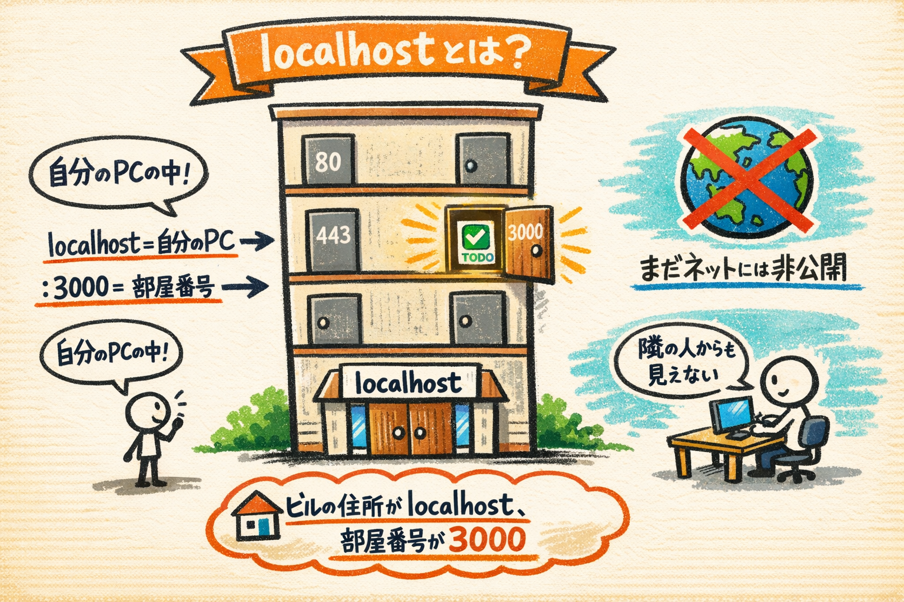

ここで「localhost」（ローカルホスト）という言葉が出てきました。

**localhost = 自分のPCの中** という意味です。

localhost:3000（ローカルホスト・さんぜん）というURLが出てきましたね。localhostというのは「自分のパソコン自身」を指す特別なアドレスです。`:3000` は通信の窓口番号（ポート番号といいます）。

たとえるなら、大きなビルの中にたくさんの部屋があるイメージです。ビルの住所が「localhost」で、部屋番号が「3000」。つまり「自分のパソコンの3000番の部屋でアプリが動いてますよ」という意味です。

まだインターネットには公開されていません。自分のPCの中だけで動いている状態です。隣に座っている人のPCからは見えません。

いわば「試作品を自分の机の上で動かしている」ような状態ですね。世界に公開するのはもう少し先、第24回でやります。

---

## ブラウザで開いてみよう

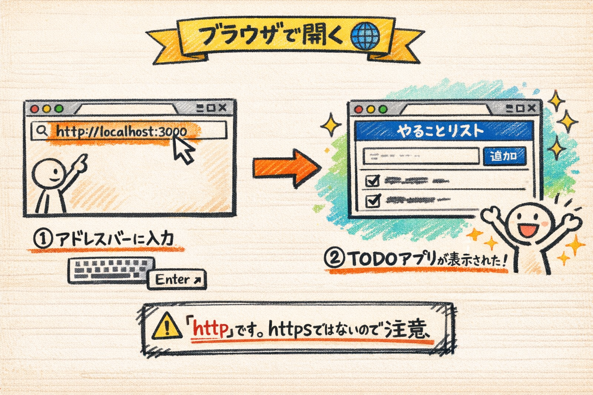

ブラウザ（Chrome、Safari、Edgeなど、普段インターネットを見るときに使うアプリ）を開いてください。

画面の一番上にあるアドレスバー（URLが表示される横長のバー）を左クリックして、以下を入力します。

```
http://localhost:3000
```

入力したらEnterキーを押しましょう。

**TODOアプリが表示されます。**

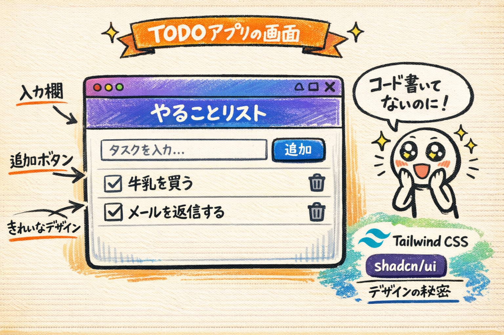

画面に、タスクを入力するためのテキスト入力欄と、追加ボタンが見えるはずです。デザインが整っていて、きれいな見た目になっていますね。これは前回指示した Tailwind CSS と shadcn/ui のおかげです。

これが、皆さんが日本語で指示して作ったアプリです。コードは一行も書いていません。でも、ちゃんと動くアプリがここにあります。

### 確認してみましょう

ブラウザにTODOアプリの画面が表示され、テキスト入力欄と追加ボタンが見えていればOKです。

### うまくいかないときは

- **画面が真っ白の場合**: ブラウザのアドレスバーに入力したURLが正しいか確認してください。`http://localhost:3000` です。`https`（sがつく）ではなく `http` ですのでご注意ください
- **「このサイトにアクセスできません」と表示される場合**: VS Codeのターミナルで `npm run dev` が正常に動いているか確認してください。ターミナルに `Local: http://localhost:3000` と表示されているかチェックしましょう
- **エラーメッセージが表示された場合**: この後の「エラーが出たら？」セクションを参照してください

---

## 実際に触ってみよう


### タスクを追加する

画面の上のほうに、テキスト入力欄（文字が打ち込める横長の枠）があるはずです。そこを左クリックして、何かタスクを入力してみてください。

```
牛乳を買う
```

入力したら、入力欄の横にある **追加ボタン**（「Add」や「追加」と書かれたボタン、もしくは「+」マーク）を左クリックしてください。

画面にタスクが一覧として表示されましたか？ 表示されたら成功です。もう1つ追加してみましょう。

```
メールを返信する
```

同じように入力して、追加ボタンを左クリックしてください。2つのタスクが一覧に並んでいるはずです。

### 確認してみましょう

「牛乳を買う」と「メールを返信する」の2つのタスクが画面に一覧表示されていればOKです。

### タスクを完了する

ここで皆さん、タスクの左側を見てください。

タスクの横にチェックボックス（小さな四角い枠）やボタンがあるはずです。それを左クリックしてみてください。

タスクに取り消し線が入ったり、色がグレーに変わったりします。これは「完了した」ということを示しています。

### タスクを削除する

次に、タスクの右側を見てください。

削除ボタン（ゴミ箱のアイコン、「削除」ボタン、もしくは「x」マーク）があるはずです。それを左クリックしてみてください。

タスクが一覧から消えます。

### 確認してみましょう

**追加、完了、削除。** 前回Claude Codeに指示した通りの3つの機能が、ちゃんと動いていることを確認できましたか？ すごくないですか？

---

## エラーが出たら？

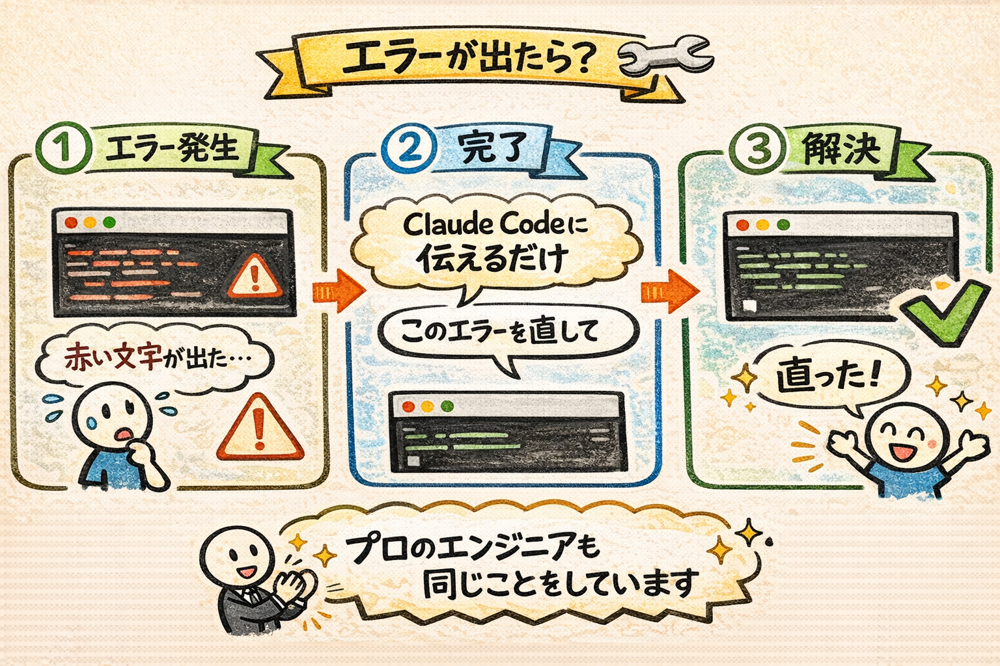

ここで大事なことをお伝えします。

**エラーが出ることは、まったく普通のことです。**

プロのエンジニアも、毎日エラーに遭遇します。エラーが出ること自体は問題ではありません。大事なのは対処方法を知っていることです。間違えても大丈夫、やり直しがきくので安心してください。

### 対処方法はとてもシンプル

エラーメッセージが表示されたら、**そのままClaude Codeに伝えるだけ** です。

まず、アプリが起動中の場合は、VS Codeのターミナルで `Ctrl + C`（MacでもCtrlです）を押してアプリを一度停止してください。そのあと、`claude` と入力してClaude Codeを起動します。

Claude Codeにこう伝えてください。

```
このエラーを直して
```

または、画面に表示されている赤い文字のエラーメッセージをマウスで選択してコピーし、Claude Codeの入力欄に貼り付けてこう伝えてもOKです。

- **コピーの操作**: エラーメッセージをマウスで選択（左クリックを押しながらドラッグ）して、`Ctrl + C`（Macなら `Command + C`）
- **貼り付けの操作**: Claude Codeの入力欄で `Ctrl + V`（Macなら `Command + V`）

```
このエラーが出ています：（エラーメッセージをコピペ）。修正してください
```

Claude Codeがエラーの原因を分析し、自動で修正してくれます。修正が完了したら、もう一度Claude Codeに「アプリを起動して」と伝えて、ブラウザで `http://localhost:3000` を開いて確認してみてください。

これは特別なテクニックではありません。実はプロのエンジニアもAIに対してまったく同じことをしています。エラーが出たらAIに投げる。それだけです。

### よくあるエラーの例

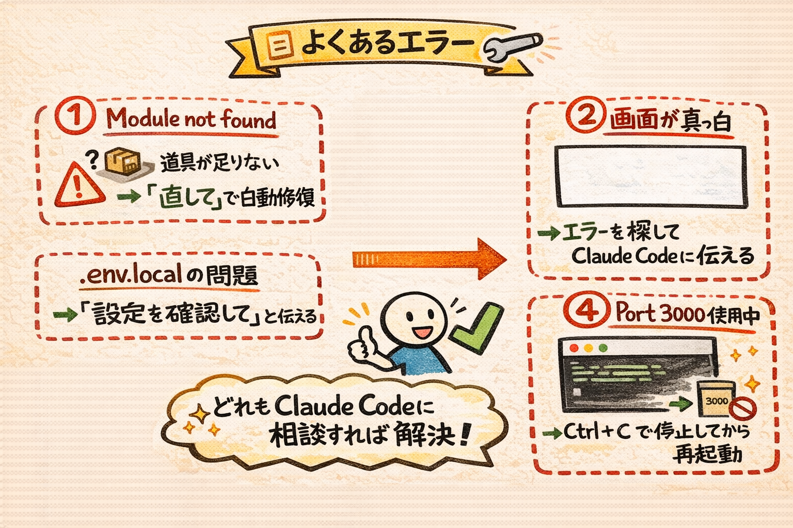

参考までに、よくあるエラーをいくつか紹介しておきますね。

| エラーメッセージ | 意味 | 対処法 |
| --- | --- | --- |
| **「Module not found」** | 必要な道具がインストールされていない | Claude Codeに「このエラーを直して」と伝えれば、自動でインストールしてくれます |
| **画面が真っ白** | アプリの表示処理に問題がある | ブラウザの画面で右クリック → 「検証」（Chrome）や「要素を調査」（Safari）を左クリック。赤い文字のエラーが出ていたら、そのメッセージをClaude Codeに伝えてください |
| **「NEXT_PUBLIC_SUPABASE_URL is not defined」** | `.env.local` ファイルの設定に問題がある | 第20回で設定した `.env.local` ファイルが `my-todo-app` フォルダの中にあるか確認してください。Claude Codeに「.env.localの設定を確認して」と伝えてもOKです |
| **「Port 3000 is already in use」** | 3000番の窓口がすでに使われている | 前回のアプリがまだ動いている可能性があります。VS Codeのターミナルで `Ctrl + C` を押してから、もう一度起動してください |

いずれの場合も、Claude Codeに相談すれば解決してくれるので、心配しなくて大丈夫です。

---

## Supabaseでデータを確認してみよう

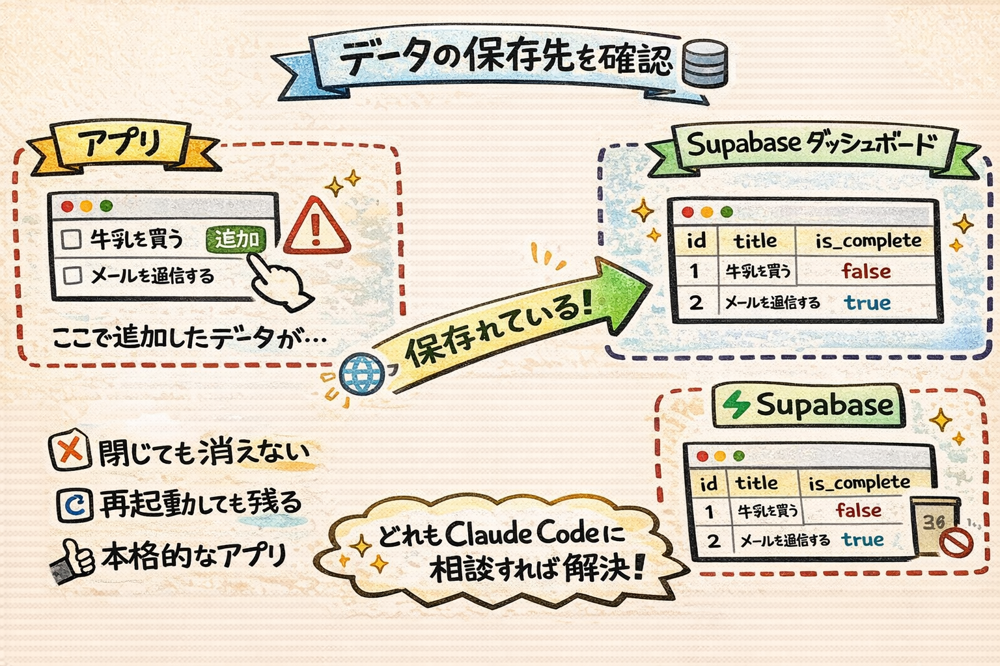

ここまで、アプリ上でタスクの追加・完了・削除をやってみました。では、追加したタスクのデータはどこに保存されているのでしょうか。

答えは **Supabase** です。第19回・第20回で設定した、あのデータベースですね。データベースとは「データを整理して保管しておく場所」のことです。たとえるなら、Excelの表のような形でデータが保存される場所です。

### ダッシュボードで確認する手順

1. ブラウザで新しいタブを開いてください。アドレスバーに `https://supabase.com` と入力してEnterキーを押します
2. ページが開いたら、画面右上の **「Sign In」** を左クリックしてログインします
3. ダッシュボード（管理画面）が表示されたら、自分のプロジェクト名を左クリックして選択します
4. 画面の左側にメニューが縦に並んでいます。その中から **「Table Editor」**（テーブルのアイコン。テーブルとは「表」のことです）を左クリックします
5. テーブルの一覧が表示されるので、**「todos」** というテーブル名を左クリックします

### 確認してみましょう

先ほどアプリで追加したタスクがデータとして保存されているのが見えます。こんな感じの表が表示されるはずです。

| id | title | is_complete | created_at |
| --- | --- | --- | --- |
| 1 | 牛乳を買う | false | 2026-02-17... |
| 2 | メールを返信する | true | 2026-02-17... |

（表の列名や構成は、Claude Codeが作ったコードによって多少異なる場合があります。それでも、タスクのタイトルや完了状態がデータとして保存されていることは確認できるはずです）

各列の意味はこうです。

- **id** — 各タスクに自動的につけられる番号。背番号のようなものです
- **title** — タスクの名前（皆さんが入力した文字）
- **is_complete** — 完了したかどうか。`false` は未完了、`true` は完了済み
- **created_at** — タスクが作られた日時

### うまくいかないときは

- **「todos」テーブルが見つからない場合**: Claude Codeが作ったテーブル名が異なる場合があります。Table Editorの一覧に表示されているテーブル名を確認して、それらしいものを左クリックしてみてください
- **テーブルは見つかるがデータが空の場合**: アプリとSupabaseの接続がうまくいっていない可能性があります。VS Codeに戻り、Claude Codeに「Supabaseとの接続を確認して」と伝えてください

### これが意味すること

データはブラウザの中ではなく、**Supabase（インターネット上のデータベース）** に保存されています。

つまり：

- ブラウザを閉じてもデータは消えない
- PCを再起動してもデータは残っている
- もう一度 `http://localhost:3000` を開けば、同じデータが表示される

これは「メモ帳アプリ」とは根本的に違います。ちゃんとしたデータベースを使った、本格的なアプリです。プロが作るアプリと同じ仕組みで動いているんですよ。

---

## アプリを停止するには

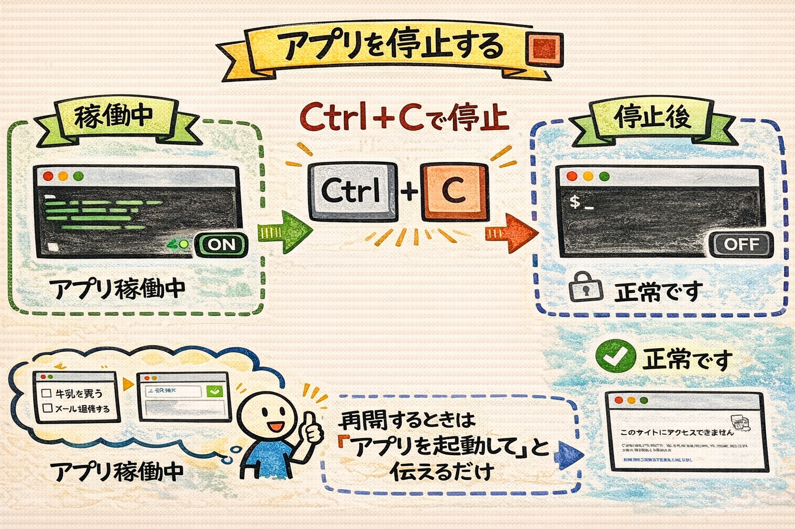

今日の動作確認が終わったら、アプリを停止しましょう。

VS Codeのターミナルで `Ctrl + C`（MacでもCtrlです）を押してください。アプリが停止し、ターミナルが通常の入力待ち状態に戻ります。

停止したあとは、ブラウザで `http://localhost:3000` を開いても「このサイトにアクセスできません」と表示されます。これは正常です。アプリの電源を切った状態ですので、次に使うときはまた `npm run dev`（またはClaude Codeに「アプリを起動して」と伝える）で起動すれば大丈夫です。

---

## 今日やったことの整理

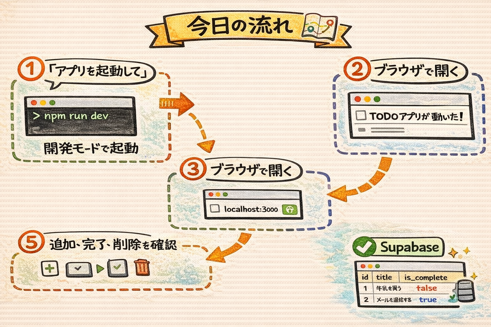

今日の流れを振り返ってみましょう。

```
Claude Codeに「アプリを起動して」と伝える
    ↓
npm run dev（開発モードで起動）が実行される
    ↓
ブラウザで localhost:3000 を開く
    ↓
TODOアプリが動いている！
    ↓
タスクの追加・完了・削除を確認
    ↓
Supabaseにデータが保存されていることも確認
```

---

## まとめ


- アプリを起動するには、Claude Codeに「アプリを起動して」と伝えるだけ
- `npm run dev` は「開発モードでアプリを起動して」という命令。`dev` は development（開発）の略
- `localhost:3000` は「自分のPCの3000番の部屋」。まだインターネットには公開されていない
- タスクの追加・完了・削除が、指示通りに動作した
- **エラーが出たら、そのままClaude Codeに投げるだけ。** エンジニアも同じことをしている
- データはSupabaseに保存されるので、ブラウザを閉じても消えない
- アプリを停止するには `Ctrl + C`（MacでもCtrl）

次回は、このアプリのコードをGitHubに保存します。今はまだ自分のPCの中だけにある状態なので、バックアップを取りましょう。
