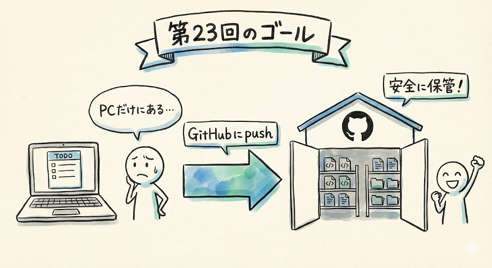

# 第23回｜GitHubにコードを保存しよう — 倉庫に預ける

## このレッスンのゴール



TODOアプリのコードをGitHubにアップロードし、「自分のPCだけにある」状態から「インターネット上に安全に保管されている」状態にすること。

---

## なぜGitHubに保存するのか


今、TODOアプリのコードは **自分のPCの中にだけ** あります。

もし、PCが壊れたら？ コーヒーをこぼしたら？ うっかりフォルダを削除したら？

コードは全部消えます。せっかく作ったアプリが、跡形もなくなってしまいます。

GitHubは **コードの倉庫** です。インターネット上にある、安全な保管場所ですね。たとえるなら、大事な書類を自宅だけに置いておくのではなく、銀行の貸し金庫にも預けておくようなものです。ここにコードを預けておけば、PCに何が起きても安心です。

そして、次回Vercelで公開するときにも、このGitHubが必要になります。

---

## VS Codeでプロジェクトを開く


まず、VS Codeで `my-todo-app` フォルダが開かれていることを確認してください。

もしVS Codeを閉じてしまった方は、VS Codeを起動して、画面左上の **「File」** → **「Open Folder」** から `my-todo-app` フォルダを選んでください。

- **Macの場合**: `/Users/自分の名前/my-todo-app`
- **Windowsの場合**: `C:\Users\自分の名前\my-todo-app`

### 確認してみましょう

VS Codeの左側のファイル一覧に、前回までにClaude Codeが作ったファイル群が表示されていればOKです。

---

## ターミナルでClaude Codeを起動する


VS Codeの画面下部にターミナルを表示してください。表示されていない場合は、以下の方法で開きます。

- **Mac / Windows共通**: 画面上部のメニューバーから **「Terminal」** → **「New Terminal」** を左クリック

ターミナルが表示されたら、以下を入力してEnterキーを押してください。

```
claude
```

Claude Codeのロゴが表示され、`>` マークが出たら準備完了です。

### うまくいかないときは

- **前回のアプリ（`npm run dev`）がまだ動いている場合**: まず `Ctrl + C`（MacでもCtrl）を押してアプリを停止してから、`claude` と入力してください
- **「command not found」と表示された場合**: Claude Codeのインストールに問題がある可能性があります。第5回の手順を確認してください

---

## Claude Codeに任せる


GitHubへのアップロードも、Claude Codeに任せましょう。自分でコマンドを打つ必要はありません。

Claude Codeの入力欄に、以下のように指示します。

```
このプロジェクトをGitHubにpushして。リポジトリ名はmy-todo-appで
```

ここで出てくる用語を説明しますね。

- **push（プッシュ）** — 文字通り「押し出す」操作です。自分のパソコンにあるコードを、GitHubという倉庫に送り出すことを「pushする」と言います。たとえるなら、段ボール箱を倉庫の棚にぐいっと押し込む動きですね
- **リポジトリ** — 「保管庫」「倉庫」のことです。GitHub上でのプロジェクトの保管場所のことを、こう呼びます。1つのアプリにつき、1つのリポジトリを使うのが一般的です

入力したらEnterキーを押してください。

### Claude Codeが自動で行う作業

Claude Codeが自動的に以下の作業を行ってくれます。

```
git init        （このフォルダの管理を始める）
    ↓
git add .       （ファイルを保存対象にする）
    ↓
git commit      （変更を記録する）
    ↓
git push        （GitHubにアップロードする）
```

途中で「許可しますか？」と聞かれたら、「Allow」を選んでください。何回か聞かれることがありますが、そのたびに「Allow」で大丈夫です。

作業には1〜2分ほどかかります。ターミナルに色々な文字が流れていきますが、焦らず待ちましょう。最後に「完了しました」のようなメッセージが表示されたら成功です。

### 確認してみましょう

Claude Codeの作業が終わり、入力待ちの状態（`>` マーク）に戻れば、アップロード完了です。

### うまくいかないときは

- **GitHubの認証（ログイン）を求められた場合**: Claude Codeの指示に従って、ブラウザでGitHubにログインしてください。初回のみ認証が必要です
- **「Permission denied」と表示された場合**: GitHubへのアクセス権限の問題です。Claude Codeに「このエラーを直して」と伝えてください
- **「Repository already exists」と表示された場合**: すでに同じ名前のリポジトリがGitHubにある可能性があります。Claude Codeに「リポジトリ名をmy-todo-app-v2にして再度pushして」と伝えてみてください
- **その他のエラーが出た場合**: 慌てなくて大丈夫です。Claude Codeにそのまま「このエラーを直して」と伝えれば、対処してくれます

---

## 用語のざっくり説明


画面にいくつかの用語が表示されたと思います。ざっくり説明しておきますね。

| コマンド | やっていること | たとえるなら |
| --- | --- | --- |
| `git init`（ギット・イニット） | 「このフォルダをgitで管理します」という宣言。initはinitialize（初期化）の略 | 引っ越し業者に「この部屋の荷物をお願いします」と伝える |
| `git add`（ギット・アド） | 「これらのファイルを保存対象にする」。addは「追加」 | 段ボールに荷物を詰める |
| `git commit`（ギット・コミット） | 「変更を記録する」。commitは「確定する」 | 段ボールにラベル（日付とメモ）を貼る |
| `git push`（ギット・プッシュ） | 「GitHubにアップロードする」。pushは「押し出す」 | 段ボールを倉庫に発送する |

**覚える必要はありません。** Claude Codeに「GitHubにpushして」と言えば、全部やってくれます。

エンジニアはこれらのコマンドを手で打ちますが、皆さんはClaude Codeに任せればOKです。「そういう手順があるんだな」くらいの理解で十分です。将来、画面に `git` で始まるコマンドが表示されても、「あ、倉庫に荷物を送る作業をしてるんだな」と思ってもらえればOKですよ。

---

## GitHubで確認してみよう


アップロードが完了したら、ブラウザで確認してみましょう。

### 1. GitHubを開く

ブラウザで新しいタブを開いて、アドレスバーに以下を入力してEnterキーを押してください。

```
https://github.com
```

ページが開いたら、画面右上のアイコンからログインしてください。すでにログインしている場合はそのままでOKです。

### 2. リポジトリを開く

ログインすると、ダッシュボード（トップページ）の左側に **`my-todo-app`** というリポジトリ名が表示されているはずです。

`my-todo-app` の文字を左クリックすると、リポジトリのページが開きます。ファイルの一覧が表示されますね。

### 確認してみましょう

自分のPCにあったファイルが、そのままGitHubにアップロードされていることが確認できます。フォルダやファイルが並んでいるのが見えるはずです。`package.json`、`app/` フォルダ、`components/` フォルダなどが見えていればOKです。

### 3. .env.localがないことを確認


ここ、ちょっと大事なポイントです。

ファイル一覧を見てください。`.env.local` というファイルは **含まれていません。**

これは正しい動作です。「あれ、ファイルが足りない？」と思うかもしれませんが、心配しないでください。

Claude Codeが `.gitignore`（ギットイグノア）という設定ファイルを使って、`.env.local`（Supabaseの接続情報が書かれたファイル）がGitHubにアップロードされないようにしてくれています。

`.gitignore` は「これらのファイルはgitで管理しないでね（無視してね）」というリストです。ignoreは英語で「無視する」の意味ですね。たとえるなら、引っ越しのときに「この箱は倉庫に送らないで、手元に残しておいて」と指示する伝票のようなものです。

なぜ `.env.local` を除外するかというと、このファイルにはSupabaseのAPIキー（サービスに接続するための鍵のようなもの）が含まれているからです。APIキーとは、サービスを利用するための「合言葉」のようなものです。これが公開されてしまうと、他の人が皆さんのSupabaseを勝手に使えてしまいます。家の鍵を道端に置いておくようなもので、とても危険ですよね。

だからこそ、秘密の情報がインターネット上に公開されないように、自動的に除外してくれているのです。

---

## GitHubに保存する意味


GitHubにコードを保存することには、2つの大きな意味があります。

### 1. バックアップ

PCが壊れても、GitHubにコードが残っています。新しいPCを買ったら、GitHubからコードをダウンロードすれば、すぐに作業を再開できます。

クラウド上に預けてあるので、自分のPC以外のどこからでもアクセスできるのも便利ですね。たとえるなら、写真をスマホだけに保存するのではなく、Googleフォトにもバックアップしておくのと同じ発想です。

### 2. 公開の土台

次回やるVercelでのインターネット公開には、GitHubが必要です。Vercelは「GitHubにあるコードを取ってきて公開する」という仕組みで動いています。

```
自分のPC → GitHub → Vercel → インターネット
```

今日やったのは、この流れの最初のステップ（自分のPC → GitHub）です。次回は、GitHub → Vercel → インターネットの部分をやります。

---

## まとめ


- TODOアプリのコードをGitHubにアップロードした
- Claude Codeに「GitHubにpushして」と言うだけで、git init → add → commit → push を自動実行してくれた
- Gitの用語は覚えなくてOK。「段ボールに荷物を詰めて倉庫に送る作業」くらいのイメージで十分
- GitHubで確認: ファイルがアップロードされている。`.env.local` は含まれていない（秘密の情報を守るため）
- `.gitignore` は「この箱は倉庫に送らないでね」という指示リスト
- GitHubはバックアップと、次回の公開（Vercel）の土台になる

次回は、いよいよVercelを使ってインターネットに公開します。世界中からアクセスできるURLが手に入りますよ。
