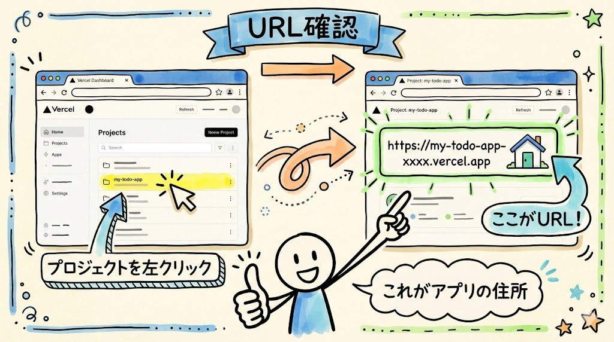
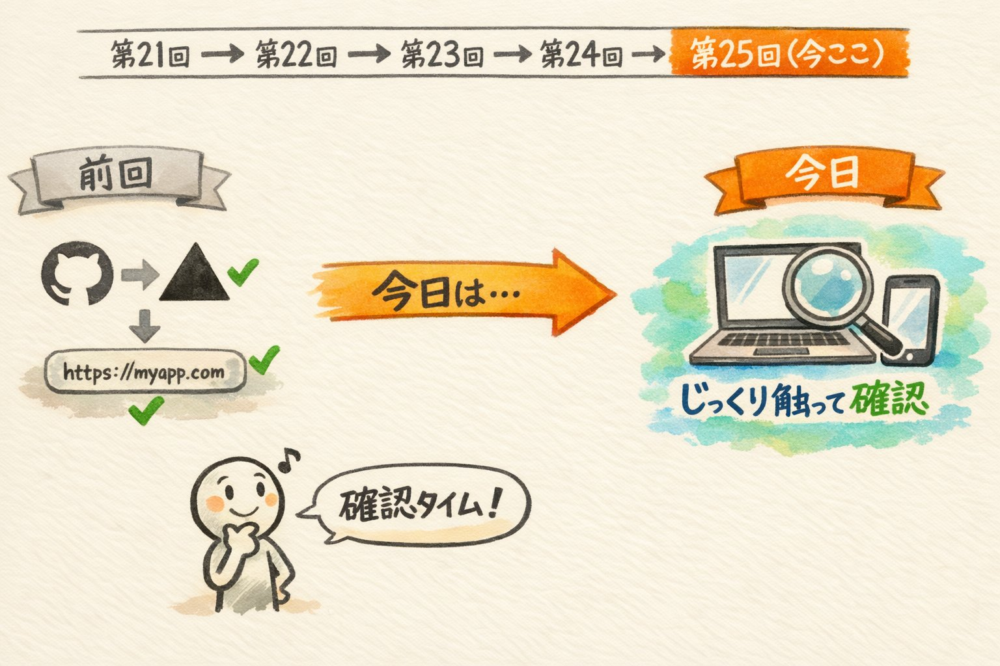
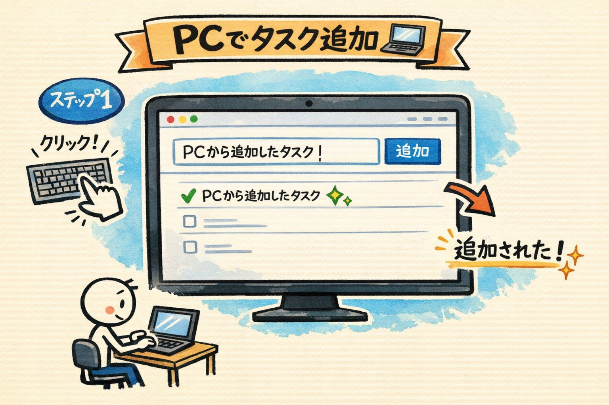
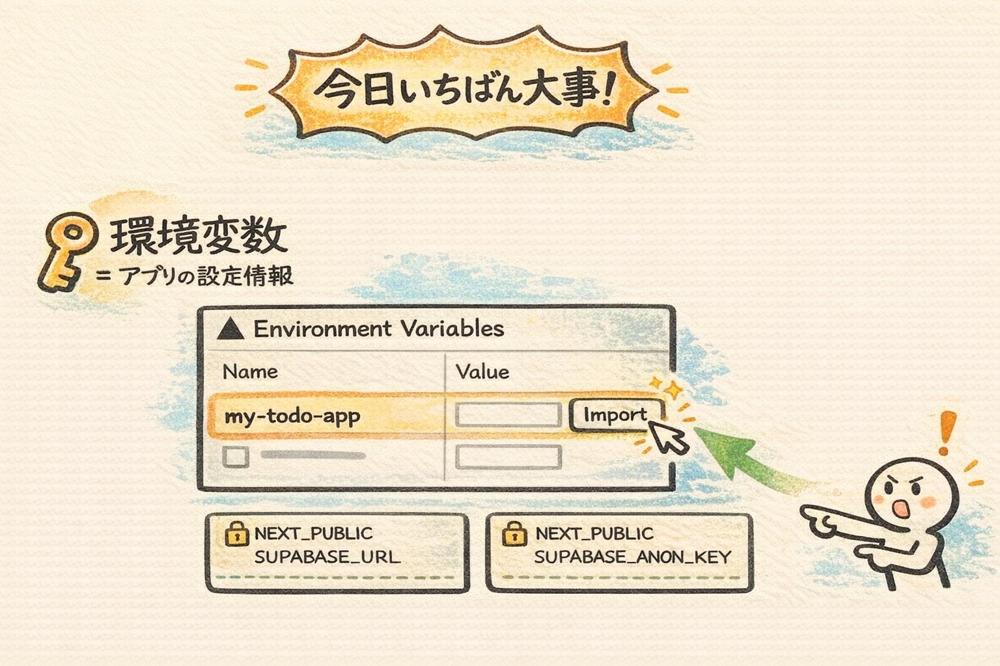
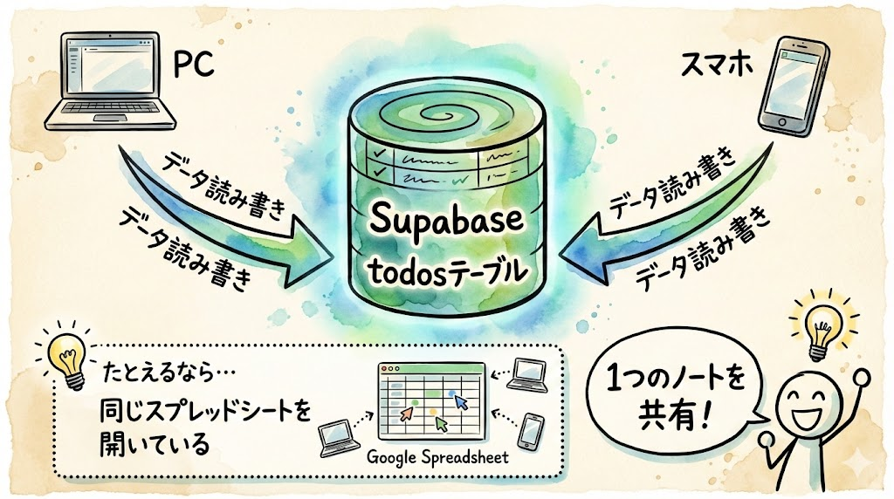
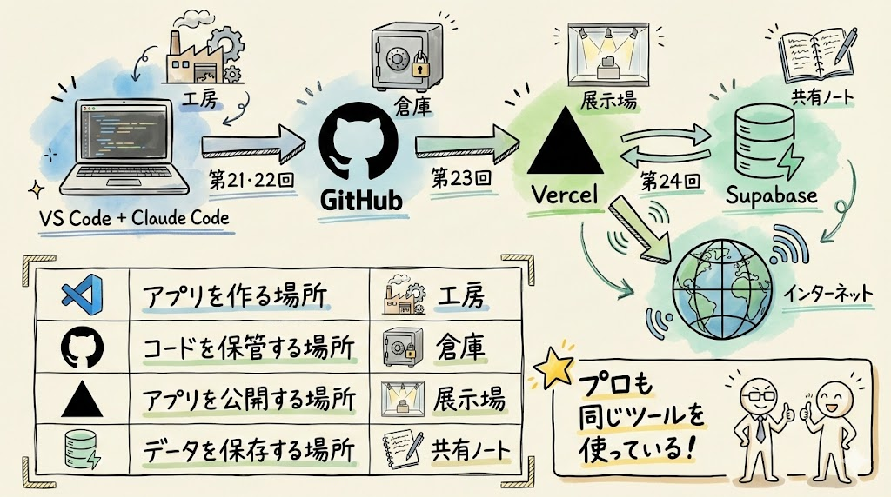
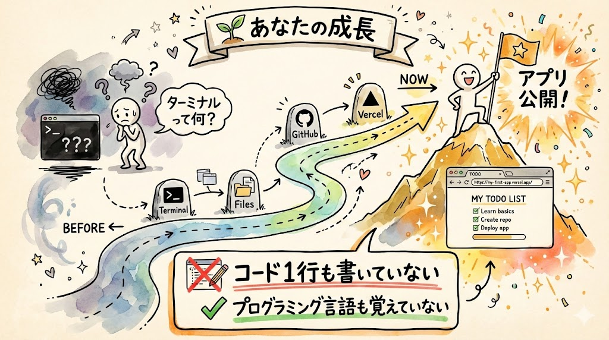
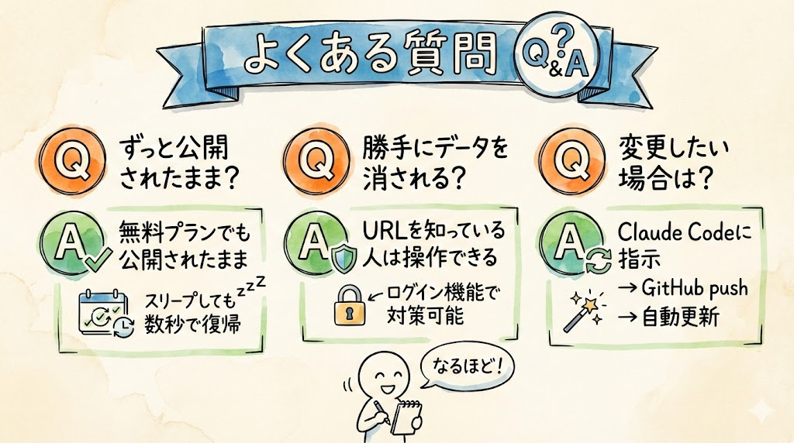
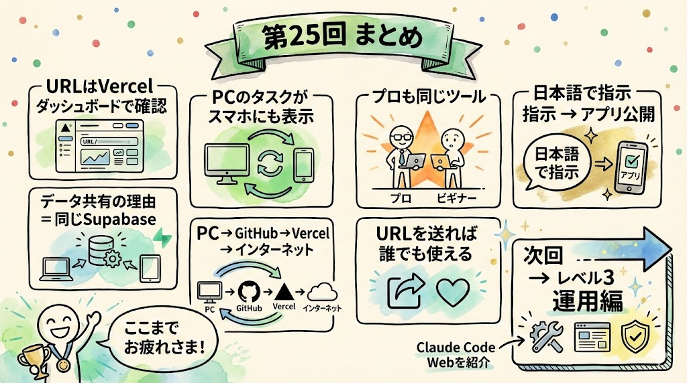

# 第25回｜公開したアプリを確認しよう — 自分のアプリが世界中から使える

## このレッスンのゴール


公開したTODOアプリをPCとスマホの両方で操作し、データが共有されていることを確認すること。ここまでの達成を実感すること。

---

## 前回のおさらい


前回、VercelでTODOアプリをインターネットに公開しました。

今日は、公開されたアプリをじっくり触って確認します。そして、第21回から今日までの全体の流れを振り返ってみましょう。

---

## 公開URLをもう一度確認する



まず、公開URLを確認しましょう。

ブラウザで新しいタブを開いて、アドレスバーに以下を入力してEnterキーを押してください。

```
https://vercel.com/dashboard
```

Vercelのダッシュボードが表示されます。ログインを求められたら、Vercelアカウントでログインしてくださいね。

### 手順

1. ダッシュボードに表示されている **`my-todo-app`** プロジェクトを左クリックしてください
2. プロジェクトの画面が開いたら、画面の上のほうに公開URLが表示されています

```
https://my-todo-app-xxxx.vercel.app
```

このURLが、皆さんのアプリの住所です。このURLを知っている人は、世界中のどこからでもアクセスできます。

### 確認してみましょう

表示されたURLを左クリックして、ブラウザの新しいタブでTODOアプリが正しく表示されればOKです。

### うまくいかないときは

- **「404 Not Found」が表示される場合**: URLが正しいか確認してください。Vercelダッシュボードに表示されているURLをそのまま使いましょう
- **前回のデプロイがエラーで終わっていた場合**: Vercelダッシュボードでプロジェクトを開き、「Deployments」タブで最新のデプロイの状態を確認してください。エラーが出ている場合は、前回の第24回の「うまくいかないときは」セクションを参照してください

---

## PCとスマホの両方で操作してみよう



ここから、ちょっとした実験をします。PCとスマホの両方を使うので、スマホを手元に用意してくださいね。

### ステップ1: PCでタスクを追加する


PCのブラウザで公開URLを開いてください。TODOアプリが表示されたら、テキスト入力欄を左クリックして、タスクを追加してみましょう。

```
PCから追加したタスク
```

入力したら追加ボタンを左クリックしてください。

### 確認してみましょう

タスクが一覧に表示されたらOKです。

### ステップ2: スマホで確認する



スマホのブラウザ（Safari、Chromeなど）を開いて、同じURLを入力してください。

URLが長い場合は、以下の方法が簡単です。

1. PCのブラウザでアドレスバーのURLを左クリックして選択
2. `Ctrl + C`（Macなら `Command + C`）でコピー
3. LINEやメールで自分のスマホにURLを送信
4. スマホでそのメッセージを開いて、URLをタップ

スマホでページが表示されたら、画面を見てください。

**PCで追加したタスクが、スマホにも表示されています。**

すごいですよね。PCで操作したのに、スマホにも反映されている。これはデータが自分のPC内ではなく、インターネット上のSupabaseに保存されているからです。

### 確認してみましょう

スマホの画面に「PCから追加したタスク」と表示されていればOKです。

### ステップ3: スマホからもタスクを追加する



今度はスマホからタスクを追加してみましょう。入力欄をタップして、以下を入力してみてください。

```
スマホから追加したタスク
```

追加ボタンをタップしてください。

次に、PCのブラウザに戻って、ページを再読み込みしてください。再読み込みの方法は以下のいずれかです。

- ブラウザの画面上部にある **丸い矢印アイコン（リロードボタン）** を左クリック
- キーボードの `F5` キーを押す
- `Ctrl + R`（Macなら `Command + R`）を押す

### 確認してみましょう

**スマホで追加したタスクが、PCにも表示されます。** PCの画面に「スマホから追加したタスク」が見えていればOKです。

### うまくいかないときは

- **スマホで画面が表示されない場合**: URLが正しく入力されているか確認してください。特に `https://` の部分を忘れていないかチェックしましょう
- **PCのタスクがスマホに表示されない場合**: スマホのブラウザでページを再読み込みしてみてください。画面を下に引っ張る（プルダウン）操作で再読み込みできるブラウザもあります
- **タスクの追加ができない場合**: Supabaseとの接続に問題がある可能性があります。Vercelの環境変数設定（第24回参照）を確認してください

---

## なぜデータが共有されるのか



PCで追加してもスマホで追加しても、データは同じ場所に保存されています。

```
PC のブラウザ  ──→  Supabase（データベース）  ←──  スマホのブラウザ
```

Supabaseという共通のデータベース（データの保管場所）を使っているので、どの端末からアクセスしても同じデータが見えます。

これは第22回でSupabaseのTable Editorでデータを確認したのと同じ仕組みです。PCもスマホも、同じ「todosテーブル」を見ているのです。

たとえるなら、PCとスマホの両方から同じGoogleスプレッドシートを開いているようなものです。シートは1つしかないので、どちらから書き込んでも、もう一方からも同じ内容が見えますよね。それと同じ仕組みです。

---

## 公開の流れの全体像



ここで、第21回から今日までの流れを整理しましょう。全体像が見えると、自分がやってきたことの意味がよくわかります。

```
自分のPC（VS Code + Claude Code）
    ↓ コードを作成（第21回・第22回）
GitHub（コードの倉庫）
    ↓ コードを取得（第23回）
Vercel（公開サーバー）  ←→  Supabase（データ保管）
    ↓                        （第24回）
インターネット（世界中からアクセス可能）
    ↓
今日、PCとスマホで確認！（第25回）
```

それぞれの役割をおさらいします。

| ツール | 役割 | たとえるなら |
| --- | --- | --- |
| VS Code + Claude Code | アプリを作る場所。日本語で指示するとClaude Codeがコードを書いてくれる | 工房。職人（Claude Code）が常駐していて、注文するだけで製品を作ってくれる |
| GitHub | コードを保管する場所。バックアップにもなる | 貸し金庫。大事なものを預けておける安全な場所 |
| Vercel | アプリを公開する場所。URLを発行して世界中からアクセスできるようにする | ショーケース。作った製品を展示して、お客さんが見に来られる |
| Supabase | データを保存する場所。タスクの追加・完了・削除のデータがここに入る | 共有ノート。PCからでもスマホからでも同じノートに書き込める |

ここ、ちょっと大事なポイントです。

この流れは、**プロのエンジニアもまったく同じものを使っています。**

皆さんが使ったツールも、公開までの手順も、プロの現場とまったく同じです。違うのは、コードを自分で書いたかClaude Codeに書いてもらったかだけです。

---

## URLを誰かに送ってみよう（任意）


もしよければ、公開URLを友人や家族に送ってみてください。

LINEやメールでURLを送るだけです。受け取った人がそのURLをタップ（またはクリック）して開けば、皆さんが作ったTODOアプリを使うことができます。

「自分が作ったアプリを、他の人に使ってもらう」という体験は、想像以上に嬉しいものです。ぜひやってみてくださいね。

ちなみに、相手がタスクを追加したら、皆さんのSupabaseにもデータが保存されます。同じデータベースを共有しているからですね。友人が追加したタスクが自分のブラウザにも表示される様子を見ると、「ちゃんとインターネットで動いてるんだ」とさらに実感できますよ。

---

## ここまでの達成を振り返る



少し立ち止まって、皆さんが何を成し遂げたか振り返ってみましょう。

この講座を始めたとき、多くの方は「ターミナルって何？」「Gitって何？」という状態だったはずです。

それが今、こうなっています。

- 日本語で指示を出しただけで、アプリが作られた
- そのアプリがインターネットに公開されている
- PCからでもスマホからでもアクセスできる
- データベースにデータが保存されている
- 世界中の誰でもURLを開けば使える

**コードは一行も書いていません。プログラミング言語は何も覚えていません。**

それでも、インターネットに公開されたアプリを持っている。これが、今の皆さんです。

本当にすごいことをやり遂げましたね。自分を褒めてあげてください。

---

## よくある質問



ここまで来ると、いくつか疑問が出てくるかもしれません。よくある質問をまとめておきますね。

### Q: このアプリはずっと公開されたままですか？

はい、Vercelの無料プランでも公開されたままになります。URLをブックマークしておけば、いつでもアクセスできます。ただし、長期間アクセスがないとスリープ状態になることがあります。その場合も、URLを開けば数秒で復帰します。

### Q: 他の人に勝手にデータを消されることはありますか？

今の状態では、URLを知っている人は誰でもタスクの追加・完了・削除ができます。将来的にログイン機能を追加すれば、自分だけが操作できるようにもできます。それもClaude Codeに「ログイン機能を追加して」と伝えるだけです。

### Q: アプリのデザインや機能を変えたい場合は？

VS CodeでClaude Codeに「ボタンの色を青に変えて」「タスクに期限を追加できるようにして」のように指示するだけです。修正後、GitHubにpushすれば、Vercelが自動的に更新してくれます。次回以降の「運用編」で詳しくやります。

---

## まとめ



- 公開URLはVercelダッシュボードで確認できる
- PCで追加したタスクがスマホにも表示される（データはSupabaseで共有されている）
- データが共有される理由: PCもスマホも同じSupabase（共有ノート）にデータを保存しているから
- 公開の流れ: 自分のPC → GitHub → Vercel → インターネット
- この流れはプロのエンジニアもまったく同じものを使っている
- 日本語で指示しただけで、インターネットに公開されたアプリを持っている
- URLを友人や家族に送れば、すぐに使ってもらえる

次回からは「レベル3 運用編」に入ります。公開したアプリを安全に修正・改善していく方法を学びましょう。ブラウザだけで使えるClaude Code Webを紹介します。
