# 第26回｜Claude Code Webを使ってみよう — ブラウザ版Claude Code

## このレッスンのゴール

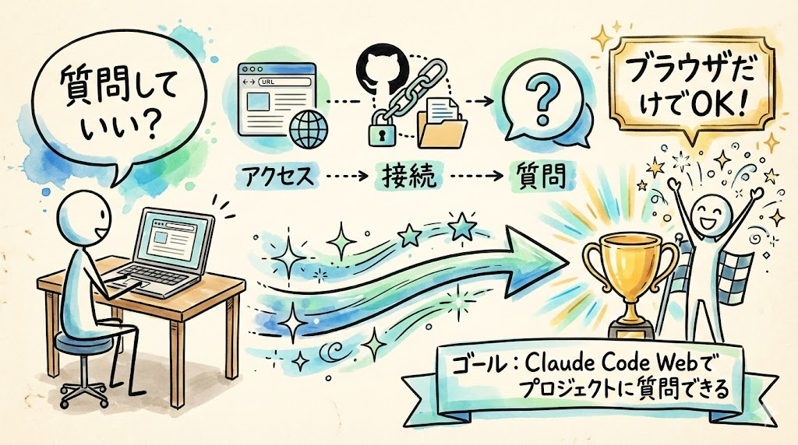

Claude Code Webにアクセスし、GitHubリポジトリを接続して、ブラウザからプロジェクトについて質問できるようになること。ローカル版との違いを理解すること。

---

## レベル3 運用編スタート

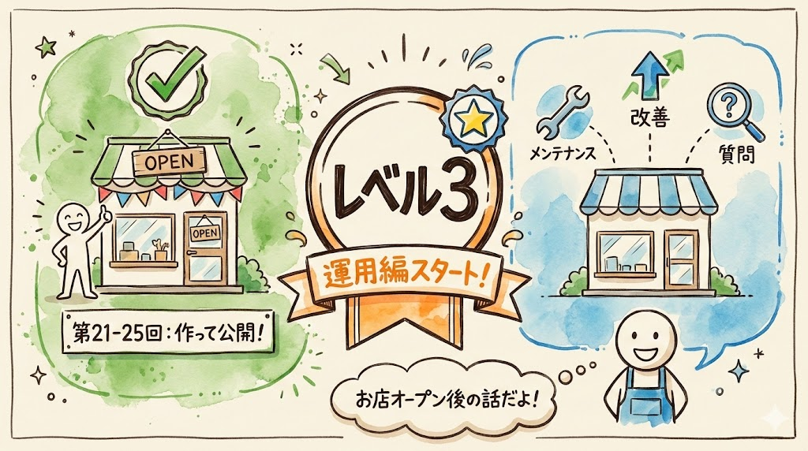

第21回〜第25回で、TODOアプリを作って公開するところまで完了しました。

ここからは **「運用」** のフェーズです。運用というのは、公開したアプリを日々メンテナンス（手入れ・管理）していくことです。修正したいところを直したり、新しい機能を追加したり、安全に改善していく方法を学びます。

たとえるなら、お店をオープンした後の話ですね。開店したら終わりではなく、メニューを改善したり、看板を直したり、お客さんの声を反映したりしますよね。アプリも同じです。

今日は、そのための新しいツール **Claude Code Web** を紹介します。

---

## Claude Code Webって何？

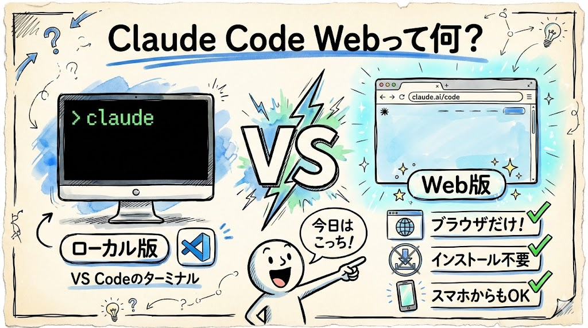

これまで使ってきたClaude Codeは、VS Codeのターミナルで動く **ローカル版** でした。ローカル（local）は「自分のPCの中」という意味でしたね。

今日紹介するのは、ブラウザで使える **Web版** です。

ひとことで言うと、**「PCにインストールしなくても、ブラウザだけで使えるClaude Code」** です。

ブラウザというのは、皆さんがインターネットを見るときに使うアプリのことです。Safari、Google Chrome、Microsoft Edgeなどですね。ブラウザさえあれば使えるので、極端な話、スマホからでも使えます。これがWeb版の大きな特徴です。

---

## ローカル版とWeb版の違い

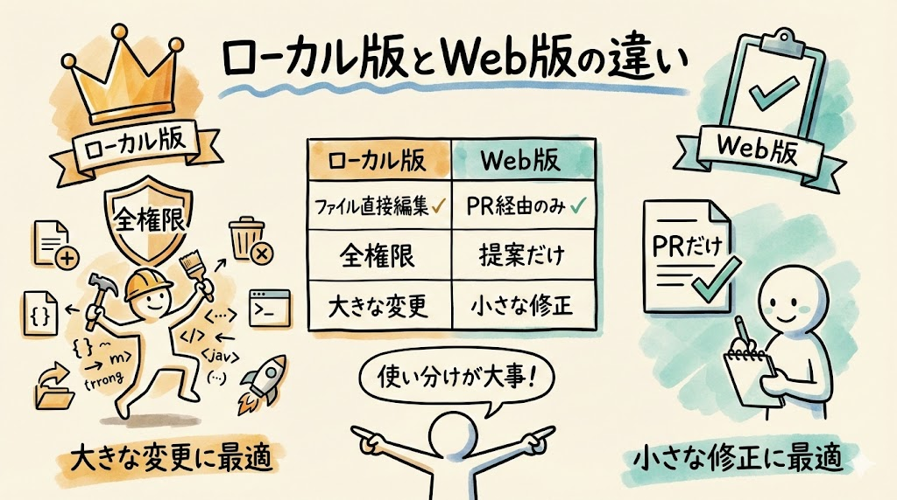

| | ローカル版（VS Code） | Web版（ブラウザ） |
| --- | --- | --- |
| 動く場所 | 自分のPC | ブラウザ（どこからでも） |
| できること | 何でもできる（全権限） | PR（プルリクエスト）を出すことだけ |
| 役割 | アプリを作る・大きな変更 | 小さな修正を安全にお願いする |
| 必要なもの | VS Code + ターミナル | ブラウザだけ |

ここで新しい用語が出てきましたね。**PR（プルリクエスト）**。正式名称はPull Request（プル・リクエスト）です。直訳すると「引っ張って取り込んでくださいという依頼」。要するに「こう変更したいんですが、取り込んでもらえますか？」という提案書のようなものです。

たとえるなら、学校の先生に提出する **「修正の申請書」** です。いきなり教科書を書き換えるのではなく、「ここをこう直したいです」と申請を出して、先生が「OK」と言ったら反映される。そんなイメージです。

PRについては次回じっくりやるので、今は「提案書のようなもの」と覚えておいてください。

### 「家の鍵」と「インターホン」

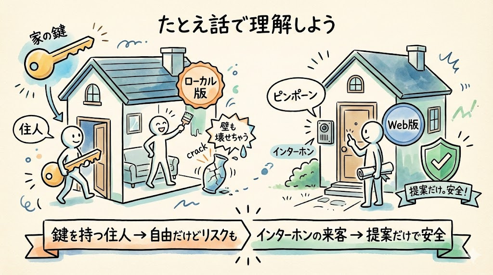

この違いをわかりやすくたとえると：

- **ローカル版** = 家の鍵を全部持っている住人。部屋の模様替えでも、家具の配置換えでも、何でも自由にできる。ただし、うっかり壁を壊しちゃうリスクもある
- **Web版** = インターホンで話しかける来客。「ここをこう変えたいんですが」と提案はできるけど、勝手に家の中に入って変えることはできない。だから安全

Web版は直接コードを変更しません。必ず **「提案」** という形で変更を出します。この提案のことを **PR（プルリクエスト）** と呼ぶわけです。

---

## なぜ2種類あるのか

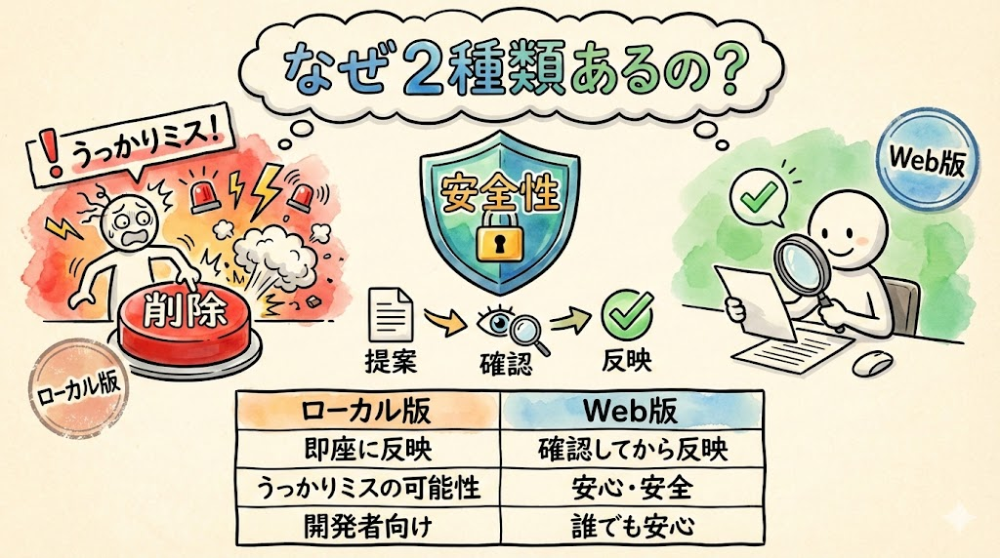

「全部できるローカル版だけでいいのでは？」と思うかもしれません。これ、よく聞かれるんですが、ちゃんとした理由があります。

理由は **安全性** です。

ローカル版は何でもできる反面、うっかり大事なファイルを壊してしまうリスクもあります。たとえば、タイトルの文字を変えたかっただけなのに、関係ないファイルまで変わってしまった...なんてことが起こりえます。

Web版はPR（提案）しか出せないので、「確認してから反映する」という安全な流れが自然にできます。間違えても、提案を却下すれば何も変わりません。やり直しがきくわけです。

使い分けの目安はこうです。

| やりたいこと | 使うべき版 | 理由 |
| --- | --- | --- |
| アプリを最初から作る | ローカル版 | たくさんのファイルを一気に作る必要がある |
| 大きな機能を追加する | ローカル版 | 複雑な作業はPC上でやるのが向いている |
| タイトルや色を変える | Web版 | 小さな修正はPR経由が安全 |
| 文言を修正する | Web版 | ちょっとした変更をすぐに指示できる |
| スマホから修正指示を出す | Web版 | PCが手元になくても対応できる |

大きな変更はローカル版、日常的な小さい修正はWeb版。この使い分けを覚えておいてください。

---

## Claude Code Webにアクセスする

### 1. claude.ai/code を開く

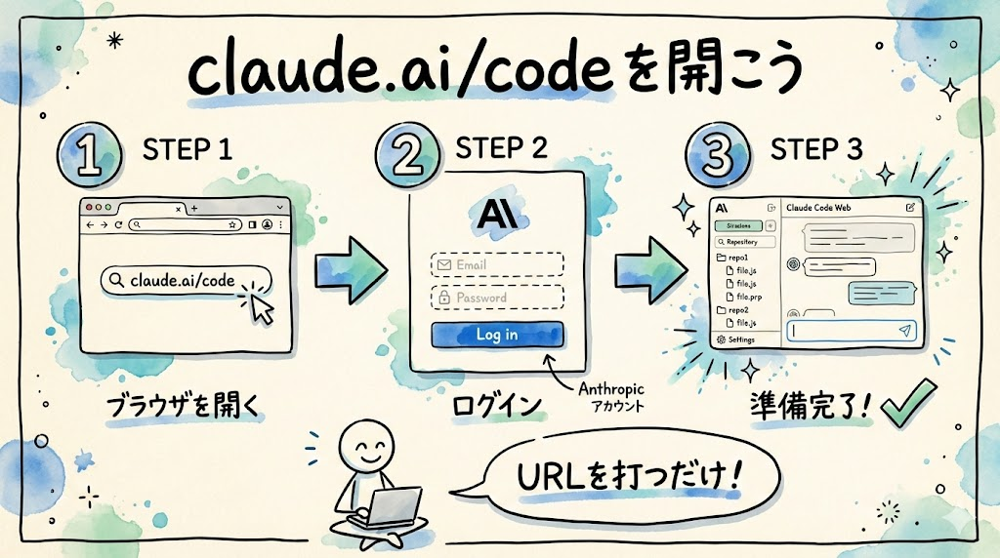

ブラウザで新しいタブを開いてください。

- **Mac** の場合: Safari や Chrome を開いて、`Cmd` + `T` で新しいタブを開きます
- **Windows** の場合: Chrome や Edge を開いて、`Ctrl` + `T` で新しいタブを開きます

画面上部のアドレスバー（URLを入力する場所）を左クリックして、以下のURLを入力してください。

```
https://claude.ai/code
```

`Enter` キーを押すと、ログイン画面が表示されます。Anthropic（アンソロピック）アカウントでログインしてください。第3回〜第5回の環境準備で作ったアカウントですね。メールアドレスとパスワード、またはGoogleアカウントでログインできます。

### 確認してみましょう

ログインすると、Claude Code Webのトップ画面が表示されます。チャット入力欄（メッセージを打ち込むテキストボックス）のようなインターフェースが見えるはずです。この画面が見えていれば、ログイン成功です。

もしログイン画面が何度も表示される場合は、ブラウザのCookie（クッキー）が無効になっている可能性があります。Cookieとは、ログイン状態などを記録するブラウザの仕組みです。ブラウザの設定でCookieが有効になっているか確認してみてください。

### 2. GitHubリポジトリを接続する

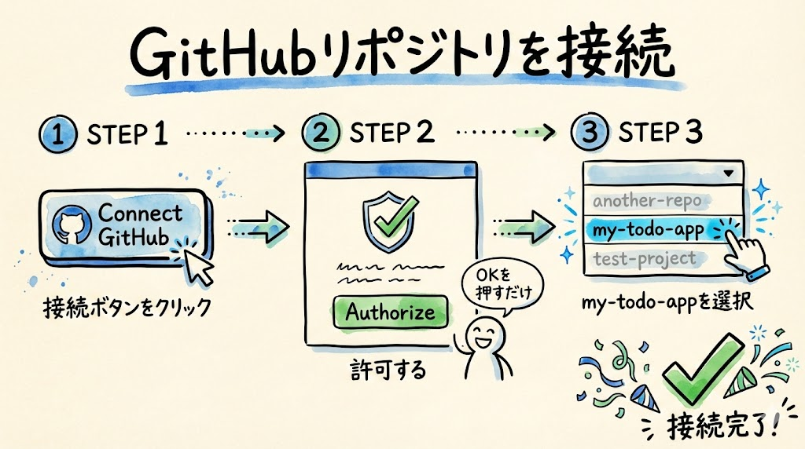

初回は、GitHubとの連携を求められます。画面に「Connect GitHub」や「GitHubを接続」のようなボタンが表示されるはずです。

そのボタンを左クリックしてください。すると、GitHubのログイン画面がブラウザの新しいタブ（または同じ画面）で開きます。

手順はこうです。

1. GitHubのログイン画面が表示されたら、**GitHubのユーザー名（またはメールアドレス）とパスワード** を入力してログインします
2. 「Authorize（オーソライズ＝許可する）」というボタンが表示されるので、これを左クリックします。これは「Claude Code WebがGitHubのリポジトリを見ることを許可しますか？」という確認です
3. 画面が自動的にClaude Code Webに戻ります

### 確認してみましょう

接続が完了すると、リポジトリの一覧が表示されます。この中に、GitHubにアップロードした `my-todo-app` リポジトリが表示されているはずです。これを左クリックして選択してください。

`my-todo-app` が選択された状態になれば、接続完了です。

### トラブルシュート

- **リポジトリが表示されない場合**: GitHubの権限設定で `my-todo-app` へのアクセスが許可されていない可能性があります。画面に「Configure repositories（リポジトリを設定）」のようなリンクがあれば、それを左クリックして `my-todo-app` にチェックを入れてください
- **「Authorize」ボタンが出ない場合**: すでに過去にGitHub連携を許可している可能性があります。そのまま進めて問題ありません
- **GitHubのパスワードを忘れた場合**: GitHubのログイン画面で「Forgot password?」を左クリックして、パスワードをリセットしてください

---

## 試しに質問してみよう

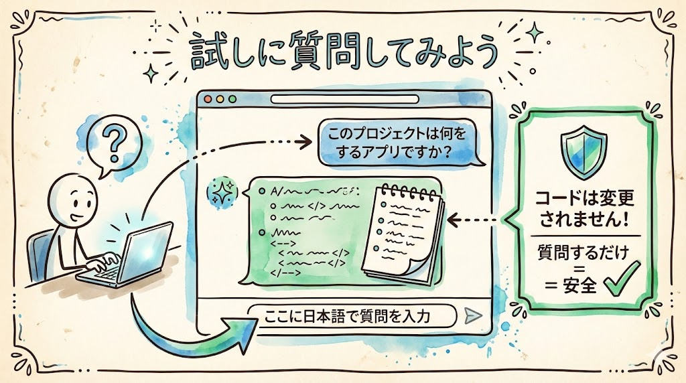

接続ができたら、まずは簡単な質問をしてみましょう。何も壊れる心配はないので、気軽にやってみてくださいね。質問するだけではコードは一切変更されません。安心して試せます。

Claude Code Webのチャット欄（画面下部のテキスト入力エリア）を左クリックして、こう入力してみてください。

```
このプロジェクトは何をするアプリですか？
```

`Enter` キーを押して送信します。

しばらくすると（数秒〜十数秒ほど）、Claude Code Webが回答を表示してくれます。「これはTODOアプリで、タスクの追加・完了・削除ができます」といった内容の回答が返ってくるはずです。

### 確認してみましょう

回答が表示されましたか？ 表示されていれば、Claude Code Webの準備は完了です。Claude Code Webはプロジェクトのコードを自動で読んで、その内容をもとに回答してくれています。

もし回答が表示されない場合や、エラーメッセージが出た場合は、ページを再読み込み（`Cmd` + `R`（Mac）または `Ctrl` + `R`（Windows））してから、もう一度試してみてください。

### 他にも聞いてみよう


こんな質問もできます。試してみてくださいね。

```
このアプリで使っている技術は何ですか？
```

```
ファイル構成を教えてください
```

```
データベースにはどんなテーブルがありますか？
```

Claude Code Webは、プロジェクトのコードを理解した上で答えてくれます。まるでプロジェクトに詳しい先輩エンジニアに質問しているような感覚です。

「技術的なことは何もわからない」という方でも、日本語で聞けば日本語で答えてくれるので、安心して使えますよ。

### トラブルシュート

- **回答が英語で返ってくる場合**: チャット欄に「日本語で回答してください」と追加で伝えれば、次から日本語で答えてくれます
- **「リポジトリにアクセスできません」と表示される場合**: GitHubとの接続が切れている可能性があります。ページを再読み込みして、再度リポジトリを選択してみてください
- **回答が途中で止まる場合**: しばらく待ってみてください。処理に時間がかかっているだけかもしれません。1分以上待っても進まなければ、ページを再読み込みして、もう一度質問を送ってみてください

---

## 今日やったことの整理

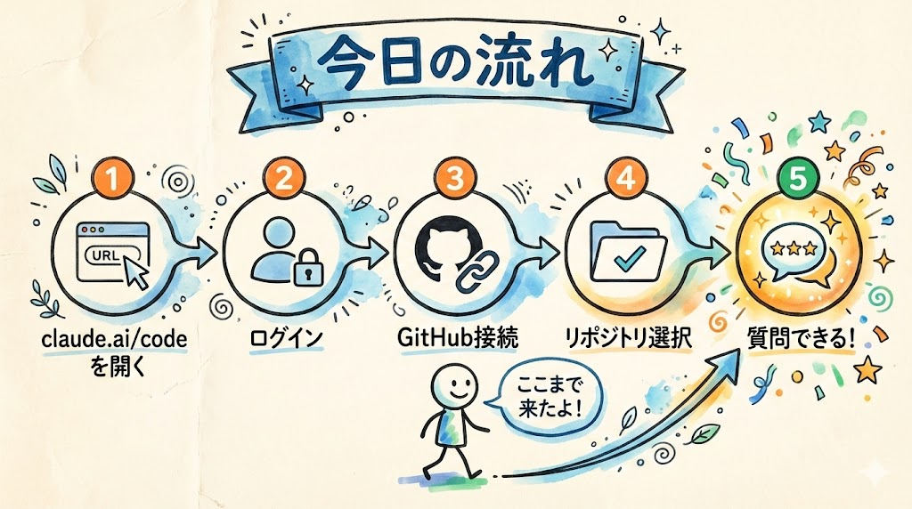

```
ブラウザで claude.ai/code にアクセス
    ↓
Anthropicアカウントでログイン
    ↓
GitHubアカウントを接続（「Authorize」を左クリック）
    ↓
my-todo-app リポジトリを選択
    ↓
プロジェクトについて質問できるようになった
```

今日はClaude Code Webの準備と、質問してみるところまでやりました。次回はいよいよ、このClaude Code Webを使って実際にアプリを修正してみます。

---

## まとめ

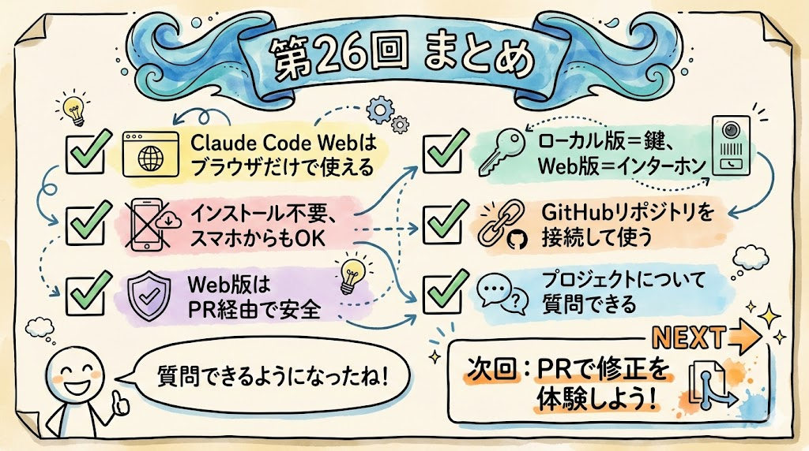

- **Claude Code Web** = ブラウザで使えるClaude Code。PCにインストール不要、ブラウザだけで使える
- ローカル版は「家の鍵を持つ住人」（何でもできる）、Web版は「インターホンの来客」（提案だけ）
- Web版はPR（プルリクエスト＝変更の提案書）しか出せないので、安全に修正できる
- 大きな変更はローカル版、日常の小さな修正はWeb版で使い分ける
- `claude.ai/code` にアクセスし、GitHubリポジトリを接続した
- プロジェクトについて質問すると、コードを読んで日本語で答えてくれる

次回は、Claude Code Webから実際に修正指示を出して、PR（プルリクエスト）を体験します。「提案 → 確認 → 反映」という安全な修正サイクルを学びましょう。
