# 第27回｜PRで修正を体験しよう — 安全に本番を更新する

## このレッスンのゴール

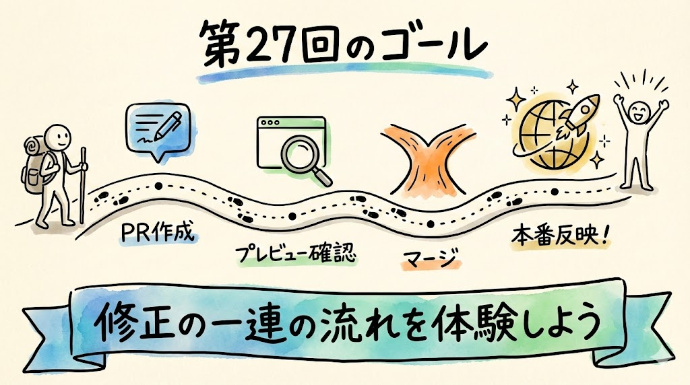

Claude Code WebからPR（プルリクエスト）を作成し、プレビューで確認してからマージして本番に反映するまでの一連の流れを体験すること。

---

## PR（プルリクエスト）とは何か

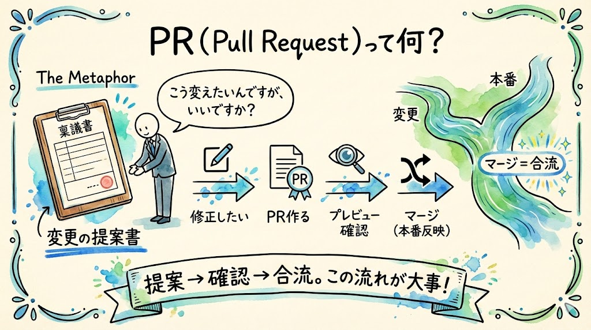

前回、Web版は「提案しかできない」とお話ししました。この提案のことを **PR（プルリクエスト）** と呼びます。

正式名称はPull Request（プル・リクエスト）。直訳すると「引っ張って取り込んでくださいという依頼」。要するに「こう変更したいんですが、取り込んでもらえますか？」という提案書のようなものです。

たとえるなら **「変更の提案書」** ですね。会社で何かを変えるときに、いきなり変えるのではなく「稟議書（りんぎしょ）」を出して上司に確認してもらいますよね。PRはそれに似ています。「こう変えたいんですが、よろしいですか？」と提案して、確認が取れたら実行する。この流れです。

いきなり本番のアプリを書き換えるのではなく、「こう変えたいんですが、いいですか？」と提案する。確認してOKなら反映する。この流れが安全な修正の基本です。

```
修正したい
    ↓
PR を作る（提案書を出す）
    ↓
プレビューで確認する（下書きをチェック）
    ↓
マージする（本番に反映する）
```

ここで「マージ」という言葉が出てきました。マージ（merge）は「合流させる・統合する」という意味です。川が合流するイメージですね。PRの変更内容を本番のコードに取り込む操作のことを「マージする」と言います。本流（本番）に支流（修正内容）を合流させる、というイメージです。

---

## Claude Code Webで修正指示を出す

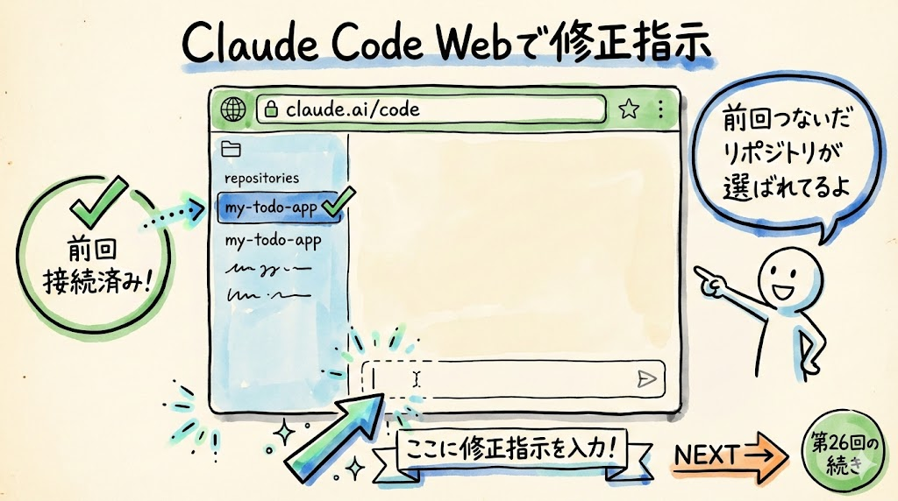

それでは、実際にやってみましょう。

### 1. Claude Code Webを開く

前回接続した `my-todo-app` リポジトリが開いている状態で進めます。

ブラウザを開いてください。

- **Mac** の場合: `Cmd` + `Space` で Spotlight を開き、「Safari」や「Chrome」と入力して起動します
- **Windows** の場合: タスクバーの Chrome や Edge のアイコンを左クリックして起動します

アドレスバーに以下のURLを入力して `Enter` を押してください。

```
https://claude.ai/code
```

前回の接続が残っていれば、`my-todo-app` リポジトリがすでに選択された状態になっているはずです。もし選択されていなければ、リポジトリ一覧から `my-todo-app` を左クリックして選択してください。

### 確認してみましょう

画面にチャット入力欄（テキストボックス）が表示されていて、リポジトリ名として `my-todo-app` が表示されていれば、準備OKです。

### 2. 修正指示を入力する

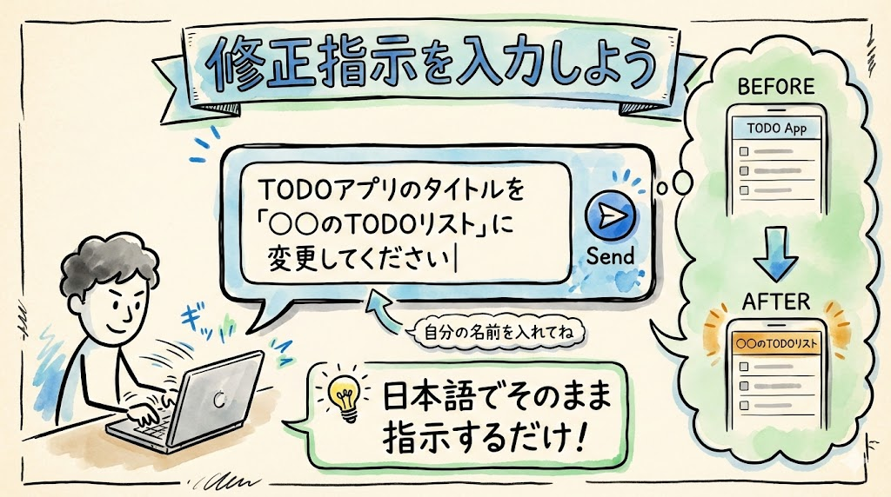

チャット欄を左クリックして、こう入力してみてください。

```
TODOアプリのタイトルを「○○のTODOリスト」に変更してください
```

（「○○」には自分の名前を入れてみてください。たとえば「田中のTODOリスト」のような感じです）

入力したら `Enter` キーを押して送信します。

### 3. PRが自動作成される

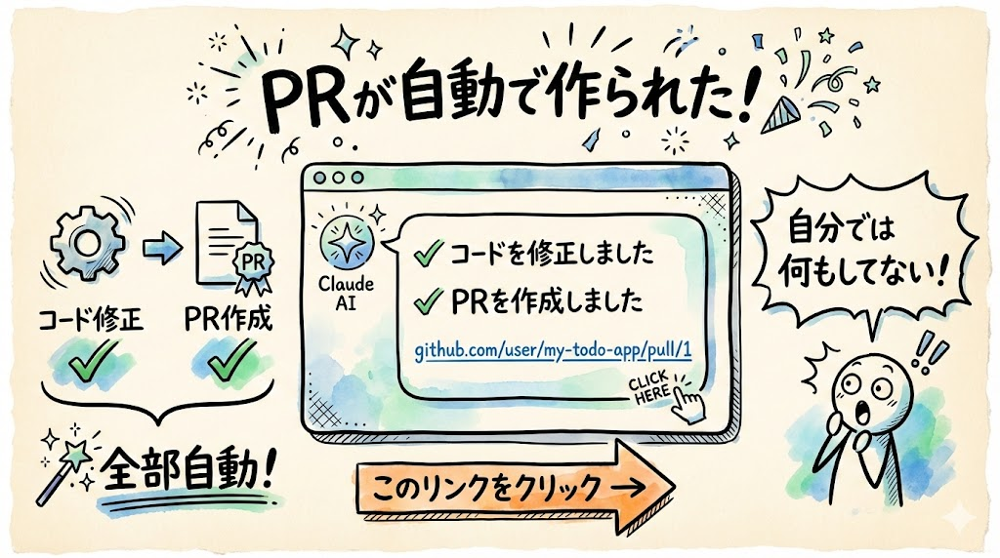

Claude Code Webがコードを読んで、タイトル部分を見つけて修正し、自動的にPRを作成してくれます。皆さんはコードに触れる必要は一切ありません。日本語で「こうしてほしい」と伝えるだけです。

作業には数十秒〜1分ほどかかることがあるので、焦らず待ちましょう。画面にClaude Code Webの処理状況が表示されることがあります。文字が流れていれば、処理中です。

### 確認してみましょう

作業が完了すると、チャットの中に **GitHubのPRリンク**（`https://github.com/...` で始まるURL）が表示されます。このリンクが見えれば、PRが正常に作成されています。このリンクを左クリックして、GitHubでPRを確認してみましょう。

### トラブルシュート

- **PRが作成されずにエラーが表示された場合**: もう一度同じ指示を送ってみてください。一時的な問題で失敗することがまれにあります
- **処理が1分以上かかっている場合**: そのまま待ちましょう。複雑な処理が行われている可能性があります。5分以上かかる場合は、ページを再読み込みして最初からやり直してみてください
- **「リポジトリが見つかりません」と表示された場合**: リポジトリの選択が外れている可能性があります。ページ上部でリポジトリを再選択してください

---

## GitHubでPRを確認する


PRリンクを左クリックすると、ブラウザの新しいタブ（または同じタブ）でGitHubのPR画面が表示されます。

ここで見てほしいのが、**変更内容の表示**（diff表示）です。diff（ディフ）は difference（違い）の略で、変更前と変更後の差分を見せてくれる表示のことです。たとえるなら、Word文書の「変更履歴」機能のようなものですね。「ここが消されて、ここが新しく書かれました」と色で教えてくれます。

画面の中ほどに「Files changed」というタブがあります。それを左クリックしてみてください。

### 赤と緑の意味

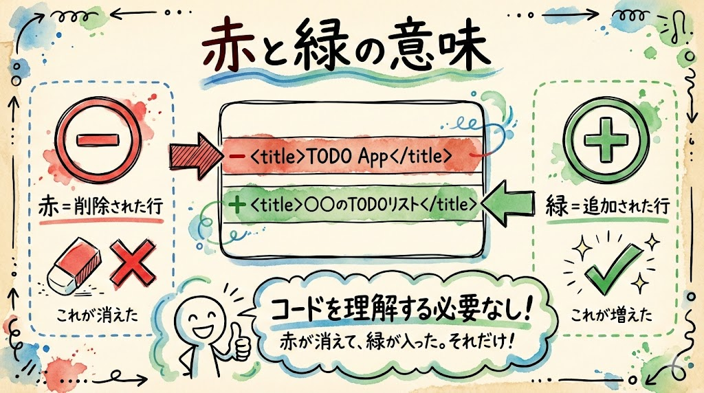

変更箇所が色分けで表示されています。

- **赤い行（先頭に - マーク）** = 削除される部分。変更前のコード
- **緑の行（先頭に + マーク）** = 追加される部分。変更後のコード

たとえば、タイトルを変更した場合、こんな表示になります。

```diff
- <h1>TODO App</h1>
+ <h1>○○のTODOリスト</h1>
```

赤い行が消えて、緑の行に置き換わる、ということですね。「TODO App」という文字が「○○のTODOリスト」に変わりますよ、と教えてくれています。

コードの中身を理解する必要はまったくありません。「赤が消えて、緑になるんだな」「タイトルの文字が変わるんだな」とだけ確認できればOKです。

### 確認してみましょう

「Files changed」タブで、赤と緑の色分け表示が見えましたか？ 自分の名前が緑の行に入っていれば、正しく修正されています。

---

## プレビューで確認する

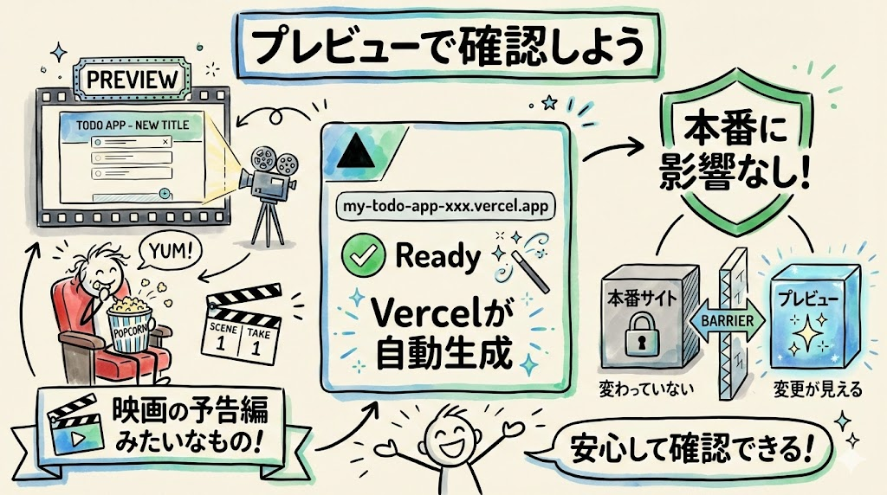

PRを作ると、Vercelが自動的に **プレビューURL** を生成してくれます。プレビューというのは「事前確認」のことですね。映画の予告編（プレビュー）のように、「本番公開する前に、どんな感じになるか見せてもらえる」仕組みです。本番に反映する前に、変更後の見た目を確認できます。

### プレビューURLを見つける


GitHubのPR画面に戻りましょう（まだ「Files changed」タブにいる場合は、画面上部の「Conversation」タブを左クリックしてください）。

画面を下にスクロールしてください。コメント欄の中に、Vercelからの自動コメントが表示されています。「Vercel」のロゴや「Preview」という文字が見えるはずです。

そのコメントの中にプレビューURLがあります。`https://my-todo-app-xxxx-yyyy.vercel.app` のようなURLです。これを左クリックしてください。

### 確認してみましょう

プレビューURLを開くと、TODOアプリが表示されます。タイトルが「○○のTODOリスト」に変更されているはずです。変更が確認できれば、プレビュー確認は成功です。

次に、本番URL（`https://my-todo-app-xxxx.vercel.app`）も別のタブで開いてみてください。こちらは **まだ変更されていないはず** です。タイトルは元のままです。

### 本番とプレビューの違い

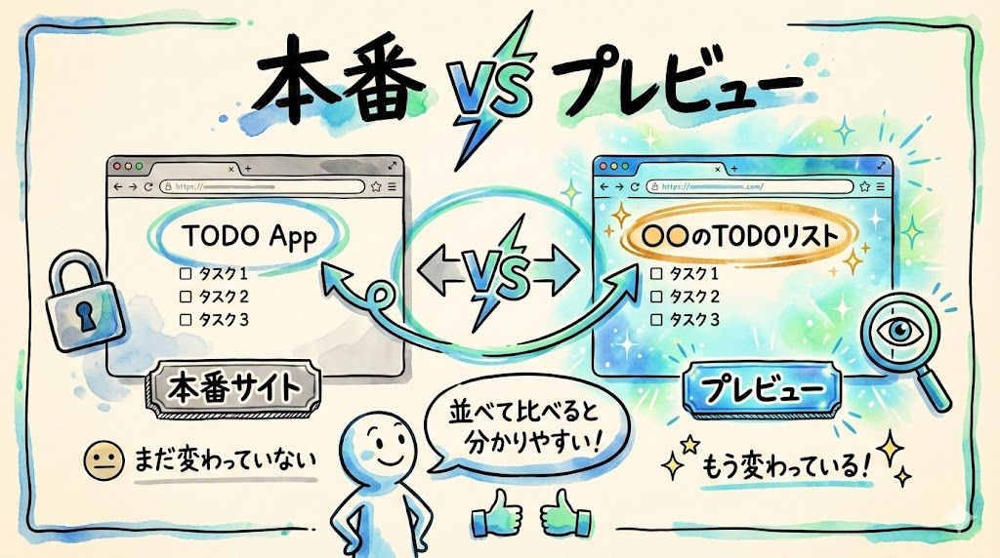

| | 本番URL | プレビューURL |
| --- | --- | --- |
| 内容 | 現在公開されているアプリ | PRの変更を適用したアプリ |
| 影響 | 全ユーザーが見る | 自分だけが見る確認用 |
| タイトル | 元のまま（変わっていない） | 「○○のTODOリスト」に変更済み |

これがPRの良いところです。「確認してから反映する」ので、いきなり本番が壊れる心配がありません。プレビューを見て「あ、これ違うな」と思ったら、PRを閉じれば（後述）何も変わりません。やり直しがきくわけです。

### トラブルシュート

- **プレビューURLが見つからない場合**: VercelがPRを検知してプレビューを作成するまでに少し時間がかかることがあります。1〜2分待ってから、ブラウザのリロードボタン（画面上部の丸い矢印アイコン、またはMacなら `Cmd` + `R`、Windowsなら `Ctrl` + `R`）を左クリックして、ページを再読み込みしてみてください
- **プレビューURLを開いたが「404 Not Found」と表示される場合**: Vercelのビルド（アプリの構築）がまだ完了していない可能性があります。2〜3分待ってからもう一度アクセスしてみてください
- **プレビューで変更が反映されていない場合**: ブラウザのキャッシュ（一時保存データ）が影響している可能性があります。`Ctrl` + `Shift` + `R`（Macなら `Cmd` + `Shift` + `R`）で強制リロードしてみてください

---

## マージする — 本番に反映する

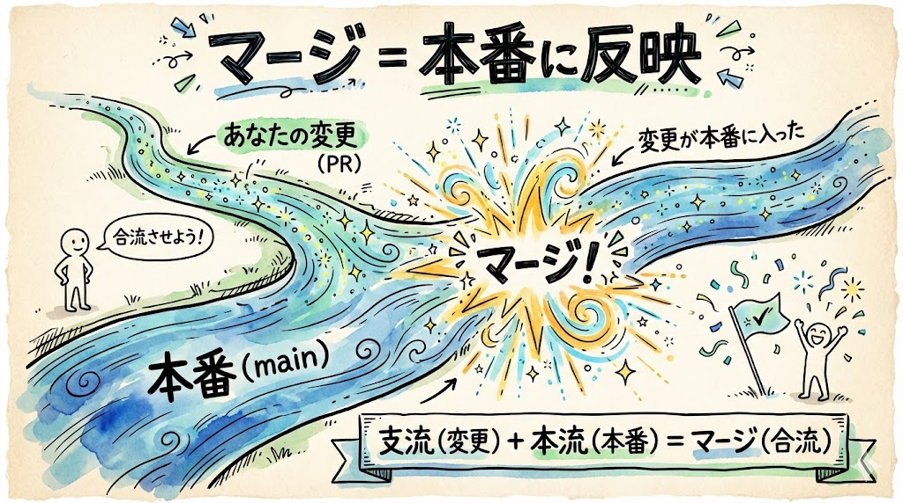

プレビューで確認して問題なければ、本番に反映しましょう。この操作を「マージする」と言います。先ほど説明したとおり、支流を本流に合流させる操作です。

### 1. GitHubのPR画面に戻る

ブラウザの戻るボタンを左クリックするか、GitHubのPRページのタブを左クリックして戻ってください。

### 2. 「Merge pull request」をクリック

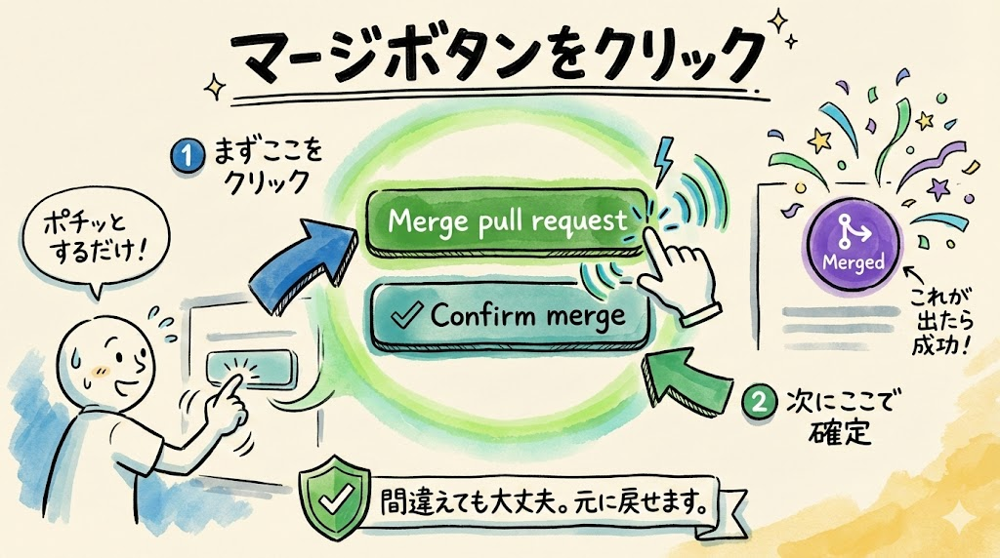

PR画面のページの一番下のほうまでスクロールしてください。

緑色の **「Merge pull request」** ボタンが見えます。これを左クリックしてください。

### 3. 「Confirm merge」をクリック

ボタンが変わって、**「Confirm merge」** という確認ボタンが表示されます。「本当にマージしていいですか？」という最終確認ですね。これを左クリックします。

### 確認してみましょう

画面に紫色の帯で「Pull request successfully merged and closed」のようなメッセージが表示されたら、マージ完了です。「Merged」という表示がPR画面に出ていれば成功しています。

これで、PRの変更が本番に反映されます。

### 4. 本番URLで確認する

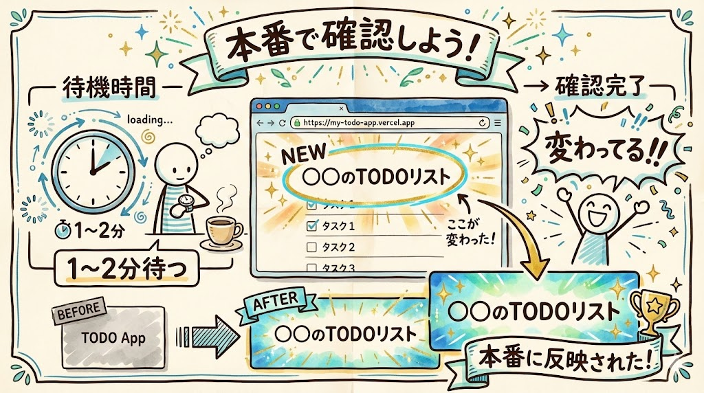

ここで大事なことをお伝えします。**マージ後すぐには反映されません。** Vercelがコードの変更を検知して、新しいバージョンをビルド（構築）して公開するまでに、**1〜2分ほどかかります。** たとえるなら、お店の看板を付け替える工事に少し時間がかかるようなものです。

1〜2分待ってから、本番URL（`https://my-todo-app-xxxx.vercel.app`）を開いてみてください。すでに開いている場合は、ブラウザのリロードボタンを左クリックしてください。

**タイトルが「○○のTODOリスト」に変わっています。**

### トラブルシュート

- **すぐに反映されない場合**: 慌てないでください。1〜2分待ってからリロードしてみましょう
- **3分以上経っても変わらない場合**: ブラウザのキャッシュ（一時保存データ）が影響している可能性があります。`Ctrl` + `Shift` + `R`（Macなら `Cmd` + `Shift` + `R`）で強制リロードを試してみてください
- **「Merge pull request」ボタンがグレーで押せない場合**: Vercelのビルドチェックが完了するのを待つ必要があるかもしれません。数分待ってからページを再読み込みしてみてください

---

## もしPRの内容が間違っていたら

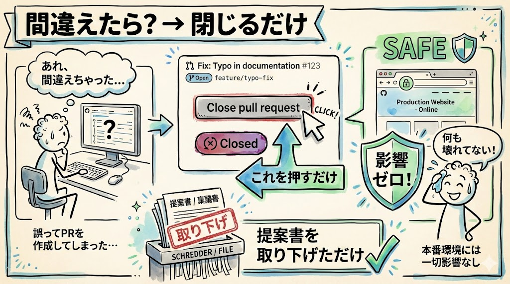

プレビューを見て「あ、これ違う」と思った場合は、マージせずにPRを閉じることができます。

GitHubのPR画面で、「Merge pull request」ボタンの近くに **「Close pull request」** というテキストリンクがあります。これを左クリックすれば、PRが閉じられます。

PRを閉じても、本番には何も影響しません。まさに「提案書を取り下げた」だけです。安心してやり直せます。Claude Code Webでもう一度正しい指示を出して、新しいPRを作ればOKです。

---

## 修正サイクルのまとめ

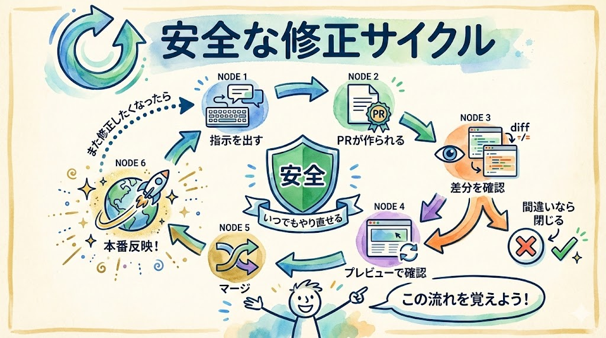

今日体験した流れを整理します。

```
Claude Code Webで修正指示を入力
    ↓
PRが自動作成される（提案書が出る）
    ↓
GitHubで変更内容を確認（赤 = 削除、緑 = 追加）
    ↓
プレビューURLで見た目を確認（本番はまだ変わらない）
    ↓
マージ（本番に反映）
    ↓
1〜2分後に本番URLで確認
```

これが **安全な修正サイクル** です。

「いきなり本番を変える」のではなく、「提案 → 確認 → 反映」という手順を踏む。これだけで、うっかりミスでアプリが壊れるリスクを大きく減らせます。

この流れは何度でも繰り返せます。色を変えたい、文言を直したい、レイアウトを調整したい。そのたびに同じ手順でやればOKです。間違えても大丈夫、PRを閉じればやり直せます。

---

## まとめ

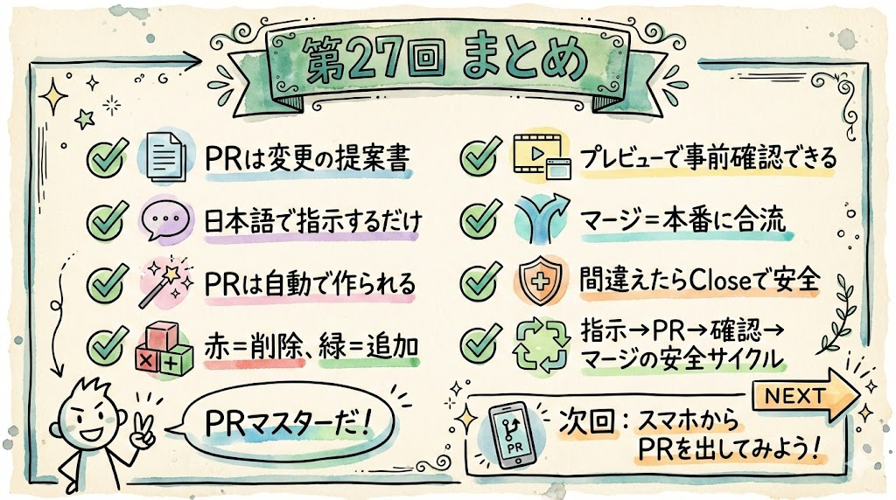

- PR（プルリクエスト）は「変更の提案書」。いきなり本番を変えないので安全
- マージ（merge）は「本番に取り込む」操作。川の合流のイメージ
- diff（ディフ）表示: 赤い行 = 削除、緑の行 = 追加。Word文書の「変更履歴」のようなもの
- Claude Code Webで修正指示 → PRが自動作成される
- Vercelが自動でプレビューURLを生成してくれる。本番に影響なく事前確認ができる
- プレビューで確認してからマージすれば、安全に本番を更新できる
- 間違えてもPRを閉じればやり直せる
- 修正サイクル: 依頼 → PR → プレビュー → マージ → 本番反映

次回は、この流れを **スマホだけ** でやってみます。PCがなくても、スマホひとつでアプリの修正ができることを体験しましょう。
