# 第28回｜スマホからPRを出してみよう — どこからでも修正できる

## このレッスンのゴール

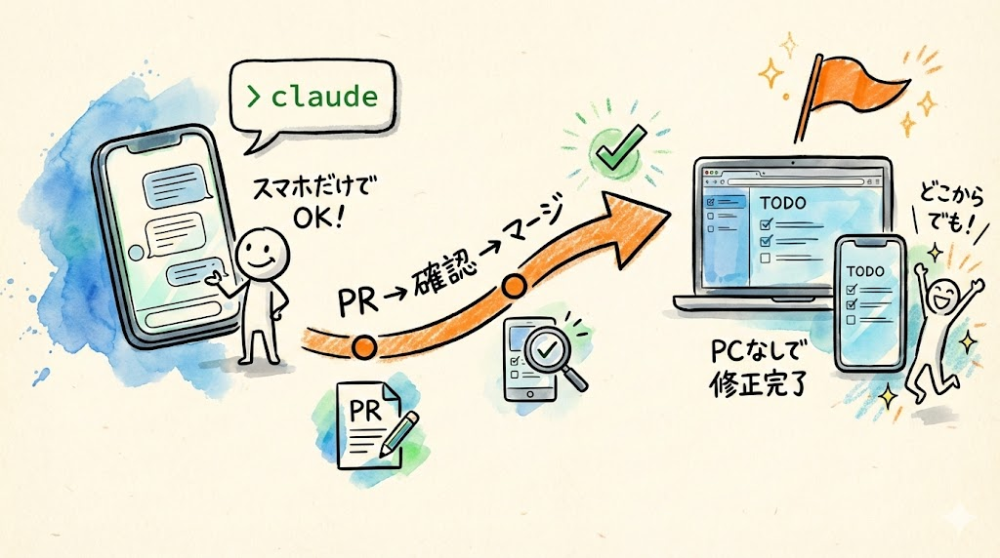

スマホのブラウザからClaude Code Webを使い、PRを作成してマージするまでの流れを体験すること。「PCがなくてもアプリを修正できる」ことを実感すること。

---

## 前回のおさらい


前回、Claude Code Webから修正指示を出して、PR → プレビュー → マージという安全な修正サイクルを体験しました。

今日やることは、前回とまったく同じ流れです。ただし、**PCではなくスマホから** やります。

「えっ、スマホだけでアプリの修正ができるの？」

はい、できます。Claude Code Webはブラウザで動くので、スマホのブラウザからでも使えます。実際にやってみましょう。

---

## スマホでClaude Code Webを開く

### 1. スマホのブラウザで claude.ai にアクセス

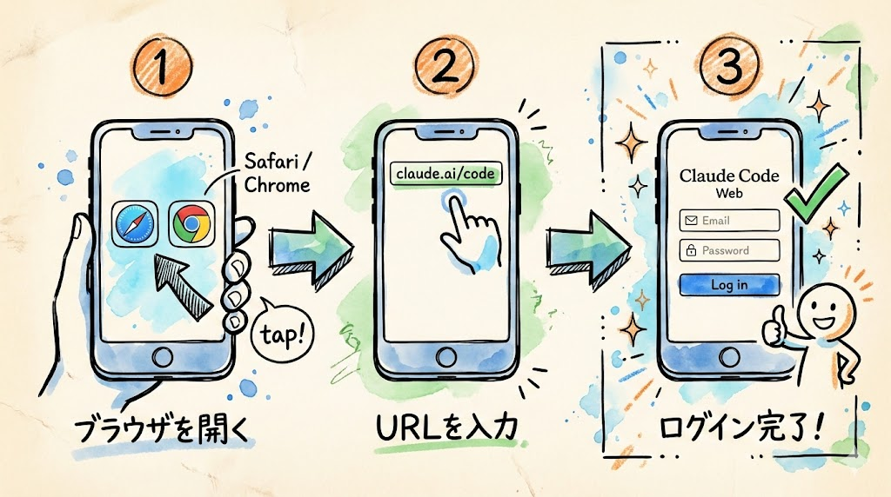

スマホを手に取ってください。ここからはPCを閉じて、スマホだけで操作します。

スマホのブラウザを開きます。ブラウザとは、インターネットを見るためのアプリのことです。

- **iPhone** の場合: ホーム画面にある **Safari**（コンパスのようなアイコン）をタップします。または **Chrome**（丸い色とりどりのアイコン）をお使いの方はそちらでもOKです
- **Android** の場合: ホーム画面にある **Chrome**（丸い色とりどりのアイコン）をタップします。または **Edge** などのブラウザでもOKです

ブラウザが開いたら、画面上部のアドレスバー（URLが表示されている部分）をタップしてください。アドレスバーが見当たらない場合は、画面を軽く下にスワイプ（指で上から下に滑らせる操作）すると表示されることがあります。

アドレスバーに以下のURLを入力してください。

```
https://claude.ai/code
```

入力したら、キーボードの「Go」や「開く」ボタン、または「Enter」キーをタップしてください。

### 確認してみましょう

ログイン画面が表示されましたか？ 表示されたら、Anthropic（アンソロピック）アカウントでログインしてください。メールアドレスとパスワードを入力する画面が表示されるはずです。GoogleアカウントでログインしていればGoogleアカウントのボタンをタップしてもOKです。

ログインが完了すると、Claude Code Webの画面が表示されます。PCで見たときと同じ画面ですが、スマホの画面サイズに合わせて表示されます。

### トラブルシュート

- **画面が小さすぎて見づらい場合**: スマホを横向き（ランドスケープモード）にすると、画面が広くなって操作しやすくなります。スマホの画面回転ロックがオンになっていないか確認してくださいね
- **ログイン画面が表示されずに真っ白な画面になる場合**: ページを再読み込みしてみてください。Safariの場合はアドレスバーの右端のリロードアイコンをタップ、Chromeの場合は画面を下に引っ張って離す操作で再読み込みできます
- **「この接続は安全ではありません」と表示される場合**: URLが `https://` で始まっているか確認してください。`http://`（sがない）だと表示されることがあります

### 2. リポジトリを選択する

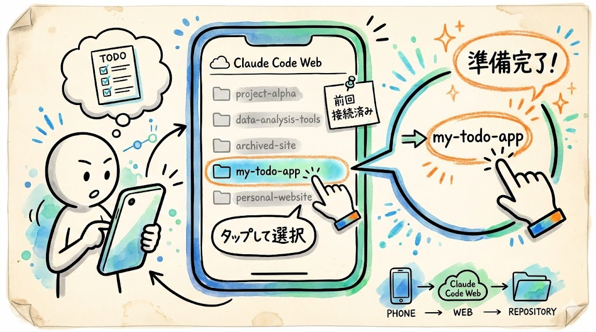

ログインすると、Claude Code Webの画面が表示されます。

`my-todo-app` リポジトリを選択してください。前回PCで接続済みなので、すでにリポジトリが表示されているはずです。リポジトリ名をタップして選択しましょう。

### 確認してみましょう

リポジトリ名 `my-todo-app` が画面に表示されていて、チャット入力欄が見えていれば、準備完了です。

もしリポジトリが表示されない場合は、再度GitHubとの接続が必要かもしれません。画面の指示に従って接続してくださいね。スマホでもPCと同じようにGitHubアカウントの認証（ログインと「Authorize」の左クリック）ができます。

---

## スマホから修正指示を出す

### 1. 修正内容を入力する

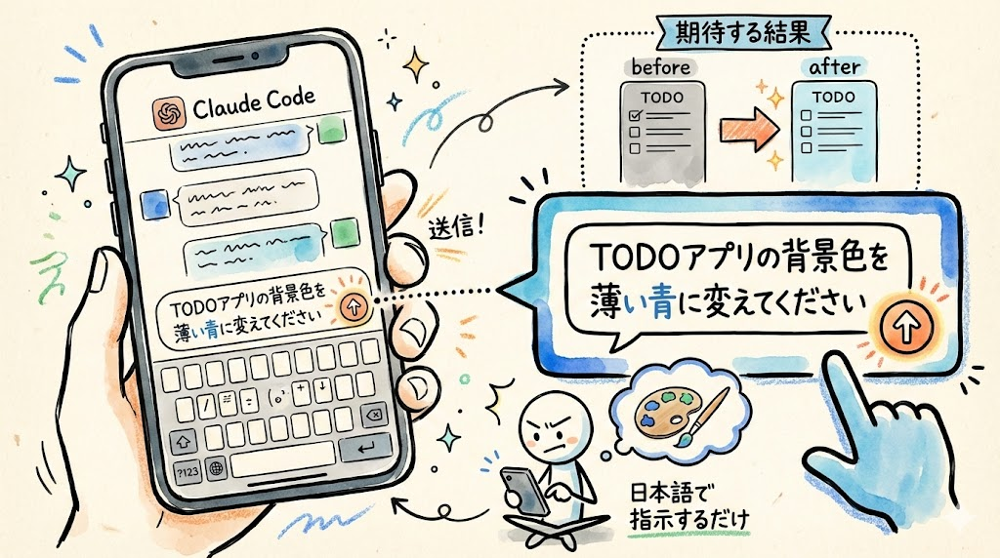

画面の下のほうにチャット入力欄があります。そこをタップすると、スマホのキーボードが表示されます。

以下の内容を入力してみてください。

```
TODOアプリの背景色を薄い青に変えてください
```

スマホのキーボードで入力するだけです。特別な操作は何もいりません。PCのときとまったく同じように、日本語で指示を出すだけです。

入力したら、送信ボタン（矢印のアイコンなど）をタップしてください。

### 確認してみましょう

送信ボタンをタップすると、チャット欄に自分のメッセージが表示され、Claude Code Webが処理を開始します。画面に文字が流れ始めたら、処理中です。

### 2. PRが作成されるのを待つ

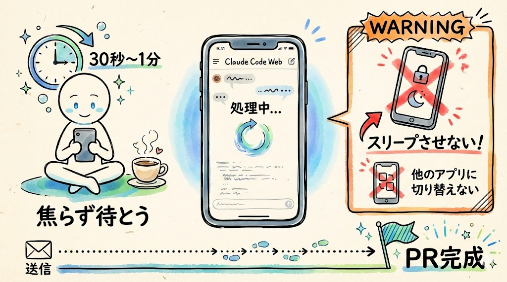

Claude Code Webがコードを修正し、自動でPRを作成してくれます。PCのときとまったく同じ流れです。

数十秒〜1分ほどかかることがあるので、焦らず待ちましょう。スマホの画面は小さいですが、処理の内容はPCと同じです。処理中にスマホをスリープさせたり、他のアプリに切り替えたりしないでくださいね。処理が中断されることがあります。

### 確認してみましょう

チャット内にGitHubのPRリンク（`https://github.com/...` で始まるURL）が表示されたら、PR作成完了です。このリンクが見えればOKです。

### トラブルシュート

- **処理中にスマホがスリープしてしまった場合**: スマホを起動してブラウザに戻れば、処理が続いていることがあります。もし止まってしまった場合は、もう一度同じ指示を送ってみてください
- **キーボードが邪魔で画面が見えない場合**: キーボードを閉じるには、画面のキーボード以外の部分をタップするか、キーボードの「完了」ボタンをタップしてください

---

## スマホでプレビューを確認する

### 1. PRリンクを開く


チャットに表示されたPRリンクをタップして、GitHubのPR画面を開きます。

スマホの画面だとPCよりも情報が詰まって見えますが、内容は同じです。画面を上下にスワイプ（指で上下に滑らせる操作）して内容を確認してみてください。

### 確認してみましょう

GitHubのPR画面が表示されましたか？ PRのタイトルや説明文が表示されていればOKです。前回PCで見た画面と同じ構成になっています。

### 2. プレビューURLを確認する

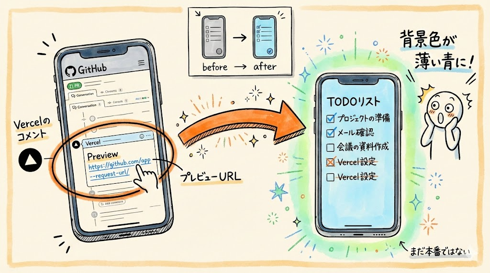

PR画面を下にスワイプしていくと、Vercelからのコメントが付いています。「Vercel」のロゴや「Preview」という文字を探してください。

プレビューURLをタップして開いてみましょう。

### 確認してみましょう

**スマホの画面で、背景色が薄い青に変わったTODOアプリが表示されます。**

まだ本番には反映されていません。プレビューで確認している状態です。前回学んだ「提案 → 確認 → 反映」の、今は「確認」のステップですね。

背景色が薄い青に変わっていれば、修正は正しく行われています。

### トラブルシュート

- **プレビューURLが表示されるまでに少し時間がかかることがあります**: 1〜2分待ってもVercelのコメントが見つからない場合は、ブラウザのリロード（画面を下に引っ張って離す操作、またはブラウザのリロードボタン）を試してみてくださいね
- **プレビューURLをタップしても「404」と表示される場合**: Vercelのビルドがまだ完了していません。2〜3分待ってからもう一度タップしてみてください
- **スマホの画面で文字が小さくて見づらい場合**: 画面をピンチアウト（2本の指で広げる操作）すると拡大できます

---

## スマホからマージする

プレビューで問題なければ、本番に反映しましょう。

### 1. GitHubのPR画面に戻る

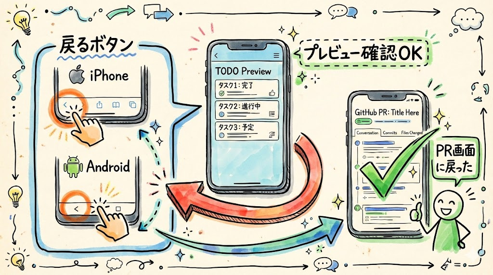

ブラウザの「戻る」ボタンをタップして、GitHubのPR画面に戻ります。

- **iPhone（Safari）** の場合: 画面左下の「<」マークをタップします
- **Android（Chrome）** の場合: 画面左下の「<」マークまたは端末の戻るボタンをタップします

### 2. 「Merge pull request」をタップ

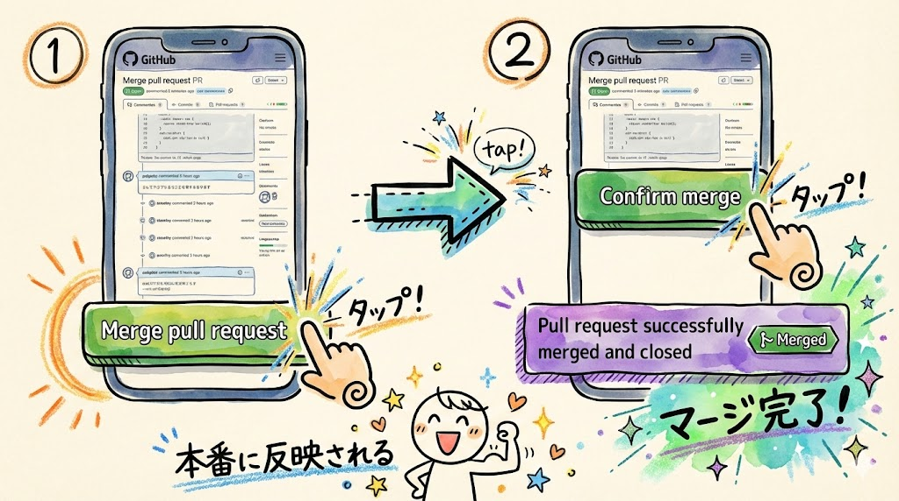

画面を下にスワイプしていくと、緑色の **「Merge pull request」** ボタンが見えます。これをタップしてください。

続いて **「Confirm merge」** ボタンが表示されるので、これもタップします。

スマホの画面だとボタンが少し小さいですが、問題なくタップできます。もしボタンが押しにくい場合は、画面をピンチアウト（2本の指で広げる操作）で拡大してからタップすると操作しやすくなりますよ。

### 確認してみましょう

紫色の帯で「Pull request successfully merged and closed」のようなメッセージが表示されたら、マージ完了です。「Merged」の表示が見えていればOKです。

### 3. 本番URLで確認する

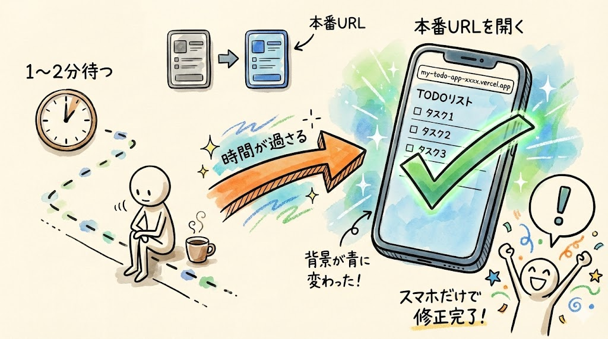

前回と同じく、**マージ後すぐには反映されません。** 1〜2分ほど待ちましょう。

1〜2分待ってから、本番URL（`https://my-todo-app-xxxx.vercel.app`）をスマホのブラウザで開いてください。新しいタブでアドレスバーに直接入力するか、前にブックマークしていればそこからアクセスしてくださいね。

新しいタブの開き方:
- **iPhone（Safari）** の場合: 画面右下の四角が重なったアイコンをタップ → 左下の「+」をタップ
- **Android（Chrome）** の場合: 画面右上の「...」(メニュー) → 「新しいタブ」をタップ

### 確認してみましょう

背景色が薄い青に変わっていますね。**スマホだけで、アプリの修正が完了しました。**

もしまだ変わっていない場合は、もう少し待ってからページを再読み込み（画面を下に引っ張って離す操作）してみてください。すぐに反映されなくても慌てなくて大丈夫です。3分以上待っても変わらない場合は、ブラウザのキャッシュをクリアしてみてください。

### トラブルシュート

- **本番URLを忘れてしまった場合**: GitHubの `my-todo-app` リポジトリのページを開き、「Settings」→「Pages」を確認するか、Vercelのダッシュボード（`https://vercel.com/dashboard`）からプロジェクトを開けばURLが確認できます
- **スマホで操作中にログアウトしてしまった場合**: もう一度ログインすれば、PRの処理は完了しています。GitHubのPR画面に直接アクセスして、マージの手順から再開してください

---

## これが意味すること

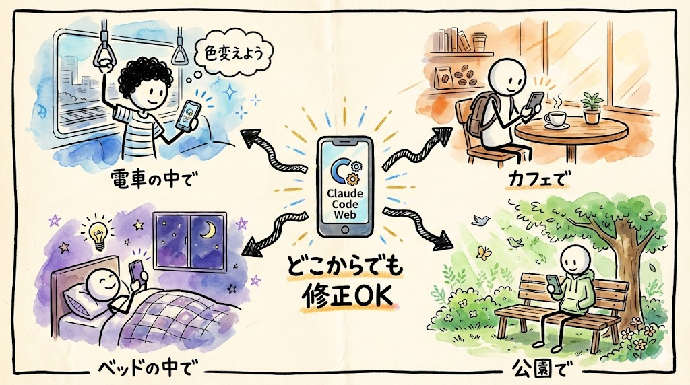

今日やったことを整理します。

```
スマホでclaude.ai/codeを開く
    ↓
リポジトリを選択
    ↓
修正指示を日本語で入力
    ↓
PRが自動作成（提案書が出る）
    ↓
プレビューで見た目を確認
    ↓
マージして本番反映
    ↓
1〜2分後に本番URLで確認
```

この流れが全部スマホで完結しました。

つまり：

- **通勤中の電車の中** でも、「あ、ここの色変えたいな」と思ったら修正できる
- **カフェでコーヒーを飲みながら** でも、「この文言ちょっと直そう」ができる
- **PCが手元になくても**、スマホひとつでアプリを改善できる
- **寝る前にベッドの中で** ふと思いついた修正も、すぐに指示できる

これはとても便利ですよね。「修正したいけどPCを開くのが面倒...」ということがなくなります。

---

## ローカル版とWeb版の使い分け（まとめ）

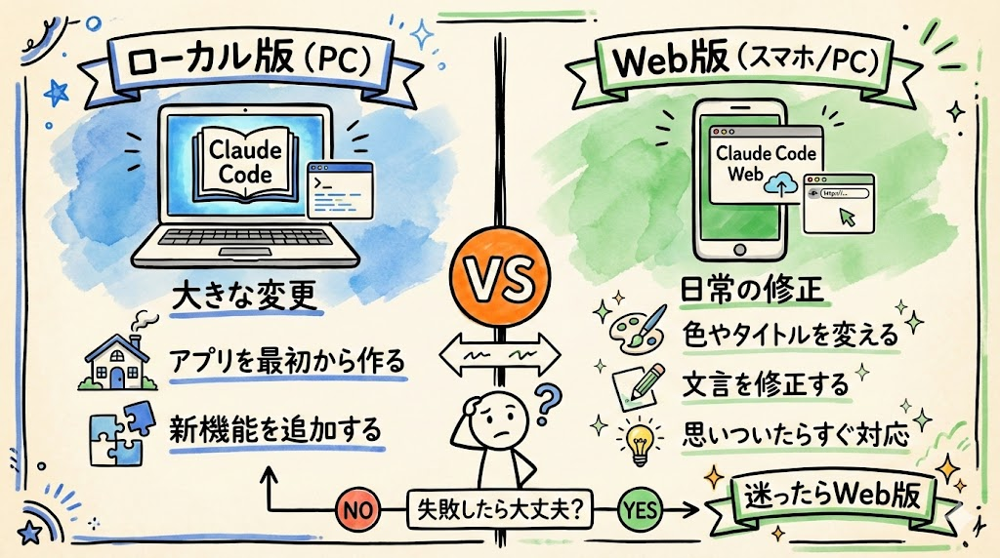

ここで、ローカル版とWeb版の使い分けを改めて整理しておきましょう。

| シーン | 使う版 | 理由 |
| --- | --- | --- |
| アプリを最初から作る | ローカル版（PC） | 大きな変更は全権限が必要。たくさんのファイルを一気に作る |
| 新機能を追加する | ローカル版（PC） | 複雑な作業はPCの大きな画面でやるのが向いている |
| タイトルや色を変える | Web版（スマホ/PC） | 小さな修正はPR経由が安全。確認してから反映できる |
| 文言を修正する | Web版（スマホ/PC） | どこからでもすぐ対応できる |
| 「ここ直したい」と思いついた | Web版（スマホ） | 思いついたときにすぐ指示できる。忘れる前に対応 |

大きな変更はローカル版、日常的な修正はWeb版。

この使い分けが自然にできるようになると、とても効率よくアプリを運用できます。そして、この使い分けを意識するだけで、安全にアプリを運用し続けることができます。

迷ったときは、こう考えてください。「この変更、もし失敗しても大丈夫かな？」。大丈夫ならWeb版でサクッと。ちょっと心配ならローカル版で慎重に。

---

## まとめ


- Claude Code Webはスマホのブラウザからでも使える。PCと同じように日本語で指示を出すだけ
- スマホから修正指示 → PR作成 → プレビュー確認 → マージの流れが全部スマホだけで完結する
- マージ後は1〜2分待ってから本番URLを確認。すぐ反映されなくても慌てない
- PCがなくても、日常的な修正はスマホだけで十分対応できる
- 大きな変更はローカル版（PC）、小さな修正はWeb版（スマホ/PC）という使い分けが大事

次回はいよいよ最終回です。全29回の講座を振り返りながら、これからの次のステップについてお話しします。
