# 第29回｜振り返りとまとめ — 皆さんはもうアプリを公開できる人です

## このレッスンのゴール


全29回の学びを振り返り、「自分にもできる」という実感と、次に進むための道筋を持ち帰ること。

---

## 全29回、おつかれさまでした

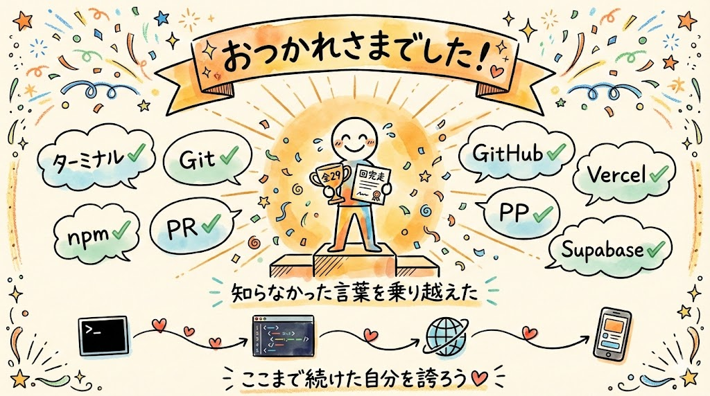

まず、ここまで続けてくださったことに、心から感謝します。

第1回から今日まで、皆さんはたくさんの新しいことに触れてきました。ターミナル、Git、GitHub、Vercel、Supabase...。聞いたこともなかった言葉ばかりだったと思います。

正直、途中で「難しい」「ついていけるかな」と思った瞬間もあったかもしれません。

それでも、ひとつずつ積み重ねて、今日ここにいます。その事実が、何よりも大きな成果です。

全体の流れを、一緒に振り返ってみましょう。

---

## 全29回の振り返り

### 第1回〜第2回: Claude Codeを知った


- Claude Codeは「ChatGPTの手足がある版」。会話するだけでなく、実際にファイルを作ったり、コマンドを実行したりしてくれるAIです
- 会話するだけでなく、実際にファイルを作ったり整理したりしてくれる。つまり「考えるだけ」じゃなくて「手を動かしてくれる」のが特徴です
- レベル1（日常業務のお手伝い）、レベル2（繰り返し作業の自動化）、レベル3（アプリ開発・公開）の3段階があることを学びました

### 第3回〜第5回: 環境を整えた

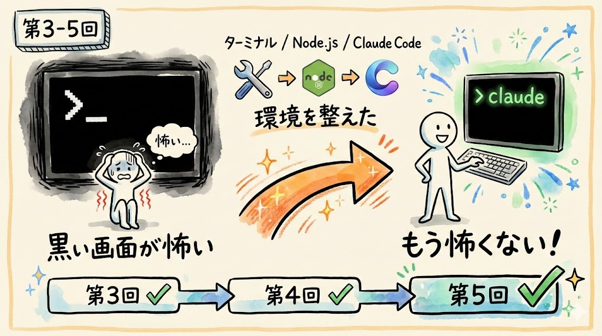

- ターミナル（黒い画面）の使い方を覚えました。最初は怖かったあの画面も、今では普通に使えるようになりましたね
- Node.js（プログラミングの道具を動かすための土台）とClaude Codeをインストールしました
- 「黒い画面」が怖くなくなった。これ、実はとても大きな一歩です

### 第6回〜第12回: 日常業務で使えるようになった


- ファイル検索、文書修正、CSV集計、フォルダ整理など、日常的な作業をClaude Codeに任せる体験をしました
- 「1回の指示で1つの作業」をたくさん体験して、日本語で指示を出すコツを掴みました
- Claude Codeが日常業務のパートナーになれることを実感しました

### 第13回〜第15回: 自動化を体験した

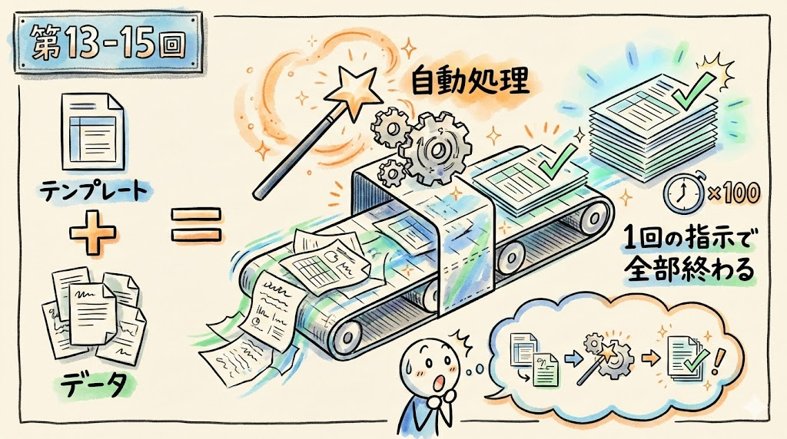

- 議事録の自動整形、大量ファイルの一括変換など、繰り返し作業をClaude Codeに任せました
- 「テンプレート + データ = 自動処理」というパターンを学びました。これは「こういう形式に直して」とお手本を渡すだけで、大量のファイルを一括処理できるということです
- 「毎回手作業でやっていたことが、一度の指示で全部終わる」という感覚を掴みました

### 第16回〜第20回: アプリ開発の準備をした

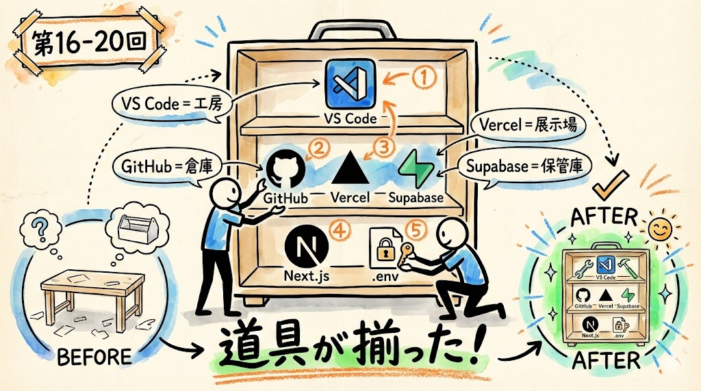

- VS Code（プログラマーが使うエディタ）をインストールしました。エディタとは、コードを見たり編集したりするための専用のアプリです。Wordが文書を書くためのアプリであるように、VS Codeはコードを書くためのアプリですね
- GitHub（コードの倉庫）、Vercel（アプリの公開場所）、Supabase（データの保管庫）のアカウントを作りました
- Next.js（Webアプリを作るための枠組み）プロジェクトを作成し、Supabaseとの接続を設定しました。Next.jsは、家を建てるときの「設計図のテンプレート」のようなものです。ゼロから全部考えなくても、基本的な構造が用意されている枠組みです
- ひとつずつ丁寧に進めたので、この時点では「まだ何も動いていない」と感じた方もいたかもしれません。でも、全部大事な準備でした

### 第21回〜第25回: アプリを作って公開した

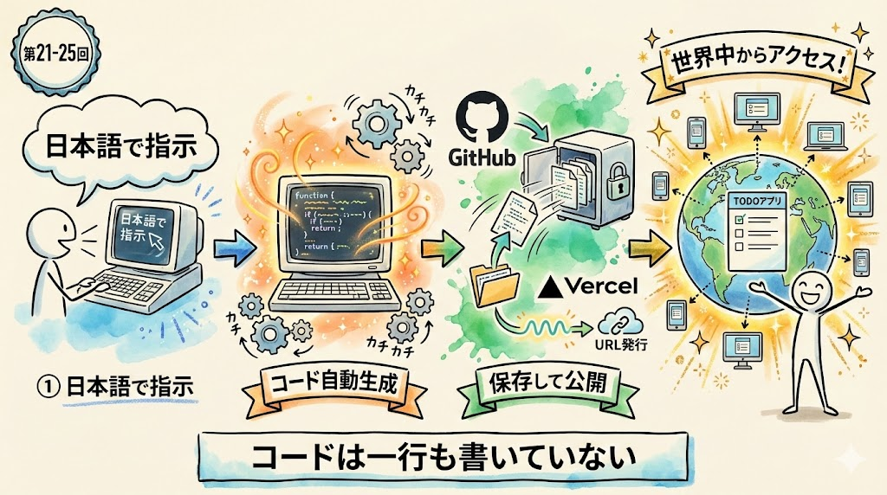

- Claude Codeに日本語で「TODOアプリを作って」と指示し、コードが自動生成されるのを体験しました。自分はコードを一行も書いていません
- `npm run dev`（開発モードで起動）で自分のPC上でアプリを動かし、タスクの追加・完了・削除ができることを確認しました
- `git push`（ギット・プッシュ）でGitHubにコードを保存しました。これもClaude Codeに「pushして」と言うだけでした
- Vercelで環境変数（アプリの設定情報）を設定して「Deploy」（デプロイ＝公開する）ボタンを押し、インターネットに公開しました
- PCでもスマホでも同じURLで使える、本格的なアプリになりました

### 第26回〜第28回: 安全に修正する方法を学んだ

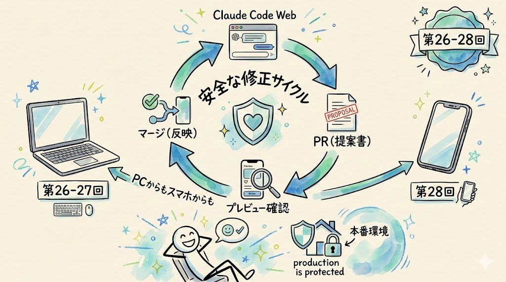

- Claude Code Web（ブラウザ版Claude Code）を使って、安全に修正指示を出す方法を学びました
- PR（プルリクエスト＝変更の提案書） → プレビュー（事前確認） → マージ（本番に反映）という安全な修正サイクルを体験しました
- スマホだけでもアプリの修正ができることを実感しました。通勤中でもカフェでも、どこからでも修正できます

---

## 各ツールの役割おさらい

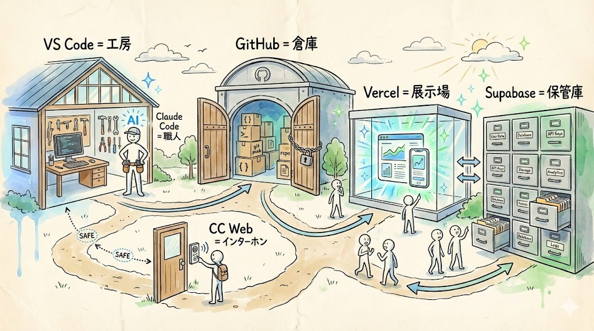

この講座で使ったツールを、もう一度整理します。全部で6つです。

| ツール | 役割 | たとえるなら |
| --- | --- | --- |
| **VS Code** | コードを見たり編集したりする作業場。Claude Codeもここで動かす | オフィス（作業机がある場所） |
| **Claude Code（ローカル版）** | 日本語の指示に従って、コードを書いたりファイルを整理したりしてくれるAI | 何でもできる職人。「これ作って」と言えば作ってくれる |
| **Claude Code Web** | ブラウザから安全に修正指示を出せる。PRという提案書を自動で作ってくれる | インターホン越しの来客。提案はできるけど勝手に入れない |
| **GitHub** | コードをインターネット上に保管する倉庫。バックアップにもなる | 安全な倉庫。PCが壊れてもここにコードが残る |
| **Vercel** | アプリをインターネットに公開するサービス。URLを発行してくれる | 展示場。世界中の人が見に来られる |
| **Supabase** | データ（タスクの内容など）を保存するデータベースサービス | データ保管庫。アプリのデータを記録する棚 |

それぞれが役割分担をしていて、連携して動いています。

```
VS Code + Claude Code（アプリを作る）
    ↓
GitHub（コードを保管する）
    ↓
Vercel（アプリを公開する）  ←→  Supabase（データを保存する）
    ↑
Claude Code Web（安全に修正する）
```

この流れの全体像が頭に入っていれば、今後新しいアプリを作るときも同じパターンで進められます。

---

## セキュリティのおさらい — 3つだけ覚えておく

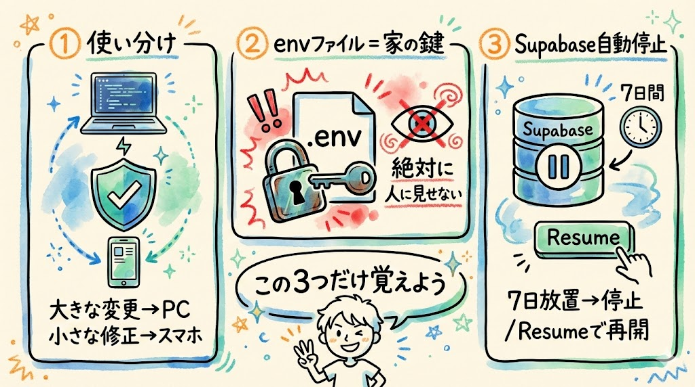

安全にアプリを運用するために、3つだけ覚えておいてください。難しいことは何もありません。

### 1. ローカルClaude Code と Claude Code Web の使い分け

| | ローカル版 | Web版 |
| --- | --- | --- |
| 用途 | アプリを作る・大きな変更 | 小さな修正・運用 |
| 安全性 | 全権限（管理者） | PR経由（安全） |
| たとえ | 家の鍵を持つ住人 | インターホンの来客 |

大きな変更はローカル版、日常的な修正はWeb版。この使い分けを意識するだけで安全に運用できます。

迷ったら Web版を使ってください。Web版なら、間違えてもPRを閉じればやり直せます。本番が壊れる心配がありません。

### 2. envファイルは絶対に人に見せない

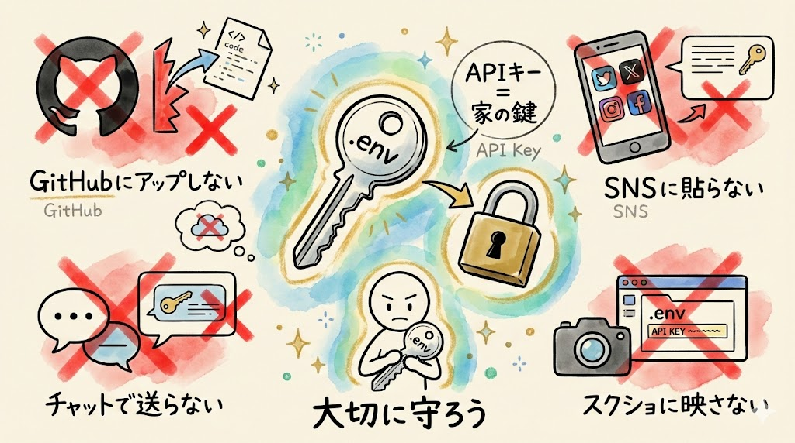

`.env.local` ファイルには、Supabaseの接続情報（APIキー）が入っています。APIキーとは、サービスにアクセスするための「合言葉」のようなものです。これを知っている人だけがデータベースにアクセスできます。つまり、家の鍵のようなものです。

- GitHubにアップロードしない（Claude Codeが `.gitignore` で自動的に保護してくれていますが、自分でも意識しておきましょう）
- SNSに貼らない
- チャットで誰かに送らない
- スクリーンショットに映り込まないように注意する

もし万が一、公開してしまった場合は、以下の手順で対処してください。

1. Supabaseのダッシュボード（`https://supabase.com`）を開く
2. プロジェクトを選択し、「Settings」→「API」を開く
3. APIキーを再発行（リセット）する
4. 新しいキーを `.env.local` ファイルに書き写す
5. Vercelのダッシュボード（`https://vercel.com/dashboard`）で、プロジェクトの「Settings」→「Environment Variables」を開き、新しいキーに更新する
6. Vercelで再デプロイ（「Deployments」タブから最新のデプロイの「...」→「Redeploy」）する

### 3. Supabaseの自動停止に注意

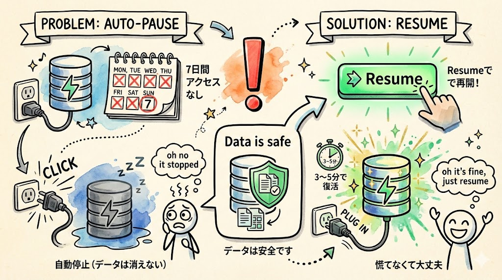

Supabaseの無料プランでは、**7日間アクセスがないとデータベースが自動停止** します。これは電気代を節約するためにコンセントを抜かれるようなイメージです。データは消えていません。コンセントを差し直せば（再開すれば）また使えます。

アプリが急に動かなくなったら、慌てずに以下の手順で確認してください。

1. ブラウザで `https://supabase.com` にアクセスし、ログインする
2. ダッシュボードでプロジェクト一覧を開く
3. `my-todo-app` のプロジェクトを選択する
4. 停止している場合は、画面に **「Resume」（再開）** ボタンが表示されます
5. 「Resume」ボタンを左クリックする
6. 再開には数分（3〜5分程度）かかることがあります。完了するまで待ちましょう
7. 再開後、アプリのURLを開いて動作を確認する

### 確認してみましょう

上記3つのポイントを覚えていますか？ まとめると:

1. **使い分け**: 大きな変更はローカル版、小さな修正はWeb版
2. **envファイル**: 絶対に人に見せない（家の鍵と同じ）
3. **Supabase停止**: 7日間アクセスなしで停止。「Resume」で再開できる

この3つだけ覚えておけば、安全にアプリを運用できます。

---

## 困ったときの対処法

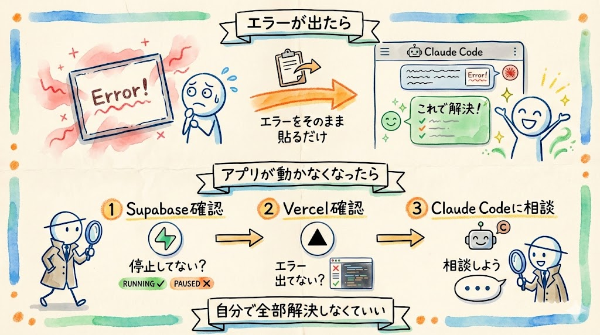

これからアプリを運用していく中で、困ることがあるかもしれません。でも大丈夫です。対処法はシンプルです。

### エラーが出たら

Claude Code（ローカル版でもWeb版でも）にエラーメッセージを貼り付けるだけです。

```
このエラーが出ました：（エラーメッセージをコピペ）。原因と解決方法を教えてください
```

エラーメッセージをそのままコピー&ペーストして投げてください。日本語に翻訳する必要もありません。英語のエラーメッセージをそのまま貼り付ければ、Claude Codeが読み解いて、日本語で対処法を教えてくれます。

エラーメッセージのコピー方法:
- **Mac** の場合: エラーメッセージをマウスで選択して `Cmd` + `C` でコピー、チャット欄で `Cmd` + `V` で貼り付け
- **Windows** の場合: エラーメッセージをマウスで選択して `Ctrl` + `C` でコピー、チャット欄で `Ctrl` + `V` で貼り付け
- **スマホ** の場合: エラーメッセージを長押しして選択し、「コピー」をタップ。チャット欄を長押しして「ペースト」をタップ

### アプリが動かなくなったら

確認する順番はこうです。上から順に試してみてください。

1. **Supabaseが停止していないか** → ブラウザで `https://supabase.com` を開いてログイン。ダッシュボードでプロジェクトを選択し、停止していたら「Resume」ボタンを左クリックして再開。再開まで数分かかることがあります
2. **Vercelでエラーが出ていないか** → ブラウザで `https://vercel.com/dashboard` を開いて、`my-todo-app` プロジェクトを左クリック。「Deployments」タブで最新のデプロイ状態を確認。「Error」と表示されていたら、ログを確認してClaude Codeに相談
3. **それでもわからなければ** → Claude Codeに状況を詳しく伝えて相談。「アプリを開くとこういう画面が出る」「昨日までは動いていたけど今日動かない」など、できるだけ具体的に伝えるのがコツです

エラーや問題は、エンジニアでも日常的に起こります。大事なのは「自分で全部解決しなきゃ」と思わないこと。AIに聞けばいい。それだけです。

### 確認してみましょう

困ったときの対処法を覚えていますか？ ポイントは2つです:

1. **エラーが出たら**: エラーメッセージをそのままClaude Codeに貼り付ける
2. **アプリが動かなくなったら**: Supabase → Vercel → Claude Codeに相談、の順で確認する

---

## 次のステップ

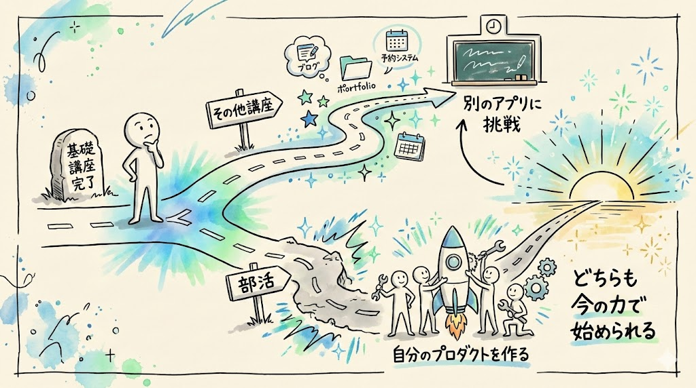

この講座で基礎は身につきました。ここから先、2つの道があります。

### その他講座 — 別のアプリを作る

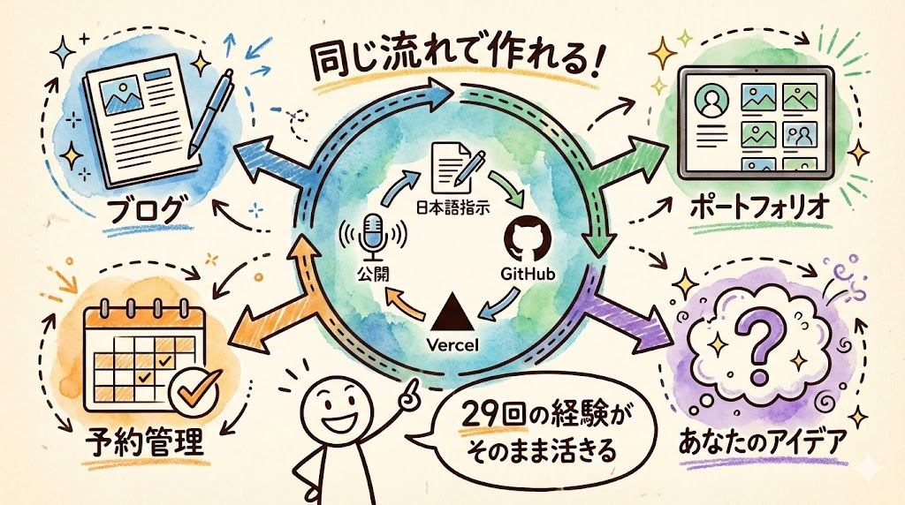

TODOアプリ以外にも、さまざまなアプリを作る講座を用意しています。

同じ流れ（Claude Codeに日本語で指示 → GitHubに保存 → Vercelで公開）で、違う種類のアプリに挑戦できます。たとえば、ブログアプリ、ポートフォリオサイト、予約管理システムなど。この29回で学んだ手順がそのまま使えるので、次からはもっとスムーズに進められるはずです。

### 部活 — 自分のプロダクトを1ヶ月で作って公開

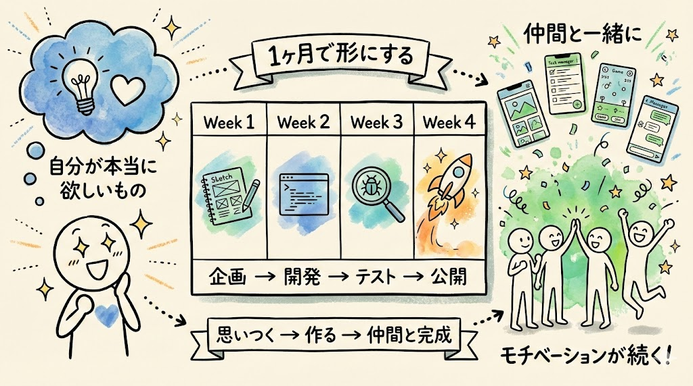

「自分が本当に欲しいもの」を1ヶ月で作って公開する実践型の活動です。

講座で学んだ流れを使って、自分だけのプロダクトを形にします。「こんなアプリがあったら便利なのに」と思っていたもの、ありませんか？ それを、Claude Codeと一緒に作ることができます。

仲間と一緒に取り組むので、モチベーションも保ちやすいです。

どちらも、この29回で学んだことがそのまま土台になります。新しく覚え直すことはほとんどありません。

---

## おわりに


全29回、おつかれさまでした。

最初は「ターミナルって何？」「Gitって何？」というところからスタートしました。

それが今、皆さんは：

- ターミナルを開いて、コマンドを入力できる
- Claude Codeに日本語で指示を出して、アプリを作れる
- GitHubにコードを保存できる
- Vercelでインターネットに公開できる
- スマホからでも安全にアプリを修正できる
- エラーが出ても、AIに聞いて対処できる

自分のアプリをインターネットに公開し、スマホからでも安全に修正できるようになっています。

ここで、いちばん大事なことをお伝えします。

**皆さんがやったのは「プログラミングを覚えた」のではなく、「AIと一緒にものづくりする方法を覚えた」ということです。**

プログラミング言語を暗記する必要はありません。JavaScriptの文法を覚えなくても、Reactの書き方を知らなくても、アプリは作れました。

大事なのは、**作りたいものを日本語で伝えて、AIと一緒に形にする力** です。

「何を作りたいか」を考える力。「こうしてほしい」を言葉にする力。うまくいかなかったときに「ここがおかしい」と伝える力。これらは全部、プログラミングの知識ではなく、日本語のコミュニケーション力です。

そして、その力は皆さんがすでに持っています。この29回で、それを証明しましたよね。

これからの時代、「自分でコードを書ける人」だけがものづくりできるわけではありません。AIに指示を出せる人、AIと対話しながら形にできる人が、新しいものづくりの担い手になっていきます。

**皆さんはもう、アプリを公開できる人です。**

ぜひ、次は自分が本当に欲しいものを作ってみてください。「こんなの作れたらいいな」と思ったら、Claude Codeに話しかけるところから始めてみてください。

ありがとうございました。
