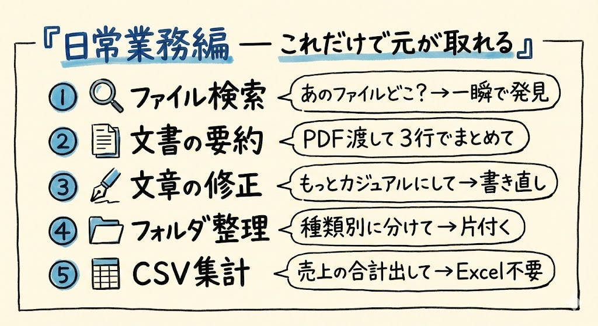
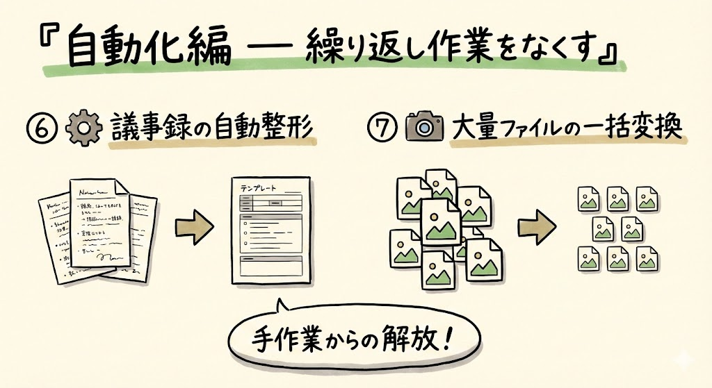
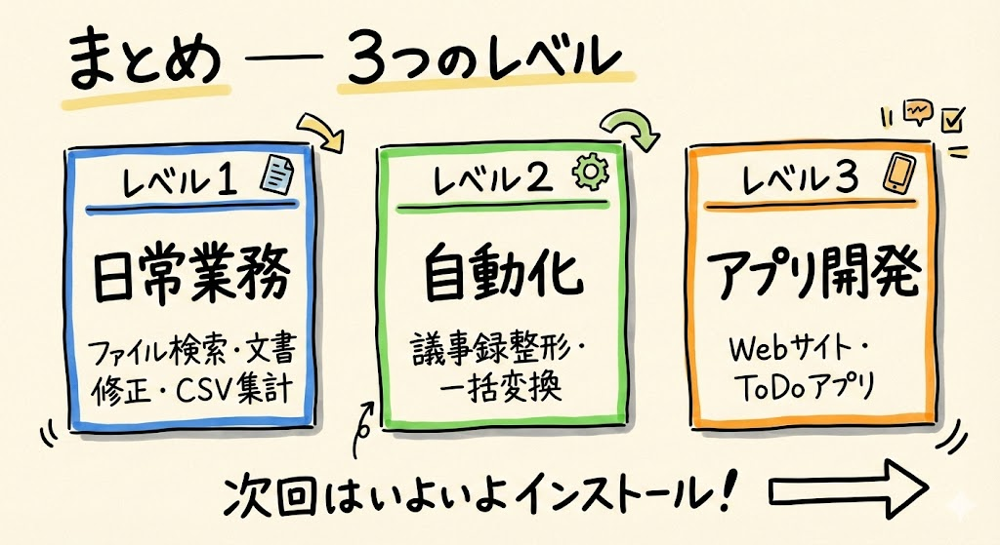

# 第2回｜実務で使える具体例10選 — 非エンジニアでもここまでできる

## このレッスンのゴール

「こんなことにも使えるのか」と具体的なイメージを持てるようになること。

---

## 日常業務編（レベル1）— これだけで元が取れる



それでは第2回、始めていきましょう。今回は、Claude Codeで実際にどんなことができるのか、具体例を10個ご紹介します。「へえ、そんなこともできるんだ」と思っていただければ大丈夫です。今回もまだ見るだけでOKです。手を動かすのは次回からですからね。

まずはレベル1、日常業務編です。ここだけでも月$20の元は十分取れます。

### ① ファイル検索 — 「あのファイルどこだっけ？」が一瞬

Claude Codeにこう話しかけます。

```
「報告書」って名前のファイルをデスクトップから探して
```

たったこれだけです。普通なら、フォルダを1つずつ開いて探しますよね。Claude Codeなら、フォルダの奥深くにあっても、数秒で見つけてくれます。どのフォルダに入っているかも教えてくれるので、場所もすぐにわかります。

### ② 文書の要約 — PDFやWord渡して「3行でまとめて」

```
@報告書.pdf を3行で要約して
```

この `@`（アットマーク）のあとにファイル名を書くと、そのファイルの中身をClaude Codeに読み込ませることができます。長い資料を全部読む時間がないとき、これがものすごく便利です。「3行」の部分を「5行」や「箇条書き」に変えれば、詳しさも自由に調整できます。

### ③ 文章の修正 — 「もっとカジュアルにして」で書き直し

```
@メール.txt をもっとカジュアルなトーンに書き直して
```

ビジネスメール、お礼文、報告書...なんでも対応できます。「堅すぎるかな」と思ったメールを、ちょうどいいトーンに直してもらえます。逆に「もっとフォーマルにして」もできます。

### ④ フォルダ整理・一括リネーム — 散らかったデスクトップが一言で片付く

```
デスクトップのファイルを種類別にフォルダ分けして
```

これ、よく聞かれるんですが、本当に一言でできます。画像は画像フォルダへ、PDFはPDFフォルダへ、ドキュメントはドキュメントフォルダへ...と、自動で分類してくれます。手動で1つずつ動かす作業からの解放です。

### ⑤ CSV集計 — Excel開かずに「売上の合計出して」

```
@売上データ.csv のカテゴリ別の合計を出して
```

CSV（シーエスブイ）というのは、Excelでよく使われる表形式のデータファイルのことです。Excelの関数（SUMとかVLOOKUPとか）を覚える必要はありません。日本語で「合計出して」と言うだけです。

---

## 自動化編（レベル2）— 繰り返し作業をなくす



次はレベル2、自動化編です。レベル1に慣れてきたら、ここに挑戦していきます。

### ⑥ 議事録の自動整形 — テンプレに合わせてフォーマット

```
この会議メモを、日時・参加者・議題・決定事項・次回アクションの形式に整えて
```

会議のメモをバーっと書いて、それをClaude Codeに渡すだけ。きちんとした議事録の形にフォーマット（整形）してくれます。毎回同じ形式で整えたい場合に、とても便利です。

### ⑦ 大量ファイルの一括変換 — 100枚の画像リサイズとか

```
imagesフォルダの画像を全部、幅800pxにリサイズして
```

px（ピクセル）というのは、画像の大きさの単位です。100枚の画像を1枚ずつリサイズしていたら、何時間もかかりますよね。Claude Codeなら、一言で全部まとめて処理してくれます。

---

## アプリ開発編（レベル3）— 「作る側」になれる


最後はレベル3、アプリ開発編です。「え、自分がアプリを？」と思うかもしれませんが、本当にできるんです。もちろん、ここに到達するのはもう少し先の話ですので、今は「こんなこともできるんだ」と見ておくだけで大丈夫です。

### ⑧ Webサイトを作る

```
シンプルなポートフォリオサイトを作って
```

ポートフォリオというのは、自分の作品や実績をまとめたWebページのことです。自己紹介サイトのようなものですね。これが日本語の指示だけでできてしまいます。

### ⑨ アプリを作る — TODOアプリ程度なら日本語指示だけ

```
ToDoアプリを作って。タスクの追加・完了・削除ができるようにして
```

TODO（トゥードゥー）アプリとは、やることリストのアプリです。こういった簡単なアプリなら、日本語で「こういう機能がほしい」と言うだけで作ってくれます。

### ⑩ ブラウザ操作の自動化

```
毎朝このURLを開いてスクリーンショットを撮って保存して
```

URL（ユーアールエル）というのは、Webサイトのアドレスのことです。毎日同じサイトを確認する作業があれば、それを自動化できます。スクリーンショットとは、画面のキャプチャ（写真）のことですね。

---

## まとめ



今回ご紹介した10個を、レベル別に整理しておきますね。

| レベル | できること | 代表例 |
| --- | --- | --- |
| レベル1 | 日常業務 | ファイル検索、文書修正、CSV集計 |
| レベル2 | 自動化 | 議事録整形、一括変換 |
| レベル3 | アプリ開発 | Webサイト、ToDoアプリ |

全部を一気にやる必要はありません。この講座では、レベル1の具体例から1つずつ、実際に手を動かしながら体験していきます。

次回はいよいよ、最初の準備に入ります。ターミナル（黒い画面）を開くところから始めましょう。見るだけの時間はここまで。次回からは一緒に手を動かしていきますので、楽しみにしていてくださいね。
