# 第3回｜ターミナルを開こう — 黒い画面は怖くない

## このレッスンのゴール

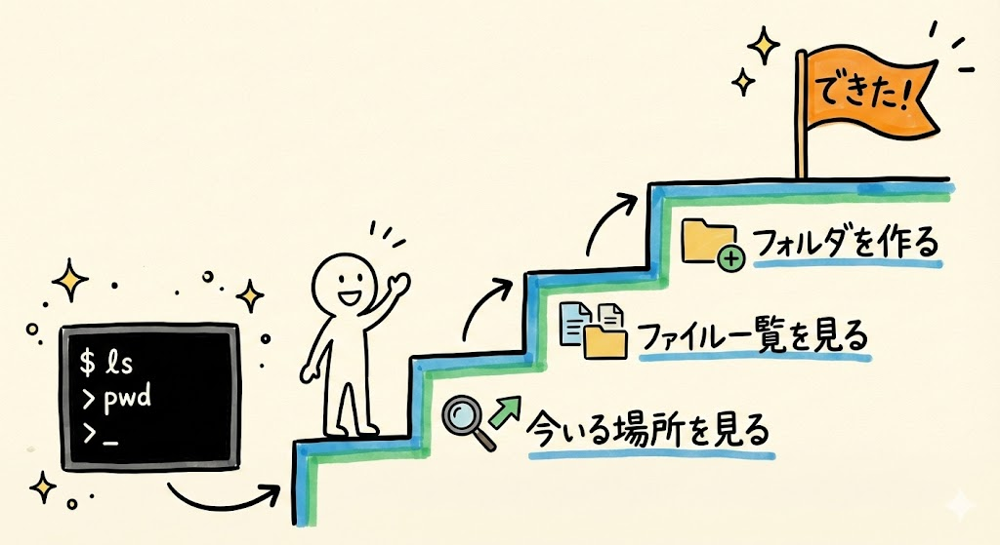

ターミナル（黒い画面）を開いて、簡単なコマンドを3つ実行できるようになること。

---

## ターミナルって何？

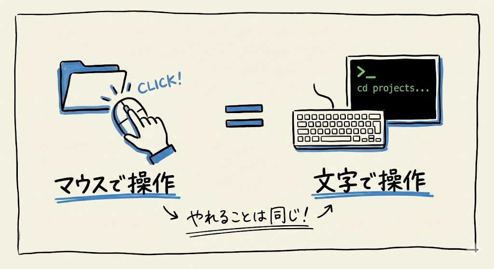

さあ、ここからいよいよ手を動かしていきますよ。

ターミナルとは、**文字でパソコンに指示を出す窓**のことです。

普段みなさんは、マウスでクリックしてフォルダを開いたり、ファイルを移動したりしていますよね。ターミナルでは、同じことを**文字を打って**やります。マウスの代わりに、キーボードで命令を出すイメージです。

「え、わざわざ文字で？ マウスのほうが楽じゃない？」と思いますよね。それはもっともです。でも、Claude Codeはこのターミナルの中で動くんです。ここが玄関口なので、まずは開けるようになりましょう。開くだけなら30秒でできます。

**ここで大事なお知らせです。この講座では、VS Code（ブイエスコード）などのエディタは使いません。** VS Codeというのはプログラマーがよく使う開発ツールのことですが、今は知らなくて大丈夫です。この講座では、Mac標準のターミナルアプリ、またはWindowsのPowerShell（パワーシェル）を直接使います。シンプルにいきましょう。VS Codeが登場するのはレベル3（第16回）からですので、ずっと先の話です。

---

## ターミナルを開く

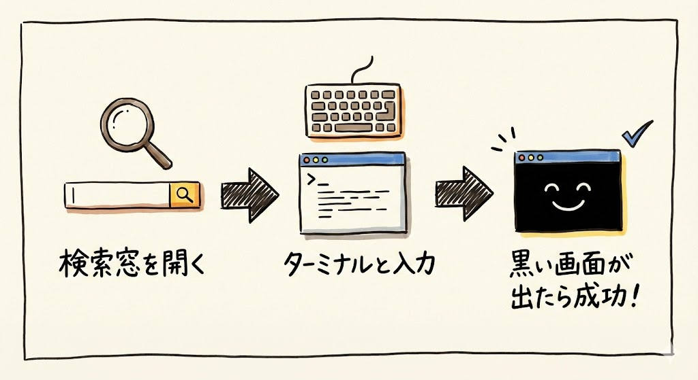

### Macの場合

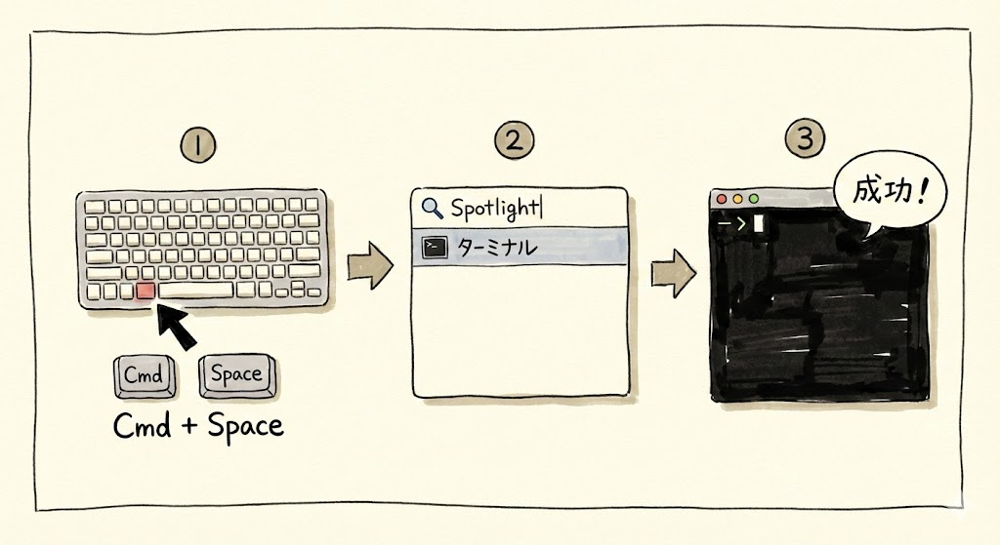

では、実際に開いてみましょう。今私がやるのを画面で見ながら、一緒にやってみてください。

1. キーボードの左下のほうにある `Cmd` キー（⌘マークがついているキー）を押しながら、スペースキーを押します。すると画面の真ん中あたりに、小さな検索窓がポンと出てきます。これをSpotlight（スポットライト）と呼びます。ここに文字を打つと、アプリやファイルを検索できます
2. その検索窓に「ターミナル」とひらがなで入力してください。「terminal」と英語で打っても大丈夫です
3. 検索結果に「ターミナル.app」が出てくるので、そのまま `Enter` キーを押します

黒い画面（設定によっては白い画面のこともあります）が出てきましたか？ 出てきたら成功です。

画面の中に `あなたの名前@MacBook ~ %` のような文字が表示されていると思います。これは「入力待ち」の状態です。ここに文字を打って `Enter` を押すと、パソコンに指示を出せます。

### Windowsの場合

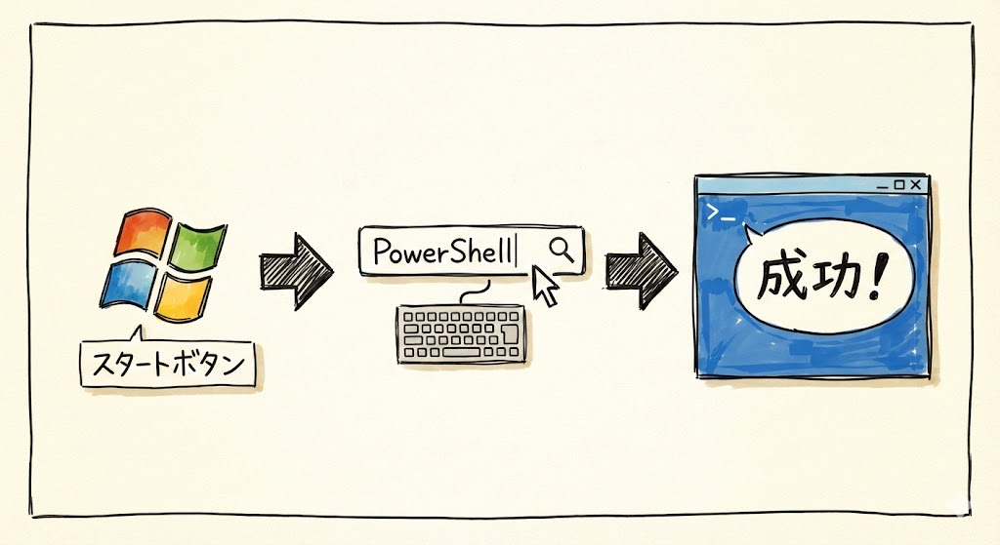

1. 画面の左下にあるスタートボタン（Windowsのロゴ）をクリックして、スタートメニューを開きます
2. そのまま「PowerShell」と入力して検索します。メニューが開いた状態でそのままキーボードを打てば、検索になります
3. 検索結果に「Windows PowerShell」が出てくるので、クリックします

青い画面が出てきたら成功です。`PS C:\Users\あなたの名前>` のような文字が表示されているはずです。これが入力待ちの状態です。

---

## 最初のコマンド3つ

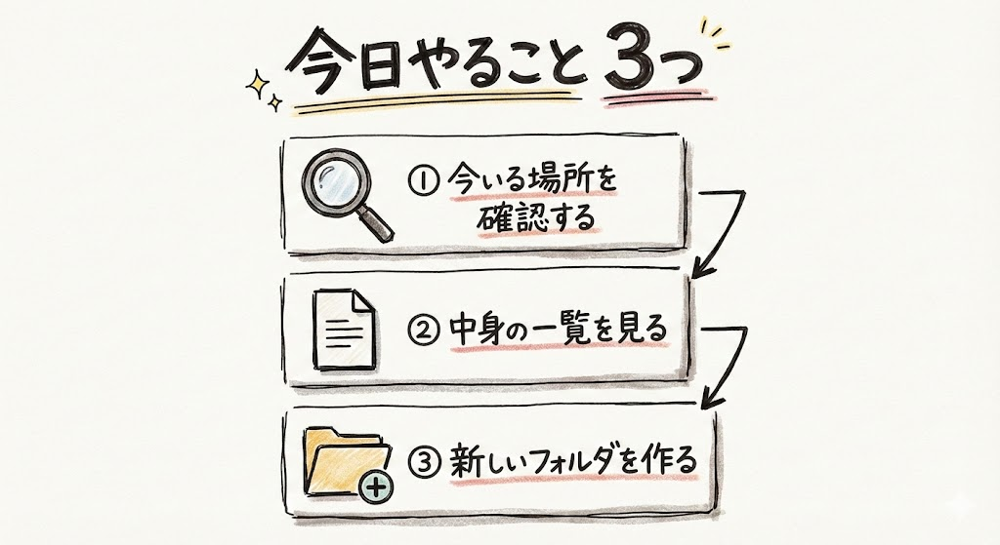

画面が開きましたね。さっそくコマンドを打ってみましょう。コマンドというのは、パソコンへの命令文のことです。短い英単語を打って `Enter` を押すだけです。

### 1. pwd — 今いる場所を表示する

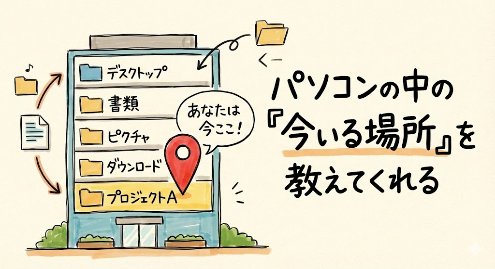

最初のコマンドは `pwd` です。ピー・ダブリュー・ディーと読みます。"Print Working Directory"の略で、日本語にすると「今いる場所を表示して」という意味です。

```
pwd
```

と打って、`Enter` キーを押してください。

画面にこんな感じの文字が表示されます。

```
/Users/あなたの名前
```

（Windowsの場合は `C:\Users\あなたの名前` のように表示されます）

これは「今、パソコンの中のどこにいるか」を示しています。Finderでいうと「ホームフォルダ」にいる状態ですね。パソコンの中には、実際のビルのようにいろんな「場所」があって、ターミナルでは今自分がどの場所にいるかを意識しながら操作します。今は「ふーん、場所があるんだな」くらいで大丈夫です。

### 2. ls — ファイル一覧を表示する

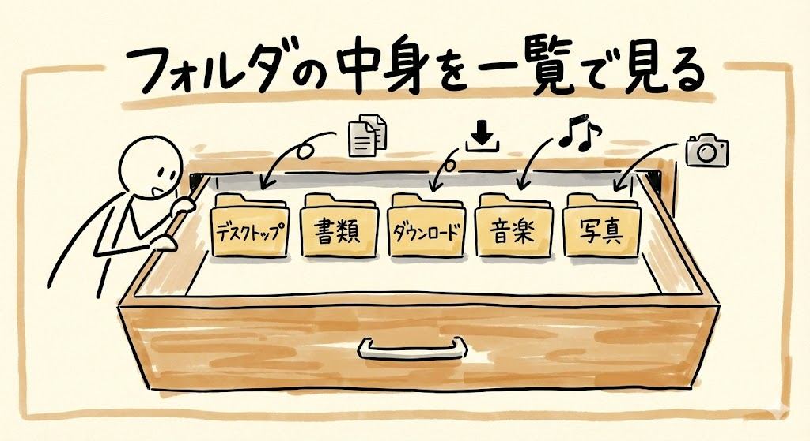

次のコマンドは `ls` です。エル・エスと読みます。リスト（list）の略で、「今いるフォルダの中身を一覧で見せて」という意味です。

```
ls
```

と打って、`Enter` キーを押してください。

画面にこんな感じで、フォルダ名やファイル名がずらっと表示されます。

```
Desktop    Documents    Downloads    Music    Pictures
```

見覚えがありませんか？ そうです、Finderで見ているのと同じものが、文字で表示されているだけなんです。`Desktop` はデスクトップ、`Documents` は書類フォルダ、`Downloads` はダウンロードフォルダです。

### 3. mkdir — フォルダを作る

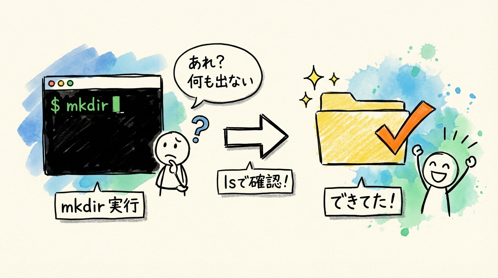

3つ目のコマンドは `mkdir` です。メイク・ディレクトリ（make directory）と読みます。ディレクトリというのはフォルダのことです。つまり「フォルダを作って」という命令ですね。

```
mkdir my-first-folder
```

と打って、`Enter` キーを押してください。

ここで皆さん、画面を見てください。何も表示されませんよね？ 「あれ、失敗した？」と思うかもしれませんが、**何も表示されないのが正常です**。ターミナルの世界では、「問題なく完了しました」というときは何も言わないことが多いんです。「便りがないのは良い便り」みたいなものですね。

本当にフォルダができたか確認してみましょう。もう一度 `ls` と打って `Enter` を押してみてください。

```
ls
```

一覧の中に `my-first-folder` が増えているはずです。見つかりましたか？

さらに確認したい方は、Finderやエクスプローラーを開いて、ホームフォルダを見てみてください。**実際にフォルダができています。** ターミナルで打ったコマンドは、画面の中だけの話ではなく、ちゃんとパソコンの中で実行されているんです。これが「ターミナルでパソコンを操作する」ということです。

---

## わざと間違えてみよう

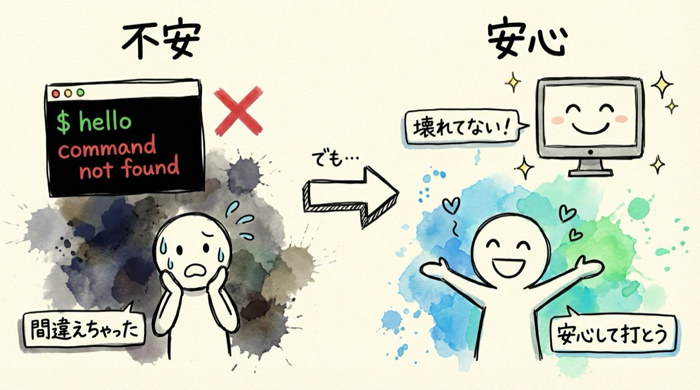

ここ、ちょっと大事なポイントです。

ターミナルが怖いと感じる一番の理由は、「間違えたらパソコンが壊れるんじゃないか」という不安だと思います。これ、よく聞かれるんですが、結論から言うと、**簡単なコマンドの打ち間違いでパソコンが壊れることはありません**。

試しに、でたらめなコマンドを打ってみましょう。

```
hello
```

`Enter` を押すと、画面にこんなメッセージが出ます。

```
command not found: hello
```

（Windowsの場合は `'hello' is not recognized as an internal or external command` のように表示されます）

これは「そんなコマンド知らないよ」と言われているだけです。**パソコンは壊れません。** エラーメッセージが出ても、それは「わかりませんでした」という返事なだけ。何度間違えても大丈夫です。安心してどんどん打ってみてください。

---

## よく使う基本コマンド一覧

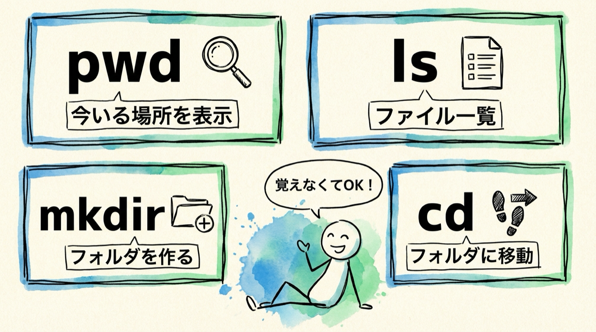

今回触ったものも含めて、まとめておきますね。**全部覚える必要はありません。** ここ、大事です。Claude Codeを使うようになれば、これらのコマンドはClaude Codeが代わりに打ってくれます。今は「こういうものがあるんだな」くらいの理解で十分です。

| コマンド | 読み方 | 意味 | 例 |
| --- | --- | --- | --- |
| `pwd` | ピー・ダブリュー・ディー | 今いる場所を表示 | `pwd` |
| `ls` | エル・エス | ファイル一覧を表示 | `ls` |
| `mkdir` | メイク・ディレクトリ | フォルダを作る | `mkdir my-folder` |
| `cd` | シー・ディー | フォルダに移動する | `cd Desktop` |

`cd` は今回使いませんでしたが、よく出てくるのでここに載せておきました。"Change Directory"の略で、「別のフォルダに移動する」という意味です。後で使う場面が出てきます。

---

## まとめ


- ターミナルは「文字でパソコンに指示を出す窓」
- Macは `Cmd` + `Space` → 「ターミナル」と入力して開く。Windowsは「PowerShell」で検索して開く
- `pwd`（今いる場所を表示）、`ls`（ファイル一覧）、`mkdir`（フォルダを作る）の3つを体験した
- 間違えてもパソコンは壊れない。`command not found` と出るだけなので安心して使える
- コマンドは覚えなくてOK。後でClaude Codeが代わりに打ってくれる

次回は、Claude Codeを動かすための土台「Node.js（ノード・ジェイエス）」をインストールします。あと2回の準備で、いよいよClaude Codeが使えるようになります。もうゴールは近いですよ。
