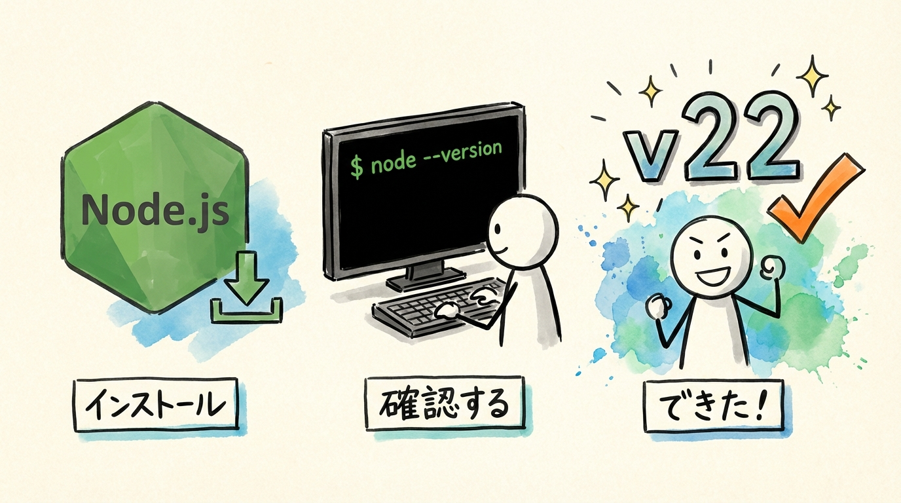
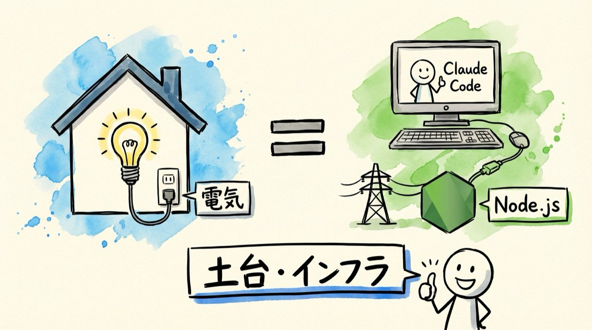
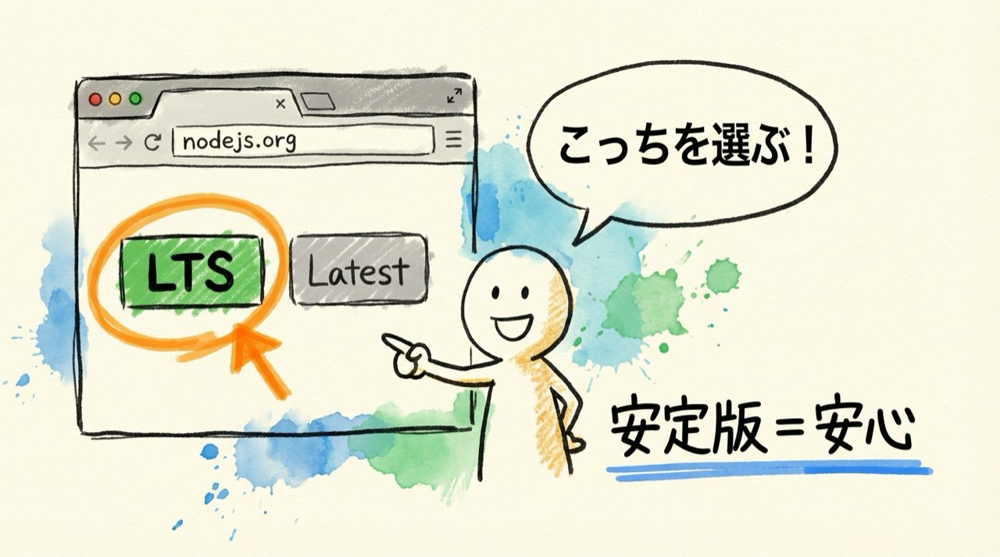
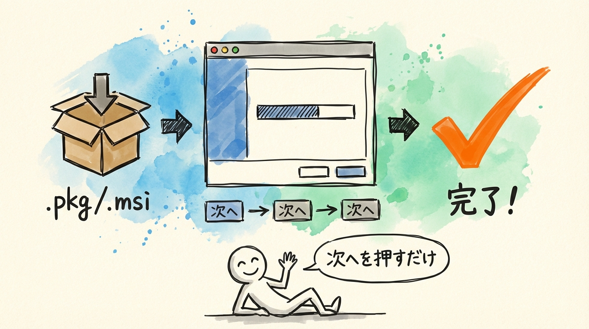
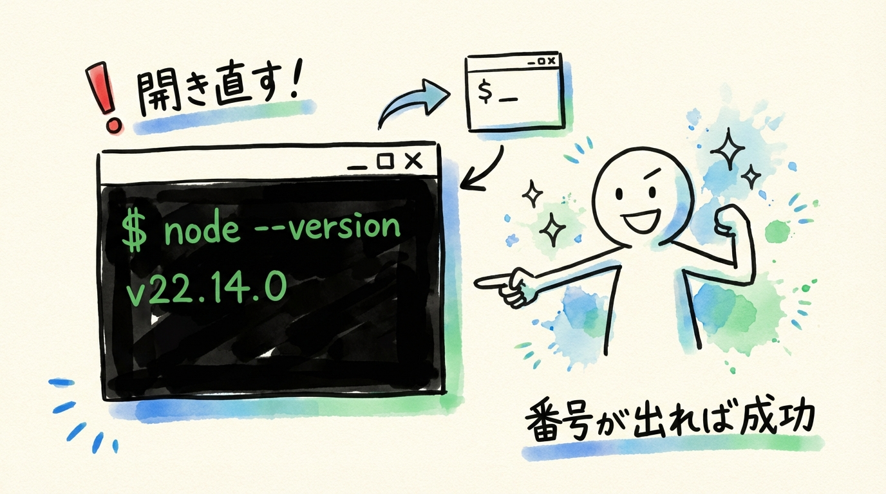
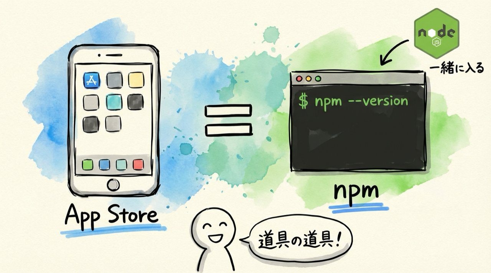
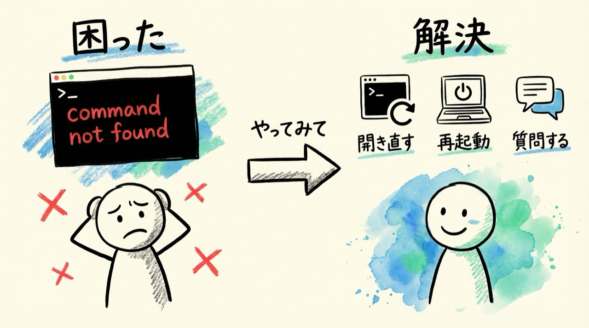
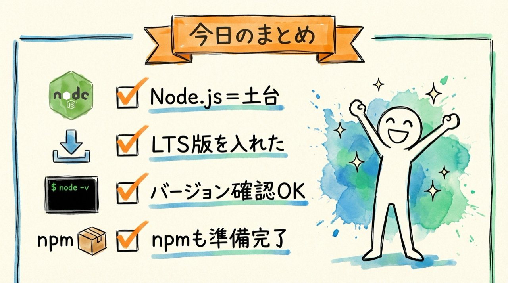

# 第4回｜Node.jsをインストールしよう — Claude Codeの土台を整える

## このレッスンのゴール



Node.jsをインストールして、ターミナルで `node --version` が表示されるようになること。

---

## Node.jsって何？



Claude Codeを動かすには、**Node.js（ノード・ジェイエス）** という土台が必要です。

たとえるなら、Node.jsは「電気」や「水道」のようなインフラ（基盤）です。家電を動かすには電気が必要ですよね。同じように、Claude Codeを動かすにはNode.jsが必要なんです。

ここで安心していただきたいのが、Node.js自体を皆さんが直接使うことはありません。裏で静かに動いてくれるだけです。一度入れてしまえば、あとは意識しなくて大丈夫です。「なんか必要なものを入れたんだな」くらいの理解で十分です。

---

## インストール手順

### ステップ1: ダウンロードページにアクセス



ブラウザ（Safari、Chrome、Edgeなど、普段使っているもので大丈夫です）で以下のURLを開きます。

```
https://nodejs.org
```

アドレスバー（画面の上のほうにあるURLを入力する場所）に、上のアドレスをそのまま打ち込んで `Enter` を押してください。

ページを開くと、ダウンロードボタンが2つあります。ここで皆さん、画面を見てください。**LTS（推奨版）** と書かれたほうを選んでください。もう1つ「Latest」や「Current」と書かれたボタンがあるかもしれませんが、そちらではなく「LTS」のほうです。

LTS（エル・ティー・エス）というのは "Long Term Support"の略で、「長期間サポートされる安定版」という意味です。最新の機能は入っていませんが、安定して動きます。こちらを選んでおけばトラブルが少ないです。

### ステップ2: インストーラーを実行



ダウンロードが完了したら、ダウンロードしたファイルを開いてインストールします。

#### Macの場合

1. ダウンロードした `.pkg`（ピーケージー）ファイルをダブルクリックします。Finderのダウンロードフォルダに入っているはずです
2. インストーラーの画面が出てきます。「続ける」ボタンを何回かクリックしていきます
3. 途中で「インストール」ボタンが出てくるので、クリックします。このとき、Macのログインパスワード（パソコンを起動するとき入れるパスワード）を聞かれることがあります。聞かれたら入力してください
4. 「インストールが完了しました」と表示されたら、「閉じる」をクリックして完了です

#### Windowsの場合

1. ダウンロードした `.msi`（エムエスアイ）ファイルをダブルクリックします
2. インストーラーの画面が出てきます。「Next」ボタンを何回かクリックしていきます
3. 途中で「Install」ボタンが出てくるので、クリックします
4. 「Finish」ボタンが出たらクリックして完了です

どちらも、途中でいろいろな選択肢が出てきますが、**基本的に初期設定のまま進めればOK**です。チェックボックスを外したり、設定を変えたりする必要はありません。「とにかく次へ、次へ」で大丈夫です。

### ステップ3: ターミナルで確認



ここ、ちょっと大事なポイントです。

インストールが終わったら、ターミナルを**一度閉じて、もう一度開き直してください**。もしターミナルを開いていなかった方は、新しく開いてください（開き方は前回やりましたね。Macなら `Cmd` + `Space` → 「ターミナル」、Windowsなら「PowerShell」で検索）。

なぜ開き直すかというと、ターミナルは起動したときに「パソコンに何がインストールされているか」を確認するんです。開きっぱなしだと、さっきインストールしたNode.jsを認識してくれないことがあります。

ターミナルを開き直したら、以下を入力して `Enter` を押します。

```
node --version
```

`node` のあとに半角スペースを1つ入れて、`--version`（ハイフンを2つ続けて書いて、そのあとに version）と打ちます。これは「Node.jsのバージョン（版の番号）を教えて」という命令です。

画面にこんな感じでバージョン番号が表示されればOKです。

```
v22.14.0
```

数字はインストールした時期によって変わりますので、皆さんの画面に出ている数字と違っていても問題ありません。`v` で始まる数字が何かしら出ていれば成功です。

もし `command not found` や `'node' is not recognized` と表示された場合は、インストールがうまくいっていない可能性があります。下の「うまくいかないときは」を見てください。

---

## npmも確認しておく



もう1つ、確認しておきたいものがあります。

```
npm --version
```

`npm`（エヌ・ピー・エム）と打って、半角スペース、`--version` と入力して `Enter` を押してください。

こちらもバージョン番号が出ればOKです。

```
10.9.2
```

こちらも数字が違っていても、何かしらの数字が出ていれば大丈夫です。

今私がやったことを説明しますね。**npm** というのは、Node.jsの世界で使われる「道具をダウンロードするための道具」です。スマホでいうApp StoreやGoogle Playのようなもの。次回、このnpmを使ってClaude Code本体をインストールします。

npm はNode.jsと一緒に自動でインストールされるので、皆さんが別途何かをダウンロードする必要はありません。Node.jsを入れた時点で、もう入っています。

---

## うまくいかないときは



インストールがうまくいかない場合も、焦らなくて大丈夫です。よくあるケースと対処法をまとめておきます。

| 症状 | 対処法 |
| --- | --- |
| `command not found` や `'node' is not recognized` と出る | ターミナルを一度閉じて、もう一度開き直してみてください。それでもダメなら、パソコン自体を再起動してみてください |
| バージョンが古い（v16以下など） | nodejs.orgからもう一度LTS版をダウンロードして、上書きインストールしてください。上書きしても問題ありません |
| インストーラーが開けない（Macで「開発元が未確認」と出る） | 「システム設定」→「プライバシーとセキュリティ」を開いて、下のほうに「このまま開く」というボタンがあるので、それをクリックしてください |

どうしてもうまくいかない場合は、コミュニティで質問してください。同じところでつまずいている方がいるかもしれませんし、先輩メンバーが助けてくれます。

---

## まとめ



- Node.js（ノード・ジェイエス）はClaude Codeを動かすためのインフラ（電気・水道のようなもの）
- nodejs.orgからLTS版（安定版）をダウンロードしてインストール
- インストール後はターミナルを**開き直す**のを忘れずに
- `node --version` でバージョン番号が出れば成功
- npm（道具をダウンロードするための道具）も一緒にインストールされている。次回これを使う

次回はいよいよClaude Code本体のインストールです。ここまで来たら、あと1回で使い始められます。もう少しです。頑張りましょう。
