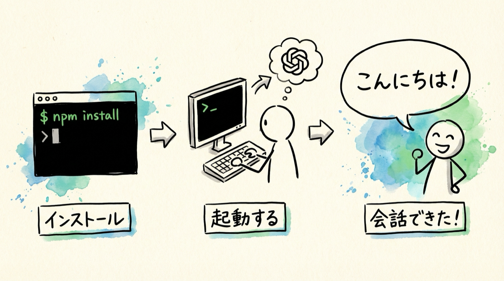
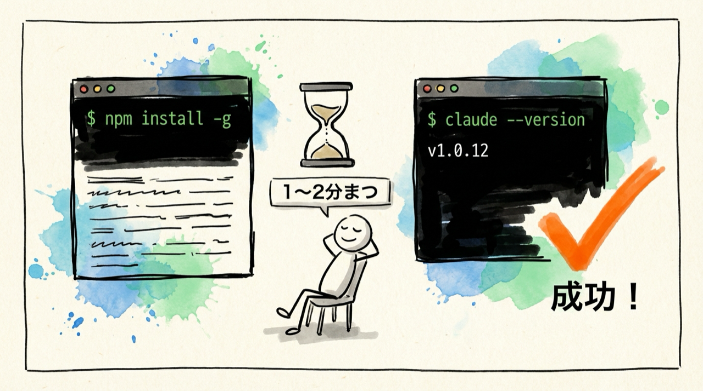
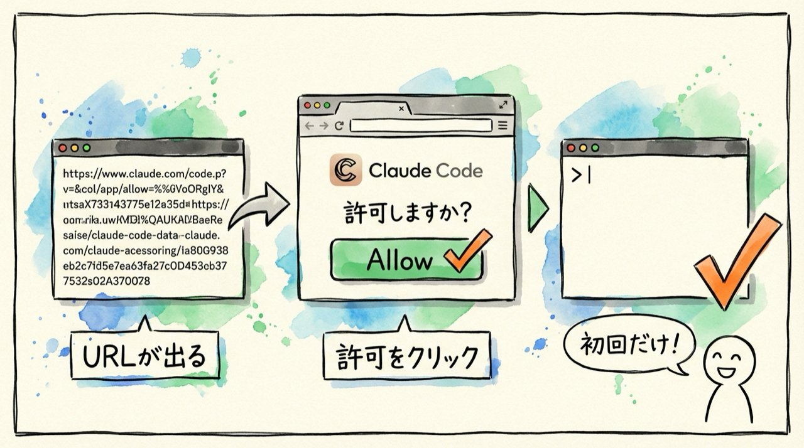
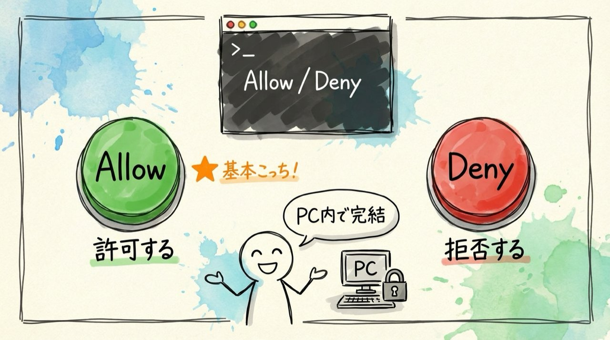
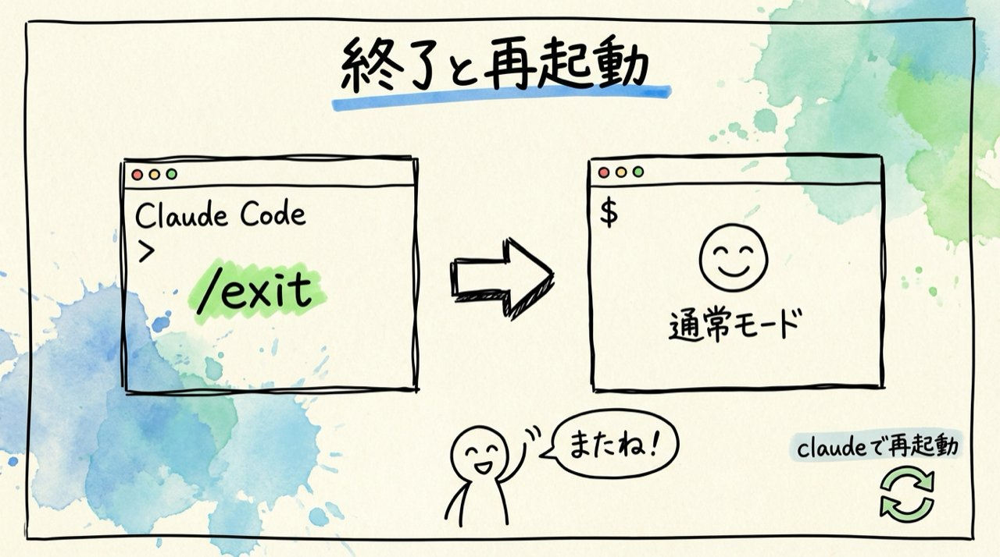

# 第5回｜Claude Codeをインストールしよう — AIアシスタントを呼び込む

## このレッスンのゴール



Claude Codeをインストールして、「こんにちは」と話しかけて返事をもらうこと。

---

## いよいよ本体のインストール



前回までで土台（Node.js）は整いました。いよいよClaude Code本体をインストールします。ここまでよく頑張りましたね。この回が終われば、もうClaude Codeが使える状態になります。

ターミナルを開いてください（Macなら `Cmd` + `Space` → 「ターミナル」、Windowsなら「PowerShell」で検索でしたね）。

開いたら、以下のコマンドを入力してください。少し長いですが、1文字ずつ慎重に打ってみましょう。

```
npm install -g @anthropic-ai/claude-code
```

ここで今私がやったことを説明しますね。

- `npm` — 前回確認した「道具をダウンロードするための道具」です。これを使ってClaude Codeをインストールします
- `install` — 「インストールして」という意味です
- `-g` — この `-g` はグローバル（global）という意味で、パソコン全体で使えるようにする、という指定です。これをつけないと、今いるフォルダでしか使えなくなってしまいます
- `@anthropic-ai/claude-code` — これがClaude Codeの正式名称です。「Anthropic（アンソロピック）社が作ったClaude Code」という意味ですね

今は意味を全部理解する必要はありません。「このコマンドを打てばClaude Codeが入る」と覚えていただければOKです。

`Enter` を押すと、画面に文字がたくさん流れ始めます。ダウンロードとインストールが進んでいる証拠なので、触らずにじっと待ちましょう。だいたい1〜2分で終わります。途中で止まったように見えても、まだ処理中のことがあるので、焦らず待ってください。

もし途中で「WARN」（警告）という黄色い文字が出ても、問題ありません。「ERR」（エラー）という赤い文字が出なければ大丈夫です。

完了したら、ちゃんとインストールできたか確認しましょう。

```
claude --version
```

`claude` のあとに半角スペースを1つ入れて、`--version` と打って `Enter` です。

画面に `1.0.12` のようなバージョン番号が表示されれば、インストール成功です。数字の値は皆さんのタイミングによって違いますが、何かしらの数字が出ていればOKです。

もし `command not found` と出た場合は、ターミナルを一度閉じて開き直してから、もう一度 `claude --version` を試してみてください。

---

## Anthropicアカウントの準備


Claude Codeを使うには、Anthropic（アンソロピック）社のアカウントが必要です。Anthropicは、Claude（クロード）というAIを作っている会社です。

1. ブラウザで `claude.ai` にアクセスします。アドレスバーに `claude.ai` と打って `Enter` です
2. 画面に「Sign Up」（サインアップ、つまり新規登録）ボタンがあるので、クリックします
3. メールアドレスとパスワードを設定します。Googleアカウントをお持ちの方は、Googleアカウントでの登録も可能です。そのほうが簡単かもしれません
4. 登録したメールアドレスにメールが届くので、メールの中のリンクをクリックして認証を完了します

### プランの選択


アカウントを作ったら、プラン（料金プラン）を選びます。

| プラン | 月額 | 向いている人 |
| --- | --- | --- |
| Pro（プロ） | $20/月（約3,000円） | まずは試してみたい人 |
| Max（マックス） | $100/月（約15,000円） | がっつり使いたい人（おすすめ） |

これ、よく聞かれるんですが、**Maxプランがおすすめ**です。なぜかというと、Claude Codeは使えば使うほど便利さを実感するので、使用量の上限が大きいMaxのほうがストレスなく使えるんです。Proプランでも使えますが、たくさん使っていると「今日はもう使えません」という上限に達しやすいのでご注意ください。

まずはProで試してみて、「もっと使いたい」と思ったらMaxに切り替えるのもアリです。

> **補足**: MYUUUプロキシという選択肢もあります。コミュニティ内の案内をご覧ください。

---

## Claude Codeを起動する


いよいよ起動です。ターミナルで以下を入力します。

```
claude
```

たった1語です。`claude` と打って `Enter` を押すだけ。これでClaude Codeが起動します。

### 初回の認証



初めて起動するときだけ、認証（本人確認）が必要です。

1. `claude` と打って `Enter` を押すと、ターミナルにURLが表示され、ブラウザが自動で開きます。もし自動で開かない場合は、表示されたURLをコピーしてブラウザのアドレスバーに貼り付けてください
2. ブラウザの画面に「Claude Codeがアカウントへのアクセスを求めています」というメッセージが表示されます
3. 「許可」（Allow）ボタンをクリックします
4. ターミナルに戻ると、Claude Codeが使える状態になっています

画面に `>` のような入力待ちの表示が出ていれば、準備完了です。

この認証は**初回だけ**です。2回目以降は `claude` と打つだけですぐに起動します。面倒なのは今回だけなので、ここを乗り越えましょう。

---

## 最初の会話


起動できましたか？ では、さっそく話しかけてみましょう。

```
こんにちは
```

と打って `Enter` を押してください。

Claude Codeが日本語で返事を返してくれます。「こんにちは！何かお手伝いできることはありますか？」のような返答が表示されるはずです。

返事が返ってきましたか？ 返ってきたら、**セットアップ完了**です。おめでとうございます。第3回から3回かけて準備してきましたが、ここでようやくClaude Codeとお話しできるようになりました。

---

## 権限の確認（Allow / Deny）



ここで、1つ知っておいてほしいことがあります。

Claude Codeは、何かを実行する前に「これをやっていいですか？」と確認してきます。画面にこんな表示が出ます。

```
Allow / Deny
```

Allow（アラウ）は「許可する」、Deny（ディナイ）は「拒否する」という意味です。

この確認が出たら、基本的に **Allow（許可）** を選んで大丈夫です。なぜ安全かというと、Claude Codeはローカル、つまり皆さん自身のパソコンの中だけで動いているからです。皆さんのファイルをインターネットにアップロードしたり、どこかに送ったりすることはありません。パソコンの中で完結しています。

もし「この操作はちょっと不安だな」と思ったら、Deny を選べばその操作はスキップされます。間違えて Allow を押してしまっても、大きな問題になることはまずありません。安心して使ってください。

---

## 終了のしかた



Claude Codeを終了するには、以下を入力します。

```
/exit
```

スラッシュ（`/`）のあとに `exit`（エグジット、「出る」という意味）と打って `Enter` です。

ターミナルの通常の画面に戻ります。「あ、元の画面に戻ったな」と思ったら、ちゃんと終了できています。

もう一度Claude Codeを使いたいときは、`claude` と打てばまた起動します。起動と終了の行き来は、何度でも自由にできます。

---

## まとめ


- `npm install -g @anthropic-ai/claude-code` でClaude Codeをインストール
- `claude.ai` でアカウントを作成。Maxプランがおすすめだが、Proでも始められる
- `claude` と打つだけで起動。初回だけブラウザでの認証が必要
- 「こんにちは」と話しかけて、返事が来ればセットアップ完了
- 権限確認（Allow / Deny）は基本Allow。ローカル（自分のパソコン内）で完結するので安心
- `/exit` で終了。もう一度使いたいときは `claude` で再起動

次回からは、いよいよClaude Codeを使って実際の作業をやっていきます。第2回で紹介した「こんなことにも使えるのか」という具体例を、1つずつ体験していきましょう。ここからがレベル1「日常業務」の始まりです。楽しみにしていてくださいね。
