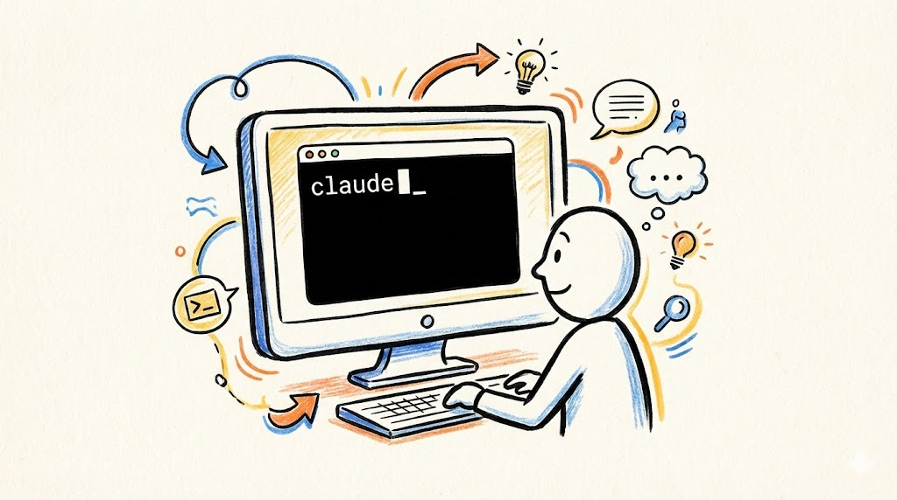
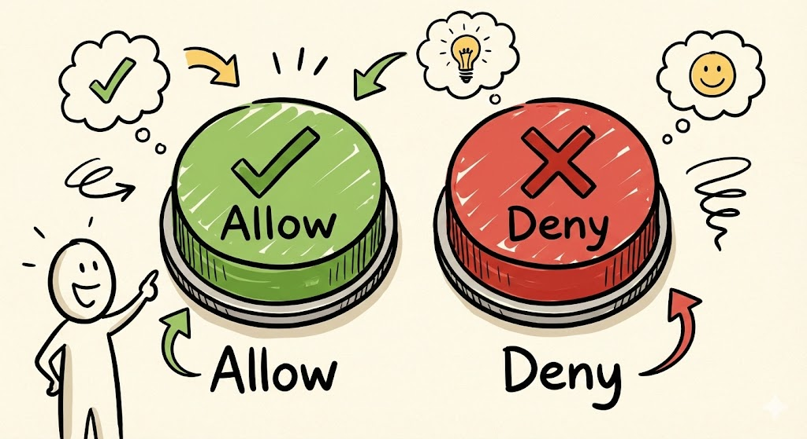
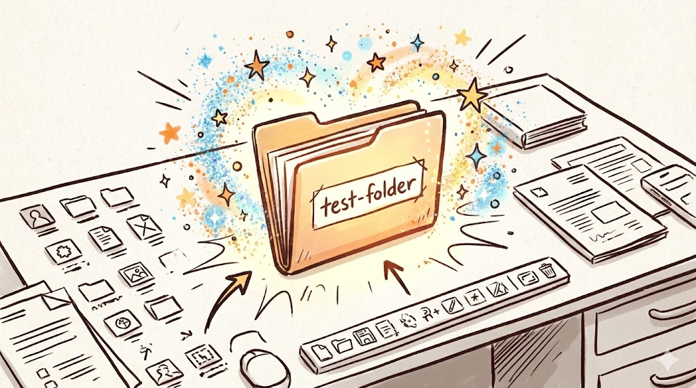
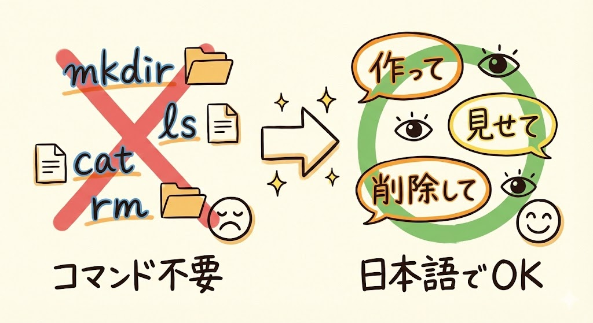

# 第6回｜はじめてのファイル操作 — フォルダ作成・ファイル作成・移動

## このレッスンのゴール


Claude Codeに日本語で指示して、フォルダやファイルの作成・確認・削除ができるようになること。

---

## ここからレベル1: 日常業務


さあ、ここからが本番です。

第2回で「こんなことにも使えるのか」という具体例を10個紹介しましたよね。ここからは、その中の日常業務編（レベル1）を1つずつ実際にやっていきます。

まずはウォームアップとして、一番基本的な操作——ファイルとフォルダの操作から始めましょう。今回やることは難しくありません。「Claude Codeに日本語で話しかけるだけで、パソコンの中にフォルダやファイルが作れるんだ」という体験をしていただきます。

イメージとしては、皆さんが秘書に「この書類をあのフォルダに入れておいて」とお願いするのと同じです。ただし、その秘書がパソコンの中にいて、一瞬でやってくれます。

---

## Claude Codeを起動する



まずはターミナルを開きましょう。

- **Macの方**: `Cmd` + `Space` で検索窓を開いて「ターミナル」と入力 → ターミナルを起動
- **Windowsの方**: スタートメニューから「PowerShell」と検索 → PowerShellを起動

ターミナルが開いたら、以下を入力して `Enter` を押します。

```
claude
```

前回やった通りですね。画面に `>` のような入力待ちの表示が出たら、準備完了です。

もし `command not found` と出た場合は、ターミナルを一度閉じて開き直してから再度 `claude` と試してみてください。

さっそく指示を出していきましょう。

---

## Allow / Deny のおさらい



今回からClaude Codeにファイルの操作をお願いしていきます。Claude Codeは何か操作をする前に、必ず「これをやっていいですか？」と聞いてきます。

```
Allow（許可する） / Deny（拒否する）
```

この表示が出たら **Allow を選んでください**。前回も説明しましたが、Claude Codeは皆さん自身のパソコンの中だけで動いていて、外に情報を送ったりしません。なので、Allow を押しても安全です。

この後の操作では何度もこの確認が出てきますが、今回は全て Allow で大丈夫です。

---

## やってみよう

### 1. フォルダを作る



Claude Codeにこう話しかけてみてください。

```
デスクトップに test-folder というフォルダを作って
```

`Enter` を押すと、Claude Codeが「こういう操作を実行しますよ」という確認を出してきます。Allow / Deny の表示が出たら、**Allow** を選んでください。

Claude Codeが裏で `mkdir`（メイク・ディレクトリ）というコマンドを実行します。これは「フォルダを作れ」という意味のコマンドですが、覚えなくて大丈夫です。

**確認してみましょう**: デスクトップを見てください。`test-folder` というフォルダができているはずです。見つかりましたか？ たった一言で、フォルダができました。

> **もし見つからない場合**: Macの方は Finder（ファインダー）を開いて左の「デスクトップ」を、Windowsの方はエクスプローラーで「デスクトップ」を確認してみてください。

### 2. ファイルを作って中身を書く


次はこう話しかけてみましょう。

```
デスクトップのtest-folderの中に hello.txt を作って、中に「はじめてのClaude Code！」と書いて
```

Allow の確認が出たら、Allow を選んでください。

Claude Codeが、ファイルの作成と中身の記入を**同時に**やってくれます。1つの指示で2つのことをまとめてやってくれるんですね。人間の秘書にお願いするのと同じで、「ファイル作って、ついでに中身も書いておいて」が通じます。

ここで **`.txt`** という部分について補足しておきます。これは「拡張子（かくちょうし）」と呼ばれるもので、ファイルの種類を示すためにファイル名の最後につく「.」以降の部分です。

身近な例でいうと:
- `.txt` → テキストファイル（メモ帳で開けるファイル）
- `.jpg` や `.png` → 写真・画像ファイル
- `.pdf` → PDFファイル

今は「テキストファイルを作ったんだな」くらいの理解で大丈夫です。

### 3. ファイル一覧を確認する


本当にファイルができたか、Claude Codeに確認してもらいましょう。

```
デスクトップのtest-folderの中のファイル一覧を見せて
```

画面に `hello.txt` というファイル名が表示されるはずです。ちゃんとファイルができていますね。

裏では `ls`（エル・エス）というコマンドが動いています。これは「リスト」の略で、「ファイルの一覧を表示しろ」という意味です。でも、皆さんはこのコマンド名を知らなくても全く問題ありません。「一覧を見せて」と日本語で言えばOKです。

**確認ポイント**: 画面に `hello.txt` と表示されていれば成功です。

### 4. ファイルの中身を読む


今度は、ファイルの中に書いた内容をClaude Codeに読んでもらいましょう。

```
デスクトップのtest-folderの中のhello.txt の内容を読んで
```

画面に「はじめてのClaude Code！」と表示されます。ちゃんと、さっき書いた内容が入っていますね。

> **ポイント**: 「デスクトップのtest-folderの中の」と場所を毎回指定しているのは、Claude Codeに「どこにあるファイルのことか」を正確に伝えるためです。人に頼むときも「あの棚の2段目の赤いファイル」と言ったほうが伝わりやすいですよね。同じことです。

### 5. 後片付け


最後に、練習で作ったフォルダを削除しましょう。

```
デスクトップのtest-folder を削除して
```

Claude Codeがフォルダごと削除してくれます。このとき、中に入っている `hello.txt` も一緒に削除されます。

**確認してみましょう**: デスクトップを見てください。`test-folder` が消えていれば成功です。

> **大事な注意**: この削除は、普段みなさんがファイルをゴミ箱に入れるのとは違います。ゴミ箱を経由せずに直接消える（＝元に戻せない）ので、大事なファイルを扱うときは十分気をつけてください。今回は練習用のファイルなので、安心して大丈夫です。
>
> 実際の仕事で使うときは、Claude Codeに「削除して」ではなく「ゴミ箱に移動して」と指示するのがおすすめです。

---

## コマンドを覚える必要はない



ここが大事なポイントです。今やったことを振り返りますね。

裏側では、Claude Codeがこんなコマンドを実行していました:

| 操作 | 裏で動いたコマンド | コマンドの意味 |
| --- | --- | --- |
| フォルダを作る | `mkdir` | 「メイク・ディレクトリ」= フォルダを作れ |
| ファイルに書き込む | `echo` | 「エコー」= 文字を出力しろ |
| 一覧を見る | `ls` | 「リスト」= 一覧を表示しろ |
| 中身を読む | `cat` | 「キャット」= ファイルの中身を表示しろ |
| 削除する | `rm` | 「リムーブ」= 消せ |

でも、みなさんはこれらのコマンドの名前も意味も**覚える必要は一切ありません**。日本語で「こうして」と言えば、Claude Codeが適切なコマンドを選んで実行してくれます。

普通なら、これらのコマンドを1つずつ覚えて、正確に打ち込む必要がありました。でもClaude Codeがあれば、「フォルダ作って」「ファイル読んで」と日本語で言うだけ。これが従来のやり方との大きな違いです。

---

## ここまでの振り返り


今回やったことを表にまとめておきますね。

| やったこと | Claude Codeへの指示 |
| --- | --- |
| フォルダを作る | 「デスクトップに test-folder を作って」 |
| ファイルを作って書き込む | 「test-folderの中に hello.txt を作って、中に〜と書いて」 |
| ファイル一覧を見る | 「test-folderの中のファイル一覧を見せて」 |
| ファイルの中身を読む | 「test-folderの中のhello.txt の内容を読んで」 |
| フォルダを削除する | 「test-folder を削除して」 |

全部、日本語の指示だけで完結しています。コマンドは一切打っていません。これがClaude Codeの基本的な使い方です。

---

## まとめ


- Claude Codeに日本語で指示するだけで、フォルダやファイルの操作ができる
- 裏ではコマンドが動いているが、覚える必要は一切ない
- 作成、確認、削除まで一通り体験した
- Allow / Deny は基本 Allow でOK。ローカル（自分のパソコン内）で完結するので安心
- **削除はゴミ箱を経由しない**ので、大事なファイルは「ゴミ箱に移動して」と指示するのがおすすめ

次回は、第2回の具体例①「ファイル検索」を実際にやってみます。「あのファイルどこだっけ？」が一瞬で解決する体験です。これ、日常で本当に便利なので楽しみにしていてください。
