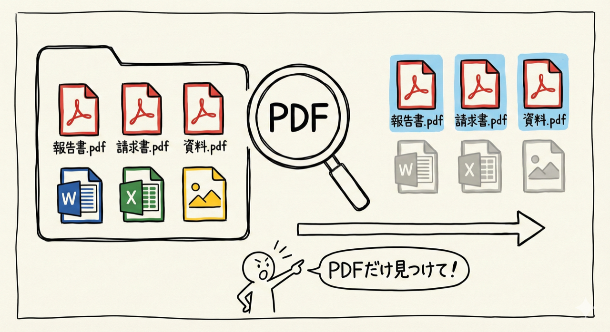
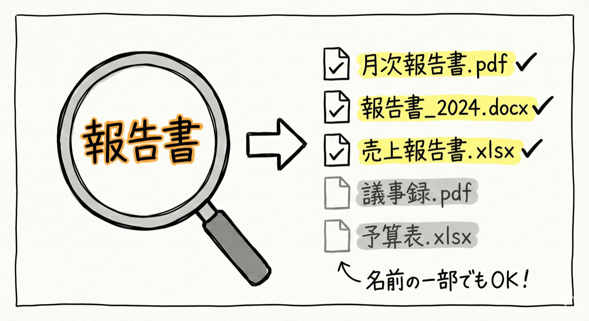
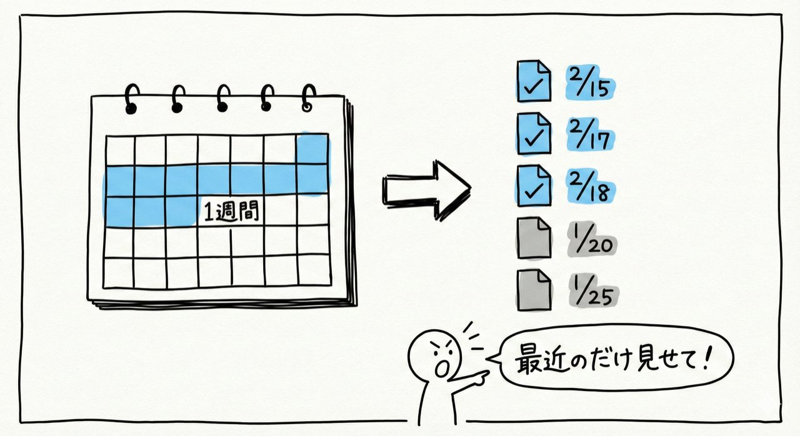
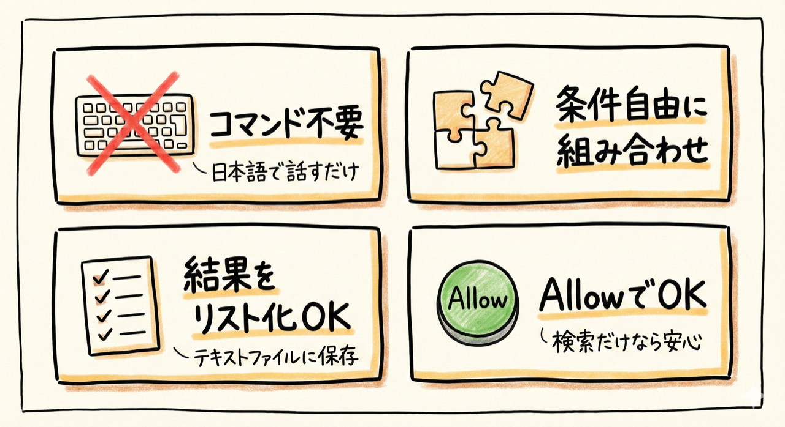
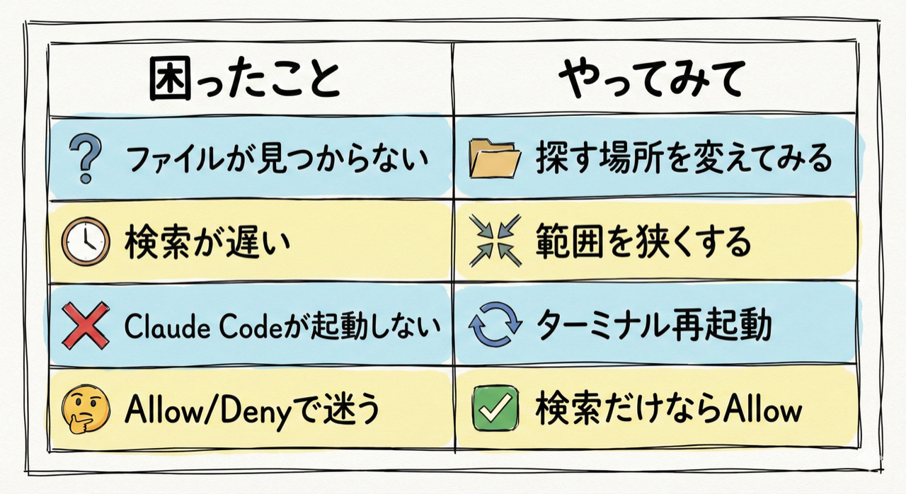

# 第7回｜ファイル検索 — 「あのファイルどこだっけ？」が一瞬で見つかる

## このレッスンのゴール


Claude Codeを使って、パソコンの中からファイルを条件付きで検索できるようになること。

---

## 第2回の具体例①を実際にやってみよう


第2回で紹介した最初の例、覚えていますか？

> 「報告書」って名前のファイルをデスクトップから探して

これを今回、実際にやってみます。「ファイルどこだっけ？」問題が一瞬で解決する体験を、ぜひ味わってください。

---

## こんな場面、ありませんか？


始める前に、ちょっと聞いてみたいんですが、こんな経験ありませんか？

- ダウンロードフォルダにファイルが大量に溜まっていて、何がどこにあるかわからない
- 「あの資料、どこに保存したっけ？」と毎回フォルダを1つずつ開いて探している
- MacのFinder（ファインダー）やWindowsのエクスプローラーの検索機能を使ってみたけど、遅い。あるいは見つからない

Claude Codeなら、日本語で条件を伝えるだけで探してくれます。しかも速いです。

---

## やってみよう


まずはClaude Codeを起動しましょう。

**ターミナルの開き方（毎回の復習）：**
- **Macの方**: `Cmd` + `Space` を押して「ターミナル」と入力 → `Enter`
- **Windowsの方**: スタートメニューで「PowerShell」と検索 → クリック

ターミナルが開いたら、以下を入力します。

```
claude
```

`Enter` を押して、入力待ちの表示（`>`のようなマーク）が出たら準備完了です。

> **確認ポイント**: 画面に `>` のような入力待ちの表示が出ていればOKです。もし `command not found` と出た場合は、第5回のインストール手順を確認してください。

### 1. 特定の種類のファイルを探す



最初の検索をやってみましょう。こう話しかけてください。

```
ダウンロードフォルダの中からPDFファイルを全部探して一覧にして
```

`Enter` を押すと、Claude Codeがパソコンの中を探し始めます。少し待つと、PDFファイルがずらっと一覧で表示されます。

ここで画面を見てみてください。ファイル名だけでなく、**パス**（どのフォルダに入っているか）も表示されていますよね。

**パスとは何か？**

パスというのは、ファイルの「住所」です。もう少し具体的に言うと、パソコンの中でのファイルの「道順」のようなものです。

たとえば現実世界で「東京都 → 渋谷区 → 神宮前 → 1-2-3 → 山田ビル3F」と住所をたどるように、パソコンの中でも「ユーザーフォルダ → ダウンロード → 報告書.pdf」という道順があります。これをパソコンでは `/Users/あなたの名前/Downloads/報告書.pdf` のように表示します。

この道順（パス）がわかれば、ファイルがどこにあるかもすぐにわかるわけです。

> **確認ポイント**: 画面にファイル名とパス（`/Users/...`のような文字列）が表示されていればOKです。

> **うまくいかない場合**: もしダウンロードフォルダにPDFファイルがない場合は、「PDFファイルは見つかりませんでした」と表示されます。その場合は、「デスクトップ」や「ドキュメントフォルダ」に変えて試してみてください。

### 2. 名前で探す



次は、ファイル名で検索してみましょう。

```
デスクトップから「報告書」って名前がついたファイルを探して
```

ファイル名に「報告書」という文字が含まれるものだけを拾ってくれます。完全一致でなくても大丈夫です。「報告書_2024年版.docx」や「月次報告書まとめ.pdf」のように、名前のどこかに「報告書」が入っていれば全部見つけてくれます。

> **確認ポイント**: 「報告書」を含むファイル名が一覧で表示されていればOKです。該当ファイルがない場合は「見つかりませんでした」と表示されます。

### 3. 日付で絞り込む



さらに便利な使い方として、日付での絞り込みもできます。

```
この1週間以内に更新されたファイルをドキュメントフォルダから探して
```

最近触ったファイルだけを絞り込めます。「1ヶ月以内」「今日更新した」「先週作ったやつ」など、期間は普段使う日本語で自由に指定できます。

> **確認ポイント**: 日付情報つきのファイル一覧が表示されていればOKです。

### 4. 条件を組み合わせる


ここ、ちょっと大事なポイントです。条件は組み合わせることもできます。

```
ドキュメントフォルダの中から、.xlsxファイルで「売上」って名前がついてるものを探して
```

`.xlsx`（エクセルエックス）というのは、Excel（エクセル）ファイルの拡張子です。この例では、種類（Excelファイル）と名前（売上が含まれる）の両方の条件で絞り込んでいます。

これを手動でやろうとすると、フォルダを1つずつ開いて、ファイル名を目で見て確認して...と大変ですよね。Claude Codeなら、条件を日本語で伝えるだけです。

> **確認ポイント**: 条件に合致するファイルが一覧で表示されていればOKです。

---

## 手動で探す場合との比較


実際にどれくらい時間の差があるか、比べてみましょう。

| 方法 | かかる時間 | 必要な知識 |
| --- | --- | --- |
| Finder（Mac）やエクスプローラー（Windows）で1つずつフォルダを開く | 5〜10分 | フォルダ構造を覚えている必要がある |
| Finderやエクスプローラーの検索機能 | 1〜3分 | 検索条件の設定方法を知っている必要がある |
| Claude Codeに頼む | 10秒 | 日本語で「こういうファイルを探して」と言うだけ |

圧倒的ですよね。しかも、Claude Codeのほうは覚えることが何もないんです。日本語で話しかけるだけですから。

---

## ポイント



- 検索に使う専門的なコマンドを覚える必要は一切ありません。裏ではClaude Codeがそうしたコマンドを自動的に使ってくれていますが、皆さんは「こういうファイルを探して」と日本語で言うだけです
- 条件はいくらでも組み合わせられます（種類 + 名前 + 日付 + サイズなど）
- 探した結果を「一覧をテキストファイルにまとめて」と追加で指示すれば、リスト化もしてくれます。検索結果を保存しておきたいときに便利ですね
- ファイルの操作をClaude Codeにお願いすると、Allow（許可）/ Deny（拒否）の確認が出ることがあります。検索するだけなら基本的にAllowで大丈夫です（第5回の復習）

---

## うまくいかないときは



| 症状 | 対処法 |
| --- | --- |
| 「ファイルが見つかりません」と表示される | 探す場所（フォルダ名）を変えてみてください。「デスクトップ」「ダウンロード」「ドキュメント」など |
| 検索に時間がかかる | 「デスクトップの中だけ」のように、探す範囲を狭くしてみてください |
| Claude Codeが起動しない | ターミナルを一度閉じて開き直し、再度 `claude` と入力してみてください |
| Allow / Deny が表示されて迷う | 検索するだけならAllowで大丈夫です。ファイルの中身を見るだけで、変更や削除はしません |

---

## まとめ


- Claude Codeでファイル検索が一瞬でできる
- 種類（PDF、Excelなど）、名前、日付など自由に条件を指定できる
- 条件の組み合わせもOK
- 専門的なコマンドを覚える必要なし。日本語で伝えるだけ

次回は、第2回の具体例②「文書の要約」を実際にやってみます。長い資料を渡して「3行でまとめて」と言うだけで要約してくれる体験です。長い資料を読む時間が大幅に減りますよ。
