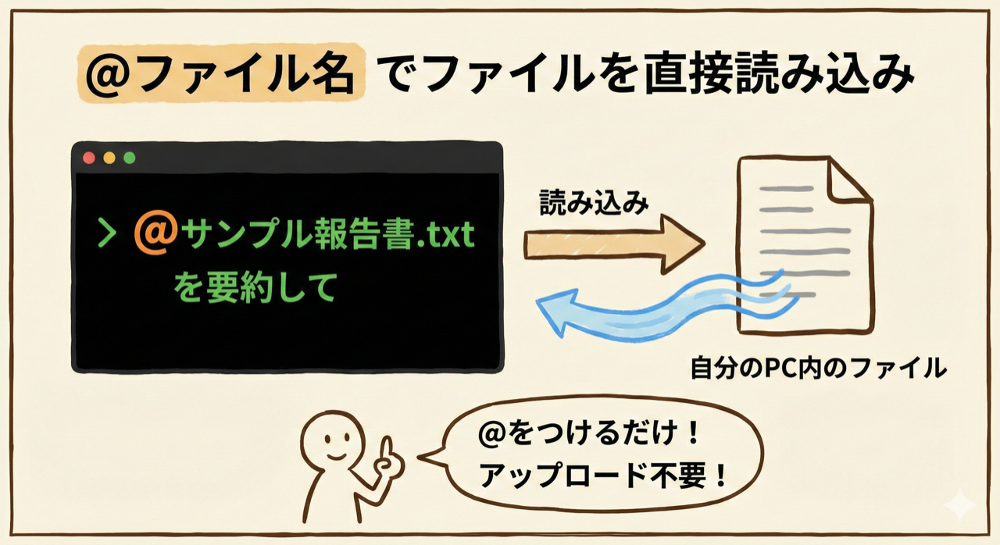
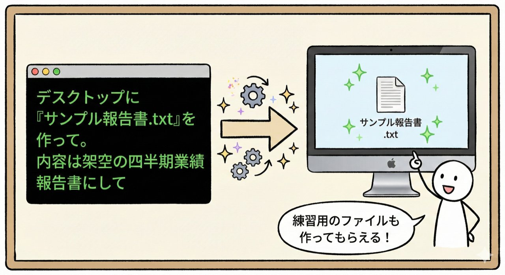
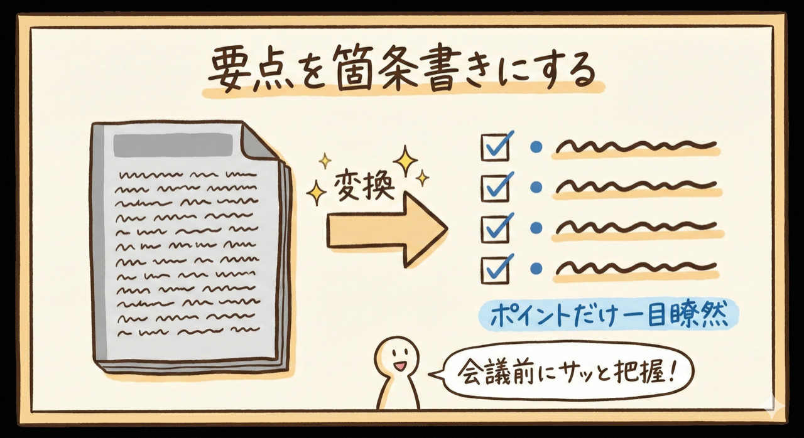
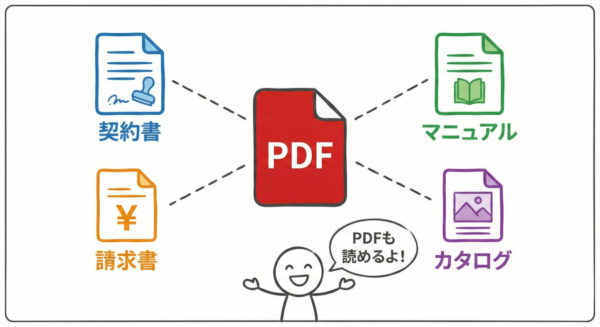
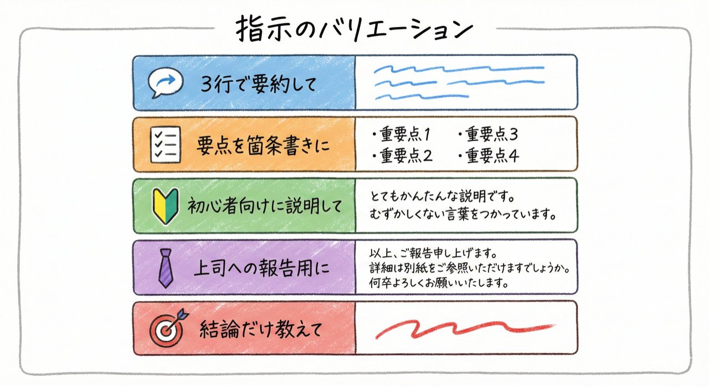
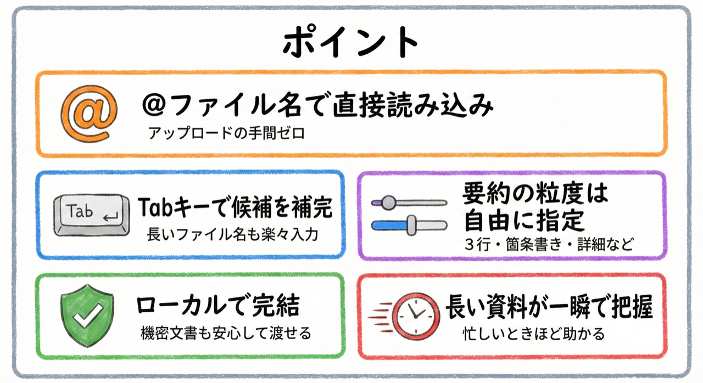
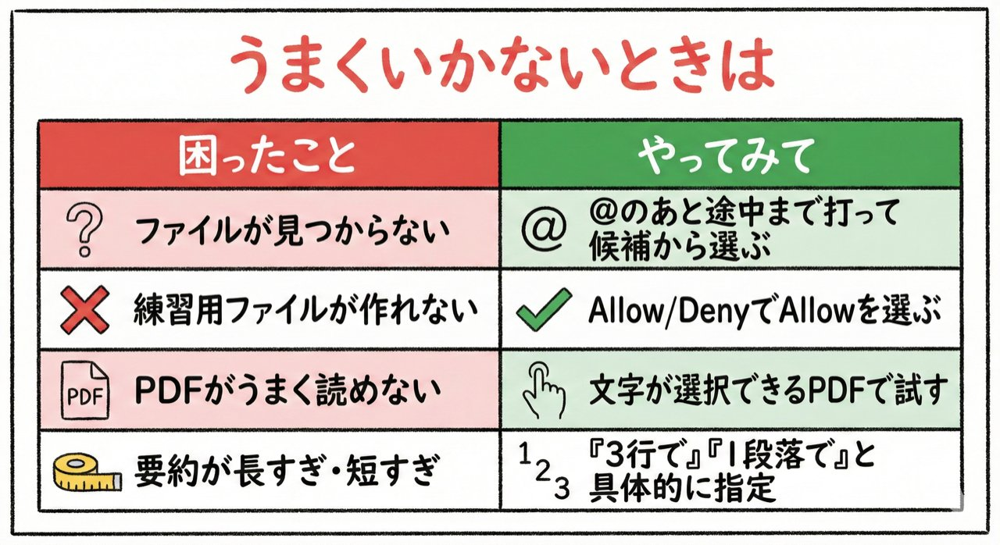

# 第8回｜文書の要約 — PDF渡して「3行でまとめて」

## このレッスンのゴール


Claude Codeにファイルを読み込ませて、要約や要点整理ができるようになること。

---

## 第2回の具体例②を実際にやってみよう


第2回で紹介した例を思い出してください。

> @報告書.pdf を3行で要約して

これを今回、実際にやっていきます。長い資料を渡して「まとめて」と言うだけで要約してくれるのは、本当に便利です。

---

## @ファイル名 でファイルを指定できる



まず、今回のキーポイントを説明しますね。

Claude Codeには便利な機能があります。`@`（アットマーク）のあとにファイル名を書くと、そのファイルの中身を直接読み込ませることができます。

```
@ファイル名
```

たとえば `@報告書.txt` と書けば、「報告書.txt」というファイルの中身をClaude Codeに渡すことになります。

これがClaude Codeの強みの1つです。ChatGPTの場合、ファイルをドラッグ&ドロップ（マウスで掴んで持っていく操作）でアップロードする必要がありますよね。Claude Codeは**自分のパソコン上で動いている**ので、パソコンの中にあるファイルを `@` をつけるだけでそのまま読めるんです。ファイルがどこかに送信されることもありません。

### @のあとのファイル名入力のコツ

`@` のあとにファイル名を途中まで打つと、候補が表示されます。たとえば `@サン` まで打つと、「サンプル報告書.txt」のような候補が出てきます。

候補が出たら：
1. **矢印キー（↑↓）** で使いたいファイルを選ぶ
2. **`Tab`キー**（キーボード左端にある、横線が2本描かれたキー）を押すと、そのファイル名が自動で入力される
3. あとは続けて指示を入力すればOK

ファイル名を全部手打ちする必要がないので、長いファイル名でも間違えにくくなります。

---

## 練習用ファイルを用意する



まだ手元に要約したいファイルがない方は、Claude Codeに練習用ファイルを作ってもらいましょう。これもClaude Codeの便利な使い方です。

まず、Claude Codeを起動してください。

**ターミナルの開き方：**
- **Macの方**: `Cmd` + `Space` を押して「ターミナル」と入力 → `Enter`
- **Windowsの方**: スタートメニューで「PowerShell」と検索 → クリック

ターミナルが開いたら `claude` と入力して `Enter` を押します。

起動したら、こう指示を出しましょう。

```
デスクトップに「サンプル報告書.txt」を作って。内容は架空の四半期業績報告書にして。3000字くらいの長さで。
```

Claude Codeが「ファイルを作成していいですか？」と確認（Allow / Deny）を出してきます。Allowを選んでください（第5回でやった、ファイル操作の許可です。パソコンの中でファイルを作るだけなので安心です）。

少し待つと、それらしい報告書ファイルを作ってくれます。もちろん中身は架空のものですが、要約の練習には十分です。

### 本当にファイルができたか確認する

ファイルが作られたら、確認してみましょう。

- **Macの方**: Finder（ファインダー）でデスクトップを開いて、「サンプル報告書.txt」があるか確認
- **Windowsの方**: エクスプローラーでデスクトップを開いて、「サンプル報告書.txt」があるか確認

または、Claude Codeにそのまま聞いてもOKです。

```
デスクトップにサンプル報告書.txtがあるか確認して
```

> **確認ポイント**: 「サンプル報告書.txt」がデスクトップに存在していればOKです。

すでに手元に要約したいファイルがある方は、それを使っていただいてもOKです。

---

## やってみよう


### 1. 3行で要約する

では、さっそく要約してみましょう。

```
@サンプル報告書.txt を3行で要約して
```

`Enter` を押すと、Claude Codeがファイルの内容を読み込んで、3行にギュッとまとめてくれます。

> **確認ポイント**: 画面に3行程度の要約文が表示されていればOKです。

長い報告書が一瞬で3行に。これ、会議の前に資料をざっと把握したいとき、ものすごく助かりますよね。

「3行」の部分を変えれば、詳しさの調整もできます。「1行で要約して」ならさらに短く、「5行で要約して」ならもう少し詳しく、「10行で要約して」ならかなり詳しくまとめてくれます。

### 2. 要点を箇条書きにする



今度は形式を変えてみましょう。

```
@サンプル報告書.txt の要点だけ箇条書きにして
```

箇条書き（かじょうがき）というのは、ポイントを「・」や「-」で1つずつ並べる形式のことです。

> **確認ポイント**: 画面に「・」や「-」で始まる箇条書きのリストが表示されていればOKです。

これなら、どこが大事かがパッと見てわかりますね。会議の前に資料をざっと把握したいとき、この形式が特に便利です。

### 3. 初心者向けに説明してもらう


こんな使い方もできます。

```
@サンプル報告書.txt の重要なポイントを初心者にもわかるように説明して
```

専門用語が多い資料でも、やさしい言葉に噛み砕いて説明してくれます。たとえば「営業利益率が前年比で3ポイント改善」のような表現を、「昨年と比べて、もうけの割合が3%良くなった」のようにわかりやすく言い換えてくれるイメージです。

新入社員への共有資料を作るときや、専門外の人に説明するときにも使えます。

> **確認ポイント**: 専門用語がやさしい言葉に置き換えられた説明が表示されていればOKです。

---

## PDFファイルも読める



テキストファイル（.txt）だけでなく、PDFファイルも渡せます。

```
@契約書.pdf の重要なポイントをまとめて
```

PDF（ピーディーエフ）というのは、文書をどのパソコンでも同じ見た目で表示できるファイル形式です。**契約書、パンフレット、カタログ、請求書、マニュアル**など、ビジネスの場面で非常によく使われる形式ですね。メールで送られてくる添付ファイルがPDFだった、という経験がある方も多いのではないでしょうか。

業務で受け取ったPDFの中身をすぐに把握したいとき、いちいち全ページ読まなくて済みます。「このPDF、結局何が書いてあるの？」を一瞬で教えてくれるわけです。

> **うまくいかない場合**: PDFファイルの中には、画像として作られていて文字が読み取れないものがあります（スキャンされた書類など）。その場合、Claude Codeがうまく読み取れないことがあります。文字が選択・コピーできるPDFなら問題ありません。

---

## 要約の指示のバリエーション



指示の仕方次第で、出力の形は自由に変えられます。いくつかパターンをまとめておきますので、参考にしてください。

| 指示の例 | 出力のイメージ |
| --- | --- |
| 「3行で要約して」 | 短い要約文（3行） |
| 「要点を箇条書きにして」 | 箇条書きリスト |
| 「初心者向けに説明して」 | 平易な言葉での解説 |
| 「上司への報告用に1段落でまとめて」 | ビジネス向けの簡潔な文章 |
| 「この資料の結論だけ教えて」 | 結論部分の抽出 |

同じファイルでも、指示の仕方を変えるだけでまったく違う形の出力が得られます。目的に合わせて使い分けてみてくださいね。

---

## ポイント



- `@ファイル名` でパソコン上のファイルを直接読み込める。アップロードの手間がいらない
- `@` のあとにファイル名を途中まで打てば候補が出る。`Tab`キーで補完できるので、長いファイル名も楽に入力できる
- Claude Codeはローカル（皆さん自身のパソコンの中）で動いているから、ファイルをどこかに送る必要がない。機密文書も安心して渡せる
- 要約の粒度（3行、箇条書き、詳細など）は日本語で自由に指定できる
- 長い資料を読む時間が大幅に減る。忙しいときほど助かる機能

---

## うまくいかないときは



| 症状 | 対処法 |
| --- | --- |
| 「ファイルが見つかりません」と表示される | ファイル名が正確か確認してください。`@` のあとに途中まで打って候補から選ぶのが確実です |
| 練習用ファイルが作れない | Allow / Denyの確認でAllowを選んだか確認してください |
| PDFがうまく読めない | スキャンされたPDF（画像化されたもの）は読めないことがあります。文字が選択できるPDFで試してください |
| 要約が長すぎる / 短すぎる | 「3行で」「1段落で」のように、具体的な長さを指定してみてください |

---

## まとめ


- `@ファイル名` でファイルを読み込ませて要約できる
- 要約の形式は日本語で自由に指定（3行、箇条書き、初心者向けなど）
- PDFファイル（契約書やパンフレットなどでよく使われる形式）も読める
- ファイルのアップロード不要。ローカル（自分のパソコン内）で完結するのがClaude Codeの強み

次回は、第2回の具体例③「文章の修正」を実際にやってみます。「もっとカジュアルにして」の一言で文章を書き直してもらう体験です。メールの下書き、報告書、お礼文...文章を書く仕事がある方は特に楽しみにしていてくださいね。
