# 第9回｜文章の修正 — 「もっとカジュアルにして」で書き直し

## このレッスンのゴール

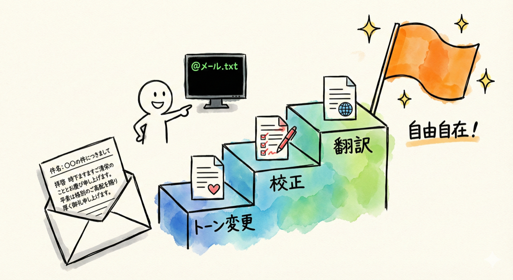

Claude Codeにファイルを渡して、トーン変更・校正・書き換えができるようになること。

---

## 第2回の具体例③を実際にやってみよう

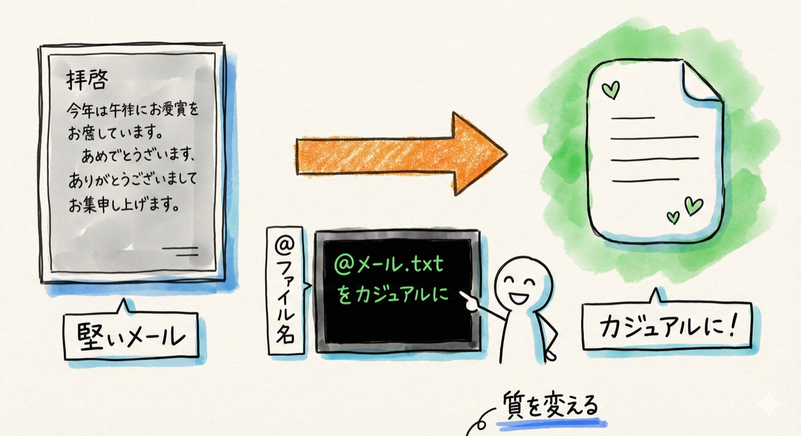

第2回で紹介したこの例です。

> @メール.txt をもっとカジュアルなトーンに書き直して

前回の「要約」はファイルの内容を短くする作業でした。今回の「修正」は、長さはだいたい同じまま、**質やトーン（文章の雰囲気）を変える**作業です。似ているようで、やっていることは違いますので、両方使いこなせると便利です。

---

## 練習用ファイルを用意する

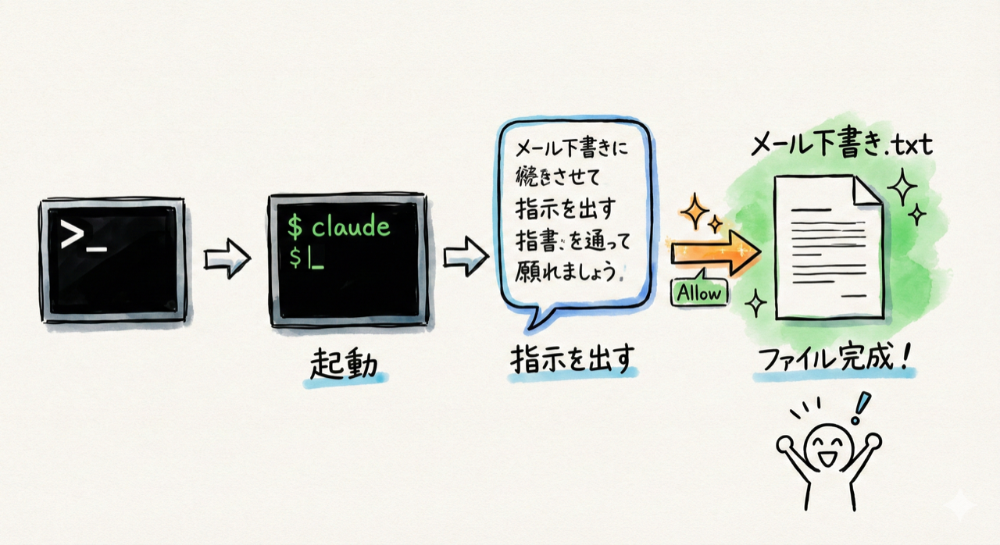

まずは素材を作りましょう。前回と同じように、Claude Codeに頼みます。

**ターミナルの開き方：**
- **Macの方**: `Cmd` + `Space` を押して「ターミナル」と入力 → `Enter`
- **Windowsの方**: スタートメニューで「PowerShell」と検索 → クリック

ターミナルが開いたら、以下を入力してClaude Codeを起動します。

```
claude
```

`Enter` を押して、入力待ちの表示（`>`のようなマーク）が出たら準備完了です。

起動したら、こう指示を出しましょう。

```
デスクトップに「メール下書き.txt」を作って。内容は取引先への堅いビジネスメールにして。打ち合わせの日程調整の内容で。
```

Claude Codeが「ファイルを作成していいですか？」と確認（Allow / Deny）を出してきます。Allowを選んでください（ファイルをパソコン内に作るだけなので安全です）。

少し待つと、それらしいビジネスメールのファイルを作ってくれます。「拝啓 時下ますますご清栄のこととお慶び申し上げます」のような、堅い文面のメールが出来上がるはずです。

### 本当にファイルができたか確認する

ファイルが作られたら、確認してみましょう。

- **Macの方**: Finder（ファインダー）でデスクトップを開いて、「メール下書き.txt」があるか確認
- **Windowsの方**: エクスプローラーでデスクトップを開いて、「メール下書き.txt」があるか確認

または、Claude Codeにそのまま聞いてもOKです。

```
デスクトップにメール下書き.txtがあるか確認して
```

> **確認ポイント**: 「メール下書き.txt」がデスクトップに存在していればOKです。

すでに手元に修正したいメールや文章がある方は、それを使っていただいてもOKです。

---

## 大事な注意：元のファイルを守る方法

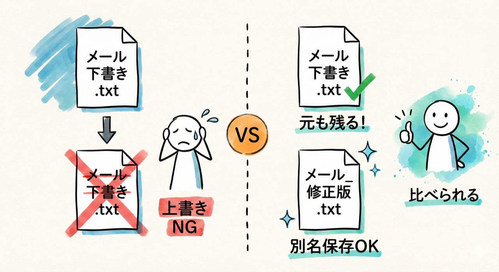

**練習を始める前に、大事なことをお伝えします。**

Claude Codeに文章の修正を頼むと、**元のファイルが上書きされてしまう**ことがあります。上書きというのは、元の内容が消えて修正後の内容に置き換わってしまうことです。

たとえば、大切なメールの下書きを修正してもらったら、元の文面が消えてしまった...となると困りますよね。

**対処法はかんたんです。** 修正をお願いするときに、「別の名前で保存して」と伝えればOKです。

```
@メール下書き.txt をもっと丁寧に書き直して、メール_修正版.txt として保存して
```

こうすれば、元のファイル（メール下書き.txt）はそのまま残り、修正版（メール_修正版.txt）が新しく作られます。2つを見比べて、どちらを使うか選べるわけです。

**今回の練習では、練習用ファイルを使っているので上書きされても問題ありませんが、大事な文章を修正するときは「別名で保存」を忘れないようにしてください。**

---

## やってみよう

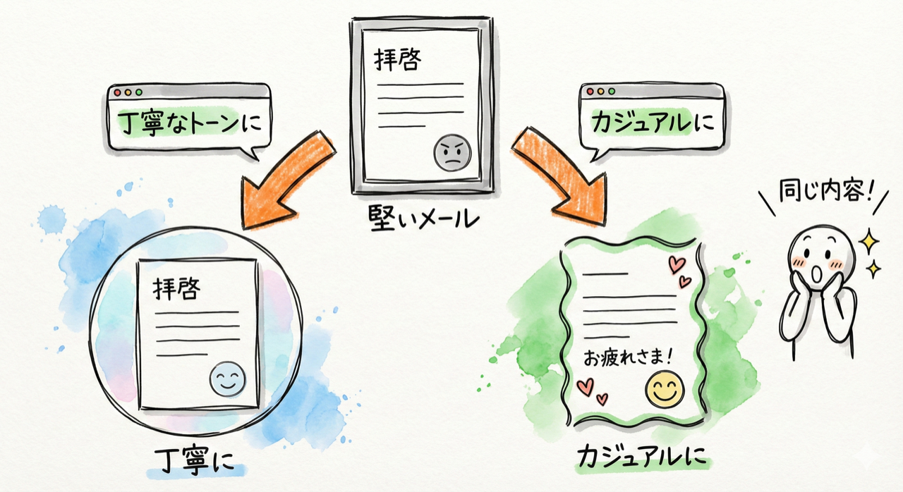

### 1. トーンを変える

まず、堅いメールを丁寧だけど柔らかいトーンに変えてみましょう。

```
@メール下書き.txt をもっと丁寧なトーンに書き直して
```

`Enter` を押すと、Claude Codeが文面を読み込んで、書き直した文章を表示してくれます。

> **確認ポイント**: 堅すぎない、でも丁寧な文面に調整された文章が画面に表示されていればOKです。元の文面と見比べて、印象が変わっていることを確認してみてください。

逆方向もやってみましょう。

```
@メール下書き.txt をカジュアルなトーンに書き直して。社内の親しい同僚に送る感じで
```

同じ「日程調整」の内容でも、トーンがガラッと変わります。「お疲れさま！来週の打ち合わせなんだけど...」のような文面になるはずです。

> **確認ポイント**: くだけた口調の文面が表示されていればOKです。

### 2. 校正する

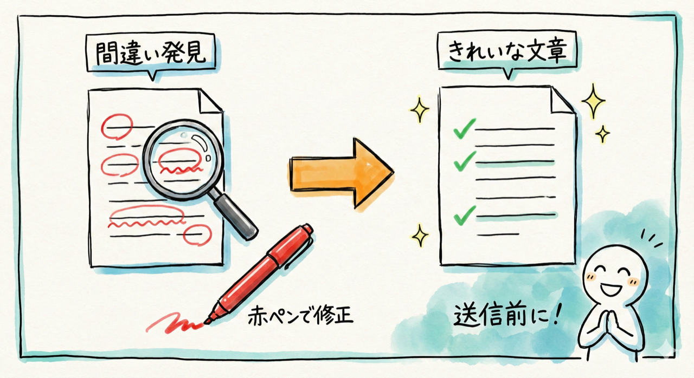

校正（こうせい）というのは、文章の間違いをチェックして直す作業のことです。

```
@メール下書き.txt の誤字脱字をチェックして修正して
```

タイプミスや変換ミス（「意外」と「以外」の間違いとか）を見つけて直してくれます。自分では何度読み返しても気づかない間違いも拾ってくれるので、メールを送る前の最終チェックに便利です。

> **確認ポイント**: 修正箇所がある場合は「ここをこう直しました」と教えてくれます。修正箇所がない場合は「誤字脱字は見つかりませんでした」と表示されます。どちらかが表示されていればOKです。

### 3. 読者に合わせて書き換える

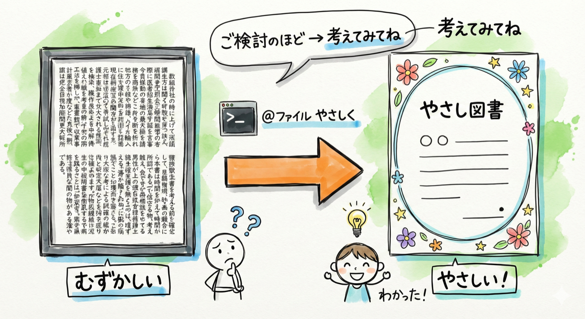

こんな使い方もできます。

```
@メール下書き.txt を小学生にもわかる言葉に書き直して
```

専門用語や難しい表現を、やさしい言葉に置き換えてくれます。たとえば「ご検討のほどよろしくお願いいたします」が「考えてみてもらえるとうれしいです」のようになるイメージです。

社内向けの説明資料を社外の一般の方向けに作り直すときや、子ども向けのお知らせを作るときにも使えますね。

### 4. 英語に翻訳する

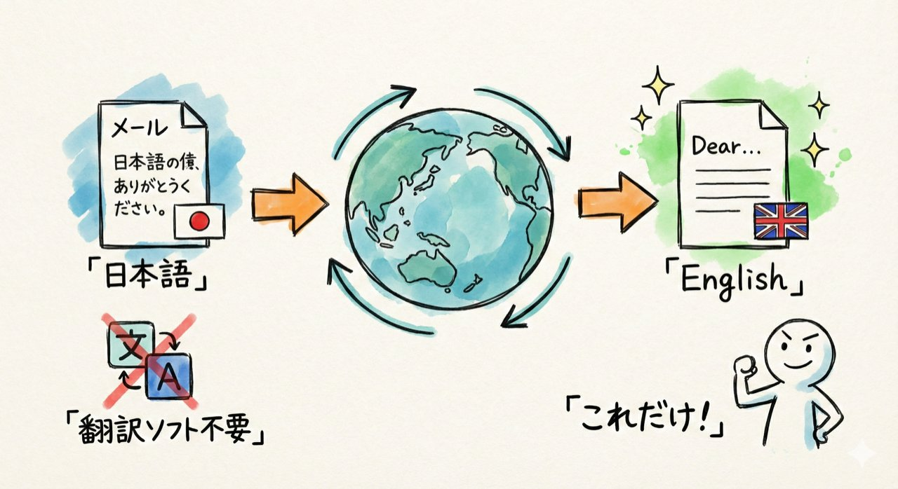

実は、トーンを変えるだけでなく、言語を変えることもできます。

```
@メール下書き.txt を英語に翻訳して
```

海外の取引先にメールを送るとき、日本語で下書きしてから英語に翻訳してもらう、という使い方ができます。翻訳ソフトを別に開く必要がなく、Claude Codeだけで完結します。

> **確認ポイント**: 英語に翻訳された文面が表示されていればOKです。

---

## 要約との違い

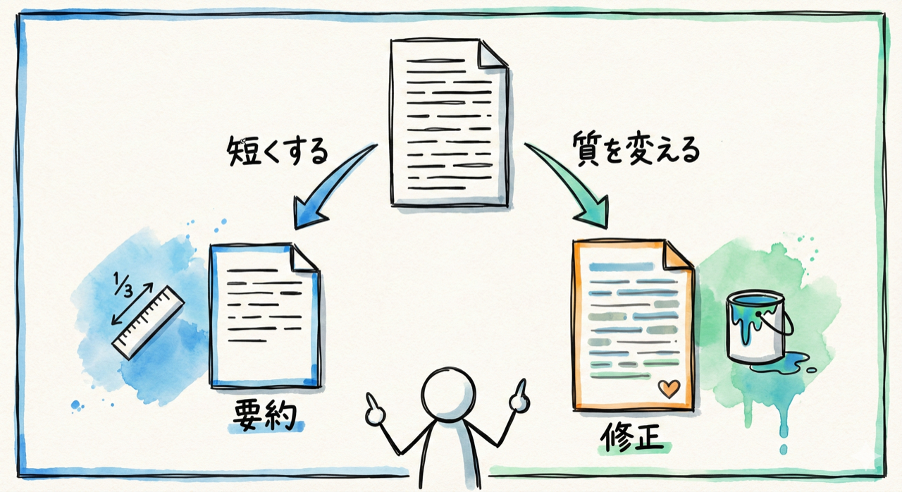

前回の「要約」と今回の「修正」、似ているようで役割が違います。整理しておきますね。

| 操作 | やること | 結果の長さ |
| --- | --- | --- |
| 要約（前回） | 内容を短くまとめる | 元より短くなる |
| 修正（今回） | トーンや質を変える | だいたい同じ長さ |

どちらも `@ファイル名` で読み込ませるところは同じです。使い分けのポイントは「短くしたいのか、質を変えたいのか」です。

---

## 何度でもやり直せる

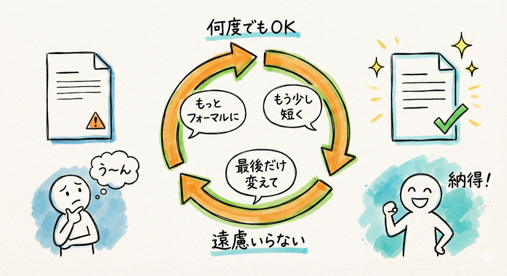

Claude Codeの良いところは、何度でもやり直しを頼めることです。修正結果を見て「ちょっと違うな」と思ったら、追加で指示を出すだけ。

```
もうちょっとフォーマルにして
```

```
もう少し短くして
```

```
最後の一文だけ変えて
```

こんな感じで、微調整ができます。「もうちょっとこうして」「もう少しああして」と何度でも言えるので、納得いくまで調整できます。人にお願いすると気を使いますが、Claude Code相手なら遠慮いりません。

---

## 修正指示のバリエーション

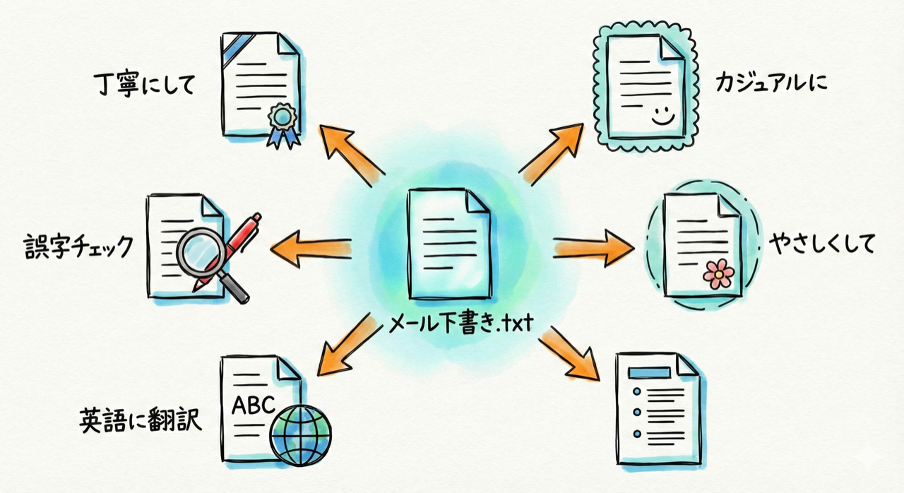

いろんな場面で使えるように、指示のパターンをまとめておきますね。

| 指示の例 | 使いどころ |
| --- | --- |
| 「もっと丁寧にして」 | 取引先へのメール |
| 「もっとカジュアルにして」 | 社内チャット向けのメッセージ |
| 「誤字脱字をチェックして」 | 送信前の校正 |
| 「小学生にもわかるようにして」 | 一般向け資料、子ども向けお知らせ |
| 「英語に翻訳して」 | 海外とのやり取り |
| 「箇条書きに整形して」 | 読みやすさの改善 |

---

## ポイント

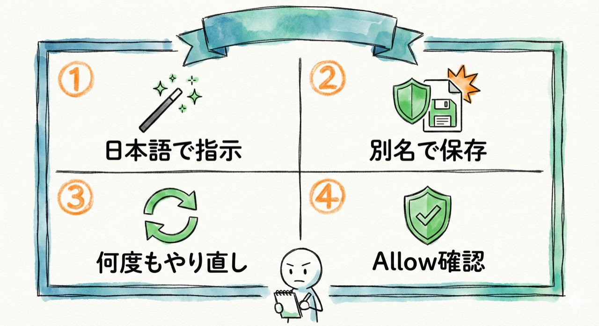

- トーンの変更、校正、書き換え、翻訳が日本語の指示だけでできる
- **大事な文章を修正するときは、別名で保存するのがおすすめ**（元ファイルの上書きを防ぐため）
- 何度でもやり直しを頼める。「もうちょっとこうして」で追加修正
- ファイル操作の確認（Allow / Deny）が出たら内容を確認してAllowを選ぶ（第5回の復習）

---

## うまくいかないときは

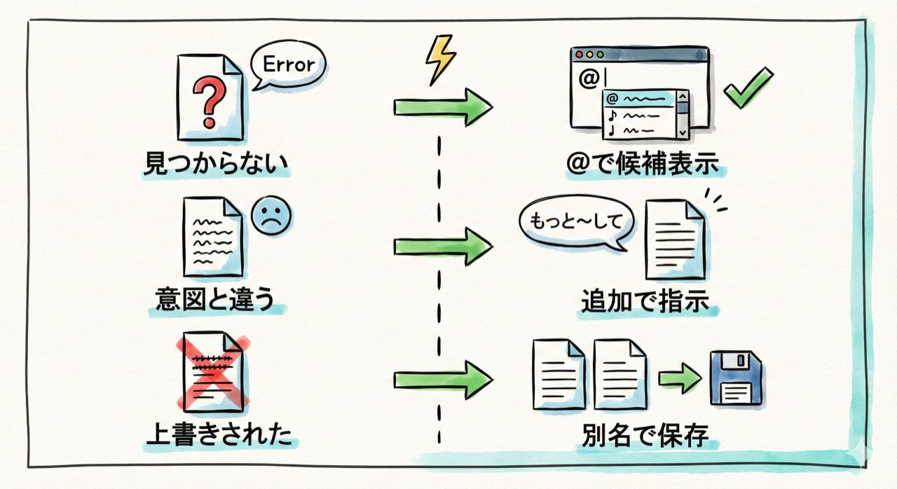

| 症状 | 対処法 |
| --- | --- |
| 「ファイルが見つかりません」と表示される | `@` のあとにファイル名を途中まで打って候補から選んでください（前回の復習） |
| 修正結果が意図と違う | 「もっと〜して」「〜の部分だけ変えて」のように追加で指示を出してみてください |
| 元のファイルが上書きされてしまった | 次回からは「〜として別名で保存して」と伝えましょう。今回は練習用ファイルなので問題ありません |
| Allow / Deny が出て迷う | ファイルの読み込みや書き込みをするときに出ます。内容を確認してAllowを選んで大丈夫です |

---

## まとめ

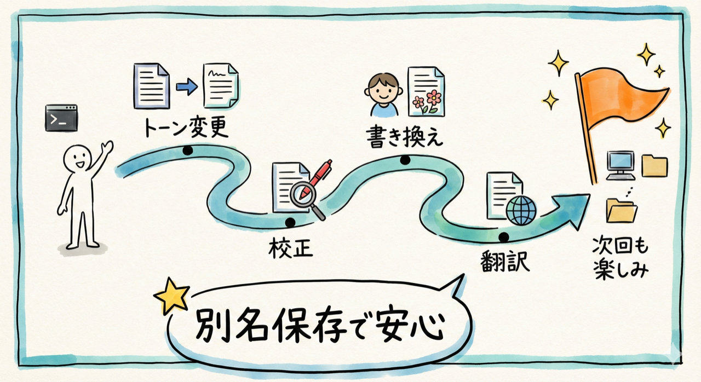

- 文章の修正は「同じくらいの長さで質やトーンを上げる」作業
- トーン変更、校正、読者に合わせた書き換え、英語への翻訳が自由自在
- **修正版を別名保存すれば、元ファイルと比較できて安心**
- 追加指示で何度でも調整可能。遠慮なく「もうちょっとこうして」と言える

次回は、第2回の具体例④「フォルダ整理・一括リネーム」を実際にやってみます。散らかったデスクトップが一言で片付く体験です。デスクトップが散らかっている方、お楽しみに。
